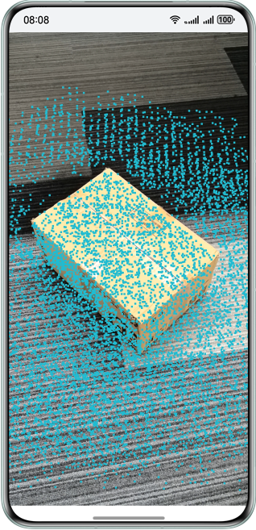
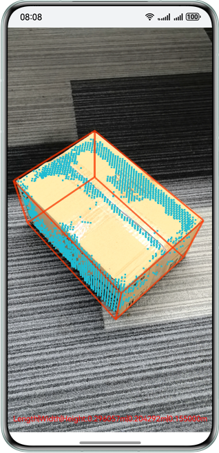
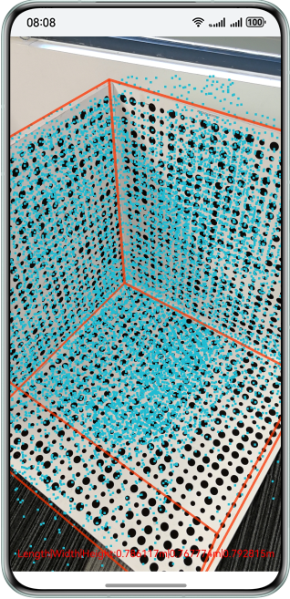

# 高精几何重建介绍

更新时间：2026-04-24 08:10:21

来源：https://developer.huawei.com/consumer/cn/doc/harmonyos-guides/arengine-get-volume-measurement-conversion

AR Engine高精几何重建用于识别空间中的立方体物体或者嵌入式立方体空间，计算出被识别物体或空间的长、宽、高以及体积。体积测量可以用于测量立方体体积以及嵌入式空间的大小。

 高精几何重建主要包含稠密点云绘制、体积测量、空间识别三大能力。

 **图1** 稠密点云绘制示意图

 

 **图2** 体积测量示意图

 

 **图3** 空间识别示意图

 
