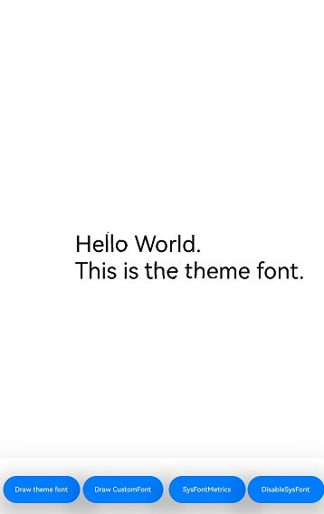
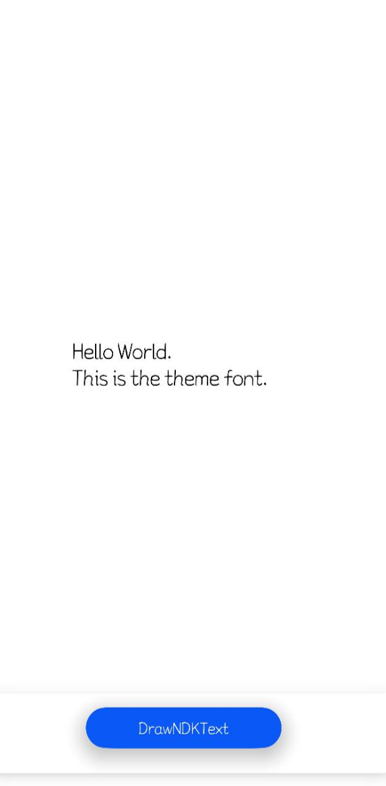

# 使用主题字体（C/C++）

更新时间：2026-04-30 02:41:24

来源：https://developer.huawei.com/consumer/cn/doc/harmonyos-guides/theme-font-c

## 场景介绍

主题字体，特指系统**主题应用**中能使用的字体，属于一种特殊的自定义字体。可以通过相关接口调用使能主题应用中的主题字体。

## 实现机制

**图1** 主题字体的切换和使用

针对主题字的切换使用，应用方应确保订阅主题字变更事件，当接收字体变更事件后，由应用方主动调用页面刷新才能实现主题字的切换，否则主题字只能在重启应用后才生效；主题字的绘制需要使用OH_Drawing_GetFontCollectionGlobalInstance来获取全局字体集对象，仅该接口返回的对象拥有主题字体信息。
> [!NOTE]
> 由OH_Drawing_CreateSharedFontCollection创建的字体集对象不包含主题字信息，无法用于绘制主题字。


## 接口说明

注册使用主题字体的常用接口如下表所示，详细接口说明请参考[Drawing](https://developer.huawei.com/consumer/cn/doc/harmonyos-references/capi-drawing)。
| 接口名 | 描述 |
| --- | --- |
| OH_Drawing_FontCollection* OH_Drawing_GetFontCollectionGlobalInstance(void) | 获取全局的字体集对象OH_Drawing_FontCollection。 |
| [onConfigurationUpdate()](https://developer.huawei.com/consumer/cn/doc/harmonyos-references/js-apis-app-ability-ability#abilityonconfigurationupdate) | 系统配置更新时调用。          主题应用当前仅提供ArkTS接口发布变更事件，需要应用自行处理进行跨语言调用。 |


## 开发步骤

请确保在设备系统**主题应用**中，能成功应用一项主题字体。 在应用入口文件（默认工程中为EntryAbility.ets）中重写onConfigurationUpdate函数，以响应fontId变更，适配主题字体的切换和页面刷新，重写方式可参考[主题字变更事件](https://developer.huawei.com/consumer/cn/doc/harmonyos-guides/theme-font-arkts#开发步骤)。 系统配置信息（即示例中的newConfig）变化时，会自动触发onConfigurationUpdate函数。应用可从系统发送的配置信息获取fontId，通过判断是否与应用本地保存的fontId一致来识别主题字的切换。若不一致则刷新本地fontId，并调用C++代码刷新排版结果。从ArkTS到C++的调用通路需应用根据实际情况选取调用方式，本示例不作推荐。跨语言调用可参考[Node-API简介](https://developer.huawei.com/consumer/cn/doc/harmonyos-guides/napi-introduction)。 导入C++侧依赖，本步骤及之后均为主题字体在C++侧的使用 在工程的src/main/cpp/CMakeLists.txt文件中添加以下lib。
```text
libnative_drawing.so
```

导入头文件。
```text
#include
#include
#include
```

创建字体管理器。
> [!NOTE]
> 注册主题字体作用于字体管理集全局对象，故必须使用OH_Drawing_GetFontCollectionGlobalInstance获取全局字体集对象进行绘制。如若使用OH_Drawing_CreateSharedFontCollection或OH_Drawing_CreateFontCollection创建字体集对象，无法使用主题字体。OH_Drawing_GetFontCollectionGlobalInstance获取的全局字体集不允许释放，释放会造成字体绘制紊乱问题。


```text
OH_Drawing_FontCollection *fontCollection = OH_Drawing_GetFontCollectionGlobalInstance();
```

OH_Drawing_SetTextStyleFontFamilies()接口可以用来指定字体家族名，从而实现使用指定字体。但使用主题字体，不需要使用OH_Drawing_SetTextStyleFontFamilies()接口指定字体，否则行为变更为优先使用指定字体，而不是主题字体。
```text
OH_Drawing_TextStyle *myTextStyle = OH_Drawing_CreateTextStyle();
// const char* myFontFamilies[] = {"otherFontFamilyName"};
// 注意不要使用此接口来指定字体
// OH_Drawing_SetTextStyleFontFamilies(textStyle, 1, myFontFamilies);
```

设置段落文本内容为"Hello World. \nThis is the theme font."，此时该段落文本将应用主题字体。
```text
// 设置其他文本样式
OH_Drawing_SetTextStyleColor(myTextStyle, OH_Drawing_ColorSetArgb(0xFF, 0x00, 0x00, 0x00));
// 设置字体大小为100.0
OH_Drawing_SetTextStyleFontSize(myTextStyle, 100.0);
// 创建一个段落样式对象，以设置排版风格
OH_Drawing_TypographyStyle *typographyStyle = OH_Drawing_CreateTypographyStyle();
OH_Drawing_SetTypographyTextAlign(typographyStyle, TEXT_ALIGN_LEFT); // 设置段落样式为左对齐
// 创建一个段落生成器
OH_Drawing_TypographyCreate *handler = OH_Drawing_CreateTypographyHandler(typographyStyle, fontCollection);
// 在段落生成器中设置文本样式
OH_Drawing_TypographyHandlerPushTextStyle(handler, myTextStyle);
// 在段落生成器中设置文本内容
const char *text = "Hello World. \nThis is the theme font.";
OH_Drawing_TypographyHandlerAddText(handler, text);
// 通过段落生成器生成段落
OH_Drawing_Typography *typography = OH_Drawing_CreateTypography(handler);
```


## 效果展示

以下展示了在系统**主题应用**中切换使用不同主题字体后，对应的文字渲染效果。 不同主题字体显示效果不同，此处仅示意。 **图2** 主题字体1的效果

**图3** 主题字体2的效果

