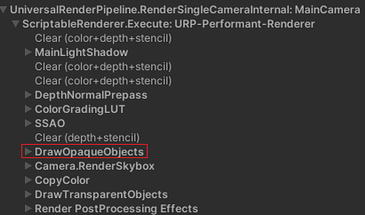

# ABR进行Buffer分辨率调整引起其他Pass渲染效果异常，该如何解决

更新时间：2026-05-18 03:44:20

来源：https://developer.huawei.com/consumer/cn/doc/harmonyos-guides/graphics-accelerate-faq-4

**现象描述**

以团结引擎URP管线为例，ABR对DrawOpaqueObjects绑定的Buffer进行分辨率调整时会引起SSAO shadow效果异常。


**原因分析**

通过上述URP管线可以看到，SSAO在渲染管线中是一个“前处理”，SSAO输出的图像会作为DrawOpaqueObjects的输入。当ABR对DrawOpaqueObjects绑定的Buffer进行自适应分辨率调整时，SSAO输出的图像为原始分辨率，而DrawOpaqueObjects绑定的Buffer使用低分辨率，分辨率不一致导致SSAO shadow效果异常。

**处理步骤**

 - 仅支持渲染线程的游戏引擎处理步骤

  
**方案1**：调整渲染管线，将SSAO作为“后处理”，SSAO不受DrawOpaqueObjects绑定的Buffer分辨率影响。

  在URP资产中勾选“After Opaque”：

  


 - **方案2**：获取实时的ABR Buffer分辨率因子，并根据Buffer分辨率因子对相关渲染数据进行同步调整。

  SSAO的shader会根据scaledScreenParams参数进行计算，该变量与渲染分辨率相关，在集成ABR后，scaledScreenParams需要根据实时的ABR Buffer分辨率因子调整。

  对于团结引擎，可在ScriptableRenderer.cs的SetPerCameraShaderVariables函数中根据Buffer分辨率因子设置scaledScreenParams参数。

  
```text
void SetPerCameraShaderVariables(CommandBuffer cmd, ref CameraData cameraData, bool isTargetFlipped)
{
    Camera camera = cameraData.camera;
    float scaledCameraWidth = (float)cameraData.cameraTargetDescriptor.width;
    float scaledCameraHeight = (float)cameraData.cameraTargetDescriptor.height;
    // scale为通过HMS_ABR_GetScale接口获取的ABR Buffer分辨率因子
    scaledCameraWidth *= scale;
    scaledCameraHeight *= scale;
    cmd.SetGlobalVector(ShaderPropertyId.scaledScreenParams, new Vector4(scaledCameraWidth, scaledCameraHeight, 1.0f + 1.0f / scaledCameraWidth, 1.0f + 1.0f / scaledCameraHeight));
}
```


     - 支持渲染线程、RHI线程的游戏引擎处理步骤

  对于同时支持渲染线程、RHI线程的游戏引擎，而且RHI线程延迟于渲染线程的场景，渲染线程通过[HMS_ABR_GetScale](https://developer.huawei.com/consumer/cn/doc/harmonyos-references/_graphics_accelerate#hms_abr_getscale)接口获取的ABR Buffer分辨率因子无法解决上述问题。

  对于该场景，渲染线程在Buffer渲染后调用[HMS_ABR_GetNextScale](https://developer.huawei.com/consumer/cn/doc/harmonyos-references/_graphics_accelerate#hms_abr_getnextscale)接口获取下一帧的ABR Buffer分辨率因子，并根据Buffer分辨率因子对相关渲染数据进行同步调整。

  
```text
// 在Buffer渲染后调用
float scale = 1.0f;
errorCode = HMS_ABR_GetNextScale(context_, &scale);
if (errorCode != ABR_SUCCESS) {
    GOLOGE("HMS_ABR_GetNextScale execution failed, error code: %d.", errorCode);
}

// 根据Buffer分辨率因子对渲染数据进行同步调整
void SetViewUniformParameters()
{
    ViewUniformParameters.BufferSize.X = (int)(ViewUniformParameters.BufferSize.X * scale);
    ViewUniformParameters.BufferSize.Y = (int)(ViewUniformParameters.BufferSize.Y * scale);
    ViewUniformParameters.BufferInvSize.X /= scale;
    ViewUniformParameters.BufferInvSize.Y /= scale;
}
```
