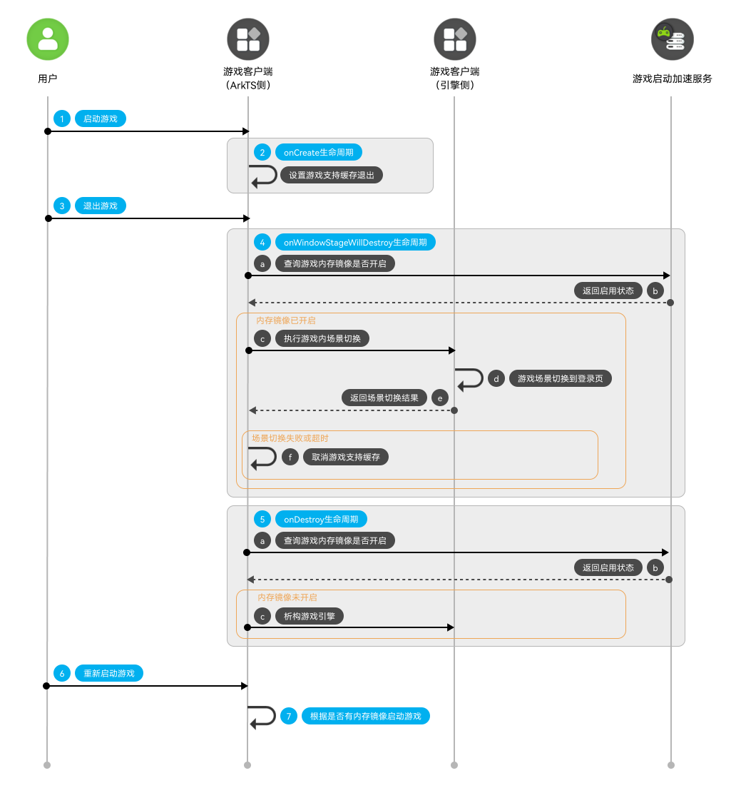
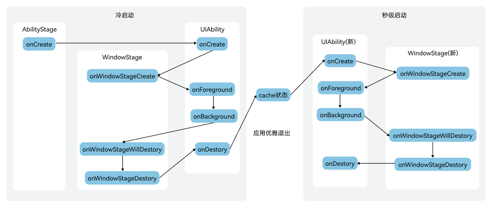

# 实现游戏启动加速

更新时间：2026-05-08 09:27:50

来源：https://developer.huawei.com/consumer/cn/doc/harmonyos-guides/graphics-accelerate-launch-development

## 业务流程


用户启动游戏。 游戏在onCreate生命周期中调用[setSupportedProcessCache](https://developer.huawei.com/consumer/cn/doc/harmonyos-references/js-apis-inner-application-applicationcontext#applicationcontextsetsupportedprocesscache12)接口，设置游戏支持缓存后快速启动。
> [!NOTE]
> 部分机型不支持设置进程资源的缓存，因此在调用setSupportedProcessCache接口时需加try catch捕获异常。

用户上划退出游戏。 在onWindowStageWillDestroy生命周期中，游戏调用[isLaunchMirrorEnabled](https://developer.huawei.com/consumer/cn/doc/harmonyos-references/graphics-accelerate-launchacceleration#islaunchmirrorenabled)接口向游戏启动加速服务查询游戏内存镜像功能是否开启。若已开启，ArkTS侧通知游戏引擎将当前场景切换至登录页，引擎完成场景切换后将结果回传ArkTS侧。若场景切换失败或超时，则调用[setSupportedProcessCache](https://developer.huawei.com/consumer/cn/doc/harmonyos-references/js-apis-inner-application-applicationcontext#applicationcontextsetsupportedprocesscache12)接口，取消游戏对缓存后快速启动的支持。
> [!NOTE]
> 建议开发者切换场景时，将场景切换至游戏登录界面并设置最大超时时间5s。

在onDestroy生命周期中，游戏再次调用[isLaunchMirrorEnabled](https://developer.huawei.com/consumer/cn/doc/harmonyos-references/graphics-accelerate-launchacceleration#islaunchmirrorenabled)接口确认内存镜像功能状态。若未开启，则执行引擎析构流程，游戏进程随即退出。 用户重新启动游戏。 游戏根据是否存在内存镜像决定启动方式：若存在内存镜像，系统将此前换出至磁盘的游戏对象重新换入到内存，实现秒级启动；若不存在内存镜像，则按正常流程启动游戏。
> [!NOTE]
> 根据上架审核规则，建议游戏秒级启动时增加游戏健康公告闪屏，然后再进入内存镜像界面，详细操作可参考Codelab示例工程。


## 生命周期


游戏冷启动场景 游戏进程会依次创建AbilityStage、UIAbility以及WindowStage，完成应用与界面的初始化。 游戏秒级启动场景 当秒级启动能力开启后，用户上划移除游戏时，系统会依次销毁WindowStage和UIAbility对象，随后对游戏进程进行深度冻结。在此过程中，系统会将游戏进程中的大部分对象换出至磁盘，仅保留少量关键对象驻留在内存中，以降低内存占用。 在触发游戏秒级启动时，系统会将此前换出到磁盘的游戏对象重新换入内存，同时游戏进程会重新创建UIAbility和WindowStage对象，从而实现快速恢复与启动。

## 接口说明

具体API说明请详见[接口文档](https://developer.huawei.com/consumer/cn/doc/harmonyos-references/graphics-accelerate-launchacceleration)。
| 接口名 | 描述 |
| --- | --- |
| [isLaunchMirrorEnabled](https://developer.huawei.com/consumer/cn/doc/harmonyos-references/graphics-accelerate-launchacceleration#islaunchmirrorenabled)(): boolean | 查询游戏的内存镜像功能是否开启。 |


## 开发步骤


> [!NOTE]
> 本节主要介绍秒级启动的核心流程，完整的开发步骤和注意事项请参见Codelab开发指导。

导入Graphics Accelerate Kit模块。
```text
import { launchAcceleration } from '@kit.GraphicsAccelerateKit';
```

游戏启动时，在onCreate生命周期中调用[setSupportedProcessCache](https://developer.huawei.com/consumer/cn/doc/harmonyos-references/js-apis-inner-application-applicationcontext#applicationcontextsetsupportedprocesscache12)接口，设置游戏支持缓存后快速启动。
```text
onCreate(want: Want, launchParam: AbilityConstant.LaunchParam): void {
  if (canIUse("SystemCapability.GraphicsGame.LaunchAcceleration")) { // 兼容性：通过canIUse()校验设备是否支持启动加速服务
    try {
      this.context.getApplicationContext().setSupportedProcessCache(true);
    } catch (error) {
      let code = (error as BusinessError).code;
      let message = (error as BusinessError).message;
      console.error(`setSupportedProcessCache fail, code: ${code}, msg: ${message}`);
    }
  }
}
```

游戏退出时，调用[isLaunchMirrorEnabled](https://developer.huawei.com/consumer/cn/doc/harmonyos-references/graphics-accelerate-launchacceleration#islaunchmirrorenabled)接口，查询游戏内存镜像功能是否开启。若已开启，游戏先切换场景，游戏需在onWindowStageWillDestroy生命周期中进行场景切换，建议开发者将场景切换至游戏登录界面，并在onDestroy生命周期中取消游戏引擎的销毁步骤，系统在退出游戏前自动制作内存镜像，制作内存镜像大概需要4s。
> [!NOTE]
> 游戏启动加速服务制作游戏内存镜像需要4s，若在4s内再次进入游戏，则秒级启动不生效，启动方式为正常冷启动。 游戏本次基于内存镜像启动加速，若在10s内上划退出，下一次启动不会加速，因为系统DFR（Design for Reliability，可靠性设计）保护机制，防止游戏快启后无法使用。 系统将结合当前设备的游戏热度、内存镜像数、当日磁盘换出量综合判定是否开启内存镜像功能。


```text
onWindowStageWillDestroy(): void {
  if (canIUse("SystemCapability.GraphicsGame.LaunchAcceleration")) { // 兼容性：通过canIUse()校验设备是否支持启动加速服务
    let enable = launchAcceleration.isLaunchMirrorEnabled()
    if (enable) {
      // 切换场景的代码逻辑
    }
  }
}
onDestroy(): void {
  if (canIUse("SystemCapability.GraphicsGame.LaunchAcceleration")) { // 兼容性：通过canIUse()校验设备是否支持启动加速服务
    let enable = launchAcceleration.isLaunchMirrorEnabled()
    if (!enable) {
      // 若未使能，才进行游戏引擎的销毁
    }
  }
}
```
