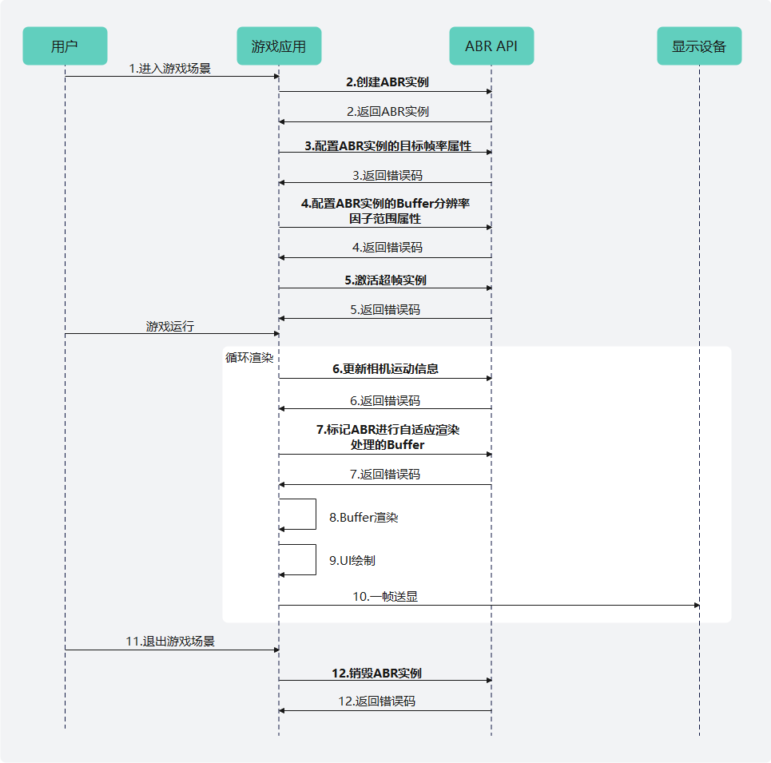

# ABR功能开发

更新时间：2026-04-20 06:34:33

来源：https://developer.huawei.com/consumer/cn/doc/harmonyos-guides/graphics-accelerate-abr

##### 业务流程

基于相机运动感知策略的ABR主要业务流程如下：




1. 用户进入ABR适用的游戏场景。
2. 游戏应用调用[HMS_ABR_CreateContext](https://developer.huawei.com/consumer/cn/doc/harmonyos-references/_graphics_accelerate#hms_abr_createcontext)接口并指定图形API类型，创建ABR上下文实例。
3. 游戏应用调用[HMS_ABR_SetTargetFps](https://developer.huawei.com/consumer/cn/doc/harmonyos-references/_graphics_accelerate#hms_abr_settargetfps)接口初始化ABR实例，配置目标帧率属性，ABR结合目标帧率属性实时感知GPU负载状态。
4. 游戏应用调用[HMS_ABR_SetScaleRange](https://developer.huawei.com/consumer/cn/doc/harmonyos-references/_graphics_accelerate#hms_abr_setscalerange)接口初始化ABR实例，配置Buffer分辨率因子范围属性。
5. 游戏应用调用[HMS_ABR_Activate](https://developer.huawei.com/consumer/cn/doc/harmonyos-references/_graphics_accelerate#hms_abr_activate)接口激活ABR上下文实例。
6. 游戏应用调用[HMS_ABR_UpdateCameraData](https://developer.huawei.com/consumer/cn/doc/harmonyos-references/_graphics_accelerate#hms_abr_updatecameradata)接口并传入相机运动信息，包含相机旋转、位移信息。
7. 游戏应用在使能ABR的Buffer渲染前调用[HMS_ABR_MarkFrameBuffer_GLES](https://developer.huawei.com/consumer/cn/doc/harmonyos-references/_graphics_accelerate#hms_abr_markframebuffer_gles)接口，对Buffer进行标记。
8. Buffer渲染处理。
9. 绘制UI。
10. 一帧送显。
11. 用户退出ABR适用的游戏场景。
12. 游戏应用调用[HMS_ABR_DestroyContext](https://developer.huawei.com/consumer/cn/doc/harmonyos-references/_graphics_accelerate#hms_abr_destroycontext)接口销毁ABR上下文实例并释放内存资源。


##### 开发步骤

本节阐述基于相机运动感知策略的ABR使用，从流程上分别阐述每个步骤的实现和调用。详细代码请参考[图形开发Sample（ABR）](https://gitcode.com/harmonyos_samples/adaptive-buffer-resolution-samplecode-clientdemo-cpp)。


##### 设置项目配置项

在“src/main/module.json5”的module层级中添加以下配置。

```json
"metadata": [
  {
    "name": "GraphicsAccelerateKit_ABR",
    "value": "true"
  }
]
```


##### 头文件引用

引用Graphics Accelerate Kit ABR头文件：abr_gles.h。

```text
// 引用ABR头文件 abr_gles.h
#include <graphics_game_sdk/abr_gles.h>
#include <GLES3/gl32.h>
```


##### 编写CMakeLists.txt

```text
find_library(
    # Sets the name of the path variable.
    abr-lib
    # Specifies the name of the NDK library that you want CMake to locate.
    libabr.so
)
find_library(
    # Sets the name of the path variable.
    GLES-lib
    # Specifies the name of the NDK library that you want CMake to locate.
    GLESv3
)
find_library(
    # Sets the name of the path variable.
    hilog-lib
    # Specifies the name of the NDK library that you want CMake to locate.
    hilog_ndk.z
)

target_link_libraries(entry PUBLIC
    ${abr-lib} ${GLES-lib} ${hilog-lib}
)
```


##### ABR初始化

在应用创建Surface后会触发其事件回调函数Core::OnSurfaceCreated()，在该函数中完成ABR上下文实例创建、ABR属性配置和功能激活。其中ABR上下文实例负责管理ABR整个生命周期。
1. 调用[HMS_ABR_CreateContext](https://developer.huawei.com/consumer/cn/doc/harmonyos-references/_graphics_accelerate#hms_abr_createcontext)接口创建ABR上下文实例，指定图形API类型。如果返回nullptr，则说明ABR上下文实例创建失败，或当前硬件设备不支持开启ABR。

  
```text
// 创建ABR上下文实例，指定图形API类型
ABR_Context *context_ = HMS_ABR_CreateContext(RENDER_API_GLES);
if (context_ == nullptr) {
      return false;
}
```

2. 调用[HMS_ABR_SetTargetFps](https://developer.huawei.com/consumer/cn/doc/harmonyos-references/_graphics_accelerate#hms_abr_settargetfps)接口初始化ABR实例，根据游戏的目标帧率配置ABR的目标帧率属性。

  
```text
// 初始化ABR接口调用错误码
ABR_ErrorCode errorCode = ABR_SUCCESS;

// 初始化ABR实例，配置ABR的目标帧率属性。例如游戏目标帧率为120fps，则配置ABR的目标帧率属性为120fps
errorCode = HMS_ABR_SetTargetFps(context_, 120);
if (errorCode != ABR_SUCCESS) {
    return false;
}
```

3. 调用[HMS_ABR_SetScaleRange](https://developer.huawei.com/consumer/cn/doc/harmonyos-references/_graphics_accelerate#hms_abr_setscalerange)接口初始化ABR实例，配置Buffer分辨率因子范围属性。

  
```text
// 初始化ABR实例，配置Buffer分辨率因子范围属性，结合具体游戏分辨率、画质设置合适的范围
// 例如设置ABR对Buffer分辨率进行0.5~1.0倍的自适应调整
errorCode = HMS_ABR_SetScaleRange(context_, 0.5f, 1.0f);
if (errorCode != ABR_SUCCESS) {
    return false;
}
```

4. 调用[HMS_ABR_Activate](https://developer.huawei.com/consumer/cn/doc/harmonyos-references/_graphics_accelerate#hms_abr_activate)接口激活ABR上下文实例。

  
```text
// 激活ABR上下文实例
errorCode = HMS_ABR_Activate(context_);
if (errorCode != ABR_SUCCESS) {
    return false;
}
```


##### 相机运动数据更新

在帧循环中，ABR根据获取的实时相机运动数据进行Buffer分辨率因子决策。

调用[HMS_ABR_UpdateCameraData](https://developer.huawei.com/consumer/cn/doc/harmonyos-references/_graphics_accelerate#hms_abr_updatecameradata)接口并传入相机运动信息，包含相机旋转、位移信息。

```text
// 相机运动数据结构体，设置每帧实时相机运动数据
ABR_CameraData cameraData;
// 每帧位置
ABR_Vector3 position_;
// 每帧的相机旋转角，范围是[0, 360]
ABR_Vector3 rotation_;
cameraData.position = position_;
cameraData.rotation = rotation_;

// 每帧相机运动数据更新
errorCode = HMS_ABR_UpdateCameraData(context_, &cameraData);
if (errorCode != ABR_SUCCESS) {
    return false;
}
```


##### 自适应渲染

在帧循环中，ABR将对所标记的Buffer进行自适应渲染处理。
1. 选择着色器处理耗时较高的Buffer，并在Buffer渲染前绑定帧缓冲。

  
```text
// 创建帧缓冲对象
GLuint fbo;
glGenFramebuffers(1, &fbo);
// 绑定帧缓冲
glBindFramebuffer(GL_FRAMEBUFFER, fbo);
```

2. 调用[HMS_ABR_MarkFrameBuffer_GLES](https://developer.huawei.com/consumer/cn/doc/harmonyos-references/_graphics_accelerate#hms_abr_markframebuffer_gles)接口对Buffer进行标记。

  
```text
// 在Buffer渲染前调用，执行失败不影响Buffer正常渲染
errorCode = HMS_ABR_MarkFrameBuffer_GLES(context_);
if (errorCode != ABR_SUCCESS) {
    return false;
}
```

3. 执行Buffer原有渲染流程。


##### 销毁ABR实例

在Surface销毁时，会触发其事件回调函数Core::OnSurfaceDestroyed()，在该函数中完成ABR实例的销毁。

调用[HMS_ABR_DestroyContext](https://developer.huawei.com/consumer/cn/doc/harmonyos-references/_graphics_accelerate#hms_abr_destroycontext)接口销毁ABR实例，释放内存资源。

```text
// 销毁ABR上下文实例并释放内存资源
ABR_ErrorCode errorCode = HMS_ABR_DestroyContext(&context_);
if (errorCode != ABR_SUCCESS) {
     return false;
}
```
