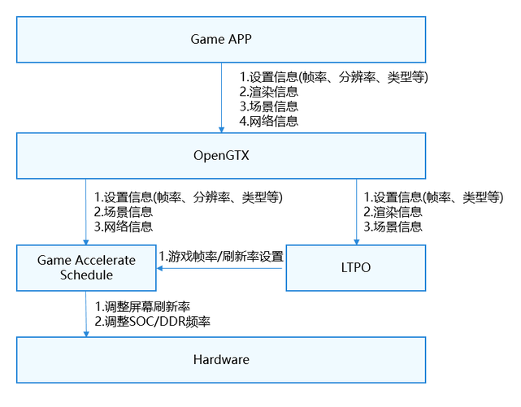
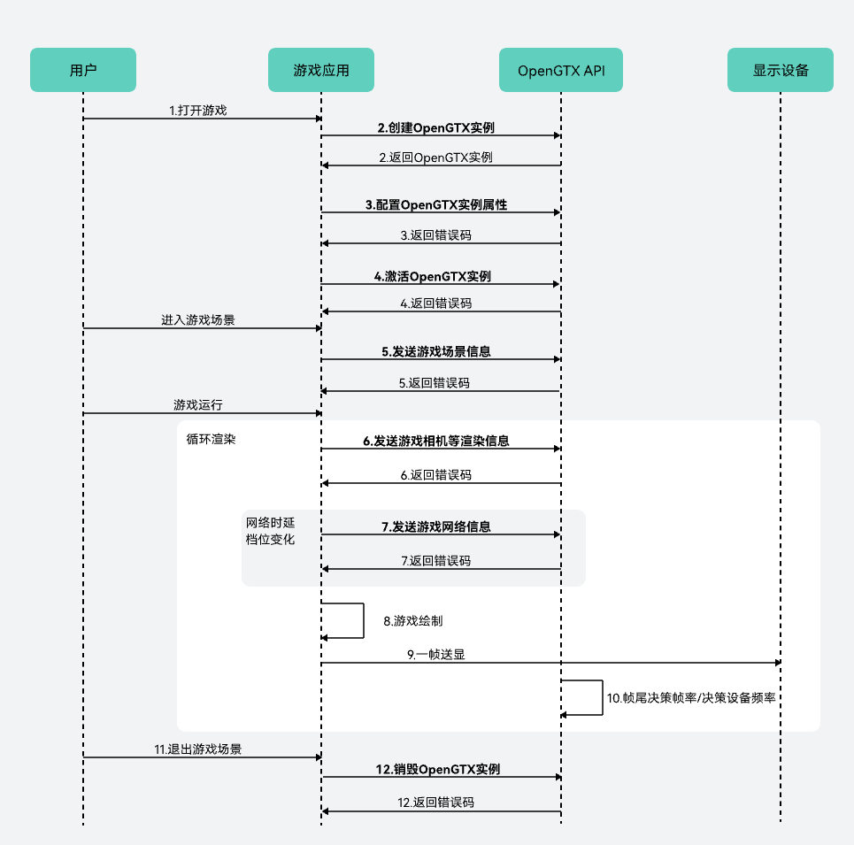

# OpenGTX功能开发

更新时间：2026-07-28 11:23:46

来源：https://developer.huawei.com/consumer/cn/doc/harmonyos-guides/graphics-accelerate-opengtx

#### 概述

OpenGTX是GPU Turbo X的开放式入口，根据游戏开发者主动提供的游戏过程中的关键信息，使能LTPO（动态帧率/刷新率）等游戏加速方案，助力游戏开发者打造高画质、高流畅、低功耗极致体验。LTPO通过动态感知游戏渲染状态、游戏场景、设备状态等关键信息，动态调整游戏的帧率/刷新率以及设备的SOC/DDR频率。





#### 业务流程

LTPO的主要业务流程如下：




1. 用户进入游戏。
2. 游戏应用调用[HMS_OpenGTX_CreateContext](https://developer.huawei.com/consumer/cn/doc/harmonyos-references/_graphics_accelerate#hms_opengtx_createcontext)接口创建OpenGTX上下文实例。
3. 游戏应用调用[HMS_OpenGTX_SetConfiguration](https://developer.huawei.com/consumer/cn/doc/harmonyos-references/_graphics_accelerate#hms_opengtx_setconfiguration)接口初始化配置实例属性，包含LTPO模式、目标帧率、包名、游戏类型、分辨率、游戏关键线程等属性。
4. 游戏应用调用[HMS_OpenGTX_Activate](https://developer.huawei.com/consumer/cn/doc/harmonyos-references/_graphics_accelerate#hms_opengtx_activate)接口激活OpenGTX上下文实例。
5. 游戏切换不同游戏场景后调用[HMS_OpenGTX_DispatchGameSceneInfo](https://developer.huawei.com/consumer/cn/doc/harmonyos-references/_graphics_accelerate#hms_opengtx_dispatchgamesceneinfo)接口发送游戏场景信息，包含场景类型、指定帧率、调度帧率范围、当前分辨率等信息。
6. 游戏应用在每帧渲染前调用[HMS_OpenGTX_DispatchFrameRenderInfo](https://developer.huawei.com/consumer/cn/doc/harmonyos-references/_graphics_accelerate#hms_opengtx_dispatchframerenderinfo)接口发送游戏帧渲染信息，包含游戏主相机的位置和欧拉角。
7. 游戏应用在每帧渲染前如遇到网络时延档位变化，调用[HMS_OpenGTX_DispatchNetworkInfo](https://developer.huawei.com/consumer/cn/doc/harmonyos-references/_graphics_accelerate#hms_opengtx_dispatchnetworkinfo)接口发送游戏网络信息，包含服务器IP地址、网络时延等信息。
8. 游戏应用正常绘制。
9. 一帧送显。
10. 每帧结束，将帧尾决策帧率、决策设备频率通知到设备。
11. 用户退出游戏。
12. 游戏应用调用[HMS_OpenGTX_DestroyContext](https://developer.huawei.com/consumer/cn/doc/harmonyos-references/_graphics_accelerate#hms_opengtx_destroycontext)接口销毁OpenGTX上下文实例并释放内存资源。


#### 开发步骤

本节介绍OpenGTX的开发接入，从流程上分别阐述每个步骤的实现和调用。详细代码请参考[OpenGTX Sample](https://gitcode.com/harmonyos_samples/open-gtx-samplecode-clientdemo-cpp)。


#### 设置项目配置项

在“src/main/module.json5”的module层级中添加以下配置。

```json
"metadata": [
  {
    "name": "GraphicsAccelerateKit_LTPO",
    "value": "true"
  }
],
```


#### 头文件引用

引用Graphics Accelerate Kit OpenGTX头文件：opengtx_base.h。

```text
// 引用OpenGTX头文件 opengtx_base.h
#include <graphics_game_sdk/opengtx_base.h>
```


#### 编写CMakeLists.txt

```text
find_library(
    # Sets the name of the path variable.
    opengtx-lib
    # Specifies the name of the NDK library that you want CMake to locate.
    libopengtx.so
)
find_library(
    # Sets the name of the path variable.
    GLES-lib
    # Specifies the name of the NDK library that you want CMake to locate.
    GLESv3
)
find_library(
    # Sets the name of the path variable.
    hilog-lib
    # Specifies the name of the NDK library that you want CMake to locate.
    hilog_ndk.z
)

target_link_libraries(entry PUBLIC
    ${opengtx-lib} ${GLES-lib} ${hilog-lib}
)
```


#### OpenGTX初始化

在surface创建后，会触发其事件回调函数Core::OnSurfaceCreated()，在该函数中完成OpenGTX上下文实例创建、OpenGTX属性配置和功能激活。其中OpenGTX上下文实例负责管理OpenGTX整个生命周期。
1. 调用[HMS_OpenGTX_CreateContext](https://developer.huawei.com/consumer/cn/doc/harmonyos-references/_graphics_accelerate#hms_opengtx_createcontext)接口创建OpenGTX上下文实例。如果返回nullptr，则说明OpenGTX上下文实例创建失败，或当前硬件设备不支持开启OpenGTX。

  
```text
// 创建OpenGTX上下文实例
OpenGTX_Context *context_ = HMS_OpenGTX_CreateContext(nullptr);
if (context_ == nullptr) {
    return false;
}
```

2. 调用[HMS_OpenGTX_SetConfiguration](https://developer.huawei.com/consumer/cn/doc/harmonyos-references/_graphics_accelerate#hms_opengtx_setconfiguration)接口属性配置，包含LTPO模式、目标帧率、包名、游戏类型、分辨率、游戏关键线程等属性。

  
```text
// 初始化OpenGTX接口调用错误码
OpenGTX_ErrorCode errorCode = OPENGTX_SUCCESS;
// OpenGTX属性配置结构体
OpenGTX_ConfigDescription config;
// LTPO调度模式
config.mode = SCENE_MODE;
// 游戏设置目标帧率
config.targetFPS = OGBT_TARGET_FPS_90;
// 游戏包名
config.packageName = OGBT_PACKAGE_NAME.data();
// 游戏版本
config.appVersion = OGBT_APP_VERSION.data();
// 引擎类型
config.engineType = OTHERS_ENGINE;
// 引擎版本
config.engineVersion = OGBT_ENGINE_VERSION.data();
// 游戏类别
config.gameType = MOBA;
// 游戏最高画质等级
config.pictureQualityMaxLevel = UHD;
// 游戏设置最大分辨率
config.resolutionMaxValue = OpenGTX_ResolutionValue { OGBT_RES_HEIGHT, OGBT_RES_WIDTH};
// 游戏逻辑线程
config.gameMainThreadId = OGBT_GAME_MAIN_THREAD_ID;
// 游戏渲染线程
config.gameRenderThreadId = OGBT_GAME_RENDER_THREAD_ID;
// 游戏运行其他关键线程
config.gameKeyThreadIds[0] = OGBT_GAME_DEFAULT_THREAD_ID;
config.gameKeyThreadIds[1] = OGBT_GAME_DEFAULT_THREAD_ID;
config.gameKeyThreadIds[2] = OGBT_GAME_DEFAULT_THREAD_ID;
config.gameKeyThreadIds[3] = OGBT_GAME_DEFAULT_THREAD_ID;
config.gameKeyThreadIds[4] = OGBT_GAME_DEFAULT_THREAD_ID;
// 游戏图形API是否为Vulkan
config.vulkanSupport = true;
// 初始化OpenGTX实例，配置OpenGTX属性
errorCode = HMS_OpenGTX_SetConfiguration(contextGtx_, &config);
if (errorCode != OPENGTX_SUCCESS) {
    GOLOGE("HMS_OpenGTX_SetConfiguration execution failed, error code: %d.", errorCode);
    return false;
}
```

3. 调用[HMS_OpenGTX_Activate](https://developer.huawei.com/consumer/cn/doc/harmonyos-references/_graphics_accelerate#hms_opengtx_activate)接口激活OpenGTX上下文实例。

  
```text
// 激活OpenGTX上下文实例
errorCode = HMS_OpenGTX_Activate(contextGtx_);
if (errorCode != OPENGTX_SUCCESS) {
    GOLOGE("HMS_OpenGTX_Activate execution failed, error code: %d.", errorCode);
    return false;
}
```

4. 调用[HMS_OpenGTX_Deactivate](https://developer.huawei.com/consumer/cn/doc/harmonyos-references/_graphics_accelerate#hms_opengtx_deactivate)接口去激活OpenGTX上下文实例。（在需要关闭OpenGTX功能时调用此接口。去激活后，调用[HMS_OpenGTX_DispatchGameSceneInfo](https://developer.huawei.com/consumer/cn/doc/harmonyos-references/_graphics_accelerate#hms_opengtx_dispatchgamesceneinfo)等接口将不会生效）。

  
```text
// 去激活OpenGTX上下文实例
errorCode = HMS_OpenGTX_Deactivate(contextGtx_);
if (errorCode != OPENGTX_SUCCESS) {
    GOLOGE("HMS_OpenGTX_Deactivate execution failed, error code: %d.", errorCode);
}
```


#### OpenGTX关键信息更新
1. 游戏切换不同游戏场景后调用[HMS_OpenGTX_DispatchGameSceneInfo](https://developer.huawei.com/consumer/cn/doc/harmonyos-references/_graphics_accelerate#hms_opengtx_dispatchgamesceneinfo)接口发送游戏场景信息，包含场景类型、指定帧率、调度帧率范围、当前分辨率等信息。

  
```text
// 激活OpenGTX上下文实例
errorCode = HMS_OpenGTX_Activate(contextGtx_);
if (errorCode != OPENGTX_SUCCESS) {
    GOLOGE("HMS_OpenGTX_Activate execution failed, error code: %d.", errorCode);
    return false;
}
```

2. 每帧渲染前调用[HMS_OpenGTX_DispatchFrameRenderInfo](https://developer.huawei.com/consumer/cn/doc/harmonyos-references/_graphics_accelerate#hms_opengtx_dispatchframerenderinfo)接口发送游戏帧渲染信息，包含游戏主相机的位置和欧拉角。

  
```text
// OpenGTX游戏渲染信息结构体
OpenGTX_FrameRenderInfo frameRenderInfo;
// 主相机位置
frameRenderInfo.mainCameraPosition = {0.0f, 0.0f, 0.0f};
// 主相机欧拉角
frameRenderInfo.mainCameraRotate = {0.0f, 0.0f, 0.0f};
// OpenGTX接收游戏渲染信息
errorCode = HMS_OpenGTX_DispatchFrameRenderInfo(contextGtx_, &frameRenderInfo);
if (errorCode != OPENGTX_SUCCESS) {
    GOLOGE("HMS_OpenGTX_DispatchFrameRenderInfo execution failed, error code: %d.", errorCode);
    return false;
}
```

3. 每帧渲染前如遇到网络时延档位变化，调用[HMS_OpenGTX_DispatchNetworkInfo](https://developer.huawei.com/consumer/cn/doc/harmonyos-references/_graphics_accelerate#hms_opengtx_dispatchnetworkinfo)接口发送游戏网络信息。包含服务器IP地址、网络时延等信息。

  
```text
// OpenGTX游戏场景信息结构体
OpenGTX_GameSceneInfo gameSceneInfo;
// 游戏场景类型ID
gameSceneInfo.sceneID = OTHERS_SCENE;
// 游戏场景描述
gameSceneInfo.description = OGBT_DESCRIPTION.data();
// 游戏场景推荐帧率
gameSceneInfo.recommendFPS = OGBT_RECOMMEND_FPS;
// 游戏场景最小帧率
gameSceneInfo.minFPS = OGBT_MIN_FPS;
// 游戏场景最大帧率
gameSceneInfo.maxFPS = OGBT_MAX_FPS;
// 屏幕分辨率 高度
gameSceneInfo.resolutionCurValue.height = OGBT_RES_HEIGHT;
// 屏幕分辨率 宽度
gameSceneInfo.resolutionCurValue.width = OGBT_RES_WIDTH;
// OpenGTX接收游戏场景信息
errorCode = HMS_OpenGTX_DispatchGameSceneInfo(contextGtx_, &gameSceneInfo);
if (errorCode != OPENGTX_SUCCESS) {
    GOLOGE("HMS_OpenGTX_DispatchGameSceneInfo execution failed, error code: %d.", errorCode);
    return false;
}
```


#### 销毁OpenGTX实例

在surface销毁时，会触发其事件回调函数Core::OnSurfaceDestroyed()，在该函数中完成OpenGTX实例的销毁。

调用[HMS_OpenGTX_DestroyContext](https://developer.huawei.com/consumer/cn/doc/harmonyos-references/_graphics_accelerate#hms_opengtx_destroycontext)接口销毁OpenGTX实例，释放内存资源。

```text
// 销毁OpenGTX上下文实例并释放内存资源
errorCode = HMS_OpenGTX_DestroyContext(&contextGtx_);
predictionPaused_ = (errorCode == OPENGTX_SUCCESS);
if (errorCode != OPENGTX_SUCCESS) {
    GOLOGE("HMS_OpenGTX_DestroyContext execution failed, error code: %d.", errorCode);
    return false;
}
```
