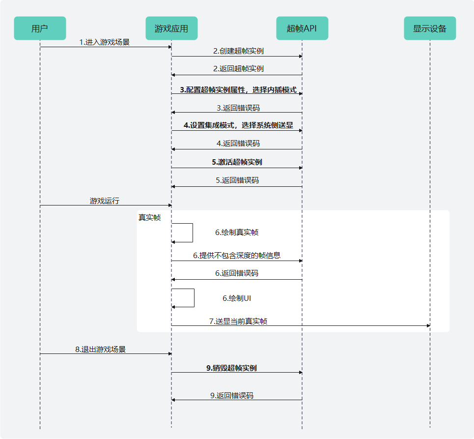

# Vulkan平台

更新时间：2026-05-18 03:44:20

来源：https://developer.huawei.com/consumer/cn/doc/harmonyos-guides/graphics-accelerate-fg-ai-vulkan

#### 业务流程
AI超帧调用流程上依赖系统送显模式功能，但与基本的系统送显模式相比，无需调用新方法，只需要在传输帧信息的时候不传输深度信息即可。
下面是基于Vulkan图形API平台，集成AI超帧的主要业务流程：

1. 用户进入超帧适用的游戏场景。
2. 游戏应用调用HMS_FG_CreateContext_VK接口创建超帧上下文实例。如超帧上下文实例创建失败，则无需在步骤6提供当前帧信息，只需逐帧对场景进行渲染送显即可。
3. 游戏应用调用接口配置超帧实例属性。包括调用HMS_FG_SetAlgorithmMode_VK（必选）设置超帧算法模式并选择内插模式；按需调用其他插帧相关配置接口。
4. 设置集成模式，选择系统侧集成调用HMS_FG_SetIntegrationMode_VK（可选）设置超帧预测的集成信息FG_IntegrationInfo并选择系统侧送显；系统送显预测帧模式下可通过HMS_FG_SetUiPredictionEnabled_VK（可选）启用UI预测功能，不启用时预测帧会复用上一帧的UI进行展示；系统送显模式下可通过HMS_FG_SetTargetFps_VK（可选）设置超帧后的目标帧率。
5. 游戏应用调用HMS_FG_Activate_VK接口激活超帧上下文实例。
6. 游戏应用渲染真实帧，调用HMS_FG_Dispatch_VK接口并传入真实帧颜色信息、相机矩阵信息，生成预测帧。请避免传入深度信息，否则会触发增强超帧算法。
7. 游戏应用完成UI绘制，并送显当前真实帧。
8. 用户退出超帧适用的游戏场景。
9. 游戏应用调用HMS_FG_DestroyContext_VK接口销毁超帧上下文实例并释放内存资源。

#### 开发步骤
本节阐述基于Vulkan图形API平台的系统送显模式调用示例。详细代码请参考[图形开发Sample（超帧Vulkan）](https://gitcode.com/harmonyos_samples/frame-generation-vulkan-samplecode-clientdemo-cpp)。
1. 设置meta-data。在应用的module.json5中声明meta-data以支持系统送显模式。 {
 "module": {
 // 其他的配置项
 // ...
 "metadata": [
 {
 "name": "GraphicsAccelerateKit_FusionAware",
 "value": "Vulkan"
 }
 ]
 }
}
2. 编写CMakeLists.txt。 find_library(
 # Sets the name of the path variable.
 framegeneration-lib
 # Specifies the name of the NDK library that you want CMake to locate.
 libframegeneration.so
)
find_library(
 # Sets the name of the path variable.
 vulkan-lib
 # Specifies the name of the NDK library that you want CMake to locate.
 vulkan
)

target_link_libraries(entry PUBLIC
 ${framegeneration-lib} ${vulkan-lib}
)
3. 引用Graphics Accelerate Kit超帧头文件：frame_generation_vk.h。 // 引用超帧frame_generation_vk.h头文件

#include <graphics_game_sdk/frame_generation_vk.h>
4. 调用HMS_FG_CreateContext_VK接口创建超帧上下文实例。如果返回nullptr，则说明超帧上下文实例创建失败，或当前硬件设备不支持开启超帧。 // 变量声明
VkInstance vkInstance = VK_NULL_HANDLE;
VkPhysicalDevice vkPhysicalDevice = VK_NULL_HANDLE;
VkDevice vkDevice = VK_NULL_HANDLE;

// 创建超帧上下文实例
FG_ContextDescription_VK contextDescription{};
contextDescription.vkInstance = vkInstance;
contextDescription.vkPhysicalDevice = vkPhysicalDevice;
contextDescription.vkDevice = vkDevice;
contextDescription.framesInFlight = 1;
contextDescription.fnVulkanLoaderFunction = vkGetInstanceProcAddr;
FG_Context_VK* m_context = HMS_FG_CreateContext_VK(&contextDescription);
if (m_context == nullptr) {
 return false;
}
5. 调用超帧实例属性配置接口，超帧算法模式选择内插增强模式并指定系统送显预测帧模式。 // 初始化超帧接口调用错误码
FG_ErrorCode errorCode = FG_SUCCESS;

// 超帧算法模式
FG_AlgorithmModeInfo aInfo{};
aInfo.predictionMode = FG_PREDICTION_MODE_INTERPOLATION; // 内插模式
aInfo.meMode = FG_ME_MODE_ENHANCED; // 增强模式
errorCode = HMS_FG_SetAlgorithmMode_VK(m_context, &aInfo); // [必选] 设置超帧算法模式
if (errorCode != FG_SUCCESS) {
 return false;
}

// 调用其他插帧相关配置接口
// ...

// 超帧预测的集成信息
FG_IntegrationInfo integrationInfo {};
integrationInfo.presentMode = FG_PRESENT_BY_SYSTEM; // 预测帧送显模式
integrationInfo.textureCachedByGame = false; // 输入的颜色纹理游戏侧缓存 系统不会复制一份再做预测 默认游戏不会缓存
integrationInfo.needFlipInputColor = false; // 颜色纹理需要翻转 默认false
integrationInfo.needFlipOutputColor = false; // 预测帧需要翻转 默认false
// 设置超帧预测的集成信息
errorCode = HMS_FG_SetIntegrationMode_VK(m_context, &integrationInfo);
if (errorCode != FG_SUCCESS) {
 return false;
}
6. 调用HMS_FG_Activate_VK接口激活超帧上下文实例。 // 激活超帧上下文实例
errorCode = HMS_FG_Activate_VK(m_context);
if (errorCode != FG_SUCCESS) {
 return false;
}
7. 调用HMS_FG_CreateImage_VK接口创建真实渲染帧颜色缓冲区图像实例。 // 变量声明
VkImage inputColorImage = VK_NULL_HANDLE;
VkImageView inputColorImageView = VK_NULL_HANDLE;

// 创建真实帧颜色缓冲区图像实例
FG_Image_VK* inputColor = HMS_FG_CreateImage_VK(m_context, inputColorImage, inputColorImageView);
if (!inputColor) {
 return false;
}
8. 游戏运行中，渲染真实帧时，缓存颜色信息和相机矩阵等属性信息。渲染预测帧时，需调用HMS_FG_Dispatch_VK接口并传入真实帧属性信息，指定预测帧缓冲区索引，生成预测帧。游戏送显自己真实帧，系统会在真实帧和上一帧间完成预测帧的展示。 // 帧循环
while (true) {
 // 真实帧渲染阶段
 // 渲染当前帧渲染画面，缓存颜色、相机矩阵等信息，用于下一帧预测帧生成
 // ...

 // 绘制真实帧
 // ...

 // 绘制UI
 // ...

 // 预测帧渲染阶段
 // 设置预测帧生成前真实帧颜色缓冲区同步状态
 FG_ImageSync_VK inputColorInitImageSync{};
 inputColorInitImageSync.stages = VK_PIPELINE_STAGE_COLOR_ATTACHMENT_OUTPUT_BIT;
 inputColorInitImageSync.layout = VK_IMAGE_LAYOUT_COLOR_ATTACHMENT_OPTIMAL;
 inputColorInitImageSync.accessMask = VK_ACCESS_COLOR_ATTACHMENT_WRITE_BIT;

 // 设置预测帧生成后真实帧颜色缓冲区同步状态
 FG_ImageSync_VK inputColorFinalImageSync{};
 inputColorFinalImageSync.stages = VK_PIPELINE_STAGE_TRANSFER_BIT;
 inputColorFinalImageSync.layout = VK_IMAGE_LAYOUT_TRANSFER_SRC_OPTIMAL;
 inputColorFinalImageSync.accessMask = VK_ACCESS_TRANSFER_READ_BIT;

 // 创建真实帧颜色缓冲区图像属性实例
 FG_ImageInfo_VK inputColorImageInfo{};
 inputColorImageInfo.image = inputColor;
 inputColorImageInfo.initialSync = inputColorInitImageSync;
 inputColorImageInfo.finalSync = inputColorFinalImageSync;

 // 帧生成属性配置结构体
 FG_DispatchDescription_VK dispatchDescription{};
 // 传入真实渲染帧颜色缓冲区属性信息
 dispatchDescription.inputColorInfo = inputColorImageInfo;

 // 变量声明
 FG_Mat4x4 preViewProj;
 FG_Mat4x4 preInvViewProj;
 VkCommandBuffer vkCommandBuffer = VK_NULL_HANDLE;

 // 传入上一帧真实渲染帧视图投影矩阵
 dispatchDescription.viewProj = preViewProj;
 // 传入上一帧真实渲染帧视图投影逆矩阵
 dispatchDescription.invViewProj = preInvViewProj;
 // 传入用于录入超帧绘制指令的命令缓冲区句柄
 dispatchDescription.vkCommandBuffer = vkCommandBuffer;

 // 生成预测帧
 errorCode = HMS_FG_Dispatch_VK(m_context, &dispatchDescription);
 if (errorCode != FG_SUCCESS) {
 return false;
 }

 switch (errorCode) {
 case FG_SUCCESS: {
 // 预测成功
 break;
 }
 case FG_COLLECTING_PREVIOUS_FRAMES:
 // 传入真实帧数量未达到固定阈值，无预测帧生成，外插模式传入真实帧数量<3时返回该状态码，此时不要将预测帧送显
 break;
 default:
 // 预测帧生成失败
 break;
 }

 // 送显真实帧
 // ...
}
9. 调用HMS_FG_DestroyContext_VK接口销毁超帧实例，释放内存资源。 // 销毁超帧上下文实例并释放内存资源
errorCode = HMS_FG_DestroyContext_VK(&m_context);
if (errorCode != FG_SUCCESS) {
 return false;
}