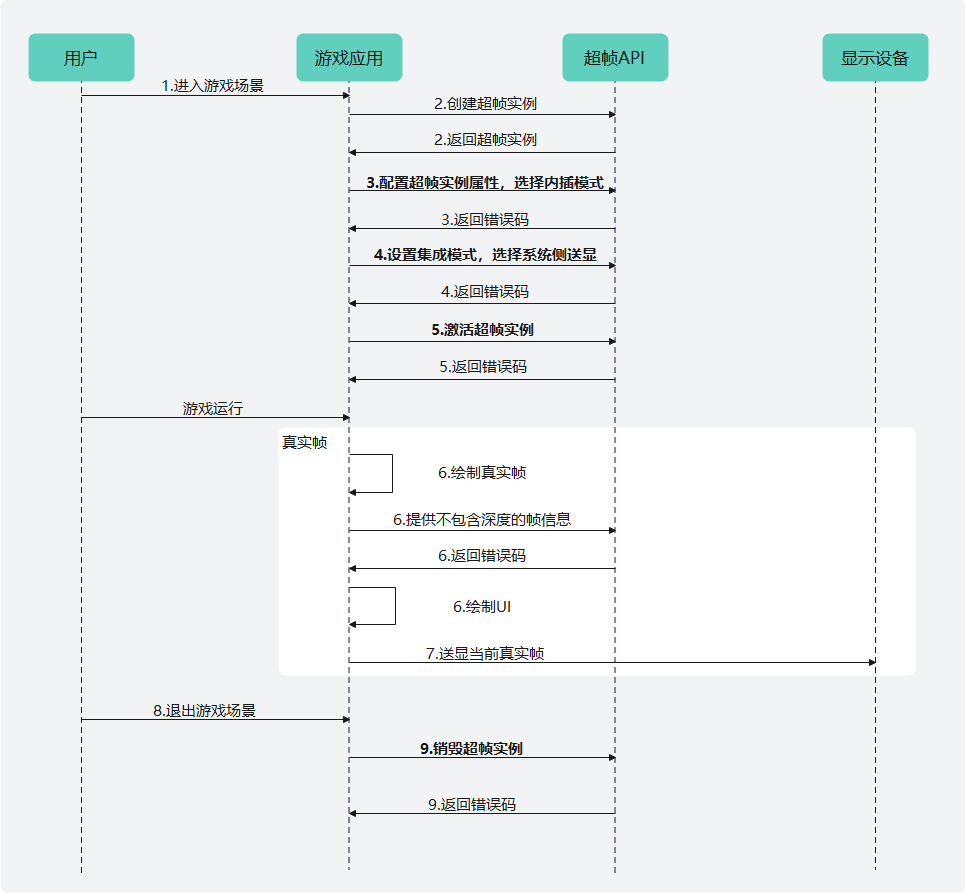

# Vulkan平台

更新时间：2026-07-28 11:23:46

来源：https://developer.huawei.com/consumer/cn/doc/harmonyos-guides/graphics-accelerate-fg-ai-vulkan

#### 业务流程

AI超帧调用流程上依赖系统送显模式功能，但与基本的系统送显模式相比，无需调用新方法，只需要在传输帧信息的时候不传输深度信息即可。

下面是基于Vulkan图形API平台，集成AI超帧的主要业务流程：




1. 用户进入超帧适用的游戏场景。
2. 游戏应用调用[HMS_FG_IsFrameGenerationSupported](https://developer.huawei.com/consumer/cn/doc/harmonyos-references/_graphics_accelerate#hms_fg_isframegenerationsupported)查询是否支持AI超帧特性。如果当前设备支持此特性，则继续步骤3创建超帧上下文实例，否则返回false，结束流程。
3. 游戏应用调用[HMS_FG_CreateContext_VK](https://developer.huawei.com/consumer/cn/doc/harmonyos-references/_graphics_accelerate#hms_fg_createcontext_vk)接口创建超帧上下文实例。如超帧上下文实例创建失败，则无需在步骤6提供当前帧信息，只需逐帧对场景进行渲染送显即可。
4. 游戏应用调用接口配置超帧实例属性。包括调用[HMS_FG_SetAlgorithmMode_VK](https://developer.huawei.com/consumer/cn/doc/harmonyos-references/_graphics_accelerate#hms_fg_setalgorithmmode_vk)设置超帧算法模式并选择内插模式；按需调用其他插帧相关配置接口。
5. 设置集成模式，选择系统侧集成调用[HMS_FG_SetIntegrationMode_VK](https://developer.huawei.com/consumer/cn/doc/harmonyos-references/_graphics_accelerate#hms_fg_setintegrationmode_vk)设置超帧预测的集成信息[FG_IntegrationInfo](https://developer.huawei.com/consumer/cn/doc/harmonyos-references/_graphics_accelerate#fg_integrationinfo)并选择系统侧送显；系统送显预测帧模式下可通过[HMS_FG_SetUiPredictionEnabled_VK](https://developer.huawei.com/consumer/cn/doc/harmonyos-references/_graphics_accelerate#hms_fg_setuipredictionenabled_vk)启用UI预测功能，不启用时预测帧会复用上一帧的UI进行展示；系统送显模式下可通过[HMS_FG_SetTargetFps_VK](https://developer.huawei.com/consumer/cn/doc/harmonyos-references/_graphics_accelerate#hms_fg_settargetfps_vk)设置超帧后的目标帧率，未调用该接口则默认设置为60帧。
6. 游戏应用调用[HMS_FG_Activate_VK](https://developer.huawei.com/consumer/cn/doc/harmonyos-references/_graphics_accelerate#hms_fg_activate_vk)接口激活超帧上下文实例。
7. 游戏应用渲染真实帧，调用[HMS_FG_Dispatch_VK](https://developer.huawei.com/consumer/cn/doc/harmonyos-references/_graphics_accelerate#hms_fg_dispatch_vk)接口并传入真实帧颜色信息、相机矩阵信息，生成预测帧。请避免传入深度信息，否则会触发增强超帧算法。
8. 游戏应用完成UI绘制，并送显当前真实帧。
9. 用户退出超帧适用的游戏场景。
10. 游戏应用调用[HMS_FG_DestroyContext_VK](https://developer.huawei.com/consumer/cn/doc/harmonyos-references/_graphics_accelerate#hms_fg_destroycontext_vk)接口销毁超帧上下文实例并释放内存资源。


#### 开发步骤

本节阐述基于Vulkan图形API平台的系统送显模式调用示例。详细代码请参考[图形开发Sample（超帧Vulkan）](https://gitcode.com/harmonyos_samples/frame-generation-vulkan-samplecode-clientdemo-cpp)。
1. 设置meta-data。在应用的module.json5中声明meta-data以支持系统送显模式。

  
```json
{
  "module": {
    // ...
    "metadata": [
      {
        "name": "GraphicsAccelerateKit_FusionAware",
        "value": "Vulkan"
      },
      // ...
    ],
    // ...
  }
}
```

2. 编写CMakeLists.txt。

  
```text
find_library(framegeneration-lib libframegeneration.so REQUIRED)
find_library(vulkan-lib vulkan REQUIRED)

target_link_libraries(entry PUBLIC
    ${framegeneration-lib} ${vulkan-lib}
)
```

3. 引用Graphics Accelerate Kit超帧头文件：frame_generation_vk.h。

  
```text
// 引用超帧frame_generation_vk.h头文件
#include <graphics_game_sdk/frame_generation_vk.h>
```

4. 调用[HMS_FG_IsFrameGenerationSupported](https://developer.huawei.com/consumer/cn/doc/harmonyos-references/_graphics_accelerate#hms_fg_isframegenerationsupported)查询是否支持AI超帧特性。如果当前设备支持此特性，则继续下一步创建超帧上下文实例，否则返回false，结束流程。

  
```text
if (!HMS_FG_IsFrameGenerationSupported(FG_FeatureType::INTERPOLATION_AI_VULKAN)) {
    GOLOGE("HMS_FG_IsFrameGenerationSupported device not support AI frame generation.");
    return false;
}
```

5. 调用[HMS_FG_CreateContext_VK](https://developer.huawei.com/consumer/cn/doc/harmonyos-references/_graphics_accelerate#hms_fg_createcontext_vk)接口创建超帧上下文实例。如果返回nullptr，则说明超帧上下文实例创建失败，或当前硬件设备不支持开启超帧。

  
```text
// 变量声明
 VkInstance vkInstance = VK_NULL_HANDLE; // vkInstance通过调用vkCreateInstance创建
 VkPhysicalDevice vkPhysicalDevice = VK_NULL_HANDLE; // vkPhysicalDevice通过调用vkEnumeratePhysicalDevices枚举
 VkDevice vkDevice = VK_NULL_HANDLE; // vkDevice通过调用vkCreateDevice创建

 // 创建超帧上下文实例
FG_ContextDescription_VK contextDescription{};
contextDescription.vkInstance = vkInstance;
contextDescription.vkPhysicalDevice = vkPhysicalDevice;
contextDescription.vkDevice = vkDevice;
contextDescription.framesInFlight = 1;
contextDescription.fnVulkanLoaderFunction = vkGetInstanceProcAddr;
FG_Context_VK* m_context = HMS_FG_CreateContext_VK(&contextDescription);
if (m_context == nullptr) {
    GOLOGE("HMS_FG_CreateContext_VK execution failed.");
    return false;
}
```

6. 调用超帧实例属性配置接口，超帧算法模式选择内插增强模式并指定系统送显预测帧模式。

  
```text
// 初始化超帧接口调用错误码
FG_ErrorCode errorCode = FG_SUCCESS;

// 超帧算法模式
FG_AlgorithmModeInfo aInfo{};
aInfo.predictionMode = FG_PREDICTION_MODE_INTERPOLATION; // 内插模式
aInfo.meMode = FG_ME_MODE_ENHANCED; // 增强模式
VkQueryPoolCreateInfo createInfo{};
createInfo.sType = VK_STRUCTURE_TYPE_QUERY_POOL_CREATE_INFO;
createInfo.queryType = VK_QUERY_TYPE_HISS_MOTION_VECTOR_DRAW_TRACKING_HUAWEI;
createInfo.queryCount = 1;
vkCreateQueryPool(m_device, &createInfo, nullptr, &m_queryPool);

errorCode = HMS_FG_SetAlgorithmMode_VK(m_context, &aInfo); // 设置超帧算法模式
if (errorCode != FG_SUCCESS) {
    GOLOGE("HMS_FG_SetAlgorithmMode_VK execution failed, error code: %d.", errorCode);
    return false;
}

// 调用其他插帧相关配置接口
// ...
// 超帧预测的集成信息
FG_IntegrationInfo integrationInfo {};
integrationInfo.presentMode = FG_PRESENT_BY_SYSTEM; // 预测帧送显模式
integrationInfo.textureCachedByGame = false; // 输入的颜色纹理和深度纹理游戏侧缓存 系统不会复制一份再做预测 默认游戏不会缓存
integrationInfo.needFlipInputColor = false; // 颜色纹理需要翻转 默认false
integrationInfo.needFlipOutputColor = false; // 预测帧需要翻转 默认false
// 设置超帧预测的集成信息
errorCode = HMS_FG_SetIntegrationMode_VK(m_context, &integrationInfo);
if (errorCode != FG_SUCCESS) {
    GOLOGE("HMS_FG_SetIntegrationMode_VK execution failed, error code: %d.", errorCode);
    return false;
}
```

7. 调用[HMS_FG_Activate_VK](https://developer.huawei.com/consumer/cn/doc/harmonyos-references/_graphics_accelerate#hms_fg_activate_vk)接口激活超帧上下文实例。

  
```text
// 激活超帧上下文实例
FG_ErrorCode errorCode = HMS_FG_Activate_VK(m_context);
if (errorCode != FG_SUCCESS) {
    GOLOGE("HMS_FG_Activate_VK execution failed, error code: %d.", errorCode);
    // ...
    return false;
}
```

8. 调用[HMS_FG_CreateImage_VK](https://developer.huawei.com/consumer/cn/doc/harmonyos-references/_graphics_accelerate#hms_fg_createimage_vk)接口创建真实渲染帧颜色缓冲区图像实例。

  
```text
// 变量声明
FG_Image_VK *m_ffSceneColor = nullptr;
VulkanFG::Image m_sceneColor{};
```

```text
// 创建真实帧颜色缓冲区图像实例
m_ffSceneColor = HMS_FG_CreateImage_VK(m_context, m_sceneColor.GetNativeImage(), m_sceneColor.GetNativeImageView());
if (!m_ffSceneColor) {
    GOLOGE("HMS_FG_RegisterImage_VK m_ffSceneColor execution failed.");
    return false;
}
```

9. 游戏运行中，渲染真实帧时，缓存颜色信息和相机矩阵等属性信息。渲染预测帧时，需调用[HMS_FG_Dispatch_VK](https://developer.huawei.com/consumer/cn/doc/harmonyos-references/_graphics_accelerate#hms_fg_dispatch_vk)接口并传入真实帧属性信息，指定预测帧缓冲区索引，生成预测帧。游戏送显自己真实帧，系统会在真实帧和上一帧间完成预测帧的展示。

  
```text
// 变量声明
FG_Mat4x4 m_viewProj{};
FG_Mat4x4 m_invViewProj{};
FG_DispatchDescription_VK dispatch{};
```

```text
// 真实帧渲染阶段
// 渲染当前帧渲染画面，缓存颜色、深度、相机矩阵等信息，用于下一帧预测帧生成，绘制真实帧
// ...

// 绘制UI
// ...

bool const runPrediction = m_predictionEnabled & !m_predictionPaused;
if (runPrediction) { // 预测帧渲染阶段
    dispatch = {
        // 传入真实渲染帧颜色缓冲区属性信息
        .inputColorInfo = {
            .image = m_ffSceneColor,
            // 设置预测帧生成前真实帧颜色缓冲区同步状态
            .initialSync {
                .accessMask = VK_ACCESS_SHADER_READ_BIT,
                .layout = VK_IMAGE_LAYOUT_SHADER_READ_ONLY_OPTIMAL,
                .stages = VK_PIPELINE_STAGE_FRAGMENT_SHADER_BIT
            },
            // 设置预测帧生成后真实帧颜色缓冲区同步状态
            .finalSync {
                .accessMask = VK_ACCESS_SHADER_READ_BIT,
                .layout = VK_IMAGE_LAYOUT_SHADER_READ_ONLY_OPTIMAL,
                .stages = VK_PIPELINE_STAGE_FRAGMENT_SHADER_BIT
            }
        },
        // 传入上一帧真实渲染帧视图投影矩阵
        .viewProj = m_viewProj,
        // 传入上一帧真实渲染帧视图投影逆矩阵
        .invViewProj = m_invViewProj,
        // 传入用于录入超帧绘制指令的命令缓冲区句柄
        .vkCommandBuffer = fif->commandBuffer,
        // 传入当前帧序号
        .frameIdx = fifIndex
    };
    // ...
    // 生成预测帧，更新预测帧缓冲区的内存
    FG_ErrorCode errorCode = HMS_FG_Dispatch_VK(m_context, &dispatch);
    if (errorCode != FG_SUCCESS) {
        GOLOGE("HMS_FG_Dispatch_VK execution failed, error code: %d", errorCode);
    }
}

// ...
// 送显真实帧
// ...
```

10. 调用[HMS_FG_DestroyContext_VK](https://developer.huawei.com/consumer/cn/doc/harmonyos-references/_graphics_accelerate#hms_fg_destroycontext_vk)接口销毁超帧实例，释放内存资源。

```text
// 销毁超帧上下文实例并释放内存资源
errorCode = HMS_FG_DestroyContext_VK(&m_context);
if (errorCode != FG_SUCCESS) {
    GOLOGE("HMS_FG_DestroyContext_VK execution failed, error code: %d", errorCode);
    return false;
}
```
