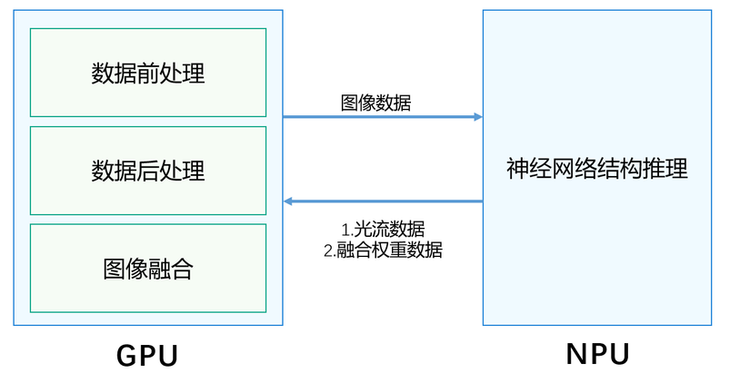

# 概述

更新时间：2026-03-09 02:50:43

来源：https://developer.huawei.com/consumer/cn/doc/harmonyos-guides/graphics-accelerate-fg-ai-overview

从6.0.0(20)版本开始，新增支持AI超帧能力。

 AI超帧主要利用了设备上的NPU执行模型推理，大幅降低GPU上的负载从而降低渲染的功耗。此外，AI超帧相比传统超帧算法在大幅运动和非线性运动场景的预测效果上也有明显优势。

 
