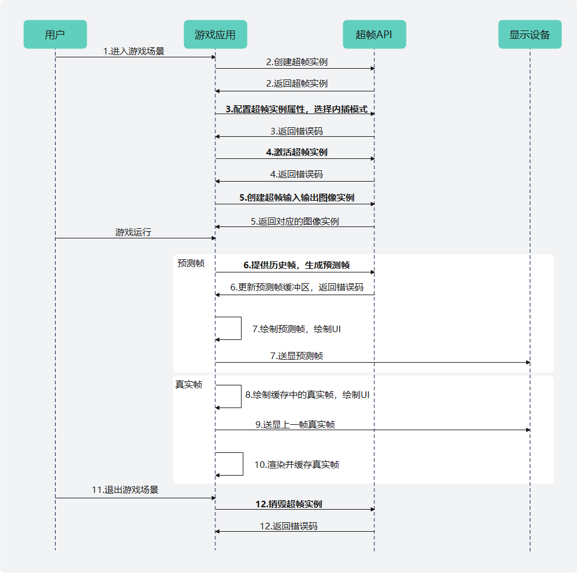

# Vulkan平台

更新时间：2026-07-28 11:23:46

来源：https://developer.huawei.com/consumer/cn/doc/harmonyos-guides/graphics-accelerate-fg-interpolation-vulkan

#### 业务流程

基于Vulkan图形API平台，超帧内插模式的主要业务流程如下：




1. 用户进入超帧适用的游戏场景。
2. 游戏应用调用[HMS_FG_CreateContext_VK](https://developer.huawei.com/consumer/cn/doc/harmonyos-references/_graphics_accelerate#hms_fg_createcontext_vk)接口创建超帧上下文实例。如超帧上下文实例创建失败，则无需进入步骤6到步骤10的预测帧、真实帧交替渲染送显的循环流程，只需逐帧对场景进行渲染送显即可。
3. 游戏应用调用接口配置超帧实例属性。包括调用[HMS_FG_SetAlgorithmMode_VK](https://developer.huawei.com/consumer/cn/doc/harmonyos-references/_graphics_accelerate#hms_fg_setalgorithmmode_vk)设置超帧算法模式并选择内插模式；调用[HMS_FG_SetResolution_VK](https://developer.huawei.com/consumer/cn/doc/harmonyos-references/_graphics_accelerate#hms_fg_setresolution_vk)设置超帧输入输出图像分辨率；调用[HMS_FG_SetCvvZSemantic_VK](https://developer.huawei.com/consumer/cn/doc/harmonyos-references/_graphics_accelerate#hms_fg_setcvvzsemantic_vk)设置齐次裁剪空间Z/W范围及深度测试函数，未调用该接口则默认设置为FG_CVV_Z_SEMANTIC_ZERO_TO_ONE_FORWARD_Z；调用[HMS_FG_SetImageFormat_VK](https://developer.huawei.com/consumer/cn/doc/harmonyos-references/_graphics_accelerate#hms_fg_setimageformat_vk)设置超帧输入输出图像格式，未调用该接口则真实帧颜色缓冲区和预测帧缓冲区图像格式默认设置为VK_FORMAT_R8G8B8A8_UNORM，深度模板缓冲区图像格式默认设置为VK_FORMAT_D24_UNORM_S8_UINT；如果颜色缓冲区相对深度模板缓冲区基于y轴翻转180度，则调用[HMS_FG_SetDepthStencilYDirectionInverted_VK](https://developer.huawei.com/consumer/cn/doc/harmonyos-references/_graphics_accelerate#hms_fg_setdepthstencilydirectioninverted_vk)设置翻转状态，未调用该接口则默认无翻转。
4. 游戏应用调用[HMS_FG_Activate_VK](https://developer.huawei.com/consumer/cn/doc/harmonyos-references/_graphics_accelerate#hms_fg_activate_vk)接口激活超帧上下文实例。
5. 游戏应用调用[HMS_FG_CreateImage_VK](https://developer.huawei.com/consumer/cn/doc/harmonyos-references/_graphics_accelerate#hms_fg_createimage_vk)接口创建真实渲染帧颜色缓冲区图像实例、深度模板缓冲区图像实例、预测帧缓冲区图像实例。该接口将游戏应用中的VkImage、VkImageView图像资源和超帧算法实现之间建立关联。
6. 游戏应用调用[HMS_FG_Dispatch_VK](https://developer.huawei.com/consumer/cn/doc/harmonyos-references/_graphics_accelerate#hms_fg_dispatch_vk)接口并传入历史真实渲染帧颜色信息、深度信息、相机矩阵信息，生成预测帧，并更新预测帧缓冲区。
7. 预测帧绘制UI并送显。
8. 绘制缓存中的上一帧真实渲染帧，并绘制UI。
9. 上一帧真实渲染帧送显。
10. 渲染游戏场景获取真实渲染帧，缓存真实渲染帧颜色信息、深度信息、相机矩阵等信息，用于后续超帧预测。由于内插模式真实帧需要等待前一帧预测帧绘制并送显后再送显，因此此处缓存一帧真实帧信息。跳转至序号5继续执行，直到退出游戏场景。
11. 用户退出超帧适用的游戏场景。
12. 游戏应用调用[HMS_FG_DestroyContext_VK](https://developer.huawei.com/consumer/cn/doc/harmonyos-references/_graphics_accelerate#hms_fg_destroycontext_vk)接口销毁超帧上下文实例并释放内存资源。


#### 开发步骤

本节阐述基于Vulkan图形API平台的超帧调用示例。详细代码请参考[图形开发Sample（超帧Vulkan）](https://gitcode.com/harmonyos_samples/frame-generation-vulkan-samplecode-clientdemo-cpp)。
1. 引用Graphics Accelerate Kit超帧头文件：frame_generation_vk.h。

  
```text
// 引用超帧frame_generation_vk.h头文件
#include <graphics_game_sdk/frame_generation_vk.h>
```

2. 编写CMakeLists.txt。

  
```text
find_library(framegeneration-lib libframegeneration.so REQUIRED)
find_library(vulkan-lib vulkan REQUIRED)

target_link_libraries(entry PUBLIC
    ${framegeneration-lib} ${vulkan-lib}
)
```

3. 调用[HMS_FG_CreateContext_VK](https://developer.huawei.com/consumer/cn/doc/harmonyos-references/_graphics_accelerate#hms_fg_createcontext_vk)接口创建超帧上下文实例。如果返回nullptr，则说明超帧上下文实例创建失败，或当前硬件设备不支持开启超帧。

  
```text
// 变量声明
 VkInstance vkInstance = VK_NULL_HANDLE; // vkInstance通过调用vkCreateInstance创建
 VkPhysicalDevice vkPhysicalDevice = VK_NULL_HANDLE; // vkPhysicalDevice通过调用vkEnumeratePhysicalDevices枚举
 VkDevice vkDevice = VK_NULL_HANDLE; // vkDevice通过调用vkCreateDevice创建

 // 创建超帧上下文实例
FG_ContextDescription_VK contextDescription{};
contextDescription.vkInstance = vkInstance;
contextDescription.vkPhysicalDevice = vkPhysicalDevice;
contextDescription.vkDevice = vkDevice;
contextDescription.framesInFlight = 1;
contextDescription.fnVulkanLoaderFunction = vkGetInstanceProcAddr;
FG_Context_VK* m_context = HMS_FG_CreateContext_VK(&contextDescription);
if (m_context == nullptr) {
    GOLOGE("HMS_FG_CreateContext_VK execution failed.");
    return false;
}
```

4. 调用超帧实例属性配置接口，超帧算法模式选择内插模式。

  
```text
// 初始化超帧接口调用错误码
FG_ErrorCode errorCode = FG_SUCCESS;

// 超帧算法模式
FG_AlgorithmModeInfo aInfo{};
aInfo.predictionMode = FG_PREDICTION_MODE_INTERPOLATION; // 内插模式
aInfo.meMode = FG_ME_MODE_BASIC; // 运动估计基础模式

errorCode = HMS_FG_SetAlgorithmMode_VK(m_context, &aInfo); // 设置超帧算法模式
if (errorCode != FG_SUCCESS) {
    GOLOGE("HMS_FG_SetAlgorithmMode_VK execution failed, error code: %d.", errorCode);
    return false;
}

// 真实帧颜色缓冲区分辨率
FG_Dimension2D inputColorResolution{};
inputColorResolution.width = m_swapChainExtent.width; // 真实帧颜色缓冲区图像宽度
inputColorResolution.height = m_swapChainExtent.height; // 真实帧颜色缓冲区图像高度
// 真实帧深度模板缓冲区分辨率
FG_Dimension2D inputDepthStencilResolution{};
inputDepthStencilResolution.width = m_swapChainExtent.width; // 真实帧深度模板缓冲区图像宽度
inputDepthStencilResolution.height = m_swapChainExtent.height; // 真实帧深度模板缓冲区图像高度
// 预测帧分辨率
FG_Dimension2D outputColorResolution{};
outputColorResolution.width = m_swapChainExtent.width; // 预测帧图像宽度
outputColorResolution.height = m_swapChainExtent.height; // 预测帧图像高度
// 超帧输入输出图像分辨率
FG_ResolutionInfo rInfo{};
rInfo.inputColorResolution = inputColorResolution;
rInfo.inputDepthStencilResolution = inputDepthStencilResolution;
rInfo.outputColorResolution = outputColorResolution;
errorCode = HMS_FG_SetResolution_VK(m_context, &rInfo); // 设置超帧输入输出图像分辨率
if (errorCode != FG_SUCCESS) {
    GOLOGE("HMS_FG_SetResolution_VK execution failed, error code: %d.", errorCode);
    return false;
}

// 设置齐次裁剪空间Z/W范围及深度测试模式，接口不调用时默认为FG_CVV_Z_SEMANTIC_ZERO_TO_ONE_FORWARD_Z
errorCode = HMS_FG_SetCvvZSemantic_VK(m_context, FG_CVV_Z_SEMANTIC_ZERO_TO_ONE_FORWARD_Z);
if (errorCode != FG_SUCCESS) {
    GOLOGE("HMS_FG_SetCvvZSemantic_VK execution failed, error code: %d.", errorCode);
    return false;
}

// 设置超帧输入输出图像格式
FG_ImageFormat_VK imageFormat{};
imageFormat.inputColorFormat = m_swapChainImageFormat;
imageFormat.inputDepthStencilFormat = m_sceneDepthStencil.GetFormat();
imageFormat.outputColorFormat = m_swapChainImageFormat;
errorCode = HMS_FG_SetImageFormat_VK(m_context, &imageFormat);
if (errorCode != FG_SUCCESS) {
    GOLOGE("HMS_FG_SetImageFormat_VK execution failed, error code: %d.", errorCode);
    return false;
}
    
// 当颜色缓冲区相对深度模板缓冲区基于y轴翻转180度时，设置第二个参数为true，接口不调用时默认为false
errorCode = HMS_FG_SetDepthStencilYDirectionInverted_VK(m_context, false);
if (errorCode != FG_SUCCESS) {
    GOLOGE("HMS_FG_SetDepthStencilYDirectionInverted_VK execution failed, error code: %d.", errorCode);
    return false;
}
```

5. 调用[HMS_FG_Activate_VK](https://developer.huawei.com/consumer/cn/doc/harmonyos-references/_graphics_accelerate#hms_fg_activate_vk)接口激活超帧上下文实例。

  
```text
// 激活超帧上下文实例
FG_ErrorCode errorCode = HMS_FG_Activate_VK(m_context);
if (errorCode != FG_SUCCESS) {
    GOLOGE("HMS_FG_Activate_VK execution failed, error code: %d.", errorCode);
    // ...
    return false;
}
```

6. 调用[HMS_FG_CreateImage_VK](https://developer.huawei.com/consumer/cn/doc/harmonyos-references/_graphics_accelerate#hms_fg_createimage_vk)接口创建真实渲染帧颜色缓冲区图像实例、深度模板缓冲区图像实例、预测帧缓冲区图像实例。

  
```text
// 变量声明
FG_Image_VK *m_ffSceneColor = nullptr;
VulkanFG::Image m_sceneColor{};
FG_Image_VK *m_ffDepthStencil = nullptr;
VulkanFG::Image m_sceneDepthStencil{};
FG_Image_VK *m_ffPredictedColor = nullptr;
VulkanFG::Image m_predictedColor{};
```

```text
// 创建真实帧颜色缓冲区图像实例
m_ffSceneColor = HMS_FG_CreateImage_VK(m_context, m_sceneColor.GetNativeImage(), m_sceneColor.GetNativeImageView());
if (!m_ffSceneColor) {
    GOLOGE("HMS_FG_RegisterImage_VK m_ffSceneColor execution failed.");
    return false;
}
// 创建真实帧深度模板缓冲区图像实例
m_ffDepthStencil = HMS_FG_CreateImage_VK(m_context, m_sceneDepthStencil.GetNativeImage(),
                                         m_sceneDepthStencil.GetNativeImageView());
if (!m_ffDepthStencil) {
    GOLOGE("HMS_FG_RegisterImage_VK m_ffDepthStencil execution failed.");
    return false;
}
// 创建预测帧缓冲区图像实例
m_ffPredictedColor = HMS_FG_CreateImage_VK(m_context, m_predictedColor.GetNativeImage(),
                                           m_predictedColor.GetNativeImageView());
if (!m_ffPredictedColor) {
    GOLOGE("HMS_FG_RegisterImage_VK m_ffPredictedColor execution failed.");
    return false;
}
```

7. 游戏运行中，真实帧和预测帧交替渲染并送显。渲染真实帧时，缓存颜色信息、深度信息和相机矩阵等属性信息。渲染预测帧时，需调用[HMS_FG_Dispatch_VK](https://developer.huawei.com/consumer/cn/doc/harmonyos-references/_graphics_accelerate#hms_fg_dispatch_vk)接口并传入上一帧真实帧属性信息，指定预测帧缓冲区索引，生成预测帧，最终更新预测帧缓冲区内存。

  
```text
// 变量声明
FG_Mat4x4 m_viewProj{};
FG_Mat4x4 m_invViewProj{};
FG_DispatchDescription_VK dispatch{};
```

```text
bool const runPrediction = m_predictionEnabled & !m_predictionPaused;
if (runPrediction) {
    // 预测帧渲染阶段
    dispatch = {
        // 传入真实渲染帧颜色缓冲区属性信息
        .inputColorInfo = {
            .image = m_ffSceneColor,
            // 设置预测帧生成前真实帧颜色缓冲区同步状态
            .initialSync {
                .accessMask = VK_ACCESS_SHADER_READ_BIT,
                .layout = VK_IMAGE_LAYOUT_SHADER_READ_ONLY_OPTIMAL,
                .stages = VK_PIPELINE_STAGE_FRAGMENT_SHADER_BIT
            },
            // 设置预测帧生成后真实帧颜色缓冲区同步状态
            .finalSync {
                .accessMask = VK_ACCESS_SHADER_READ_BIT,
                .layout = VK_IMAGE_LAYOUT_SHADER_READ_ONLY_OPTIMAL,
                .stages = VK_PIPELINE_STAGE_FRAGMENT_SHADER_BIT
            }
        },
        // 传入真实渲染帧深度模板缓冲区属性信息
        .inputDepthStencilInfo = {
            .image = m_ffDepthStencil,
            // 设置预测帧生成前深度模板缓冲区同步状态
            .initialSync {
                .accessMask = VK_ACCESS_SHADER_READ_BIT,
                .layout = VK_IMAGE_LAYOUT_SHADER_READ_ONLY_OPTIMAL,
                .stages = VK_PIPELINE_STAGE_FRAGMENT_SHADER_BIT
            },
            // 设置预测帧生成后深度模板缓冲区同步状态
            .finalSync {
                .accessMask = VK_ACCESS_SHADER_READ_BIT,
                .layout = VK_IMAGE_LAYOUT_SHADER_READ_ONLY_OPTIMAL,
                .stages = VK_PIPELINE_STAGE_FRAGMENT_SHADER_BIT
            }
        },
        // 传入预测帧缓冲区属性信息
        .outputColorInfo = {
            .image = m_ffPredictedColor,
            // 设置预测帧生成前预测帧缓冲区同步状态
            .initialSync {
                .accessMask = VK_ACCESS_SHADER_READ_BIT,
                .layout = VK_IMAGE_LAYOUT_SHADER_READ_ONLY_OPTIMAL,
                .stages = VK_PIPELINE_STAGE_FRAGMENT_SHADER_BIT
            },
            // 设置预测帧生成后预测帧缓冲区同步状态
            .finalSync {
                .accessMask = VK_ACCESS_SHADER_READ_BIT,
                .layout = VK_IMAGE_LAYOUT_SHADER_READ_ONLY_OPTIMAL,
                .stages = VK_PIPELINE_STAGE_FRAGMENT_SHADER_BIT
            }
        },
        // 传入上一帧真实渲染帧视图投影矩阵
        .viewProj = m_viewProj,
        // 传入上一帧真实渲染帧视图投影逆矩阵
        .invViewProj = m_invViewProj,
        // 传入用于录入超帧绘制指令的命令缓冲区句柄
        .vkCommandBuffer = fif->commandBuffer,
        // 传入当前帧序号
        .frameIdx = fifIndex
    };
    // ...
    // 生成预测帧，更新预测帧缓冲区的内存
    FG_ErrorCode errorCode = HMS_FG_Dispatch_VK(m_context, &dispatch);
    GOLOGE("HMS_FG_Dispatch_VK execution failed, error code: %d", errorCode);
    if (errorCode == FG_SUCCESS) { // 生成预测帧成功
        // 绘制预测帧和UI
        // ...
        // 预测帧送显
        // ...
    }
}
// 真实帧渲染阶段
// 绘制缓存中的上一帧真实帧和UI，渲染当前帧渲染画面，缓存颜色、深度、相机矩阵等信息，用于下一帧预测帧生成
// ...
// 送显缓存中的上一帧真实帧
// ...
```

8. 调用[HMS_FG_DestroyContext_VK](https://developer.huawei.com/consumer/cn/doc/harmonyos-references/_graphics_accelerate#hms_fg_destroycontext_vk)接口销毁超帧实例，释放内存资源。

  
```text
// 销毁超帧上下文实例并释放内存资源
errorCode = HMS_FG_DestroyContext_VK(&m_context);
if (errorCode != FG_SUCCESS) {
    GOLOGE("HMS_FG_DestroyContext_VK execution failed, error code: %d", errorCode);
    return false;
}
```
