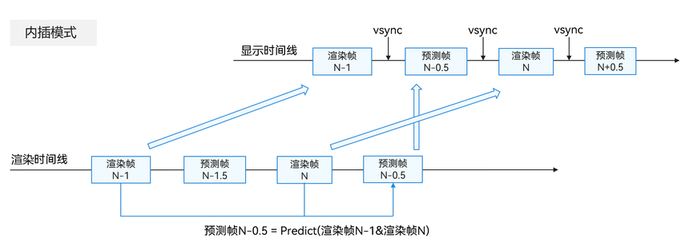

# 概述

更新时间：2026-03-09 02:50:43

来源：https://developer.huawei.com/consumer/cn/doc/harmonyos-guides/graphics-accelerate-fg-interpolation-overview

超帧内插模式是利用相邻两个真实渲染帧进行超帧计算生成中间的预测帧，即利用第N-1帧和第N帧真实渲染帧预测第N-0.5帧预测帧，如下图所示。由于中间预测帧的像素点通常能在前后两帧中找到对应位置，因此内插模式的预测帧效果较外插模式更优。由于第N帧真实渲染帧需要等待第N-0.5帧预测帧生成并送显后才能最终送显，因此会新增1~2帧的响应时延。
 

