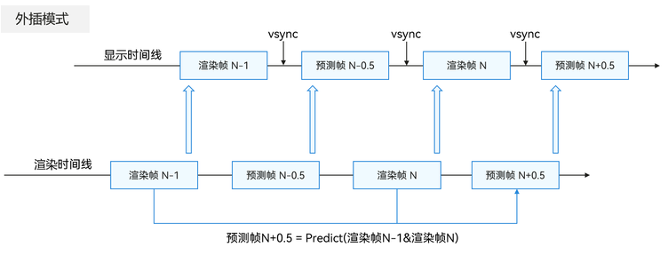

# 概述

更新时间：2026-03-09 02:50:43

来源：https://developer.huawei.com/consumer/cn/doc/harmonyos-guides/graphics-accelerate-fg-extrapolation-overview

超帧外插模式是利用相邻两个真实渲染帧进行超帧计算并生成未来一帧预测帧，即利用第N-1帧、第N帧真实帧预测第N+0.5帧预测帧，如下图所示。由于外插模式不改变渲染时间线和显示时间线的帧间顺序，因此不会导致响应时延的增加。但由于外插模式预测的是未来帧画面，当发生场景画面帧间差异大、相机或物体运动方向突变时，在预测帧的画面边缘和物体边缘容易出现拖影和模糊现象。
 

