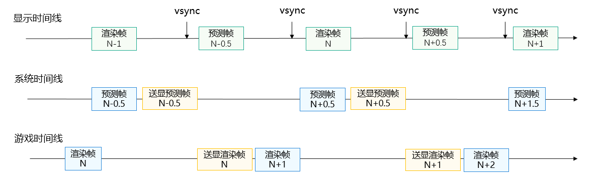

# 概述

更新时间：2026-03-09 02:50:43

来源：https://developer.huawei.com/consumer/cn/doc/harmonyos-guides/graphics-accelerate-fg-systempresent-overview

从5.1.0(18)版本开始，新增支持系统送显模式。
 
系统送显模式是相较于游戏送显模式，能减少开发者集成复杂度的方案。在游戏送显模式下，系统完成预测后需要游戏应用主动调用图形API来完成预测帧的送显。 系统送显模式下游戏虽仍需要触发插帧任务，但不再需要负责预测帧送显，系统会完成送显。当前系统送显模式仅支持内插模式。
 

