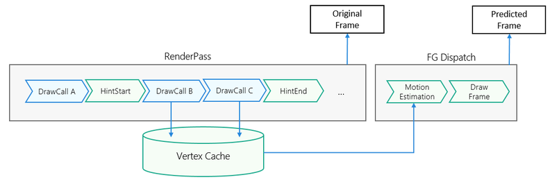

# Vulkan平台

更新时间：2026-04-28 03:31:56

来源：https://developer.huawei.com/consumer/cn/doc/harmonyos-guides/graphics-accelerate-fg-mv-vulkan

#### 业务流程

基于Vulkan图形API平台，超帧顶点标记的主要业务流程如下：
 
- 增强模式运动估计原理

  开发阶段，开发者需要使用系统的图形驱动库提供的Vulkan接口，在期望被标记的物体绘制前后添加上开始标记指令和结束标记指令。运行阶段，基于Vulkan的Transform Feedback（变换反馈）特性，被标记的所有Draw Call处理的顶点数据将被缓存，再通过顶点匹配、运动估计、屏幕空间投影等过程，得到高精度运动向量，最终绘制出预测帧。运行阶段流程如下图所示：

  


- 顶点标记原则

  被标记的物体能在运动估计阶段得到更高精度的运动向量图（MV，Motion Vector），但需要付出额外的性能代价，开发者需要在这之间做出平衡。**建议只标记画面中相对场景运动的物体**，因为相对场景运动的物体的顶点数量较少，但运动预测却最为困难，这样的标记方式能以少量的性能代价换取较明显的超帧画质收益。

  

 

  **请在会影响最终深度缓冲区写入的渲染Pass中，标记对应的Draw Call**。比如对于延迟管线，建议在gbuffer pass中标记；对于有pre depth的前向管线，建议在pre depth pass标记；对于无pre depth的前向管线，建议在base pass(也叫forward pass)中进行标记。并且注意，不要在生成shadowmap pass中的动态物体Draw Call进行标记。

 
  

#### 开发步骤

本节阐述基于Vulkan图形API平台的超帧调用示例。详细代码请参考[图形开发Sample（超帧Vulkan）](https://gitcode.com/harmonyos_samples/frame-generation-vulkan-samplecode-clientdemo-cpp)。
 1. 设置meta-data。设置GraphicsAccelerateKit_VBMV为true，来通知系统支持顶点标记。

  
```json
{
    "module": {
        /*
          其他的配置项
          ...
         */
        "metadata": [
            {
                "name": "GraphicsAccelerateKit_VBMV",
                "value": "true"
            }
        ]
    }
}
```

2. 引用头文件。

  
```text
// 引用超帧frame_generation_vk.h头文件
#include <graphics_game_sdk/frame_generation_vk.h>
```

3. 创建QueryPool，用vkCmdBeginQuery，vkCmdEndQuery标记Draw Call。

  
```text
// 变量定义
VkQueryPool queryPool;
VkQueryPoolCreateInfo createInfo{};
VkCommandBuffer cmd_buffer{};
VkDevice device;
VkQueryType VK_QUERY_TYPE_HISS_MOTION_VECTOR_DRAW_TRACKING_HUAWEI = static_cast<VkQueryType>(1000000000);

// 创建QueryPool，queryCount需要等于1，queryType配置后将不支持查询管理，仅用来顶点标记
createInfo.sType = VK_STRUCTURE_TYPE_QUERY_POOL_CREATE_INFO;
createInfo.queryType = VK_QUERY_TYPE_HISS_MOTION_VECTOR_DRAW_TRACKING_HUAWEI;
createInfo.queryCount = 1;
vkCreateQueryPool(device, &createInfo, nullptr, &queryPool);

// 循环渲染帧
void DrawDynamicObject()
{
    // 绘制动态物体前，开始记录顶点数据
    vkCmdBeginQuery(cmd_buffer, queryPool, 0, 0);
    // 绘制动态物体
    vkCmdDraw(cmd_buffer, 3, 1, 0, 0);
    // 绘制动态物体后，结束记录顶点数据
    vkCmdEndQuery(cmd_buffer, queryPool, 0);
}
```
