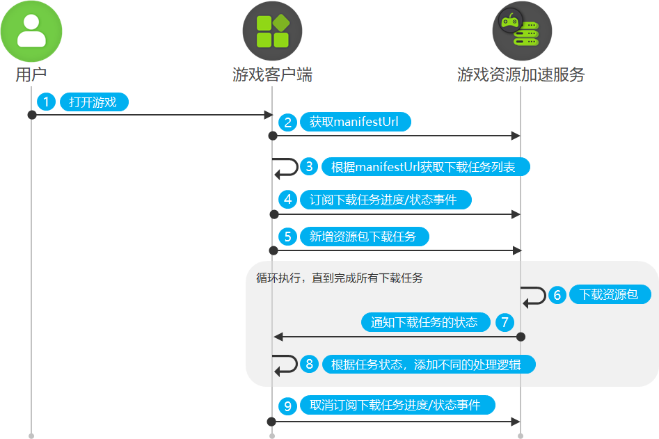

# 应用前台下载资源包

更新时间：2026-05-18 03:44:20

来源：https://developer.huawei.com/consumer/cn/doc/harmonyos-guides/graphics-accelerate-assetdownload-fore

启动游戏后，为游戏提供管理、创建资源包下载任务功能。


#### 业务流程




1. 用户打开游戏App。
2. 游戏调用[fetchManifestUrl](https://developer.huawei.com/consumer/cn/doc/harmonyos-references/graphics-accelerate-assetdownloadmanager#assetdownloadmanagerfetchmanifesturl)方法，从游戏资源加速服务获取manifestUrl资源清单。
3. 游戏根据manifestUrl获取资源包下载任务列表。若manifestUrl不为空，游戏从华为CDN获取资源包下载任务列表，若manifestUrl为空，从三方CDN获取资源包下载任务列表。
4. 游戏向资源加速服务订阅资源包下载进度/状态事件。游戏调用[on('progress')](https://developer.huawei.com/consumer/cn/doc/harmonyos-references/graphics-accelerate-assetdownloadmanager#assetdownloadmanageronprogress)方法，监听资源包下载进度。游戏调用[on('pause')](https://developer.huawei.com/consumer/cn/doc/harmonyos-references/graphics-accelerate-assetdownloadmanager#assetdownloadmanageronpause)方法，监听下载任务是否暂停。游戏调用[on('complete')](https://developer.huawei.com/consumer/cn/doc/harmonyos-references/graphics-accelerate-assetdownloadmanager#assetdownloadmanageroncomplete)方法，监听资源是否成功下载。游戏调用[on('fail')](https://developer.huawei.com/consumer/cn/doc/harmonyos-references/graphics-accelerate-assetdownloadmanager#assetdownloadmanageronfail)方法，监听下载任务是否失败。
5. 游戏调用[addAssetDownloadTask](https://developer.huawei.com/consumer/cn/doc/harmonyos-references/graphics-accelerate-assetdownloadmanager#assetdownloadmanageraddassetdownloadtask)方法，新增manifestUrl清单上的资源包下载任务。
6. 游戏资源加速服务根据下载任务逐一下载资源包。
7. 游戏资源加速服务每完成一个下载任务，均会向游戏通知当前任务的下载进度和下载状态。
8. 若游戏接收到[on('progress')](https://developer.huawei.com/consumer/cn/doc/harmonyos-references/graphics-accelerate-assetdownloadmanager#assetdownloadmanageronprogress)方法返回的[DownloadCompletedInfo](https://developer.huawei.com/consumer/cn/doc/harmonyos-references/graphics-accelerate-assetdownloadmanager#downloadcompletedinfo)，表示资源包下载成功，游戏可前往下载路径操作（例如转移、解压）资源文件。若游戏接收到[on('fail')](https://developer.huawei.com/consumer/cn/doc/harmonyos-references/graphics-accelerate-assetdownloadmanager#assetdownloadmanageronfail)方法返回的[DownloadFailedInfo](https://developer.huawei.com/consumer/cn/doc/harmonyos-references/graphics-accelerate-assetdownloadmanager#downloadfailedinfo)，表示下载任务失败，游戏可以根据[DownloadFault](https://developer.huawei.com/consumer/cn/doc/harmonyos-references/graphics-accelerate-assetdownloadmanager#downloadfault)自行实现处理逻辑。若游戏接收到[on('pause')](https://developer.huawei.com/consumer/cn/doc/harmonyos-references/graphics-accelerate-assetdownloadmanager#assetdownloadmanageronpause)方法返回的[AssetDownloadTask](https://developer.huawei.com/consumer/cn/doc/harmonyos-references/graphics-accelerate-assetdownloadmanager#assetdownloadtask)，表示下载任务已暂停，游戏可以携带taskId，调用[resumeAssetDownloadTask](https://developer.huawei.com/consumer/cn/doc/harmonyos-references/graphics-accelerate-assetdownloadmanager#assetdownloadmanagerresumeassetdownloadtask)方法，恢复暂停中的下载任务。
9. 游戏向资源加速服务取消订阅资源包下载进度/状态事件。游戏调用[off('progress')](https://developer.huawei.com/consumer/cn/doc/harmonyos-references/graphics-accelerate-assetdownloadmanager#assetdownloadmanageroffprogress)方法，取消监听资源包下载进度。游戏调用[off('pause')](https://developer.huawei.com/consumer/cn/doc/harmonyos-references/graphics-accelerate-assetdownloadmanager#assetdownloadmanageroffpause)方法，取消监听下载任务暂停事件。游戏调用[off('complete')](https://developer.huawei.com/consumer/cn/doc/harmonyos-references/graphics-accelerate-assetdownloadmanager#assetdownloadmanageroffcomplete)方法，取消监听资源包下载成功事件。游戏调用[off('fail')](https://developer.huawei.com/consumer/cn/doc/harmonyos-references/graphics-accelerate-assetdownloadmanager#assetdownloadmanagerofffail)方法，取消监听资源包下载失败事件。


#### 接口说明

具体API说明请详见[接口文档](https://developer.huawei.com/consumer/cn/doc/harmonyos-references/graphics-accelerate-assetdownloadmanager)。

| 接口名 | 描述 |
| --- | --- |
| fetchManifestUrl(): Promise&lt;string&gt; | 获取资源包文件下载列表。使用Promise异步回调。 |
| on(type: 'progress', callback: Callback<DownloadProgressInfo[]>): void | 订阅资源包下载进度事件。使用callback形式返回结果。 |
| on(type: 'pause', callback: Callback&lt;AssetDownloadTask&gt;): void | 订阅资源包下载暂停事件。使用callback形式返回结果。 |
| on(type: 'complete', callback: Callback&lt;DownloadCompletedInfo&gt;): void | 订阅资源包下载成功事件。使用callback形式返回结果。 |
| on(type: 'fail', callback: Callback&lt;DownloadFailedInfo&gt;): void | 订阅资源包下载失败事件。使用callback形式返回结果。 |
| addAssetDownloadTask(context: common.BaseContext, downloadConfig: AssetDownloadConfig): Promise&lt;string&gt; | 新增资源包下载任务。使用Promise异步回调。 |
| off(type: 'progress', callback?: Callback<DownloadProgressInfo[]>): void | 取消订阅资源包下载进度事件。使用callback形式返回结果。 |
| off(type: 'pause', callback?: Callback&lt;AssetDownloadTask&gt;): void | 取消订阅资源包下载暂停事件。使用callback形式返回结果。 |
| off(type: 'complete', callback?: Callback&lt;DownloadCompletedInfo&gt;): void | 取消订阅资源包下载成功事件。使用callback形式返回结果。 |
| off(type: 'fail', callback?: Callback&lt;DownloadFailedInfo&gt;): void | 取消订阅资源包下载失败事件。使用callback形式返回结果。 |


#### 开发步骤
1. 导入模块信息。

  导入assetDownloadManager模块。

  
```text
import { assetDownloadManager } from '@kit.GraphicsAccelerateKit';
import { common } from '@kit.AbilityKit';
```

2. 实现应用前台下载资源包功能。

  
 - 游戏调用[fetchManifestUrl](https://developer.huawei.com/consumer/cn/doc/harmonyos-references/graphics-accelerate-assetdownloadmanager#assetdownloadmanagerfetchmanifesturl)方法，获取manifestUrl资源清单，并根据manifestUrl获取资源包下载任务列表。若manifestUrl不为空，则游戏从华为CDN获取资源包下载任务列表。若manifestUrl为空，则从三方CDN获取资源包下载任务列表。

  
```text
async fetchManifestUrl() {
  let manifestUrl : string = '';
  try {
    manifestUrl = await assetDownloadManager.fetchManifestUrl();
    console.info('AssetAccelDemo', `Succeeded in fetching manifestUrl, manifestUrl = ${manifestUrl}`);
  } catch (error) {
    console.error('AssetAccelDemo', `Failed to fetch manifestUrl, errCode: ${error.code}, errMessage: ${error.message}`);
    return;
  }
  // 根据获取到的manifestUrl不为空，获取华为CDN侧资源。若获取到的manifestUrl为空，则获取三方CDN侧资源。
}
```


3. 游戏调用[on('progress')](https://developer.huawei.com/consumer/cn/doc/harmonyos-references/graphics-accelerate-assetdownloadmanager#assetdownloadmanageronprogress)方法，监听资源包下载进度。游戏调用[on('pause')](https://developer.huawei.com/consumer/cn/doc/harmonyos-references/graphics-accelerate-assetdownloadmanager#assetdownloadmanageronpause)方法，监听下载任务是否暂停。游戏调用[on('complete')](https://developer.huawei.com/consumer/cn/doc/harmonyos-references/graphics-accelerate-assetdownloadmanager#assetdownloadmanageroncomplete)方法，监听资源是否成功下载。游戏调用[on('fail')](https://developer.huawei.com/consumer/cn/doc/harmonyos-references/graphics-accelerate-assetdownloadmanager#assetdownloadmanageronfail)方法，监听下载任务是否失败。

  
```text
onProgressCallback: (progressArray: assetDownloadManager.DownloadProgressInfo[]) => void = (progressArray) => {
  console.info('AssetAccelDemo', `onProgressCallback progressArray length: ${progressArray.length}`);
  // 添加资源包下载进度处理逻辑。
}

onPauseCallback: (downloadTaskInfo: assetDownloadManager.AssetDownloadTask) => void = (downloadTaskInfo) => {
  console.info('AssetAccelDemo', `task identifier = ${downloadTaskInfo.config.identifier} has paused.`);
  // 添加资源包下载暂停处理逻辑。
}

onCompleteCallback: (completeInfo: assetDownloadManager.DownloadCompletedInfo) => void = async (completeInfo) => {
  console.info('AssetAccelDemo', `task identifier = ${completeInfo.downloadTask.config.identifier} has completed.`);
  // 添加资源包下载完成处理逻辑。
}

onFailedCallback: (failedInfo: assetDownloadManager.DownloadFailedInfo) => void = async (failedInfo) => {
  console.info('AssetAccelDemo', `task identifier = ${failedInfo.downloadTask.config.identifier} has failed.`);
  // 添加资源包下载失败处理逻辑。
}

// 订阅下载状态和下载进度事件。
try {
　assetDownloadManager.on('progress', this.onProgressCallback);
　assetDownloadManager.on('pause', this.onPauseCallback);
　assetDownloadManager.on('complete', this.onCompleteCallback);
　assetDownloadManager.on('fail', this.onFailedCallback);
} catch (error) {
  console.error('AssetAccelDemo', `Failed to do assetDownloadManager.on, errCode: ${error.code}, errMessage: ${error.message}`);
}
```


4. 游戏调用[addAssetDownloadTask](https://developer.huawei.com/consumer/cn/doc/harmonyos-references/graphics-accelerate-assetdownloadmanager#assetdownloadmanageraddassetdownloadtask)方法，新增资源包下载任务。

  
```text
async addAssetDownloadTask() {
  // 构造资源包下载配置信息。
  let assetDownload: assetDownloadManager.AssetDownloadConfig = {
    fileName: 'fileName', // 下载资源文件名。
    url: 'url', // 下载资源url。
    isEssential: false, // 是否是必要下载资源。
    identifier: 'identifier', // 标识信息。
    groupId: 'groupId' // 组ID，用于标识资源的版本信息。
  }
  try {
    // 添加资源包下载任务。
    // 根据实际代码上下文自行传入合适的context。
    const taskId: string = await assetDownloadManager.addAssetDownloadTask(this.getUIContext().getHostContext() as common.Context, assetDownload);
    console.info('AssetAccelDemo', `Succeeded in adding assetDownloadTask`);
  } catch (error) {
    console.error('AssetAccelDemo', `Failed to add assetDownloadTask, errCode:${error.code}, errMessage:${error.message}`);
  }
}
```


5. 游戏调用[off('progress')](https://developer.huawei.com/consumer/cn/doc/harmonyos-references/graphics-accelerate-assetdownloadmanager#assetdownloadmanageroffprogress)方法，取消监听资源包下载进度。游戏调用[off('pause')](https://developer.huawei.com/consumer/cn/doc/harmonyos-references/graphics-accelerate-assetdownloadmanager#assetdownloadmanageroffpause)方法，取消监听下载任务暂停事件。游戏调用[off('complete')](https://developer.huawei.com/consumer/cn/doc/harmonyos-references/graphics-accelerate-assetdownloadmanager#assetdownloadmanageroffcomplete)方法，取消监听资源包下载成功事件。游戏调用[off('fail')](https://developer.huawei.com/consumer/cn/doc/harmonyos-references/graphics-accelerate-assetdownloadmanager#assetdownloadmanagerofffail)方法，取消监听资源包下载失败事件。

  
```text
// 取消订阅下载状态和下载进度事件。
try {
　assetDownloadManager.off('progress', this.onProgressCallback);
　assetDownloadManager.off('pause', this.onPauseCallback);
　assetDownloadManager.off('complete', this.onCompleteCallback);
　assetDownloadManager.off('fail', this.onFailedCallback);
} catch (error) {
  console.error('AssetAccelDemo', `Failed to do assetDownloadManager.off, errCode: ${error.code}, errMessage: ${error.message}`);
}
```
