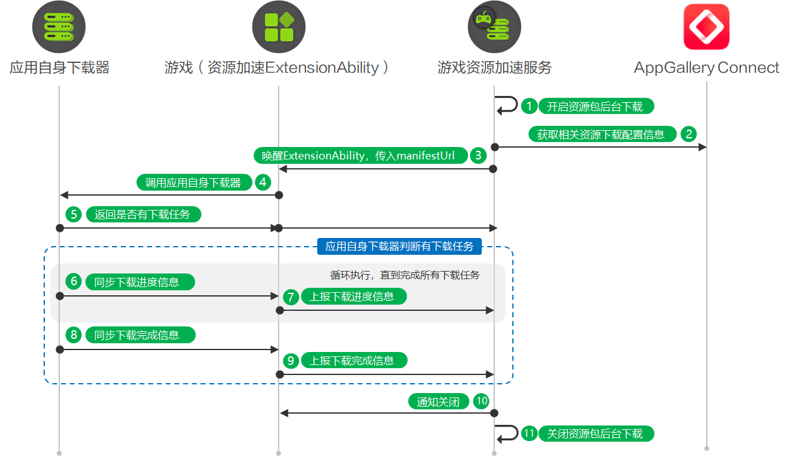

# extension协同下载

更新时间：2026-05-08 09:27:50

来源：https://developer.huawei.com/consumer/cn/doc/harmonyos-guides/graphics-accelerate-assetdownload-back-self

从5.1.1(19)版本开始，新增extension协同下载。

用户在应用市场安装游戏后、或更新游戏后、设备满足闲时条件时，在游戏未启动状态下，若检测到该游戏有资源包需要更新，可使用**应用自身下载器**自动下载资源包。


## 业务流程


用户在应用市场安装游戏后、用户在应用市场更新游戏后、系统检测到用户设备符合闲时条件时，游戏资源加速服务开启资源包后台下载。 游戏资源加速服务从AppGallery Connect获取相关资源下载配置信息，例如下载类型、CDN类型、manifestUrl、域名白名单等。具体资源下载配置信息请参见[发布资源包下载任务](https://developer.huawei.com/consumer/cn/doc/harmonyos-guides/graphics-accelerate-assetdownload-release)。 游戏资源加速服务唤醒ExtensionAbility进程，并调用[onDownloadWithAppControl](https://developer.huawei.com/consumer/cn/doc/harmonyos-references/graphics-accelerate-extensionability#ondownloadwithappcontrol)方法传入manifestUrl资源清单等信息。 游戏实现资源加速ExtensionAbility的[onDownloadWithAppControl](https://developer.huawei.com/consumer/cn/doc/harmonyos-references/graphics-accelerate-extensionability#ondownloadwithappcontrol)方法，调用应用自身下载器下载游戏资源包。若manifestUrl不为空，解析manifestUrl指向的资源清单文件，生成托管在华为CDN的资源下载任务列表；若manifestUrl为空，生成托管在三方CDN的资源下载任务列表。 应用自身下载器查询是否有下载任务，若有下载任务，则异步下载资源并返回结果true给游戏资源加速服务。若没有下载任务，则返回结果false给游戏资源加速服务，游戏资源加速服务将关闭资源包后台下载。 若有下载任务，应用自身下载器下载资源包，并同步下载进度信息给游戏资源加速ExtensionAbility。 在资源加速ExtensionAbility中调用[reportDownloadProgress](https://developer.huawei.com/consumer/cn/doc/harmonyos-references/graphics-accelerate-assetdownloadmanager#assetdownloadmanagerreportdownloadprogress)方法，向游戏资源加速服务上报下载进度信息。 应用自身下载器完成下载后，并同步下载完成信息给资源加速ExtensionAbility。 在资源加速ExtensionAbility中调用的[reportDownloadProgress](https://developer.huawei.com/consumer/cn/doc/harmonyos-references/graphics-accelerate-assetdownloadmanager#assetdownloadmanagerreportdownloadprogress)方法，向游戏资源加速服务上报下载完成信息。 游戏资源加速服务接收到下载完成信息后，调用[onExtensionWillTerminate](https://developer.huawei.com/consumer/cn/doc/harmonyos-references/graphics-accelerate-extensionability#onextensionwillterminate)方法通知资源加速ExtensionAbility将关闭进程。 游戏资源加速服务关闭资源包后台下载。

## 接口说明

具体API说明请详见[接口文档](https://developer.huawei.com/consumer/cn/doc/harmonyos-references/graphics-accelerate-extensionability)。
| 接口名 | 描述 |
| --- | --- |
| [onDownloadWithAppControl](https://developer.huawei.com/consumer/cn/doc/harmonyos-references/graphics-accelerate-extensionability#ondownloadwithappcontrol)(requestType: ContentRequestType, manifestUrl: string, assetAccelerationExtensionInfo: AssetAccelerationExtensionInfo): Promise | 安装应用、更新应用、设备闲时，执行该方法，触发extension协同下载，如果有资源包下载任务则返回true，否则返回false。使用Promise异步回调。 |
| [reportDownloadProgress](https://developer.huawei.com/consumer/cn/doc/harmonyos-references/graphics-accelerate-assetdownloadmanager#assetdownloadmanagerreportdownloadprogress)(progressInfo: AppDownloadProgress): void | 上报应用自身下载器中的下载进度信息。 |
| [onExtensionWillTerminate](https://developer.huawei.com/consumer/cn/doc/harmonyos-references/graphics-accelerate-extensionability#onextensionwillterminate)(error?: BusinessError): Promise | 在资源加速ExtensionAbility生命周期即将结束时、调度异常退出后，执行该方法，通知关闭资源包后台下载。建议在该方法中执行资源清理等操作。请避免耗时操作。使用Promise异步回调。 |


## 开发步骤

在“src/main/module.json5”的extensionAbilities层级中添加资源加速ExtensionAbility信息。
```text
"extensionAbilities": [
  {
    "name": "AssetAccelExtAbility", // 游戏资源加速ExtensionAbility组件的名称。
    "srcEntry": "./ets/extensionability/AssetAccelExtAbility.ets", // 游戏资源加速ExtensionAbility组件所对应的代码路径。
    "type": "assetAcceleration"
  }
]
```

在ets目录下新建extensionability文件夹及AssetAccelExtAbility.ets文件，导入assetDownloadManager模块、AssetAccelerationExtensionAbility模块及相关模块，同时新增AssetAccelExtAbility类继承AssetAccelerationExtensionAbility。
```text
import { BusinessError } from '@kit.BasicServicesKit';
import { deviceInfo } from '@kit.BasicServicesKit';
import { common } from '@kit.AbilityKit';
import { assetDownloadManager, AssetAccelerationExtensionAbility, AssetAccelerationExtensionInfo, ContentRequestType } from '@kit.GraphicsAccelerateKit';

export default class AssetAccelExtAbility extends AssetAccelerationExtensionAbility {
};
```

游戏实现[onDownloadWithAppControl](https://developer.huawei.com/consumer/cn/doc/harmonyos-references/graphics-accelerate-extensionability#ondownloadwithappcontrol)方法，调用应用自身下载器下载资源包。
> [!NOTE]
> 若接口需要使用common.Context类型的上下文，可以从this.context中获取类型为common.ExtensionContext的上下文对象。


```text
async onDownloadWithAppControl(requestType: ContentRequestType, manifestUrl: string,
  assetAccelerationExtensionInfo: AssetAccelerationExtensionInfo): Promise {
  const context = this.context as common.ExtensionContext; // 将当前上下文转换为ExtensionContext类型。
  console.info('AssetAccelDemo', `application file directory = ${context.filesDir}`);
  console.info('AssetAccelDemo', `onDownloadWithAppControl enter, requestType: ${requestType}, manifestUrl: ${manifestUrl}.`);
  // 如果有下载任务，则调用应用自身下载器进行资源下载，并返回true，否则返回false。
  // ...
  let hasDownloadTask = true;
  return hasDownloadTask;
}
```

应用自身下载器下载过程中和下载完成后，会同步下载信息给资源加速ExtensionAbility。在资源加速ExtensionAbility中调用[reportDownloadProgress](https://developer.huawei.com/consumer/cn/doc/harmonyos-references/graphics-accelerate-assetdownloadmanager#assetdownloadmanagerreportdownloadprogress)方法，向游戏资源加速服务上报下载进度信息和下载完成信息。
```text
try {
  let progressInfo: assetDownloadManager.AppDownloadProgress = {
    totalBytesWritten: 0,
    totalExpectedBytes: 0,
    totalFiles: 0,
    successCount: 0,
    failureCount: 0,
    status:assetDownloadManager.AppDownloadStatus.IN_PROGRESS
  }
  // 判断当前HarmonyOS SDK版本是否为6.1.0(23)及以上版本
  if (deviceInfo.sdkApiVersion >= 23) {
    progressInfo.resourceType = assetDownloadManager.ResourceType.RELEASED
  }
  assetDownloadManager.reportDownloadProgress(progressInfo);
  console.info('AssetAccelDemo', `Succeeded in reporting downloadProgress`);
} catch (error) {
  console.error('AssetAccelDemo', `Failed to report downloadProgress, errCode:${error.code}, errMessage:${error.message}`);
}
```

游戏实现[onExtensionWillTerminate](https://developer.huawei.com/consumer/cn/doc/harmonyos-references/graphics-accelerate-extensionability#onextensionwillterminate)方法，接收游戏资源加速服务关闭资源包后台下载功能的通知。
```text
async onExtensionWillTerminate(error?: BusinessError): Promise {
  // 避免进行耗时处理。
  if (error) {
    console.error('AssetAccelDemo', `onExtensionWillTerminate enter, TerminateReason:${error?.code}, msg:${error?.message}.`);
    // 添加异常终止处理逻辑。
    return;
  }
  // 添加资源清理等处理逻辑。
}
```
