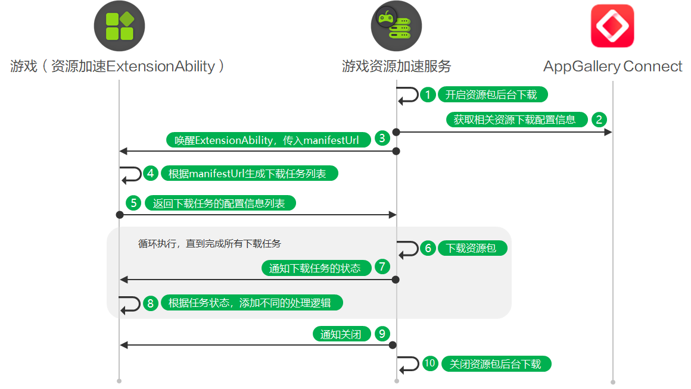

# extension系统托管下载

更新时间：2026-05-18 03:44:20

来源：https://developer.huawei.com/consumer/cn/doc/harmonyos-guides/graphics-accelerate-assetdownload-back-system

用户在应用市场安装游戏后、或更新游戏后、设备满足闲时条件时，在游戏未启动状态下，若检测到该游戏有资源包需要更新，将使用**系统下载器**（游戏资源加速服务）自动下载资源包。

#### 业务流程

1. 用户在应用市场安装游戏后、用户在应用市场更新游戏后、系统检测到用户设备符合闲时条件时，游戏资源加速服务开启资源包后台下载。
2. 游戏资源加速服务从AppGallery Connect获取相关资源下载配置信息，例如下载类型、CDN类型、 manifestUrl、域名白名单等。具体资源下载配置信息请参见发布资源包下载任务。
3. 游戏资源加速服务唤醒ExtensionAbility进程，并通过调用onDownloadContentRequest方法传入manifestUrl资源清单等信息，以获取下载任务的配置信息列表。
4. 游戏实现资源加速ExtensionAbility的onDownloadContentRequest方法，生成资源包下载任务列表。若manifestUrl不为空，解析manifestUrl指向的资源清单文件，生成托管在华为CDN的资源下载任务列表；若manifestUrl为空，生成托管在三方CDN的资源下载任务列表。
5. 资源加速ExtensionAbility向游戏资源加速服务返回不超过200条下载任务的配置信息列表AssetDownloadConfig。
6. 游戏资源加速服务根据配置信息列表逐一从华为CDN或三方CDN下载资源包。
7. 游戏资源加速服务每完成一个下载任务，均会向资源加速ExtensionAbility通知当前任务的下载状态。
8. 游戏实现资源加速ExtensionAbility的onBackgroundDownloadSucceeded方法，接收“成功”状态的下载任务信息，并前往下载路径操作（例如转移、解压）资源文件。游戏实现资源加速ExtensionAbility的onBackgroundDownloadFailed方法，接收“失败”状态的下载任务信息，并根据失败原因DownloadFault自行实现处理逻辑。
9. 游戏资源加速服务完成所有下载任务后，调用onExtensionWillTerminate方法通知资源加速ExtensionAbility。
10. 游戏资源加速服务关闭资源包后台下载功能。

#### 接口说明
具体API说明请详见[接口文档](https://developer.huawei.com/consumer/cn/doc/harmonyos-references/graphics-accelerate-extensionability)。

| 接口名 | 描述 |
| --- | --- |
| [onDownloadContentRequest](https://developer.huawei.com/consumer/cn/doc/harmonyos-references/graphics-accelerate-extensionability#ondownloadcontentrequest)(requestType: ContentRequestType, manifestUrl: string, assetAccelerationExtensionInfo: AssetAccelerationExtensionInfo): Promise<assetDownloadManager.AssetDownloadConfig[]> | 安装应用、更新应用、设备闲时，执行该方法，获取资源包下载任务列表。返回任务量不超过200条。使用Promise异步回调。 |
| [onBackgroundDownloadSucceeded](https://developer.huawei.com/consumer/cn/doc/harmonyos-references/graphics-accelerate-extensionability#onbackgrounddownloadsucceeded)(downloadTask: assetDownloadManager.AssetDownloadTask, filePath: string): Promise&lt;void&gt; | 在系统后台下载任务成功时，执行该方法，通知资源加速ExtensionAbility下载成功。使用Promise异步回调。 |
| [onBackgroundDownloadFailed](https://developer.huawei.com/consumer/cn/doc/harmonyos-references/graphics-accelerate-extensionability#onbackgrounddownloadfailed)(downloadTask: assetDownloadManager.AssetDownloadTask, fault: assetDownloadManager.DownloadFault): Promise&lt;void&gt; | 在系统后台下载任务失败时，执行该方法，通知资源加速ExtensionAbility下载失败。使用Promise异步回调。 |
| [onExtensionWillTerminate](https://developer.huawei.com/consumer/cn/doc/harmonyos-references/graphics-accelerate-extensionability#onextensionwillterminate)(error?: BusinessError&lt;void&gt;): Promise&lt;void&gt; | 在资源加速ExtensionAbility生命周期即将结束时、调度异常退出后，执行该方法，通知关闭资源包后台下载功能。建议在该方法中执行资源清理等操作。请避免耗时操作。使用Promise异步回调。 |

#### 开发步骤
1. 新增配置信息。 在“src/main/module.json5”的extensionAbilities层级中添加资源加速ExtensionAbility信息。 "extensionAbilities": [
  {
 "name": "AssetAccelExtAbility", // 游戏资源加速ExtensionAbility组件的名称。
 "srcEntry": "./ets/extensionability/AssetAccelExtAbility.ets", // 游戏资源加速ExtensionAbility组件所对应的代码路径。
 "type": "assetAcceleration"
  }
]
2. 导入模块信息。 新建extensionability文件夹及AssetAccelExtAbility.ets文件，导入assetDownloadManager模块、AssetAccelerationExtensionAbility模块及相关模块，同时新增AssetAccelExtAbility类继承AssetAccelerationExtensionAbility。 import { BusinessError } from '@kit.BasicServicesKit';
import { common } from '@kit.AbilityKit';
import { assetDownloadManager, AssetAccelerationExtensionAbility, AssetAccelerationExtensionInfo, ContentRequestType } from '@kit.GraphicsAccelerateKit';

export default class AssetAccelExtAbility extends AssetAccelerationExtensionAbility {
};
3. 实现extension系统托管下载。   游戏实现onDownloadContentRequest方法，收集资源包下载任务列表。 若接口需要使用common.Context类型的上下文，可以从this.context中获取类型为common.ExtensionContext的上下文对象。   async onDownloadContentRequest(requestType: ContentRequestType, manifestUrl: string,
  assetAccelerationExtensionInfo: AssetAccelerationExtensionInfo): Promise<assetDownloadManager.AssetDownloadConfig[]> {
  const context = this.context as common.ExtensionContext; // 将当前上下文转换为ExtensionContext类型。
  console.info('AssetAccelDemo', `application file directory = ${context.filesDir}`);
  console.info('AssetAccelDemo', `onDownloadContentRequest enter, requestType: ${requestType}, manifestUrl: ${manifestUrl}.`);
  // 1.根据manifestUrl获取下载资源包。2.manifestUrl不为空，获取华为CDN侧资源，为空则获取三方CDN侧资源。3.返回资源包下载任务列表。
  let downloadConfigArr: Array&lt;assetDownloadManager.AssetDownloadConfig&gt; = [];
  return downloadConfigArr;
}  游戏实现onBackgroundDownloadSucceeded方法，接收“成功”状态的下载任务，并前往下载路径操作（例如转移、解压）资源文件。 async onBackgroundDownloadSucceeded(downloadTask: assetDownloadManager.AssetDownloadTask,
  filePath: string): Promise&lt;void&gt; {
  console.info('AssetAccelDemo', `onBackgroundDownloadSucceeded enter, taskId is ${downloadTask.taskId}, filePath = ${filePath}`);
  // 添加已下载资源包转移等处理逻辑。
}  游戏实现onBackgroundDownloadFailed方法，接收“失败”状态的下载任务，并根据失败原因DownloadFault自行实现处理逻辑。 async onBackgroundDownloadFailed(downloadTask: assetDownloadManager.AssetDownloadTask,
  fault: assetDownloadManager.DownloadFault): Promise&lt;void&gt; {
  console.info('AssetAccelDemo', `onBackgroundDownloadFailed enter, download url: ${downloadTask.config.url}, err: ${fault}`);
  // 添加资源包下载失败处理逻辑。
}  游戏实现onExtensionWillTerminate方法，接收游戏资源加速服务关闭资源包后台下载功能的通知。 async onExtensionWillTerminate(error?: BusinessError): Promise&lt;void&gt; {
  // 避免进行耗时处理。
  if (error) {
 console.error('AssetAccelDemo', `onExtensionWillTerminate enter, TerminateReason: ${error?.code}, msg: ${error?.message}.`);
 // 添加异常终止处理逻辑。
 return;
  }
  // 添加资源清理等处理逻辑。
}