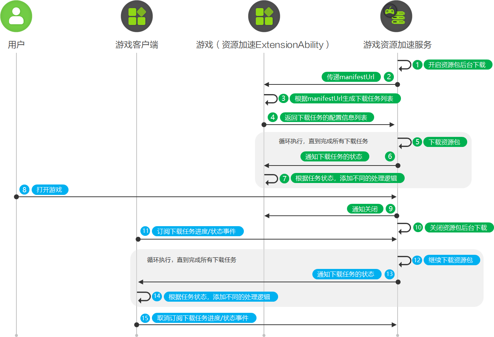

# 系统后台切应用前台接续下载资源包

更新时间：2026-05-18 03:44:20

来源：https://developer.huawei.com/consumer/cn/doc/harmonyos-guides/graphics-accelerate-assetdownload-back-fore

系统后台静默下载过程中启动游戏，应用前台将接管系统后台下载任务，资源包下载任务将在应用前台接续执行。

#### 业务流程

1. 用户在应用市场安装游戏后、用户在应用市场更新游戏后、系统检测到用户设备符合闲时条件时，游戏资源加速服务开启资源包后台下载。
2. 游戏资源加速服务携带manifestUrl资源清单，向资源加速ExtensionAbility获取资源包下载任务列表。
3. 游戏实现资源加速ExtensionAbility的onDownloadContentRequest方法，解析manifestUrl指向的资源清单文件，对比本地资源差异，生成资源包下载任务列表。若manifestUrl不为空，资源加速ExtensionAbility从华为CDN获取下载任务列表，若manifestUrl为空，从三方CDN获取下载任务列表。
4. 资源加速ExtensionAbility向游戏资源加速服务返回不超过200条下载任务的配置信息列表AssetDownloadConfig。
5. 游戏资源加速服务根据配置信息列表逐一从华为CDN或三方CDN下载资源包。
6. 游戏资源加速服务每完成一个下载任务，均会向资源加速ExtensionAbility通知当前任务的下载状态。
7. 游戏实现资源加速ExtensionAbility的onBackgroundDownloadSucceeded方法，接收“成功”状态的下载任务信息，并前往下载路径操作（例如转移、解压）资源文件。游戏实现资源加速ExtensionAbility的onBackgroundDownloadFailed方法，接收“失败”状态的下载任务信息，并根据失败原因DownloadFault自行实现处理逻辑。
8. 用户在后台下载资源包的过程中打开游戏App。
9. 游戏资源加速服务通知资源加速ExtensionAbility即将关闭资源包后台下载功能。
10. 游戏资源加速服务关闭资源包后台下载功能。
11. 游戏向资源加速服务订阅资源包下载进度/状态事件。游戏调用on('progress')方法，监听资源包下载进度。游戏调用on('pause')方法，监听下载任务是否暂停。游戏调用on('complete')方法，监听资源是否成功下载。游戏调用on('fail')方法，监听下载任务是否失败。
12. 游戏资源加速服务继续下载资源包。
13. 游戏资源加速服务每完成一个下载任务，还会向游戏通知当前任务的下载进度和下载状态。
14. 若游戏接收到on('progress')方法返回的DownloadCompletedInfo，表示资源包下载成功，游戏可前往下载路径操作（例如转移、解压）资源文件。若游戏接收到on('fail')方法返回的DownloadFailedInfo，表示下载任务失败，游戏可以根据DownloadFault自行实现处理逻辑。若游戏接收到on('pause')方法返回的AssetDownloadTask，表示下载任务已暂停，游戏可以携带taskId，调用resumeAssetDownloadTask方法，恢复暂停中的下载任务。
15. 游戏向资源加速服务取消订阅资源包下载进度/状态事件。游戏调用off('progress')方法，取消监听资源包下载进度。游戏调用off('pause')方法，取消监听下载任务暂停事件。游戏调用off('complete')方法，取消监听资源包下载成功事件。游戏调用off('fail')方法，取消监听资源包下载失败事件。

#### 开发步骤
1. 新增配置信息。 在“src/main/module.json5”的extensionAbilities层级中添加资源加速ExtensionAbility信息。 "extensionAbilities": [
  {
 "name": "AssetAccelExtAbility", // 游戏资源加速ExtensionAbility组件的名称。
 "srcEntry": "./ets/extensionability/AssetAccelExtAbility.ets", // 游戏资源加速ExtensionAbility组件所对应的代码路径。
 "type": "assetAcceleration"
  }
]
2. 导入模块信息。 新建extensionability文件夹及AssetAccelExtAbility.ets文件，导入assetDownloadManager模块、AssetAccelerationExtensionAbility模块及相关模块，同时新增AssetAccelExtAbility类继承AssetAccelerationExtensionAbility。 import { BusinessError } from '@kit.BasicServicesKit';
import { assetDownloadManager, AssetAccelerationExtensionAbility, AssetAccelerationExtensionInfo, ContentRequestType } from '@kit.GraphicsAccelerateKit';

export default class AssetAccelExtAbility extends AssetAccelerationExtensionAbility {
};
3. 实现系统后台切应用前台接续下载资源包功能。   游戏实现onDownloadContentRequest方法，收集资源包下载任务列表。 async onDownloadContentRequest(requestType: ContentRequestType, manifestUrl: string,
  assetAccelerationExtensionInfo: AssetAccelerationExtensionInfo): Promise<assetDownloadManager.AssetDownloadConfig[]> {
  console.info('AssetAccelDemo', `onDownloadContentRequest enter, requestType: ${requestType}, manifestUrl: ${manifestUrl}.`);
  // 1.根据manifestUrl获取下载资源包。2.manifestUrl不为空，获取华为CDN侧资源，为空则获取三方CDN侧资源。3.返回资源包下载任务列表。
  let downloadConfigArr: Array&lt;assetDownloadManager.AssetDownloadConfig&gt; = [];
  return downloadConfigArr;
}  游戏实现onBackgroundDownloadSucceeded方法，接收“成功”状态的下载任务，并前往下载路径操作（例如转移、解压）资源文件。 async onBackgroundDownloadSucceeded(downloadTask: assetDownloadManager.AssetDownloadTask,
  filePath: string): Promise&lt;void&gt; {
  console.info('AssetAccelDemo', `onBackgroundDownloadSucceeded enter, taskId is ${downloadTask.taskId}, filePath = ${filePath}`);
  // 添加已下载资源包转移等处理逻辑。
}  游戏实现onBackgroundDownloadFailed方法，接收“失败”状态的下载任务，并根据失败原因DownloadFault自行实现处理逻辑。 async onBackgroundDownloadFailed(downloadTask: assetDownloadManager.AssetDownloadTask,
  fault: assetDownloadManager.DownloadFault): Promise&lt;void&gt; {
  console.info('AssetAccelDemo', `onBackgroundDownloadFailed enter, download url: ${downloadTask.config.url}, err: ${fault}`);
  // 添加资源包下载失败处理逻辑。
}  游戏实现onExtensionWillTerminate方法，接收游戏资源加速服务关闭资源包后台下载功能的通知。 async onExtensionWillTerminate(error?: BusinessError): Promise&lt;void&gt; {
  // 避免进行耗时处理。
  if (error) {
 console.error('AssetAccelDemo', `onExtensionWillTerminate enter, TerminateReason：${error?.code}, msg: ${error?.message}.`);
 // 添加异常终止处理逻辑。
 return;
  }
  // 添加资源清理等处理逻辑。
}  游戏调用on('progress')方法，监听资源包下载进度。游戏调用on('pause')方法，监听下载任务是否暂停。游戏调用on('complete')方法，监听资源是否成功下载。游戏调用on('fail')方法，监听下载任务是否失败。 onProgressCallback: (progressArray: assetDownloadManager.DownloadProgressInfo[]) => void = (progressArray) => {
  console.info('AssetAccelDemo', `onProgressCallback progressArray length: ${progressArray.length}`);
  // 添加资源包下载进度处理逻辑。
}

onPauseCallback: (downloadTaskInfo: assetDownloadManager.AssetDownloadTask) => void = (downloadTaskInfo) => {
  console.info('AssetAccelDemo', `task identifier = ${downloadTaskInfo.config.identifier} has paused.`);
  // 添加资源包下载暂停处理逻辑。
}

onCompleteCallback: (completeInfo: assetDownloadManager.DownloadCompletedInfo) => void = async (completeInfo) => {
  console.info('AssetAccelDemo', `task identifier = ${completeInfo.downloadTask.config.identifier} has completed.`);
  // 添加资源包下载完成处理逻辑。
}

onFailedCallback: (failedInfo: assetDownloadManager.DownloadFailedInfo) => void = async (failedInfo) => {
  console.info('AssetAccelDemo', `task identifier = ${failedInfo.downloadTask.config.identifier} has failed.`);
  // 添加资源包下载失败处理逻辑。
}

// 订阅下载状态和下载进度事件。
try {
　assetDownloadManager.on('progress', this.onProgressCallback);
　assetDownloadManager.on('pause', this.onPauseCallback);
　assetDownloadManager.on('complete', this.onCompleteCallback);
　assetDownloadManager.on('fail', this.onFailedCallback);
} catch (error) {
  console.error('AssetAccelDemo', `Failed to do assetDownloadManager.on, errCode: ${error.code}, errMessage: ${error.message}`);
}  游戏调用off('progress')方法，取消监听资源包下载进度。游戏调用off('pause')方法，取消监听下载任务暂停事件。游戏调用off('complete')方法，取消监听资源包下载成功事件。游戏调用off('fail')方法，取消监听资源包下载失败事件。 // 取消订阅下载状态和下载进度事件。
try {
　assetDownloadManager.off('progress', this.onProgressCallback);
　assetDownloadManager.off('pause', this.onPauseCallback);
　assetDownloadManager.off('complete', this.onCompleteCallback);
　assetDownloadManager.off('fail', this.onFailedCallback);
} catch (error) {
  console.error('AssetAccelDemo', `Failed to do assetDownloadManager.off, errCode: ${error.code}, errMessage: ${error.message}`);
}