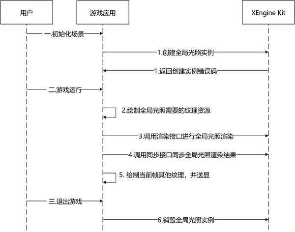

# 光线追踪全局光照

更新时间：2026-05-26 06:48:54

来源：https://developer.huawei.com/consumer/cn/doc/harmonyos-guides/xengine-kit-rt-global-illumination

从6.0.0(20) 版本开始，新增光线追踪全局光照特性。

XEngine Kit提供端侧光线追踪全局光照（Ray-Traced Global Illumination，RTGI）能力，包含动态漫反射全局光照（DDGI）算法和神经网络全局光照（NNGI）算法。


##### 约束与限制

 - 支持的设备类型：此特性依赖设备支持Vulkan光线追踪扩展[VK_KHR_acceleration_structure](https://docs.vulkan.org/refpages/latest/refpages/source/VK_KHR_acceleration_structure.html)、[VK_KHR_ray_query](https://docs.vulkan.org/refpages/latest/refpages/source/VK_KHR_ray_query.html)
 - 可通过以下方式查询相关扩展特性是否支持：

  对于Vulkan，使用[HMS_XEG_EnumerateDeviceExtensionProperties](https://developer.huawei.com/consumer/cn/doc/harmonyos-references/xengine-kit-xengine#hms_xeg_enumeratedeviceextensionproperties)扩展特性查询接口进行查询，如查询结果包含XEG_RTGI_EXTENSION_NAME，则表示支持该特性，若查询结果未包含，则表示不支持该特性。


##### 应用场景

DDGI算法：根据视角中的探针信息，分帧更新探针光照，实现使用光线追踪实时渲染动态全局光照的效果。同时可与端云渲染相结合，利用端侧光追算力，计算动态全局光照，结合云侧下发的静态全局光照信息，实时生成高质量全场景光线追踪全局光照。

NNGI算法：结合了AI和光线追踪技术，通过非常小分辨率（例如64×32）对场景进行光线追踪渲染，然后将延迟渲染的几何数据和光追结果输入给NPU推理出整个场景的全局光照结果，从而实现少量光线即可实现全局光照效果。同时基于马良GPU的异构协同技术，NPU和GPU可以同时工作，降低整体时延。


##### 接口说明

以下接口为RTGI设置接口，如需使用更丰富的设置和查询接口，具体API说明详见[接口文档](https://developer.huawei.com/consumer/cn/doc/harmonyos-references/xengine-kit-xengine)。

| 接口名 | 描述 |
| --- | --- |
| VKAPI_ATTR VkResult VKAPI_CALL HMS_XEG_EnumerateDeviceExtensionProperties (VkPhysicalDevice physicalDevice, uint32_t *pPropertyCount, XEG_ExtensionProperties *pProperties) | XEngine Vulkan扩展特性查询接口。 |
| VKAPI_ATTR VkResult VKAPI_CALL HMS_XEG_CreateRTGI (VkDevice device, const void *pCreateInfo, XEG_RTGI *pRtGI) | 创建XEG_RTGI对象。 |
| VKAPI_ATTR VkResult VKAPI_CALL HMS_XEG_CmdRenderRTGI (VkCommandBuffer commandBuffer, XEG_RTGI rtGI, const void *pDescription) | 执行渲染命令。 |
| VKAPI_ATTR VkResult VKAPI_CALL HMS_XEG_CmdSetSynchronization (VkCommandBuffer commandBuffer, const void *xegHandle) | 设置同步信号，等待渲染结果写入指定图像。使用RTGI特性时，为等待GI渲染结果写入指定图像。 |
| VKAPI_ATTR void VKAPI_CALL HMS_XEG_DestroyRTGI (XEG_RTGI rtGI) | 销毁XEG_RTGI对象。 |


##### DDGI开发步骤

本章以Vulkan图像API集成为例，说明XEngine集成操作过程。


##### 配置项目

编译HAP时，Native层so编译需要依赖NDK中的libxengine.so。

 - 头文件引用

  
```text
#include <algorithm>
#include <string>
#include <vector>
#include <xengine/xeg_vulkan_rtgi.h>
#include <xengine/xeg_vulkan_extension.h>
#include <xengine/xeg_extension_defs.h>
```

 - 编写CMakeLists.txt

  CMakeLists.txt部分示例代码如下。

  
```text
find_library(
    # 设置路径变量的名称。
    xengine-lib
    # 指定希望CMake定位的NDK库的名称。
    xengine
)
target_link_libraries(ohosmain PUBLIC
    // 其他库文件
    // ...
    ${xengine-lib} RenderBehavior SceneLoader VulkanBase
)
```


##### 业务流程

 - 下面是基于Vulkan图形API平台集成动态漫反射全局光照的主要业务流程

  


1. 用户在使用动态漫反射全局光照特性前需要查询硬件平台是否支持光线追踪扩展。
2. 用户在进入游戏初始化场景时调用HMS_XEG_EnumerateDeviceExtensionProperties接口查询XEngine支持的特性，当查询接口返回支持的特性列表中包含动态漫反射全局光照特性时代表可以使用此特性。
3. 创建动态漫反射全局光照使用的创建信息，调用[HMS_XEG_CreateRTGI](https://developer.huawei.com/consumer/cn/doc/harmonyos-references/xengine-kit-xengine#hms_xeg_creatertgi)接口创建动态漫反射全局光照实例。
4. 当游戏运行时，渲染动态漫反射全局光照特性需要的纹理。
5. 调用HMS_XEG_CmdRenderRTGI执行全局光照渲染任务。
6. 调用HMS_XEG_CmdSetSynchronization设置同步信号，等待渲染结果写入指定图像。
7. 游戏使用全局光照纹理，进行其他的渲染任务，如UI等。
8. 当前帧已全部渲染完成，进行送显。
9. 当游戏退出时，调用HMS_XEG_DestroyRTGI接口销毁动态漫反射全局光照实例。


##### 集成XEngine RT DDGI（Vulkan）

使用Vulkan图形API搭建图像渲染管线，并集成RT DDGI在Native层实现，渲染结果通过[XComponent](https://developer.huawei.com/consumer/cn/doc/harmonyos-references/ts-basic-components-xcomponent)组件显示到屏幕。

本节阐述Vulkan图形API的RT DDGI使用。

在调用XEngine Kit能力前，需要先通过[Syscap](https://developer.huawei.com/consumer/cn/doc/harmonyos-references/syscap#什么是systemcapabilitysyscap)查询您的目标设备是否支持SystemCapability.Graphic.XEngine系统能力。
1. 调用[HMS_XEG_EnumerateDeviceExtensionProperties](https://developer.huawei.com/consumer/cn/doc/harmonyos-references/xengine-kit-xengine#hms_xeg_enumeratedeviceextensionproperties)接口，获取XEngine支持的扩展信息，只有在支持XEG_RTGI_EXTENSION_NAME扩展时才可以使用RT DDGI的相关接口。

  
```text
// physicalDevice为Vulkan物理设备，用户需进行初始化
VkPhysicalDevice physicalDevice;
// 查询XEngine支持的Vulkan扩展列表
std::vector<std::string> supportedExtensions;
uint32_t propertyCount;
HMS_XEG_EnumerateDeviceExtensionProperties(physicalDevice, &propertyCount, nullptr);
if (propertyCount > 0) {
    std::vector<XEG_ExtensionProperties> properties(propertyCount);
    if (HMS_XEG_EnumerateDeviceExtensionProperties(physicalDevice, &propertyCount,
        &properties.front()) == VK_SUCCESS) {
        for (auto ext : properties) {
            supportedExtensions.push_back(ext.extensionName);
        }
    }
}
// 查询是否支持RT DDGI
if (std::find(supportedExtensions.begin(), supportedExtensions.end(), XEG_RTGI_EXTENSION_NAME) ==
    supportedExtensions.end()) {
    exit(1);
}
```

2. 声明实例句柄。

  
```text
XEG_RTGI xegRTGI;
```

3. 调用[HMS_XEG_CreateRTGI](https://developer.huawei.com/consumer/cn/doc/harmonyos-references/xengine-kit-xengine#hms_xeg_creatertgi)接口，创建RT DDGI实例。

  
```text
// 渲染宽高以及缩放倍率可以由用户设定，这里用1280*720为例，缩放倍率为1
VkExtent2D outputSize;
outputSize.width = 1280;
outputSize.height = 720;
VkExtent2D scaled;
scaled.width = 1;
scaled.height = 1;
// Vulkan逻辑设备，用户需进行初始化
VkDevice device;
// XEG_DDGICreateInfo为创建XEG_RTGI对象所需信息
struct XEG_DDGICreateInfo DDGICreateInfo;
// 指定当前结构体类型为create info
DDGICreateInfo.sType = XEG_STRUCTURE_TYPE_DDGI_CREATE_INFO;
// 指定扩展为空
DDGICreateInfo.pNext = nullptr;
// 指定质量模式为平衡
DDGICreateInfo.qualityMode = XEG_RTGI_QUALITY_MODE_BALANCED;
// 指定当前场景中需要同时渲染的最大体积数量，范围为[1, 9]
DDGICreateInfo.numberVolume = 4;
// 指定渲染宽高缩小倍率，建议范围为[1, 4]，必须不小于1
DDGICreateInfo.scaledView = scaled;
// 指定输出GI图像的渲染宽高
DDGICreateInfo.viewSize = outputSize;
// 指定是否开启端云模式，true为开启，false为关闭
DDGICreateInfo.enableCloud = false;
VkResult res = HMS_XEG_CreateRTGI(device, &DDGICreateInfo, &xegRTGI);
if (res != VK_SUCCESS) {
    exit(1);
}
```

4. 调用[HMS_XEG_CmdRenderRTGI](https://developer.huawei.com/consumer/cn/doc/harmonyos-references/xengine-kit-xengine#hms_xeg_cmdrenderrtgi)接口执行渲染命令，每帧都需要调用。

  
```text
// probeIrradianceSH为用户创建的存储探针光照二阶球谐系数的3D图像的VkImageView
// 存储当前接口渲染结果，通过对该图像进行三线性插值采样，可以计算GI光照值
VkImageView probeIrradianceSH = VK_NULL_HANDLE;
// 定义XEG_DDGIVolumeEntryParameters对象DDGIVolumeEntryParameters
struct XEG_DDGIVolumeEntryParameters DDGIVolumeEntryParameters;
// 体积索引，范围为[0, 65535]，且唯一
DDGIVolumeEntryParameters.volumeIndex = 0;
// 探针发射光线数量，范围为[1, 1024]
DDGIVolumeEntryParameters.raysPerProbe = 128;
// 光线求交最远距离
DDGIVolumeEntryParameters.probeMaxRayDistance = 1000.0f;
// 体积中心点坐标
DDGIVolumeEntryParameters.volumePosition[0] = 0.0f;
DDGIVolumeEntryParameters.volumePosition[1] = 0.0f;
DDGIVolumeEntryParameters.volumePosition[2] = 0.0f;
// 探针放置间距，必须大于0
DDGIVolumeEntryParameters.probeSpacing[0] = 10.0f;
DDGIVolumeEntryParameters.probeSpacing[1] = 10.0f;
DDGIVolumeEntryParameters.probeSpacing[2] = 10.0f;
// 体积光照通道标记
DDGIVolumeEntryParameters.volumeLightingChannelMask = 0xFFFFFFFF;
// 探针放置数量，必须大于0，范围为[1, 32]
DDGIVolumeEntryParameters.volumeProbeGridCounts[0] = 6;
DDGIVolumeEntryParameters.volumeProbeGridCounts[1] = 6;
DDGIVolumeEntryParameters.volumeProbeGridCounts[2] = 6;
// 光照的伽马校正系数，必须不为0
DDGIVolumeEntryParameters.volumeProbeIrradianceEncodingGamma = 5.0f;
// 探针光照历史权重，范围为[0.0, 1.0]
DDGIVolumeEntryParameters.probeHysteresis = 0.95f;
// 探针变化阈值
DDGIVolumeEntryParameters.probeChangeThreshold = 1.0f;
// 探针亮度阈值
DDGIVolumeEntryParameters.probeBrightnessThreshold = 1.0f;
// 探针法向偏移量
DDGIVolumeEntryParameters.volumeNormalBias = 0.12f;
// 探针视角偏移量
DDGIVolumeEntryParameters.volumeViewBias = 0.48f;
// 体积光照混合距离
DDGIVolumeEntryParameters.volumeBlendDistance = 1.0;
// 体积边缘光照渐暗范围
DDGIVolumeEntryParameters.volumeBlendDistanceBlack = 1.0;
// 探针反向判断阈值
DDGIVolumeEntryParameters.probeBackfaceThreshold = 1.0;
// 探针正向最小距离
DDGIVolumeEntryParameters.probeMinFrontfaceDistance = 1.0;
// 体积光照缩放倍率，必须非负
DDGIVolumeEntryParameters.volumeIrradianceScalar = 1.0;
// 发射光线强度倍率，必须非负
DDGIVolumeEntryParameters.emissiveMultiplier = 1.0;
// 光照倍率，必须非负
DDGIVolumeEntryParameters.lightingMultiplier = 1.0;
// 是否强制更新所有探针，true为强制全部更新，false为选择部分更新
DDGIVolumeEntryParameters.bForceUpdate = false;
DDGIVolumeEntryParameters.probeIrradianceSH = probeIrradianceSH;

// 定义XEG_DDGIDescription对象DDGIDescription
struct XEG_DDGIDescription DDGIDescription;
// inputNormalImage为用户创建的法线图像的VkImageView
VkImageView inputNormalImage = VK_NULL_HANDLE;
// inputDepthImage为用户创建的深度图像的VkImageView
VkImageView inputDepthImage = VK_NULL_HANDLE;
// inputBasecolorMetallicImage为用户创建的颜色及金属度图像的VkImageView
VkImageView inputBasecolorMetallicImage = VK_NULL_HANDLE;
// inputDirectionImage为用户创建的发射光线方向图像的VkImageView
VkImageView inputDirectionImage = VK_NULL_HANDLE;
// inputRayRadianceDistanceImage为用户创建的发射光线交点光照及距离图像的VkImageView
VkImageView inputRayRadianceDistanceImage = VK_NULL_HANDLE;
// inputRayHitNormalAndMetallicImage为用户创建的发射光线交点法线及金属度图像的VkImageView
VkImageView inputRayHitNormalAndMetallicImage = VK_NULL_HANDLE;
// inputVolumeIndexAndProbeIndex为用户创建的输入probe索引缓冲区VkBuffer
VkBuffer inputVolumeIndexAndProbeIndex = VK_NULL_HANDLE;
// outputVolumeIndexAndProbeIndex为用户创建的输出probe索引缓冲区VkBuffer
VkBuffer outputVolumeIndexAndProbeIndex = VK_NULL_HANDLE;
// outputProbeCount为用户创建的输出probe数量缓冲区VkBuffer
VkBuffer outputProbeCount = VK_NULL_HANDLE;
// outputGIImage为用户创建的全局光照图像的VkImageView
VkImageView outputGIImage = VK_NULL_HANDLE;
// commandBuffer为命令缓冲区，用户需进行初始化
VkCommandBuffer commandBuffer = VK_NULL_HANDLE;
// 指定当前结构体类型为DDGI description
DDGIDescription.sType = XEG_STRUCTURE_TYPE_DDGI_DESCRIPTION;
// 指定扩展为空
DDGIDescription.pNext = nullptr;
// 设置相机相关矩阵
for (uint32_t i = 0; i < 16; ++i) {
    DDGIDescription.viewMatrix[i] = 1.0f;
    DDGIDescription.projectionMatrix[i] = 1.0f;
}
DDGIDescription.inputNormalImage = inputNormalImage;
DDGIDescription.inputDepthImage = inputDepthImage;
DDGIDescription.inputBasecolorMetallicImage = inputBasecolorMetallicImage;
DDGIDescription.inputDirectionImage = inputDirectionImage;
DDGIDescription.inputRayRadianceDistanceImage = inputRayRadianceDistanceImage;
DDGIDescription.inputRayHitNormalAndMetallicImage = inputRayHitNormalAndMetallicImage;
DDGIDescription.inputVolumeIndexAndProbeIndex = inputVolumeIndexAndProbeIndex;
// 输入probe信息数量
DDGIDescription.inputProbeCount = 10;
DDGIDescription.outputVolumeIndexAndProbeIndex = outputVolumeIndexAndProbeIndex;
DDGIDescription.outputProbeCount = outputProbeCount;
DDGIDescription.outputGIImage = outputGIImage;
// 使用的volume数量
DDGIDescription.enableVolumeNumber = 1;
DDGIDescription.pVolumeEntryParameters = &DDGIVolumeEntryParameters;
HMS_XEG_CmdRenderRTGI(commandBuffer, xegRTGI, &DDGIDescription);
```

5. 若使用延迟渲染管线，则可以在调用[HMS_XEG_CmdRenderRTGI](https://developer.huawei.com/consumer/cn/doc/harmonyos-references/xengine-kit-xengine#hms_xeg_cmdrenderrtgi)接口之后，调用[HMS_XEG_CmdSetSynchronization](https://developer.huawei.com/consumer/cn/doc/harmonyos-references/xengine-kit-xengine#hms_xeg_cmdsetsynchronization)接口，设置同步信号，等待GI渲染结果写入指定图像，[HMS_XEG_CmdSetSynchronization](https://developer.huawei.com/consumer/cn/doc/harmonyos-references/xengine-kit-xengine#hms_xeg_cmdsetsynchronization)接口需要每帧调用。

  
```text
// GI渲染结果会写入到XEG_DDGIDescription中的outputGIImage图像中
HMS_XEG_CmdSetSynchronization(commandBuffer, &xegRTGI);
```

6. 调用[HMS_XEG_DestroyRTGI](https://developer.huawei.com/consumer/cn/doc/harmonyos-references/xengine-kit-xengine#hms_xeg_destroyrtgi)接口销毁实例。

  
```text
if (xegRTGI) {
    HMS_XEG_DestroyRTGI(xegRTGI);
}
```


##### NNGI开发步骤

本章以Vulkan图像API集成为例，说明XEngine集成操作过程。


##### 配置项目

编译HAP时，Native层so编译需要依赖NDK中的libxengine.so。

 - 头文件引用

  
```text
#include <algorithm>
#include <string>
#include <vector>
#include "xengine/xeg_vulkan_rtgi.h"
#include "xengine/xeg_vulkan_extension.h"
```

 - 编写CMakeLists.txt

  CMakeLists.txt部分示例代码如下。

  
```text
find_library(
    # 设置路径变量的名称。
    xengine-lib
    # 指定希望CMake定位的NDK库的名称。
    xengine
)
target_link_libraries(nativerender PUBLIC
    // 其他库文件
    // ...
    ${xengine-lib})
```


##### 业务流程

下面是基于Vulkan图形API平台集成神经网络全局光照的主要业务流程




1. 用户在使用神经网络全局光照特性前需要查询硬件平台是否支持光线追踪扩展。
2. 用户在进入游戏初始化场景时调用HMS_XEG_EnumerateDeviceExtensionProperties接口查询XEngine支持的特性，当查询接口返回支持的特性列表中包含神经网络全局光照特性时代表可以使用此特性。
3. 创建神经网络全局光照使用的创建信息，调用[HMS_XEG_CreateRTGI](https://developer.huawei.com/consumer/cn/doc/harmonyos-references/xengine-kit-xengine#hms_xeg_creatertgi)接口创建神经网络全局光照实例。
4. 当游戏运行时，渲染神经网络全局光照特性需要的纹理。
5. 调用HMS_XEG_CmdRenderRTGI执行全局光照渲染任务。
6. 调用HMS_XEG_CmdSetSynchronization执行训练任务。
7. 游戏使用全局光照纹理，进行其他的渲染任务，如UI等。
8. 当前帧已全部渲染完成，进行送显。
9. 当游戏退出时，调用HMS_XEG_DestroyRTGI接口销毁神经网络全局光照实例。


##### 集成XEngine RT NNGI（Vulkan）

使用Vulkan图形API搭建图像渲染管线，并集成RT NNGI在Native层实现，渲染结果通过[XComponent](https://developer.huawei.com/consumer/cn/doc/harmonyos-references/ts-basic-components-xcomponent)组件显示到屏幕。

本节阐述Vulkan图形API的RT NNGI使用。

在调用XEngine Kit能力前，需要先通过[Syscap](https://developer.huawei.com/consumer/cn/doc/harmonyos-references/syscap#什么是systemcapabilitysyscap)查询您的目标设备是否支持SystemCapability.Graphic.XEngine系统能力。
1. 调用[HMS_XEG_EnumerateDeviceExtensionProperties](https://developer.huawei.com/consumer/cn/doc/harmonyos-references/xengine-kit-xengine#hms_xeg_enumeratedeviceextensionproperties)接口，获取XEngine支持的扩展信息，只有在支持XEG_RTGI_EXTENSION_NAME扩展时才可以使用RT NNGI的相关接口。

  
```text
// physicalDevice为Vulkan物理设备，用户需进行初始化
VkPhysicalDevice physicalDevice;
// 查询XEngine支持的Vulkan扩展列表
std::vector<std::string> supportedExtensions;
uint32_t propertyCount;
HMS_XEG_EnumerateDeviceExtensionProperties(physicalDevice, &propertyCount, nullptr);
if (propertyCount> 0) {
    std::vector<XEG_ExtensionProperties> properties(propertyCount);
    if (HMS_XEG_EnumerateDeviceExtensionProperties(physicalDevice, &propertyCount,
        &properties.front()) == VK_SUCCESS) {
        for (auto ext : properties) {
            supportedExtensions.push_back(ext.extensionName);
        }
    }
}
// 查询是否支持RT NNGI
if (std::find(supportedExtensions.begin(), supportedExtensions.end(), XEG_RTGI_EXTENSION_NAME) ==
    supportedExtensions.end()) {
    exit(1);
}
```

2. 声明实例句柄。

  
```text
XEG_RTGI xegRTGI;
```

3. 调用[HMS_XEG_CreateRTGI](https://developer.huawei.com/consumer/cn/doc/harmonyos-references/xengine-kit-xengine#hms_xeg_creatertgi)接口，创建RT NNGI实例。

  
```text
// Vulkan逻辑设备，用户需进行初始化
VkDevice device;
// XEG_NNGICreateInfo为创建XEG_NNGI对象所需信息
XEG_NNGICreateInfo NNGICreateInfo;
// 指定当前结构体类型为create info
NNGICreateInfo.sType = XEG_STRUCTURE_TYPE_NNGI_CREATE_INFO;
// 指定扩展为空
NNGICreateInfo.pNext = nullptr;
// 指定质量模式为平衡
NNGICreateInfo.qualityMode = XEG_RTGI_QUALITY_MODE_BALANCED;
// 指定推理输入图像的分辨率
NNGICreateInfo.inferenceInputSize = {1280,720};
// 指定推理输出图像的分辨率，当前仅支持（640，368）
NNGICreateInfo.inferenceOutputSize = {640, 368};
// 指定训练图像的分辨率
NNGICreateInfo.trainingSize = {64, 32};
VkResult res = HMS_XEG_CreateRTGI(device, &NNGICreateInfo, &xegRTGI);
if (res != VK_SUCCESS) {
    exit(1);
}
```

4. 调用[HMS_XEG_CmdRenderRTGI](https://developer.huawei.com/consumer/cn/doc/harmonyos-references/xengine-kit-xengine#hms_xeg_cmdrenderrtgi)接口执行渲染命令，每帧都需要调用。

  
```text
// 定义XEG_NNGIDescription对象NNGIDescription
struct XEG_NNGIDescription NNGIDescription;
// inferenceInputDepthImage为用户创建的推理输入深度图像的VkImageView
VkImageView inferenceInputDepthImage = VK_NULL_HANDLE;
// inferenceInputNormalImage为用户创建的推理输入法向量图像的VkImageView
VkImageView inferenceInputNormalImage = VK_NULL_HANDLE;
// inferenceInputBaseColorMetallicImage为用户创建的推理输入基础颜色和金属度图像的VkImageView
VkImageView inferenceInputBaseColorMetallicImage = VK_NULL_HANDLE;
// inferenceOutputGIImage为用户创建的推理输出全局光照图像的VkImageView
VkImageView inferenceOutputGIImage = VK_NULL_HANDLE;
// trainingInputPositionImage为用户创建的训练输入位置图像的VkImageView
VkImageView trainingInputPositionImage = VK_NULL_HANDLE;
// trainingInputNormalImage为用户创建的训练输入法向量图像的VkImageView
VkImageView trainingInputNormalImage = VK_NULL_HANDLE;
// trainingInputBaseColorMetallicImage为用户创建的训练输入基础颜色和金属度图像的VkImageView
VkImageView trainingInputBaseColorMetallicImage = VK_NULL_HANDLE;
// trainingInputGIImage为用户创建的训练输入全局光照图像的VkImageView
VkImageView trainingInputGIImage = VK_NULL_HANDLE;
// sceneAabb为用户创建的渲染包围盒范围VkAabbPositionsKHR
VkAabbPositionsKHR sceneAabb = {0,0,0,1,1,1};
// isSceneUnbounded指定渲染场景是否无界，当前只支持false
bool isSceneUnbounded = false;
// spatialScaleFactor为场景缩放因子，对于有界场景，无需设置，XEngine根据sceneAabb计算该值
float spatialScaleFactor = 0;
// commandBuffer为命令缓冲区，用户需进行初始化
VkCommandBuffer commandBuffer = VK_NULL_HANDLE;
// 指定当前结构体类型为NNGI description
NNGIDescription.sType = XEG_STRUCTURE_TYPE_NNGI_DESCRIPTION;
// 指定扩展为空
NNGIDescription.pNext = nullptr;
// 设置推理图像的相机相关矩阵，此处仅为示例，使用时需要用户进行初始化
float inferenceCameraViewMatrix[16];
float inferenceCameraProjectionMatrix[16];
memcpy(NNGIDescription.inferenceCameraViewMatrix, &inferenceCameraViewMatrix, sizeof(NNGIDescription.inferenceCameraViewMatrix));
memcpy(NNGIDescription.inferenceCameraProjectionMatrix, &inferenceCameraProjectionMatrix, sizeof(NNGIDescription.inferenceCameraProjectionMatrix));
// 设置训练图像的相机相关矩阵，此处仅为示例，使用时需要用户进行初始化
float trainingCameraViewMatrix[16];
float trainingCameraProjectionMatrix[16];
memcpy(NNGIDescription.trainingCameraViewMatrix, &trainingCameraViewMatrix, sizeof(NNGIDescription.trainingCameraViewMatrix));
memcpy(NNGIDescription.trainingCameraProjectionMatrix, &trainingCameraProjectionMatrix, sizeof(NNGIDescription.trainingCameraProjectionMatrix));
NNGIDescription.inferenceInputDepthImage = inferenceInputDepthImage;
NNGIDescription.inferenceInputNormalImage = inferenceInputNormalImage;
NNGIDescription.inferenceInputBaseColorMetallicImage = inferenceInputBaseColorMetallicImage;
NNGIDescription.inferenceOutputGIImage = inferenceOutputGIImage;
NNGIDescription.trainingInputPositionImage = trainingInputPositionImage;
NNGIDescription.trainingInputNormalImage = trainingInputNormalImage;
NNGIDescription.trainingInputBaseColorMetallicImage = trainingInputBaseColorMetallicImage;
NNGIDescription.trainingInputGIImage = trainingInputGIImage;
NNGIDescription.sceneAabb = sceneAabb;
NNGIDescription.isSceneUnbounded = isSceneUnbounded;
NNGIDescription.spatialScaleFactor = spatialScaleFactor;
HMS_XEG_CmdRenderRTGI(commandBuffer, xegRTGI, &NNGIDescription);
```

5. 在调用[HMS_XEG_CmdRenderRTGI](https://developer.huawei.com/consumer/cn/doc/harmonyos-references/xengine-kit-xengine#hms_xeg_cmdrenderrtgi)接口之后，调用[HMS_XEG_CmdSetSynchronization](https://developer.huawei.com/consumer/cn/doc/harmonyos-references/xengine-kit-xengine#hms_xeg_cmdsetsynchronization)接口，执行训练步骤，[HMS_XEG_CmdSetSynchronization](https://developer.huawei.com/consumer/cn/doc/harmonyos-references/xengine-kit-xengine#hms_xeg_cmdsetsynchronization)接口需要每帧调用。

  
```text
// GI渲染结果会写入到XEG_NNGIDescription中的inferenceOutputGIImage图像中
HMS_XEG_CmdSetSynchronization(commandBuffer, &xegRTGI);
```

6. 调用[HMS_XEG_DestroyRTGI](https://developer.huawei.com/consumer/cn/doc/harmonyos-references/xengine-kit-xengine#hms_xeg_destroyrtgi)接口销毁实例。

  
```text
if (xegRTGI) {
    HMS_XEG_DestroyRTGI(xegRTGI);
}
```
