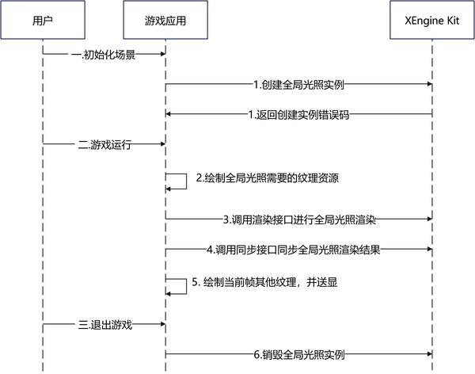

# 光线追踪全局光照

更新时间：2026-07-28 11:23:46

来源：https://developer.huawei.com/consumer/cn/doc/harmonyos-guides/xengine-kit-rt-global-illumination

从6.0.0(20) 版本开始，新增光线追踪全局光照特性。

XEngine Kit提供端侧光线追踪全局光照（Ray-Traced Global Illumination，RTGI）特性，包含动态漫反射全局光照（DDGI）算法和神经网络全局光照（NNGI）算法。


#### 约束与限制

 - 支持的设备类型：此特性依赖设备支持Vulkan光线追踪扩展[VK_KHR_acceleration_structure](https://docs.vulkan.org/refpages/latest/refpages/source/VK_KHR_acceleration_structure.html)、[VK_KHR_ray_query](https://docs.vulkan.org/refpages/latest/refpages/source/VK_KHR_ray_query.html)
 - 可通过以下方式查询相关扩展特性是否支持：

  对于Vulkan，使用[HMS_XEG_EnumerateDeviceExtensionProperties](https://developer.huawei.com/consumer/cn/doc/harmonyos-references/xengine-kit-xengine#hms_xeg_enumeratedeviceextensionproperties)扩展特性查询接口进行查询，如查询结果包含XEG_RTGI_EXTENSION_NAME，则表示支持该特性，若查询结果未包含，则表示不支持该特性。


#### 应用场景

DDGI算法：根据视角中的探针信息，分帧更新探针光照，实现使用光线追踪实时渲染动态全局光照的效果。同时可与端云渲染相结合，利用端侧光追算力，计算动态全局光照，结合云侧下发的静态全局光照信息，实时生成高质量全场景光线追踪全局光照。

NNGI算法：结合了AI和光线追踪技术，通过非常小分辨率（例如64×32）对场景进行光线追踪渲染，然后将延迟渲染的几何数据和光追结果输入给NPU推理出整个场景的全局光照结果，从而实现少量光线即可实现全局光照效果。同时基于马良GPU的异构协同技术，NPU和GPU可以同时工作，降低整体时延。


#### 接口说明

以下接口为RTGI设置接口，如需使用更丰富的设置和查询接口，具体API说明详见[接口文档](https://developer.huawei.com/consumer/cn/doc/harmonyos-references/xengine-kit-xengine)。

| 接口名 | 描述 |
| --- | --- |
| VKAPI_ATTR VkResult VKAPI_CALL HMS_XEG_EnumerateDeviceExtensionProperties (VkPhysicalDevice physicalDevice, uint32_t *pPropertyCount, XEG_ExtensionProperties *pProperties) | XEngine Vulkan扩展特性查询接口。 |
| VKAPI_ATTR VkResult VKAPI_CALL HMS_XEG_CreateRTGI (VkDevice device, const void *pCreateInfo, XEG_RTGI *pRtGI) | 创建XEG_RTGI对象。 |
| VKAPI_ATTR VkResult VKAPI_CALL HMS_XEG_CmdRenderRTGI (VkCommandBuffer commandBuffer, XEG_RTGI rtGI, const void *pDescription) | 执行渲染命令。 |
| VKAPI_ATTR VkResult VKAPI_CALL HMS_XEG_CmdSetSynchronization (VkCommandBuffer commandBuffer, const void *xegHandle) | 设置同步信号，等待渲染结果写入指定图像。使用RTGI特性时，为等待GI渲染结果写入指定图像。 |
| VKAPI_ATTR void VKAPI_CALL HMS_XEG_DestroyRTGI (XEG_RTGI rtGI) | 销毁XEG_RTGI对象。 |


#### DDGI开发步骤

本章以Vulkan图像API集成为例，说明XEngine Kit集成操作过程。


#### 配置项目

编译HAP包时，Native层so编译需要依赖NDK中的libxengine.so。

 - 头文件引用

  
```text
#include <xengine/xeg_vulkan_extension.h>
// ...
#include <xengine/xeg_vulkan_rtgi.h>
```

```text
#include "xengine/xeg_extension_defs.h"
```

 - 编写CMakeLists.txt

  CMakeLists.txt部分示例代码如下。

  
```text
find_library(
    # 设置路径变量的名称。
    xengine-lib
    # 指定希望CMake定位的NDK库的名称。
    xengine
)
# ...
target_link_libraries(ohosmain PUBLIC
    # ...
    ${xengine-lib} RenderBehavior SceneLoader VulkanBase
)
```


#### 业务流程

 - 下面是基于Vulkan图形API平台集成动态漫反射全局光照的主要业务流程

  



1. 用户在进入游戏初始化场景时调用[HMS_XEG_EnumerateDeviceExtensionProperties](https://developer.huawei.com/consumer/cn/doc/harmonyos-references/xengine-kit-xengine#hms_xeg_enumeratedeviceextensionproperties)接口查询XEngine Kit支持的特性。检查返回列表中是否包含[XEG_RTGI_EXTENSION_NAME](https://developer.huawei.com/consumer/cn/doc/harmonyos-references/xengine-kit-xengine#xeg_rtgi_extension_name)。若不包含，则当前设备不支持此特性，流程终止。
2. 创建动态漫反射全局光照使用的创建信息，调用[HMS_XEG_CreateRTGI](https://developer.huawei.com/consumer/cn/doc/harmonyos-references/xengine-kit-xengine#hms_xeg_creatertgi)接口创建动态漫反射全局光照实例。
3. 当游戏运行时，渲染动态漫反射全局光照特性需要的纹理。
4. 调用[HMS_XEG_CmdRenderRTGI](https://developer.huawei.com/consumer/cn/doc/harmonyos-references/xengine-kit-xengine#hms_xeg_cmdrenderrtgi)执行全局光照渲染任务。
5. 调用[HMS_XEG_CmdSetSynchronization](https://developer.huawei.com/consumer/cn/doc/harmonyos-references/xengine-kit-xengine#hms_xeg_cmdsetsynchronization)设置同步信号，等待渲染结果写入指定图像。
6. 游戏使用全局光照纹理，进行其他的渲染任务，如UI等。待当前帧的渲染完成后，统一调用送显操作。
7. 当游戏退出时，调用[HMS_XEG_DestroyRTGI](https://developer.huawei.com/consumer/cn/doc/harmonyos-references/xengine-kit-xengine#hms_xeg_destroyrtgi)接口销毁动态漫反射全局光照实例。


#### 集成XEngine RT DDGI（Vulkan）

使用Vulkan图形API搭建图像渲染管线，并集成RT DDGI在Native层实现，渲染结果通过[XComponent](https://developer.huawei.com/consumer/cn/doc/harmonyos-references/ts-basic-components-xcomponent)组件显示到屏幕。

本节阐述Vulkan图形API的RT DDGI使用。

在调用XEngine Kit能力前，需要先通过[Syscap](https://developer.huawei.com/consumer/cn/doc/harmonyos-references/syscap#什么是systemcapabilitysyscap)查询您的目标设备是否支持SystemCapability.Graphic.XEngine系统能力。
1. 调用[HMS_XEG_EnumerateDeviceExtensionProperties](https://developer.huawei.com/consumer/cn/doc/harmonyos-references/xengine-kit-xengine#hms_xeg_enumeratedeviceextensionproperties)接口，获取XEngine支持的扩展信息，只有在支持XEG_RTGI_EXTENSION_NAME扩展时才可以使用RT DDGI的相关接口。

  
```text
// 查询XEngine支持的Vulkan扩展列表
std::vector<std::string> supportedExtensions;
uint32_t propertyCount;
// engineResource.physicalDevice物理设备，用户需进行初始化
HMS_XEG_EnumerateDeviceExtensionProperties(engineResource.physicalDevice, &propertyCount, nullptr);
if (propertyCount > 0) {
    std::vector<XEG_ExtensionProperties> properties(propertyCount);
    if (HMS_XEG_EnumerateDeviceExtensionProperties(engineResource.physicalDevice, &propertyCount,
        &properties.front()) == VK_SUCCESS) {
        for (auto ext : properties) {
            supportedExtensions.push_back(ext.extensionName);
        }
    }
}
// 查询是否支持RT DDGI
if (std::find(supportedExtensions.begin(), supportedExtensions.end(), XEG_RTGI_EXTENSION_NAME) ==
    supportedExtensions.end()) {
    // 错误处理
    // ...
}
```

2. 声明实例句柄。

  
```text
XEG_RTGI xegRTGI;
```

3. 调用[HMS_XEG_CreateRTGI](https://developer.huawei.com/consumer/cn/doc/harmonyos-references/xengine-kit-xengine#hms_xeg_creatertgi)接口，创建RT DDGI实例。

  
```text
// 渲染宽高renderWidth、renderHeight以及缩放倍率scaled可以由用户设定
VkExtent2D outputSize;
outputSize.width = renderWidth;
outputSize.height = renderHeight;
VkExtent2D scaled;
scaled.width = 1;
scaled.height = 1;
// 指定当前结构体类型为create info
ddgiCreateInfo.sType = XEG_STRUCTURE_TYPE_DDGI_CREATE_INFO;
// 指定扩展为空
ddgiCreateInfo.pNext = nullptr;
// 指定质量模式为质量
ddgiCreateInfo.qualityMode = XEG_RTGI_QUALITY_MODE_QUALITY;
// 指定当前场景中需要同时渲染的最大体积数量，范围为[1, 9]
ddgiCreateInfo.numberVolume = VOLUME_NUMBER;
// 指定渲染宽高缩小倍率，建议范围为[1, 4]，必须不小于1
ddgiCreateInfo.scaledView = scaled;
// 指定输出GI图像的渲染宽高
ddgiCreateInfo.viewSize = outputSize;
// 指定是否开启端云模式，true为开启，false为关闭
ddgiCreateInfo.enableCloud = false;
HMS_XEG_CreateRTGI(engineResource.device, &ddgiCreateInfo, &xegRTGI);
```

4. 调用[HMS_XEG_CmdRenderRTGI](https://developer.huawei.com/consumer/cn/doc/harmonyos-references/xengine-kit-xengine#hms_xeg_cmdrenderrtgi)接口执行渲染命令，每帧都需要调用。

  
```text
// ddgiVolumeEntryParameters为XEG_DDGIVolumeEntryParameters对象
// 体积索引，范围为[0, 65535]，且唯一
ddgiVolumeEntryParameters[volumeID].volumeIndex = uint32_t(ddgiVolumePara[volumeID].volumeIndex);
// 探针发射光线数量，范围为[1, 1024]
ddgiVolumeEntryParameters[volumeID].raysPerProbe = uint32_t(ddgiVolumePara[volumeID].raysPerProbe);
// 光线求交最远距离
ddgiVolumeEntryParameters[volumeID].probeMaxRayDistance = 1000.0f;
// 体积中心点坐标
ddgiVolumeEntryParameters[volumeID].volumePosition[0] =
    ddgiVolumePara[volumeID].probeGridOrigin[0] + offsetX * ddgiVolumePara[volumeID].probeSpacing[0];
ddgiVolumeEntryParameters[volumeID].volumePosition[1] =
    ddgiVolumePara[volumeID].probeGridOrigin[1] + offsetY * ddgiVolumePara[volumeID].probeSpacing[1];
ddgiVolumeEntryParameters[volumeID].volumePosition[NUM_TWO] =
    ddgiVolumePara[volumeID].probeGridOrigin[NUM_TWO] +
    offsetZ * ddgiVolumePara[volumeID].probeSpacing[NUM_TWO];
// 探针放置间距，必须大于0
ddgiVolumeEntryParameters[volumeID].probeSpacing[0] = ddgiVolumePara[volumeID].probeSpacing[0];
ddgiVolumeEntryParameters[volumeID].probeSpacing[1] = ddgiVolumePara[volumeID].probeSpacing[1];
ddgiVolumeEntryParameters[volumeID].probeSpacing[NUM_TWO] =
    ddgiVolumePara[volumeID].probeSpacing[NUM_TWO];
// 体积光照通道标记
ddgiVolumeEntryParameters[volumeID].volumeLightingChannelMask = 0xFFFFFFFF;
// 探针放置数量，必须大于0，范围为[1, 32]
ddgiVolumeEntryParameters[volumeID].volumeProbeGridCounts[0] =
    uint32_t(ddgiVolumePara[volumeID].probeCounts[0]);
ddgiVolumeEntryParameters[volumeID].volumeProbeGridCounts[1] =
    uint32_t(ddgiVolumePara[volumeID].probeCounts[1]);
ddgiVolumeEntryParameters[volumeID].volumeProbeGridCounts[NUM_TWO] =
    uint32_t(ddgiVolumePara[volumeID].probeCounts[NUM_TWO]);
// 光照的伽马校正系数，必须不为0
ddgiVolumeEntryParameters[volumeID].volumeProbeIrradianceEncodingGamma =
    ddgiVolumePara[volumeID].irradianceGamma;
// 探针光照历史权重，范围为[0.0, 1.0]
ddgiVolumeEntryParameters[volumeID].probeHysteresis = ddgiVolumePara[volumeID].historicalWeight;
// 探针变化阈值
ddgiVolumeEntryParameters[volumeID].probeChangeThreshold = 1.0;
// 探针亮度阈值
ddgiVolumeEntryParameters[volumeID].probeBrightnessThreshold = 1.0;
// 探针法向偏移量
ddgiVolumeEntryParameters[volumeID].volumeNormalBias = ddgiVolumePara[volumeID].biasNormal;
// 探针视角偏移量
ddgiVolumeEntryParameters[volumeID].volumeViewBias = ddgiVolumePara[volumeID].biasDir;
// 体积光照混合距离
ddgiVolumeEntryParameters[volumeID].volumeBlendDistance = 1.0;
// 体积边缘光照渐暗范围
ddgiVolumeEntryParameters[volumeID].volumeBlendDistanceBlack = 1.0;
// 探针反向判断阈值
ddgiVolumeEntryParameters[volumeID].probeBackfaceThreshold = 1.0;
// 探针正向最小距离
ddgiVolumeEntryParameters[volumeID].probeMinFrontfaceDistance = 1.0;
// 体积光照缩放倍率，必须非负
ddgiVolumeEntryParameters[volumeID].volumeIrradianceScalar = 1.0;
// 发射光线强度倍率，必须非负
ddgiVolumeEntryParameters[volumeID].emissiveMultiplier = 1.0;
// 光照倍率，必须非负
ddgiVolumeEntryParameters[volumeID].lightingMultiplier = ddgiVolumePara[volumeID].lightingMultiplier;
// 是否强制更新所有探针，true为强制全部更新，false为选择部分更新
ddgiVolumeEntryParameters[volumeID].bForceUpdate = false;
// probeSH[volumeID].textureImageView为用户创建的存储探针光照二阶球谐系数的3D图像的VkImageView
// 存储当前接口渲染结果，通过对该图像进行三线性插值采样，可以计算GI光照值
ddgiVolumeEntryParameters[volumeID].probeIrradianceSH = probeSH[volumeID].textureImageView;
```

```text
// ddgiDescription为XEG_DDGIDescription对象
ddgiDescription.sType = XEG_STRUCTURE_TYPE_DDGI_DESCRIPTION;
// 指定扩展为空
ddgiDescription.pNext = nullptr;
// gBufferNormal.textureImageView为用户创建的法线图像的VkImageView
ddgiDescription.inputNormalImage = gBufferNormal.textureImageView;
// gBufferDepth.textureImageView为用户创建的深度图像的VkImageView
ddgiDescription.inputDepthImage = gBufferDepth.textureImageView;
// gBufferAlbedo.textureImageView为用户创建的颜色及金属度图像的VkImageView
ddgiDescription.inputBasecolorMetallicImage = gBufferAlbedo.textureImageView;
// rayDirection.textureImageView为用户创建的发射光线方向图像的VkImageView
ddgiDescription.inputDirectionImage = rayDirection.textureImageView;
// rayHitRadiance.textureImageView为用户创建的发射光线交点光照及距离图像的VkImageView
ddgiDescription.inputRayRadianceDistanceImage = rayHitRadiance.textureImageView;
// rayHitNormal.textureImageView为用户创建的发射光线交点法线及金属度图像的VkImageView
ddgiDescription.inputRayHitNormalAndMetallicImage = rayHitNormal.textureImageView;
// probeRenderList.buffer为用户创建的输入probe索引缓冲区VkBuffer
ddgiDescription.inputVolumeIndexAndProbeIndex = probeRenderList.buffer;
// inputProbeCount为输入probe信息数量
ddgiDescription.inputProbeCount = inputProbeCount;
// outputProbeList.buffer为用户创建的输出probe索引缓冲区VkBuffer
ddgiDescription.outputVolumeIndexAndProbeIndex = outputProbeList.buffer;
// outputProbeCount.buffer为用户创建的输出probe数量缓冲区VkBuffer
ddgiDescription.outputProbeCount = outputProbeCount.buffer;
// outputGIImage.textureImageView为用户创建的全局光照图像的VkImageView
ddgiDescription.outputGIImage = outputGIImage.textureImageView;
// VOLUME_NUMBER为使用的volume数量
ddgiDescription.enableVolumeNumber = VOLUME_NUMBER;
ddgiDescription.pVolumeEntryParameters = ddgiVolumeEntryParameters.data();
// ...
HMS_XEG_CmdRenderRTGI(commandBuffer, xegRTGI, &ddgiDescription);
```

5. 若使用延迟渲染管线，则可以在调用[HMS_XEG_CmdRenderRTGI](https://developer.huawei.com/consumer/cn/doc/harmonyos-references/xengine-kit-xengine#hms_xeg_cmdrenderrtgi)接口之后，调用[HMS_XEG_CmdSetSynchronization](https://developer.huawei.com/consumer/cn/doc/harmonyos-references/xengine-kit-xengine#hms_xeg_cmdsetsynchronization)接口，设置同步信号，等待GI渲染结果写入指定图像，[HMS_XEG_CmdSetSynchronization](https://developer.huawei.com/consumer/cn/doc/harmonyos-references/xengine-kit-xengine#hms_xeg_cmdsetsynchronization)接口需要每帧调用。

  
```text
// 将GI渲染结果写入到指定图像中
HMS_XEG_CmdSetSynchronization(commandBuffer, xegRTGI);
```

6. 调用[HMS_XEG_DestroyRTGI](https://developer.huawei.com/consumer/cn/doc/harmonyos-references/xengine-kit-xengine#hms_xeg_destroyrtgi)接口销毁实例。

  
```text
if (xegRtgi != nullptr) {
    HMS_XEG_DestroyRTGI(xegRtgi);
}
```


#### NNGI开发步骤

本章以Vulkan图像API集成为例，说明XEngine Kit集成操作过程。


#### 配置项目

编译HAP包时，Native层so编译需要依赖NDK中的libxengine.so。

 - 头文件引用

  
```text
#include <xengine/xeg_vulkan_extension.h>
// ...
#include <xengine/xeg_vulkan_rtgi.h>
```

 - 编写CMakeLists.txt

  CMakeLists.txt部分示例代码如下。

  
```text
find_library(
    # 设置路径变量的名称。
    xengine-lib
    # 指定希望CMake定位的NDK库的名称。
    xengine
)

target_link_libraries(nativerender PUBLIC
    # ...
    ${xengine-lib}
)
```


#### 业务流程

下面是基于Vulkan图形API平台集成神经网络全局光照的主要业务流程


1. 用户在进入游戏初始化场景时调用[HMS_XEG_EnumerateDeviceExtensionProperties](https://developer.huawei.com/consumer/cn/doc/harmonyos-references/xengine-kit-xengine#hms_xeg_enumeratedeviceextensionproperties)接口查询XEngine Kit支持的特性。检查返回列表中是否包含[XEG_RTGI_EXTENSION_NAME](https://developer.huawei.com/consumer/cn/doc/harmonyos-references/xengine-kit-xengine#xeg_rtgi_extension_name)。若不包含，则当前设备不支持此特性，流程终止。
2. 创建神经网络全局光照使用的创建信息，调用[HMS_XEG_CreateRTGI](https://developer.huawei.com/consumer/cn/doc/harmonyos-references/xengine-kit-xengine#hms_xeg_creatertgi)接口创建神经网络全局光照实例。
3. 当游戏运行时，渲染神经网络全局光照特性需要的纹理。
4. 调用[HMS_XEG_CmdRenderRTGI](https://developer.huawei.com/consumer/cn/doc/harmonyos-references/xengine-kit-xengine#hms_xeg_cmdrenderrtgi)执行全局光照渲染任务。
5. 调用[HMS_XEG_CmdSetSynchronization](https://developer.huawei.com/consumer/cn/doc/harmonyos-references/xengine-kit-xengine#hms_xeg_cmdsetsynchronization)执行训练任务。
6. 游戏使用全局光照纹理，进行其他的渲染任务，如UI等。待当前帧的渲染完成后，统一调用送显操作。
7. 当游戏退出时，调用[HMS_XEG_DestroyRTGI](https://developer.huawei.com/consumer/cn/doc/harmonyos-references/xengine-kit-xengine#hms_xeg_destroyrtgi)接口销毁神经网络全局光照实例。


#### 集成XEngine RT NNGI（Vulkan）

使用Vulkan图形API搭建图像渲染管线，并集成RT NNGI在Native层实现，渲染结果通过[XComponent](https://developer.huawei.com/consumer/cn/doc/harmonyos-references/ts-basic-components-xcomponent)组件显示到屏幕。

本节阐述Vulkan图形API的RT NNGI使用。

在调用XEngine Kit能力前，需要先通过[Syscap](https://developer.huawei.com/consumer/cn/doc/harmonyos-references/syscap#什么是systemcapabilitysyscap)查询您的目标设备是否支持SystemCapability.Graphic.XEngine系统能力。
1. 调用[HMS_XEG_EnumerateDeviceExtensionProperties](https://developer.huawei.com/consumer/cn/doc/harmonyos-references/xengine-kit-xengine#hms_xeg_enumeratedeviceextensionproperties)接口，获取XEngine支持的扩展信息，只有在支持XEG_RTGI_EXTENSION_NAME扩展时才可以使用RT NNGI的相关接口。

  
```text
// 查询XEngine支持的Vulkan扩展列表
std::vector<std::string> supportedExtensions;
uint32_t pPropertyCount;
// physicalDevice为Vulkan物理设备，用户需进行初始化
HMS_XEG_EnumerateDeviceExtensionProperties(physicalDevice, &pPropertyCount, nullptr);
if (pPropertyCount > 0) {
    std::vector<XEG_ExtensionProperties> pProperties(pPropertyCount);
    if (HMS_XEG_EnumerateDeviceExtensionProperties(physicalDevice, &pPropertyCount,
        &pProperties.front()) == VK_SUCCESS) {
        for (auto ext : pProperties) {
            supportedExtensions.push_back(ext.extensionName);
        }
    }
}
    
// 查询是否支持RT NNGI
if (std::find(supportedExtensions.begin(), supportedExtensions.end(), XEG_RTGI_EXTENSION_NAME) ==
    supportedExtensions.end()) {
    // 错误处理
    // ...
}
```

2. 声明实例句柄。

  
```text
XEG_RTGI xegRTGI;
```

3. 调用[HMS_XEG_CreateRTGI](https://developer.huawei.com/consumer/cn/doc/harmonyos-references/xengine-kit-xengine#hms_xeg_creatertgi)接口，创建RT NNGI实例。

  
```text
// XEG_NNGICreateInfo为创建XEG_NNGI对象所需信息
XEG_NNGICreateInfo xegNngiCreateInfo;
// 指定当前结构体类型为create info
xegNngiCreateInfo.sType = XEG_STRUCTURE_TYPE_NNGI_CREATE_INFO;
// 指定扩展为空
xegNngiCreateInfo.pNext = nullptr;
// 指定质量模式为质量
xegNngiCreateInfo.qualityMode = XEG_RTGIQualityMode::XEG_RTGI_QUALITY_MODE_QUALITY;
// NNGI_RENDER_WIDTH, NNGI_RENDER_HEIGHT分别表示指定推理输入图像的分辨率宽高
xegNngiCreateInfo.inferenceInputSize = {NNGI_RENDER_WIDTH, NNGI_RENDER_HEIGHT};
// NNGI_IL_WIDTH, NNGI_IL_HEIGHT分别表示指定推理输出图像的分辨率宽高
xegNngiCreateInfo.inferenceOutputSize = {NNGI_IL_WIDTH, NNGI_IL_HEIGHT};
// nngiPathtracer.width, nngiPathtracer.height分别表示指定训练图像的分辨率宽高
xegNngiCreateInfo.trainingSize = {nngiPathtracer.width, nngiPathtracer.height};
// device逻辑设备，用户需进行初始化
VkResult res = HMS_XEG_CreateRTGI(device, &xegNngiCreateInfo, &xegRtgi);
```

4. 调用[HMS_XEG_CmdRenderRTGI](https://developer.huawei.com/consumer/cn/doc/harmonyos-references/xengine-kit-xengine#hms_xeg_cmdrenderrtgi)接口执行渲染命令，每帧都需要调用。

  
```text
// 指定当前结构体类型为NNGI description
xegNNGIDescription.sType = XEG_STRUCTURE_TYPE_NNGI_DESCRIPTION;
// 指定扩展为空
xegNNGIDescription.pNext = nullptr;
// 设置推理图像的相机相关矩阵，此处仅为示例，使用时需要用户进行初始化
memcpy(xegNNGIDescription.inferenceCameraViewMatrix, (float*)glm::value_ptr(camera->matrices.view),
       sizeof(xegNNGIDescription.inferenceCameraViewMatrix));
memcpy(xegNNGIDescription.inferenceCameraProjectionMatrix, (float*)glm::value_ptr(camera->matrices.perspective),
       sizeof(xegNNGIDescription.inferenceCameraProjectionMatrix));
// inputNormalView为用户创建的推理输入法向量图像的VkImageView
xegNNGIDescription.inferenceInputNormalImage = inputNormalView;
// inputDepthView为用户创建的推理输入深度图像的VkImageView
xegNNGIDescription.inferenceInputDepthImage = inputDepthView;
// inputAlbedoView为用户创建的推理输入基础颜色和金属度图像的VkImageView
xegNNGIDescription.inferenceInputBaseColorMetallicImage = inputAlbedoView;
// outputGIView为用户创建的推理输出全局光照图像的VkImageView
xegNNGIDescription.inferenceOutputGIImage = outputGIView;
// 设置训练图像的相机相关矩阵，此处仅为示例，使用时需要用户进行初始化
memcpy(xegNNGIDescription.trainingCameraViewMatrix, (float*)glm::value_ptr(trainCameraViewMatrix),
       sizeof(xegNNGIDescription.trainingCameraViewMatrix));
memcpy(xegNNGIDescription.trainingCameraProjectionMatrix, (float*)glm::value_ptr(trainCameraProjMatrix),
       sizeof(xegNNGIDescription.trainingCameraProjectionMatrix));
// inputPositionView为用户创建的训练输入位置图像的VkImageView
xegNNGIDescription.trainingInputPositionImage = inputPositionView;
// inputNormalView为用户创建的训练输入法向量图像的VkImageView
xegNNGIDescription.trainingInputNormalImage = inputUnpacNormalView;
// inputAlbedoNormalView为用户创建的训练输入基础颜色和金属度图像的VkImageView
xegNNGIDescription.trainingInputBaseColorMetallicImage = inputAlbedoNormalView;
// inputTrainGIView为用户创建的训练输入全局光照图像的VkImageView
xegNNGIDescription.trainingInputGIImage = inputTrainGIView;
// xegNNGIDescription.isSceneUnbounded表示指定渲染场景是否无界，当前只支持false
xegNNGIDescription.isSceneUnbounded = false;
// xegNNGIDescription.sceneAabb表示用户创建的渲染包围盒范围VkAabbPositionsKHR
xegNNGIDescription.sceneAabb = {sceneAabbMin.x, sceneAabbMin.y, sceneAabbMin.z,
                                   sceneAabbMax.x, sceneAabbMax.y, sceneAabbMax.z};
// xegNNGIDescription.spatialScaleFactor表示场景缩放因子，对于有界场景，无需设置，XEngine根据sceneAabb计算该值
xegNNGIDescription.spatialScaleFactor = 1.0f / glm::length(sceneAabbMax - sceneAabbMin);
// ...
if (useDDKNNGI && xegRtgi != nullptr) {
    VkResult res = HMS_XEG_CmdRenderRTGI(commandBuffer, xegRtgi, &xegNNGIDescription);
    // ...
}
```

5. 在调用[HMS_XEG_CmdRenderRTGI](https://developer.huawei.com/consumer/cn/doc/harmonyos-references/xengine-kit-xengine#hms_xeg_cmdrenderrtgi)接口之后，调用[HMS_XEG_CmdSetSynchronization](https://developer.huawei.com/consumer/cn/doc/harmonyos-references/xengine-kit-xengine#hms_xeg_cmdsetsynchronization)接口，执行训练步骤，[HMS_XEG_CmdSetSynchronization](https://developer.huawei.com/consumer/cn/doc/harmonyos-references/xengine-kit-xengine#hms_xeg_cmdsetsynchronization)接口需要每帧调用。

  
```text
VkResult res = HMS_XEG_CmdSetSynchronization(commandBuffer, xegRtgi);
```

6. 调用[HMS_XEG_DestroyRTGI](https://developer.huawei.com/consumer/cn/doc/harmonyos-references/xengine-kit-xengine#hms_xeg_destroyrtgi)接口销毁实例。

  
```text
if (xegRtgi != nullptr) {
    HMS_XEG_DestroyRTGI(xegRtgi);
}
```
