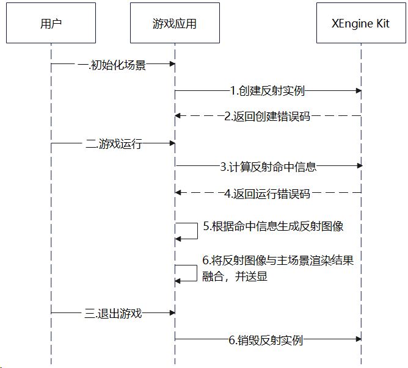

# 光线追踪反射

更新时间：2026-07-28 11:23:46

来源：https://developer.huawei.com/consumer/cn/doc/harmonyos-guides/xengine-kit-rt-reflection

从6.0.0(20) 版本开始，新增光线追踪反射特性。

XEngine Kit提供光线追踪反射（Ray-Traced Reflections）渲染能力。相比于该效果的传统光线追踪实现方式，依托于华为马良GPU的软硬结合优化，XEngine Kit支持FERT(Flexible Entry Raytracing)求交加速技术，可以减少光线与场景几何的求交计算次数，从而降低实现高画质光追效果时的GPU负载。


#### 约束与限制

 - 支持的设备类型：此特性依赖设备支持Vulkan光线追踪扩展[VK_KHR_acceleration_structure](https://docs.vulkan.org/refpages/latest/refpages/source/VK_KHR_acceleration_structure.html)、[VK_KHR_ray_query](https://docs.vulkan.org/refpages/latest/refpages/source/VK_KHR_ray_query.html)
 - 可通过以下方式查询相关扩展特性是否支持：

  对于Vulkan，使用[HMS_XEG_EnumerateDeviceExtensionProperties](https://developer.huawei.com/consumer/cn/doc/harmonyos-references/xengine-kit-xengine#hms_xeg_enumeratedeviceextensionproperties)扩展特性查询接口进行查询，如查询结果包含XEG_RT_REFLECTION_EXTENSION_NAME，则表示支持该特性，若查询结果未包含，则表示不支持该特性。


#### 接口说明

以下接口为使用光线追踪反射特性需要使用的接口，关于这些接口的详细说明见[接口文档](https://developer.huawei.com/consumer/cn/doc/harmonyos-references/xengine-kit-xengine)。

| 接口名 | 描述 |
| --- | --- |
| VKAPI_ATTR VkResult VKAPI_CALL HMS_XEG_EnumerateDeviceExtensionProperties (VkPhysicalDevice physicalDevice, uint32_t * pPropertyCount, XEG_ExtensionProperties * pProperties) | XEngine Vulkan扩展特性查询接口。 |
| VKAPI_ATTR VkResult VKAPI_CALL HMS_XEG_CreateRTReflection(VkDevice device, const void* pCreateInfo, XEG_RTReflection* pRtReflection) | 创建XEG_RTReflection对象。 |
| VKAPI_ATTR VkResult VKAPI_CALL HMS_XEG_CmdRenderRTReflection(VkCommandBuffer commandBuffer, XEG_RTReflection rtReflection, const void* pDescription) | 录制计算RT反射命中信息命令。 |
| VKAPI_ATTR void VKAPI_CALL HMS_XEG_DestroyRTReflection(XEG_RTReflection rtReflection) | 销毁XEG_RTReflection对象。 |


#### 业务流程




1. 当用户进入游戏场景时，调用[HMS_XEG_EnumerateDeviceExtensionProperties](https://developer.huawei.com/consumer/cn/doc/harmonyos-references/xengine-kit-xengine#hms_xeg_enumeratedeviceextensionproperties)接口查询XEngine Kit支持的特性列表。
2. 检查返回列表中是否包含[XEG_RT_REFLECTION_EXTENSION_NAME](https://developer.huawei.com/consumer/cn/doc/harmonyos-references/xengine-kit-xengine#xeg_rt_reflection_extension_name)。若不包含，则当前设备不支持此特性，流程终止。
3. 调用[HMS_XEG_CreateRTReflection](https://developer.huawei.com/consumer/cn/doc/harmonyos-references/xengine-kit-xengine#hms_xeg_creatertreflection)接口创建光线追踪反射实例。
4. 调用[HMS_XEG_CmdRenderRTReflection](https://developer.huawei.com/consumer/cn/doc/harmonyos-references/xengine-kit-xengine#hms_xeg_cmdrenderrtreflection)接口计算光线追踪反射命中信息。
5. 根据4中计算的反射命中信息，生成反射图像。
6. 将反射图像和游戏的主场景渲染结果进行融合。
7. 进行后续的渲染流程，如UI元素的绘制。待当前帧的渲染完成后，统一调用送显操作。
8. 当游戏退出时，调用[HMS_XEG_DestroyRTReflection](https://developer.huawei.com/consumer/cn/doc/harmonyos-references/xengine-kit-xengine#hms_xeg_destroyrtreflection)接口销毁光线追踪反射实例。


#### 开发步骤

本章以在Vulkan应用程序中集成为例，说明XEngine Kit集成操作过程。


#### 配置项目

编译HAP包时，Native层so编译需要依赖NDK中的libxengine.so。

 - 头文件引用

  
```text
#include "xengine/xeg_vulkan_extension.h"
// ...
#include "xengine/xeg_vulkan_rt_reflection.h"
```

 - 编写CMakeLists.txt

  CMakeLists.txt部分示例代码如下

  
```text
find_library(
    # 设置路径变量的名称。
    xengine-lib
    # 指定希望CMake定位的NDK库的名称。
    xengine
)

target_link_libraries(nativerender PUBLIC
    # ...
    ${xengine-lib}
)
```


#### 集成XEngine Kit光线追踪反射（Vulkan）

使用Vulkan图形API搭建图像渲染管线，并集成光线追踪反射效果的代码需要在Native层实现，渲染结果通过[XComponent](https://developer.huawei.com/consumer/cn/doc/harmonyos-references/ts-basic-components-xcomponent)组件显示到屏幕。

在调用XEngine Kit能力前，需要先通过[Syscap](https://developer.huawei.com/consumer/cn/doc/harmonyos-references/syscap#什么是systemcapabilitysyscap)查询您的目标设备是否支持SystemCapability.Graphic.XEngine系统能力。
1. 调用[HMS_XEG_EnumerateDeviceExtensionProperties](https://developer.huawei.com/consumer/cn/doc/harmonyos-references/xengine-kit-xengine#hms_xeg_enumeratedeviceextensionproperties)接口，获取XEngine支持的扩展信息，只有在支持XEG_RT_REFLECTION_EXTENSION_NAME扩展时才可以使用光线追踪反射的相关接口。

  
```text
// 查询XEngine支持的Vulkan扩展列表
std::vector<std::string> supportedExtensions;
uint32_t propertyCount;
// physicalDevice为Vulkan物理设备，用户需进行初始化
HMS_XEG_EnumerateDeviceExtensionProperties(physicalDevice, &propertyCount, nullptr);
if (propertyCount > 0) {
    std::vector<XEG_ExtensionProperties> properties(propertyCount);
    if (HMS_XEG_EnumerateDeviceExtensionProperties(physicalDevice, &propertyCount, &properties.front()) ==
        VK_SUCCESS) {
        for (auto ext : properties) {
            supportedExtensions.push_back(ext.extensionName);
        }
    }
}
// ...
// 查询是否支持光线追踪反射特性
if (std::find(supportedExtensions.begin(), supportedExtensions.end(), XEG_RT_REFLECTION_EXTENSION_NAME) ==
    supportedExtensions.end()) {
    // 错误处理
    // ...
}
```

2. 声明实例句柄。

  
```text
XEG_RTReflection rtReflection = VK_NULL_HANDLE;
```

3. 调用[HMS_XEG_CreateRTReflection](https://developer.huawei.com/consumer/cn/doc/harmonyos-references/xengine-kit-xengine#hms_xeg_creatertreflection)接口，创建光线追踪反射实例。

  
```text
// XEG_RTReflectionCreateInfo为创建xegRTReflection对象信息
XEG_RTReflectionCreateInfo xegRTReflectionCreateInfo;
// 指定是否开启快速求交模式。1表示开启快速求交模式
xegRTReflectionCreateInfo.enableFastTrace = 1;
xegRTReflectionCreateInfo.pNext = nullptr;
// 指定XEG_StructureType值，必须是XEG_STRUCTURE_TYPE_RT_REFLECTION_CREATE_INFO
xegRTReflectionCreateInfo.sType = XEG_STRUCTURE_TYPE_RT_REFLECTION_CREATE_INFO;
// 指定输入图像尺寸
// 创建光线追踪反射实例所需的宽高reflectionWidth，reflectionHeight信息为用户自定义参数
xegRTReflectionCreateInfo.renderSize = VkExtent2D{ reflectionWidth, reflectionHeight };
// ...
VkResult ret = HMS_XEG_CreateRTReflection(device, &xegRTReflectionCreateInfo, &rtReflection);
if (ret != VK_SUCCESS) {
    // 错误处理
    // ...
}
```

4. 调用[HMS_XEG_CmdRenderRTReflection](https://developer.huawei.com/consumer/cn/doc/harmonyos-references/xengine-kit-xengine#hms_xeg_cmdrenderrtreflection)接口下发渲染命令，每帧都需要调用。

  
```text
// 反射渲染输入信息
XEG_RTReflectionDescription xegRTReflectionDescription;
xegRTReflectionDescription.pNext = nullptr;
// rayOriginImage.view为用户创建的光线原点图像的VkImageView
xegRTReflectionDescription.inputRayOriginImage = rayOriginImage.view;
// rayDirection.view为用户创建的光线方向图像的VkImageView
xegRTReflectionDescription.inputRayDirectionImage = rayDirection.view;
// reflectionOutput.view为用户创建的用于记录光线追踪求交结果的VkImageView
xegRTReflectionDescription.outputReflectionInfoImage = reflectionOutput.view;
// accelerationStructureBuilder.getTlas()是场景的Top Level光线追踪加速结构
xegRTReflectionDescription.accelerationStructure = accelerationStructureBuilder.getTlas();
xegRTReflectionDescription.rayMin = 0.01;
xegRTReflectionDescription.rayMax = 1e10;
xegRTReflectionDescription.sType = XEG_STRUCTURE_TYPE_RT_REFLECTION_DESCRIPTION;
xegRTReflectionDescription.reflectionCullMask = 0xff;
// drawCmdBuffers[currentBuffer]为命令缓冲区，用户需进行初始化
VkResult ret = HMS_XEG_CmdRenderRTReflection(
    drawCmdBuffers[currentBuffer], rtReflection, &xegRTReflectionDescription);
if (ret != VK_SUCCESS) {
    // 错误处理
    // ...
}
```

5. 调用[HMS_XEG_DestroyRTReflection](https://developer.huawei.com/consumer/cn/doc/harmonyos-references/xengine-kit-xengine#hms_xeg_destroyrtreflection)接口销毁实例，释放资源，当特性不再使用或应用退出时需要调用。

  
```text
HMS_XEG_DestroyRTReflection(rtReflection);
```
