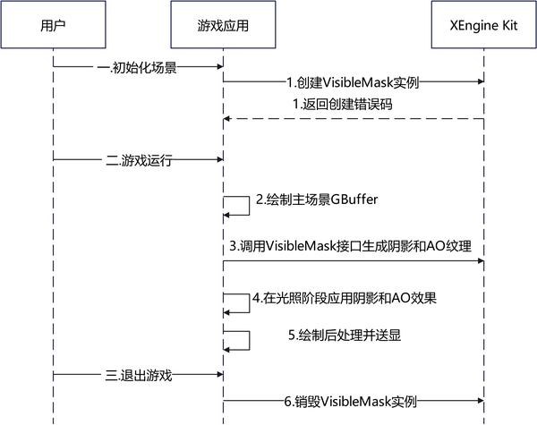

# 光线追踪阴影和环境光遮蔽

更新时间：2026-04-29 07:35:50

来源：https://developer.huawei.com/consumer/cn/doc/harmonyos-guides/xengine-kit-rt-shadow-and-ao

从6.0.0(20) 版本开始，新增光线追踪阴影和环境光遮蔽特性。

 XEngine VisibleMask特性提供开箱即用的光线追踪阴影和环境光遮蔽（Ray-Traced Shadow and AO）渲染能力。相比于这些效果的传统光线追踪实现方式，依托于华为马良GPU的软硬结合优化，XEngine支持FERT(Flexible Entry Raytracing)求交加速技术，可以减少光线与场景几何的求交计算次数，从而降低实现高画质光追效果时的GPU负载。此外，XEngine通过高度优化的时空域降噪技术，解决光线追踪渲染时因为光线数量不足而引入的噪声问题，可以在发射较少光线数的情况下达成高画质表现，实现同等画质GPU负载更轻，同等负载下画质更好的效果。


## 约束与限制

支持的设备类型：此特性依赖设备支持Vulkan光线追踪扩展[VK_KHR_acceleration_structure](https://docs.vulkan.org/refpages/latest/refpages/source/VK_KHR_acceleration_structure.html)、[VK_KHR_ray_query](https://docs.vulkan.org/refpages/latest/refpages/source/VK_KHR_ray_query.html)。  可通过以下方式查询相关扩展特性是否支持：  对于Vulkan，使用[HMS_XEG_EnumerateDeviceExtensionProperties](https://developer.huawei.com/consumer/cn/doc/harmonyos-references/xengine-kit-xengine#hms_xeg_enumeratedeviceextensionproperties)扩展特性查询接口进行查询，如查询结果包含XEG_RT_SHADOW_AO_EXTENSION_NAME，则表示支持该特性，若查询结果未包含，则表示不支持该特性。

## 接口说明

以下接口为使用光线追踪阴影和环境光遮蔽特性需要使用的接口，关于这些接口的详细说明见[接口文档](https://developer.huawei.com/consumer/cn/doc/harmonyos-references/xengine-kit-xengine)。
| 接口名 | 描述 |
| --- | --- |
| VKAPI_ATTR VkResult VKAPI_CALL HMS_XEG_EnumerateDeviceExtensionProperties (VkPhysicalDevice physicalDevice, uint32_t * pPropertyCount, XEG_ExtensionProperties * pProperties) | XEngine Vulkan扩展特性查询接口。 |
| VKAPI_ATTR VkResult VKAPI_CALL HMS_XEG_CreateRTVisibleMask (VkDevice device, const void *pCreateInfo, XEG_RTVisibleMask *pRTVisibleMask) | 创建XEG_RTVisibleMask对象。 |
| VKAPI_ATTR VkResult VKAPI_CALL HMS_XEG_CmdRenderRTVisibleMask (VkCommandBuffer commandBuffer, XEG_RTVisibleMask rtVisibleMask, const void *pDescription) | 录制光线追踪VisibleMask渲染命令。 |
| VKAPI_ATTR void VKAPI_CALL HMS_XEG_DestroyRTVisibleMask (XEG_RTVisibleMask rtVisibleMask) | 销毁XEG_RTVisibleMask对象。 |


## 业务流程


游戏进入适用光线追踪阴影和环境光遮蔽效果的游戏场景。在确认设备支持光线追踪扩展和XEG_RT_SHADOW_AO_EXTENSION_NAME扩展时，调用HMS_XEG_CreateRTVisibleMask接口创建实例。游戏构建或更新场景的光线追踪加速结构在延迟渲染GBuffer渲染阶段后，调用HMS_XEG_CmdRenderRTVisibleMask接口计算阴影和环境光遮蔽贴图。在延迟渲染光照计算阶段，采样前一步生成的阴影和环境光遮蔽值，进行光照效果计算。进行后续渲染流程，如后处理和UI渲染，完成一帧渲染后送显当前帧。用户退出游戏场景时，游戏应用调用HMS_XEG_DestroyRTVisibleMask接口销毁XEngine实例。

## 开发步骤

本章以在Vulkan应用程序延迟渲染管线中集成为例，说明使用XEngine光线追踪阴影和环境光遮蔽特性的开发步骤。

## 配置项目

编译HAP时，Native层so需要依赖NDK中的XEngine相关库和头文件。 头文件引用
```text
#include
#include
#include
#include
#include
```

CMakeLists.txt添加库依赖  CMakeLists.txt中添加对XEngine动态链接库依赖的代码如下。
```text
find_library(
    # 设置路径变量的名称。
    xengine-lib
    # 指定希望CMake定位的NDK库的名称。
    xengine
)
target_link_libraries(nativerender PUBLIC
    ...... // 其他库文件
    ${xengine-lib})
```


## 集成XEngine光线追踪阴影和环境光遮蔽（Vulkan）

XEngine VisibleMask特性的光线追踪阴影（Ray-Traced Shadow，简称RTShadow）和环境光遮蔽（Ray-Traced AO，简称RTAO）效果API需要与Vulkan API延迟渲染管线配合使用。相关代码在Native层实现，渲染结果通过[XComponent](https://developer.huawei.com/consumer/cn/doc/harmonyos-references/ts-basic-components-xcomponent)组件显示到屏幕。 在调用XEngine Kit特性接口前，需要先通过[Syscap](https://developer.huawei.com/consumer/cn/doc/harmonyos-references/syscap#什么是systemcapabilitysyscap)查询确认您的目标设备支持SystemCapability.Graphic.XEngine系统能力。 调用[HMS_XEG_EnumerateDeviceExtensionProperties](https://developer.huawei.com/consumer/cn/doc/harmonyos-references/xengine-kit-xengine#hms_xeg_enumeratedeviceextensionproperties)接口，获取XEngine支持的扩展信息，只有在支持XEG_RT_SHADOW_AO_EXTENSION_NAME扩展时才可以使用光线追踪阴影和环境光遮蔽特性的接口。
```text
// physicalDevice为当前应用程序的Vulkan物理设备，需用户进行初始化
VkPhysicalDevice physicalDevice;
// 查询XEngine支持的Vulkan扩展列表
std::vector supportedExtensions;
uint32_t propertyCount;
HMS_XEG_EnumerateDeviceExtensionProperties(physicalDevice, &propertyCount, nullptr);
if (propertyCount > 0) {
    std::vector properties(propertyCount);
    if (HMS_XEG_EnumerateDeviceExtensionProperties(physicalDevice, &propertyCount, &properties.front())
        == VK_SUCCESS) {
        for (auto ext : properties) {
            supportedExtensions.push_back(ext.extensionName);
        }
    }
}
// 查询是否支持XEngine光线追踪阴影和环境光遮蔽特性
if (std::find(supportedExtensions.begin(), supportedExtensions.end(), XEG_RT_SHADOW_AO_EXTENSION_NAME)
    == supportedExtensions.end()) {
    exit(1);  // 不支持时处理错误
}
```

调用[HMS_XEG_CreateRTVisibleMask](https://developer.huawei.com/consumer/cn/doc/harmonyos-references/xengine-kit-xengine#hms_xeg_creatertvisiblemask)接口，创建实例句柄。
```text
// 声明实例句柄
XEG_RTVisibleMask rtVisibleMask = VK_NULL_HANDLE;
// RTShadow和RTAO初始化信息
XEG_RTShadowAOCreateInfo createInfo;
createInfo.sType = XEG_STRUCTURE_TYPE_RT_SHADOWAO_CREATE_INFO;
createInfo.pNext = nullptr;
// GBuffer图像大小
createInfo.rtInputGbufferSize = {1280, 720};
// 输出的RTShadow和RTAO图像大小，需要与GBuffer等比例
createInfo.rtShadowAOSize = {640, 360};
createInfo.enableRTShadow = true;
createInfo.enableRTAO = true;
// 去噪器质量模式设置为平衡模式
createInfo.denoiseMode = XEG_DENOISE_QUALITY_MODE_BALANCED;
// 场景遍历模式设置为性能模式
createInfo.traversalMode = XEG_TRAVERSAL_MODE_PERFORMANCES;
createInfo.aoOnlyInShadow = false;
createInfo.reverseZ = false;
// device为当前应用程序的Vulkan设备对象，需用户进行初始化
VkDevice device;
if (HMS_XEG_CreateRTVisibleMask(device, &createInfo, &rtVisibleMask) != VK_SUCCESS) {
    exit(1);  // 创建失败，进行错误处理
}
```

调用[HMS_XEG_CmdRenderRTVisibleMask](https://developer.huawei.com/consumer/cn/doc/harmonyos-references/xengine-kit-xengine#hms_xeg_cmdrenderrtvisiblemask)接口执行渲染命令，每帧都需要调用。
```text
// RTShadow算法参数设置
XEG_RTShadowParameters shadowParameters;
// RTAO算法参数设置
XEG_RTAOParameters aoParameters;
// 去噪器参数设置
XEG_RTShadowAODenoiserParameters denoiserParameters;
// RTShadow和RTAO渲染输入信息
XEG_RTShadowAODescription description;
// 光线求交只考虑不透明物体
const uint32_t gl_RayFlagsOpaqueEXT = 1U;
// 在找到第一个相交点时即停止光线求交查询
const uint32_t gl_RayFlagsTerminateOnFirstHitEXT = 4U;
const uint32_t rayFlags = (gl_RayFlagsOpaqueEXT | gl_RayFlagsTerminateOnFirstHitEXT) 应用RTShadow和RTAO输出的outputShadowAOImage贴图到光照计算过程中，计算着色点颜色时的Shader片段示例：
```text
// lighting_pass.frag code
layout (binding = 0) uniform sampler2D textureRayTracingOutputShadowAO;

// color为当前着色点不考虑阴影和环境光遮蔽时的颜色值
vec3 color;
// 用户的着色点颜色计算过程...
// 应用RTShadow和RTAO至最终光照结果
vec2 shadowAO = texture(textureRayTracingOutputShadowAO, TexCoords).xy;
float shadow = shadowAO.x;
float ao = shadowAO.y;
// finalColor为最终颜色值
vec3 finalColor = color * pow(ao, 2.0) * shadow;
```

  调用[HMS_XEG_DestroyRTVisibleMask](https://developer.huawei.com/consumer/cn/doc/harmonyos-references/xengine-kit-xengine#hms_xeg_destroyrtvisiblemask)接口销毁特性实例句柄以释放资源，在不需要再使用特性或应用退出时需要调用。
```text
if (rtVisibleMask != VK_NULL_HANDLE) {
HMS_XEG_DestroyRTVisibleMask(rtVisibleMask);
}
```
