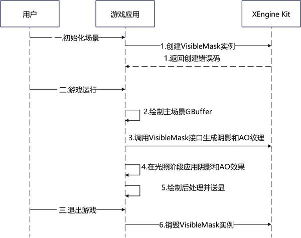

# 光线追踪阴影和环境光遮蔽

更新时间：2026-07-28 11:23:46

来源：https://developer.huawei.com/consumer/cn/doc/harmonyos-guides/xengine-kit-rt-shadow-and-ao

从6.0.0(20) 版本开始，新增光线追踪阴影和环境光遮蔽特性。

XEngine Kit VisibleMask特性提供开箱即用的光线追踪阴影和环境光遮蔽（Ray-Traced Shadow and AO）渲染能力。相比于这些效果的传统光线追踪实现方式，依托于华为马良GPU的软硬结合优化，XEngine Kit支持FERT(Flexible Entry Raytracing)求交加速技术，可以减少光线与场景几何的求交计算次数，从而降低实现高画质光追效果时的GPU负载。此外，XEngine通过高度优化的时空域降噪技术，解决光线追踪渲染时因为光线数量不足而引入的噪声问题，可以在发射较少光线数的情况下达成高画质表现，实现同等画质GPU负载更轻，同等负载下画质更好的效果。


#### 约束与限制

 - 支持的设备类型：此特性依赖设备支持Vulkan光线追踪扩展[VK_KHR_acceleration_structure](https://docs.vulkan.org/refpages/latest/refpages/source/VK_KHR_acceleration_structure.html)、[VK_KHR_ray_query](https://docs.vulkan.org/refpages/latest/refpages/source/VK_KHR_ray_query.html)。
 - 可通过以下方式查询相关扩展特性是否支持：

  对于Vulkan，使用[HMS_XEG_EnumerateDeviceExtensionProperties](https://developer.huawei.com/consumer/cn/doc/harmonyos-references/xengine-kit-xengine#hms_xeg_enumeratedeviceextensionproperties)扩展特性查询接口进行查询，如查询结果包含XEG_RT_SHADOW_AO_EXTENSION_NAME，则表示支持该特性，若查询结果未包含，则表示不支持该特性。


#### 接口说明

以下为光线追踪阴影和环境光遮蔽特性需要使用的接口，详细说明请参考[接口文档](https://developer.huawei.com/consumer/cn/doc/harmonyos-references/xengine-kit-xengine)。

**Vulkan接口：**

| 接口名 | 描述 |
| --- | --- |
| VKAPI_ATTR VkResult VKAPI_CALL HMS_XEG_EnumerateDeviceExtensionProperties (VkPhysicalDevice physicalDevice, uint32_t * pPropertyCount, XEG_ExtensionProperties * pProperties) | XEngine Vulkan扩展特性查询接口。 |
| VKAPI_ATTR VkResult VKAPI_CALL HMS_XEG_CreateRTVisibleMask (VkDevice device, const void *pCreateInfo, XEG_RTVisibleMask *pRTVisibleMask) | 创建XEG_RTVisibleMask对象。 |
| VKAPI_ATTR VkResult VKAPI_CALL HMS_XEG_CmdRenderRTVisibleMask (VkCommandBuffer commandBuffer, XEG_RTVisibleMask rtVisibleMask, const void *pDescription) | 录制光线追踪VisibleMask渲染命令。 |
| VKAPI_ATTR void VKAPI_CALL HMS_XEG_DestroyRTVisibleMask (XEG_RTVisibleMask rtVisibleMask) | 销毁XEG_RTVisibleMask对象。 |


#### 业务流程




1. 当用户进入游戏场景时，调用[HMS_XEG_EnumerateDeviceExtensionProperties](https://developer.huawei.com/consumer/cn/doc/harmonyos-references/xengine-kit-xengine#hms_xeg_enumeratedeviceextensionproperties)接口查询XEngine Kit支持的特性列表。
2. 检查返回列表中是否包含[XEG_RT_SHADOW_AO_EXTENSION_NAME](https://developer.huawei.com/consumer/cn/doc/harmonyos-references/xengine-kit-xengine#xeg_rt_shadow_ao_extension_name)。若不包含，则当前设备不支持此特性，流程终止。
3. 调用[HMS_XEG_CreateRTVisibleMask](https://developer.huawei.com/consumer/cn/doc/harmonyos-references/xengine-kit-xengine#hms_xeg_creatertvisiblemask)接口，创建VisibleMask实例。
4. 游戏运行时，每一帧先渲染主场景的G-Buffer，作为后续处理的输入数据。
5. 调用[HMS_XEG_CmdRenderRTVisibleMask](https://developer.huawei.com/consumer/cn/doc/harmonyos-references/xengine-kit-xengine#hms_xeg_cmdrenderrtvisiblemask)接口，执行生成阴影及环境光遮蔽（AO）纹理渲染指令。
6. 进入延迟渲染的光照计算阶段，采样生成的阴影与AO纹理，结合场景光照信息计算最终颜色。
7. 继续执行后处理、UI渲染等后续流程。待当前帧渲染完成后，统一调用送显操作。
8. 当游戏退出时，调用[HMS_XEG_DestroyRTVisibleMask](https://developer.huawei.com/consumer/cn/doc/harmonyos-references/xengine-kit-xengine#hms_xeg_destroyrtvisiblemask)接口，销毁步骤3中创建的VisibleMask实例，避免内存泄漏。


#### 开发步骤

本章以在Vulkan应用程序延迟渲染管线中集成为例，说明使用XEngine光线追踪阴影和环境光遮蔽特性的开发步骤。


#### 配置项目

编译HAP包时，Native层so需要依赖NDK中的XEngine相关库和头文件。

 - 头文件引用

  
```text
#include "xengine/xeg_vulkan_extension.h"
// ...
#include "xengine/xeg_vulkan_rt_visible_mask.h"
```

 - CMakeLists.txt添加库依赖

  CMakeLists.txt中添加对XEngine动态链接库依赖的代码如下。

  
```text
find_library(
    # 设置路径变量的名称。
    xengine-lib
    # 指定希望CMake定位的NDK库的名称。
    xengine
)

target_link_libraries(nativerender PUBLIC
    # ...
    ${xengine-lib}
)
```


#### 集成XEngine Kit光线追踪阴影和环境光遮蔽（Vulkan）

XEngine VisibleMask特性的光线追踪阴影（Ray-Traced Shadow，简称RTShadow）和环境光遮蔽（Ray-Traced AO，简称RTAO）效果API需要与Vulkan API延迟渲染管线配合使用。相关代码在Native层实现，渲染结果通过[XComponent](https://developer.huawei.com/consumer/cn/doc/harmonyos-references/ts-basic-components-xcomponent)组件显示到屏幕。

在调用XEngine Kit特性接口前，需要先通过[Syscap](https://developer.huawei.com/consumer/cn/doc/harmonyos-references/syscap#什么是systemcapabilitysyscap)查询确认您的目标设备支持SystemCapability.Graphic.XEngine系统能力。
1. 调用[HMS_XEG_EnumerateDeviceExtensionProperties](https://developer.huawei.com/consumer/cn/doc/harmonyos-references/xengine-kit-xengine#hms_xeg_enumeratedeviceextensionproperties)接口，获取XEngine支持的扩展信息，只有在支持[XEG_RT_SHADOW_AO_EXTENSION_NAME](https://developer.huawei.com/consumer/cn/doc/harmonyos-references/xengine-kit-xengine#xeg_rt_shadow_ao_extension_name)扩展时才可以使用光线追踪阴影和环境光遮蔽特性的接口。

  
```text
// 查询XEngine支持的Vulkan扩展列表
std::vector<std::string> supportedExtensions;
uint32_t propertyCount;
// physicalDevice为Vulkan物理设备，用户需进行初始化
HMS_XEG_EnumerateDeviceExtensionProperties(physicalDevice, &propertyCount, nullptr);
if (propertyCount > 0) {
    std::vector<XEG_ExtensionProperties> properties(propertyCount);
    if (HMS_XEG_EnumerateDeviceExtensionProperties(physicalDevice, &propertyCount, &properties.front()) ==
        VK_SUCCESS) {
        for (auto ext : properties) {
            supportedExtensions.push_back(ext.extensionName);
        }
    }
}
// 查询是否支持XEngine光线追踪阴影和环境光遮蔽特性
if (std::find(supportedExtensions.begin(), supportedExtensions.end(), XEG_RT_SHADOW_AO_EXTENSION_NAME) ==
    supportedExtensions.end()) {
    // 错误处理
    // ...
}
```

2. 调用[HMS_XEG_CreateRTVisibleMask](https://developer.huawei.com/consumer/cn/doc/harmonyos-references/xengine-kit-xengine#hms_xeg_creatertvisiblemask)接口，创建实例句柄。

  
```text
// RTShadow和RTAO初始化信息
XEG_RTShadowAOCreateInfo createInfo;
createInfo.sType = XEG_STRUCTURE_TYPE_RT_SHADOWAO_CREATE_INFO;
createInfo.pNext = nullptr;
// GBuffer图像大小，renderWidth和renderHeight分别表示渲染宽高
createInfo.rtInputGbufferSize = {renderWidth, renderHeight};
// 输出的RTShadow和RTAO图像大小，需要与GBuffer等比例
// visibleMaskWidth、visibleMaskHeight分别表示可见遮罩宽高
createInfo.rtShadowAOSize = {visibleMaskWidth, visibleMaskHeight};
createInfo.enableRTShadow = true;
createInfo.enableRTAO = true;
// 去噪器质量模式设置为质量模式
createInfo.denoiseMode = XEG_DENOISE_QUALITY_MODE_QUALITY;
// 场景遍历模式设置为默认模式
createInfo.traversalMode = XEG_TRAVERSAL_MODE_DEFAULT;
createInfo.aoOnlyInShadow = false;
createInfo.reverseZ = false;
// ...
auto start = std::chrono::high_resolution_clock::now();
// device为当前应用程序的Vulkan设备对象，需用户进行初始化
VkResult ret = HMS_XEG_CreateRTVisibleMask(device, &createInfo, &rtVisibleMaskQuality);
if (ret != VK_SUCCESS) {
    // 错误处理
    // ...
}
```

3. 调用[HMS_XEG_CmdRenderRTVisibleMask](https://developer.huawei.com/consumer/cn/doc/harmonyos-references/xengine-kit-xengine#hms_xeg_cmdrenderrtvisiblemask)接口执行渲染命令，每帧都需要调用。

  
```text
// RTShadow算法参数设置
XEG_RTShadowParameters shadowParameters;
// RTAO算法参数设置
XEG_RTAOParameters aoParameters;
// 去噪器参数设置
XEG_RTShadowAODenoiserParameters denoiserParameters;

shadowParameters.rayTMax = 200.0f;
shadowParameters.rayTMin = 1.0f;
// m_lightDir表示光线方向
shadowParameters.sunDirection[0] = m_lightDir.x;
shadowParameters.sunDirection[1] = m_lightDir.y;
shadowParameters.sunDirection[2] = m_lightDir.z;
shadowParameters.raySourceAngleInDegree = 1.0f;
shadowParameters.shadowCullMask = 0x5FF;
shadowParameters.shadowCullDistance = 500.0f;

aoParameters.rayTMax = 5.0f;
aoParameters.rayTMin = 0.01f;
aoParameters.aoIntensity = 0.5f;
aoParameters.aoNormalBias = 0.5f;
aoParameters.aoCullMask = 0x5FF;
aoParameters.aoCullDistance = 500.0f;
    
// 混合权重
denoiserParameters.temporalBlendFactor = 0.075f;
denoiserParameters.positionConstantDistance = 2.0f;
denoiserParameters.spatialDenoiseTimes = 2;
denoiserParameters.ghostingAlpha = 0.05;
denoiserParameters.spatialNormalWeight = 1.0f;
denoiserParameters.spatialMaxKernelStep = 1;

// RTShadow和RTAO渲染输入信息
XEG_RTShadowAODescription description;
description.sType = XEG_STRUCTURE_TYPE_RT_SHADOWAO_DESCRIPTION;
description.pNext = nullptr;
// inputDepthView是GBuffer深度图像的VkImageView，需要用户进行初始化
description.inputDepthImage = inputDepthView;
// inputNormalView是GBuffer法线图像的VkImageView，需要用户进行初始化，关于法线的格式和编码详见API参考
description.inputNormalImage = inputNormalView;
description.inputMotionVectorImage = VK_NULL_HANDLE;
// outputShadowAOView是保存XEngine RTShadow和RTAO渲染输出的VkImageView，需要用户进行初始化
description.outputShadowAOImage = outputShadowAOView;
// accelerationStructureBuilder.getTlas()是场景的Top Level光线追踪加速结构，需要用户进行初始化
description.accelerationStructure = accelerationStructureBuilder.getTlas();
// worldCameraOrigin表示相机实际位置
glm::vec3 worldCameraOrigin = camera.position;
// 以相机实际位置的x坐标为准
description.worldCameraOrigin[0] = worldCameraOrigin.x;
// 以相机实际位置的y坐标为准
description.worldCameraOrigin[1] = worldCameraOrigin.y;
// 以相机实际位置的z坐标为准
description.worldCameraOrigin[2] = worldCameraOrigin.z;

description.pRtShadowParameters = &shadowParameters;
description.pRtAOParameters = &aoParameters;
description.pRtShadowAODenoiserParameters = &denoiserParameters;
GlmMatrix4ToFloat16(description.viewMatrix, camera.matrices.view);
GlmMatrix4ToFloat16(description.projectionMatrix, camera.matrices.perspective);
XEG_RTVisibleMask visibleMaskHandle = rtVisibleMaskQuality;
if (IsVisibleMaskPerformanceMode()) {
    visibleMaskHandle = rtVisibleMaskPerformance;
}
// drawCmdBuffers[currentBuffer]命令缓冲区，需要用户进行初始化
VkResult res = HMS_XEG_CmdRenderRTVisibleMask(drawCmdBuffers[currentBuffer], visibleMaskHandle, &description);
if (res != VK_SUCCESS) {
    // 错误处理
    // ...
}
```

```text
for (uint32_t i = 0; i < images.size(); i++) {

    // 设置Pipeline Barrier以同步对RTShadow和RTAO渲染输出的读取
    VkImageMemoryBarrier imageMemoryBarrier;
    imageMemoryBarrier.sType = VK_STRUCTURE_TYPE_IMAGE_MEMORY_BARRIER;
    imageMemoryBarrier.pNext = nullptr;
    imageMemoryBarrier.srcAccessMask = VK_ACCESS_SHADER_WRITE_BIT;
    // 根据实际访问方式设置
    imageMemoryBarrier.dstAccessMask = VK_ACCESS_SHADER_READ_BIT;
    imageMemoryBarrier.oldLayout = VK_IMAGE_LAYOUT_UNDEFINED;
    imageMemoryBarrier.newLayout = VK_IMAGE_LAYOUT_SHADER_READ_ONLY_OPTIMAL;
    imageMemoryBarrier.srcQueueFamilyIndex = VK_QUEUE_FAMILY_IGNORED;
    imageMemoryBarrier.dstQueueFamilyIndex = VK_QUEUE_FAMILY_IGNORED;
    // images[i]是保存RTShadow和RTAO渲染输出的VkImage，需要用户进行初始化
    imageMemoryBarrier.image = images[i];
    imageMemoryBarrier.subresourceRange.aspectMask = aspectMask;
    imageMemoryBarrier.subresourceRange.baseMipLevel = 0;
    imageMemoryBarrier.subresourceRange.levelCount = 1;
    imageMemoryBarrier.subresourceRange.baseArrayLayer = 0;
    imageMemoryBarrier.subresourceRange.layerCount = 1;
    imageMemoryBarriers.emplace_back(imageMemoryBarrier);
}
// 根据实际访问stage设置
vkCmdPipelineBarrier(commandBuffer, srcStage, dstStage, 0, 0,
    nullptr, 0, nullptr, imageMemoryBarriers.size(), imageMemoryBarriers.data());
```
应用RTShadow和RTAO输出的outputShadowAOImage贴图到光照计算过程中，计算着色点颜色时的Shader片段示例：

  
```text
// 光照片段着色器代码示例
// textureRayTracingOutputShadowAO需要绑定为RTShadow和RTAO的输出图像
layout (binding = 0) uniform sampler2D textureRayTracingOutputShadowAO;

// color为当前着色点不考虑阴影和环境光遮蔽时的颜色值
vec3 color;
// 用户的着色点颜色计算过程
// ...
// 采样阴影和环境光遮蔽纹理，TexCoords为当前采样点的UV坐标。
vec2 shadowAO = texture(textureRayTracingOutputShadowAO, TexCoords).xy;
float shadow = shadowAO.x;
float ao = shadowAO.y;
// finalColor为最终颜色值
vec3 finalColor = color * pow(ao, 2.0) * shadow;
```

4. 调用[HMS_XEG_DestroyRTVisibleMask](https://developer.huawei.com/consumer/cn/doc/harmonyos-references/xengine-kit-xengine#hms_xeg_destroyrtvisiblemask)接口销毁特性实例句柄以释放资源，在不需要再使用特性或应用退出时需要调用。

  
```text
HMS_XEG_DestroyRTVisibleMask(rtVisibleMaskQuality);
```
