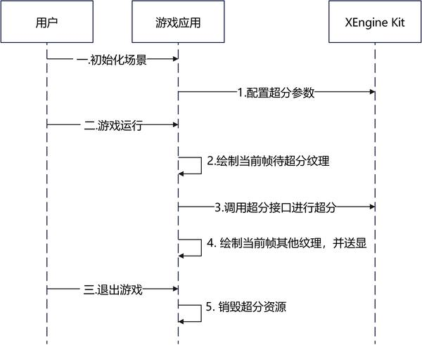

# 时域AI超分

更新时间：2026-07-28 11:23:46

来源：https://developer.huawei.com/consumer/cn/doc/harmonyos-guides/xengine-kit-ai-temporal-upscaling

从6.0.0(20) 版本开始，新增支持OpenGL ES协议。

XEngine Kit提供时域AI超分特性，利用相机的抖动获取不同位置的采样信息，融合时域实现超采样率和超分辨率功能，并利用神经网络达到抗锯齿效果，建议超分倍率为[1.25, 2.0]。


#### 约束与限制

 - 支持的设备类型：Phone，从5.1.0(18)版本开始新增支持Tablet、PC/2in1设备，从5.1.1(19)版本开始新增支持TV设备。
 - 可通过以下方式查询相关扩展特性是否支持：

  
对于OpenGL ES，使用[HMS_XEG_GetString](https://developer.huawei.com/consumer/cn/doc/harmonyos-references/xengine-kit-xengine#hms_xeg_getstring)扩展特性查询接口进行查询。
 - 对于Vulkan，使用[HMS_XEG_EnumerateDeviceExtensionProperties](https://developer.huawei.com/consumer/cn/doc/harmonyos-references/xengine-kit-xengine#hms_xeg_enumeratedeviceextensionproperties)扩展特性查询接口进行查询。


如查询结果包含[XEG_TEMPORAL_UPSCALE_EXTENSION_NAME](https://developer.huawei.com/consumer/cn/doc/harmonyos-references/xengine-kit-xengine#xeg_temporal_upscale_extension_name)，则表示支持该特性，若查询结果未包含，则表示不支持该特性。


#### 接口说明

以下接口为OpenGL ES和Vulkan时域AI超分设置接口，如需使用更丰富的设置和查询接口，具体API说明详见[接口文档](https://developer.huawei.com/consumer/cn/doc/harmonyos-references/xengine-kit-xengine)。

| 接口名 | 描述 |
| --- | --- |
| const GLubyte * HMS_XEG_GetString (GLenum name) | XEngine OpenGL ES扩展特性查询接口。 |
| GL_APICALL void GL_APIENTRY HMS_XEG_TemporalUpscaleParameter(GLenum pname, const GLvoid *param) | 设置时域AI超分输入参数。 |
| GL_APICALL void GL_APIENTRY HMS_XEG_RenderTemporalUpscale( GLuint inputTexture, GLuint depthTexture, GLuint motionVectorTexture, GLuint dynamicMaskTexture, GLfloat jitterX, GLfloat jitterY ) | 录制时域AI超分渲染命令。 |
| VKAPI_ATTR VkResult VKAPI_CALL HMS_XEG_EnumerateDeviceExtensionProperties (VkPhysicalDevice physicalDevice, uint32_t * pPropertyCount, XEG_ExtensionProperties * pProperties) | XEngine Vulkan扩展特性查询接口。 |
| VKAPI_ATTR VkResult VKAPI_CALL HMS_XEG_CreateTemporalUpscale (VkDevice device, XEG_TemporalUpscaleCreateInfo * pTemporalUpscaleInfo, XEG_TemporalUpscale * pTemporalUpscale) | 创建XEG_TemporalUpscale对象。 |
| VKAPI_ATTR void VKAPI_CALL HMS_XEG_CmdRenderTemporalUpscale (VkCommandBuffer commandBuffer, XEG_TemporalUpscale temporalUpscale, XEG_TemporalUpscaleDescription * pDescription) | 录制时域AI超分渲染命令。 |
| VKAPI_ATTR void VKAPI_CALL HMS_XEG_DestroyTemporalUpscale (XEG_TemporalUpscale temporalUpscale) | 销毁XEG_TemporalUpscale对象。 |


#### 业务流程

 - 下面是基于OpenGL ES图形API平台集成时域AI超分的主要业务流程

  



1. 在游戏初始化阶段，调用[HMS_XEG_GetString](https://developer.huawei.com/consumer/cn/doc/harmonyos-references/xengine-kit-xengine#hms_xeg_getstring)接口查询XEngine Kit支持的特性列表。检查返回列表中是否包含[XEG_TEMPORAL_UPSCALE_EXTENSION_NAME](https://developer.huawei.com/consumer/cn/doc/harmonyos-references/xengine-kit-xengine#xeg_temporal_upscale_extension_name)。若不包含，则当前设备不支持此特性，流程终止。
2. 调用[HMS_XEG_TemporalUpscaleParameter](https://developer.huawei.com/consumer/cn/doc/harmonyos-references/xengine-kit-xengine#hms_xeg_temporalupscaleparameter)接口配置超分相关参数。
3. 游戏运行时，首先渲染待超分的当前帧纹理。此阶段需完成包含Jitter的主Pass渲染，并确保Depth、Motion Vector和Color等输入纹理已准备就绪。
4. 当待超分纹理渲染完成后，调用[HMS_XEG_RenderTemporalUpscale](https://developer.huawei.com/consumer/cn/doc/harmonyos-references/xengine-kit-xengine#hms_xeg_rendertemporalupscale)接口对纹理执行时域AI超分处理。
5. 超分完成后，继续渲染剩余纹理，如UI等。全部渲染结束后，进行帧送显。
6. 游戏退出时，XEngine Kit会自动释放超分相关资源，无需手动管理。

 - 下面是基于Vulkan图形API平台集成时域AI超分的主要业务流程

  


1. 用户进入游戏初始化场景时，调用[HMS_XEG_EnumerateDeviceExtensionProperties](https://developer.huawei.com/consumer/cn/doc/harmonyos-references/xengine-kit-xengine#hms_xeg_enumeratedeviceextensionproperties)接口查询XEngine Kit支持的特性列表。检查返回列表中是否包含[XEG_TEMPORAL_UPSCALE_EXTENSION_NAME](https://developer.huawei.com/consumer/cn/doc/harmonyos-references/xengine-kit-xengine#xeg_temporal_upscale_extension_name)。若不包含，则当前设备不支持此特性，流程终止。
2. 调用[HMS_XEG_CreateTemporalUpscale](https://developer.huawei.com/consumer/cn/doc/harmonyos-references/xengine-kit-xengine#hms_xeg_createtemporalupscale)接口创建时域AI超分实例。
3. 游戏运行过程中，渲染当前待超分的帧纹理。
4. 待超分纹理渲染完成（即带jitter的主pass渲染结束，且depth、motion vector、color等输入纹理准备就绪）后，调用[HMS_XEG_CmdRenderTemporalUpscale](https://developer.huawei.com/consumer/cn/doc/harmonyos-references/xengine-kit-xengine#hms_xeg_cmdrendertemporalupscale)接口执行超分处理。
5. 超分渲染完成后，继续渲染剩余纹理（如UI等），渲染结束后进行画面送显。
6. 游戏退出时，调用[HMS_XEG_DestroyTemporalUpscale](https://developer.huawei.com/consumer/cn/doc/harmonyos-references/xengine-kit-xengine#hms_xeg_destroytemporalupscale)接口销毁超分实例。


#### 开发步骤

本章以OpenGL ES和Vulkan图像API集成为例，说明XEngine Kit集成操作过程。


#### 配置项目

编译HAP包时，Native层so编译需要依赖NDK中的libxengine.so。

 - 头文件引用

  若需使用OpenGL ES时域AI超分特性，请引入以下头文件。

  
```text
#include "xengine/xeg_gles_extension.h"
// ...
#include "xengine/xeg_gles_temporal_upscale.h"
```
若需使用Vulkan时域AI超分特性，请引入以下头文件。

  
```text
#include "xengine/xeg_vulkan_extension.h"
// ...
#include "xengine/xeg_vulkan_temporal_upscale.h"
```

 - 编写CMakeLists.txt

  若需使用OpenGL ES时域AI超分特性，请引用XEngine Kit的CMakeLists，CMakeLists.txt部分示例代码如下：

  
```text
find_library(
    # 设置路径变量的名称。
    EGL-lib
    # 指定希望CMake定位的NDK库的名称。
    EGL
)

find_library(
    # 设置路径变量的名称。
    GLES-lib
    # 指定希望CMake定位的NDK库的名称。
    GLESv3
)

find_library(
    # 设置路径变量的名称。
    xengine-lib
    # 指定希望CMake定位的NDK库的名称。
    xengine
)
# ...
target_link_libraries(nativerender PUBLIC
    ${EGL-lib} ${GLES-lib} ${xengine-lib}
    # ...
)
```
若需使用Vulkan时域AI超分特性，请引用XEngine Kit的CMakeLists，CMakeLists.txt部分示例代码如下，完整示例代码请参见[Demo（GPU加速引擎-Vulkan）](https://gitcode.com/harmonyos_samples/xengine-samplecode-vulkan-temporal-upscale-demo-cpp)。

  
```text
find_library(
    # 设置路径变量的名称。
    hilog-lib
    # 指定希望CMake定位的NDK库的名称。
    hilog_ndk.z
)

find_library(
    # 设置路径变量的名称。
    libace-lib
    # 指定希望CMake定位的NDK库的名称。
    ace_ndk.z
)

find_library(
    # 设置路径变量的名称。
    libnapi-lib
    # 指定希望CMake定位的NDK库的名称。
    ace_napi.z
)

find_library(
    # 设置路径变量的名称。
    libuv-lib
    # 指定希望CMake定位的NDK库的名称。
    uv
)

# ...

add_library(libassimp SHARED IMPORTED)
set_target_properties(
        libassimp
        PROPERTIES
        IMPORTED_LOCATION
        ${CMAKE_CURRENT_SOURCE_DIR}/libs/arm64-v8a/libassimp.so
)
target_link_libraries(nativerender PUBLIC
    ${hilog-lib} ${libace-lib} ${libnapi-lib} ${libuv-lib} libnative_window.so libc++.a libktx librawfile.z.so libassimp ${xengine-lib}
)
```


#### 集成XEngine时域AI超分（OpenGL ES）

使用EGL和OpenGL ES图形API搭建图像渲染管线并集成时域AI超分在Native层实现，渲染结果通过[XComponent](https://developer.huawei.com/consumer/cn/doc/harmonyos-references/ts-basic-components-xcomponent)组件显示到屏幕。

本节阐述OpenGL ES图形API的时域AI超分的使用。

在调用XEngine Kit能力前，需要先通过[Syscap](https://developer.huawei.com/consumer/cn/doc/harmonyos-references/syscap#什么是systemcapabilitysyscap)查询您的目标设备是否支持SystemCapability.Graphic.XEngine系统能力。
1. 调用[HMS_XEG_GetString](https://developer.huawei.com/consumer/cn/doc/harmonyos-references/xengine-kit-xengine#hms_xeg_getstring)接口，获取XEngine支持的扩展信息，只有在支持[XEG_TEMPORAL_UPSCALE_EXTENSION_NAME](https://developer.huawei.com/consumer/cn/doc/harmonyos-references/xengine-kit-xengine#xeg_temporal_upscale_extension_name)扩展时才可以使用时域AI超分的相关接口。

  
```text
// 查询XEngine支持的GLES扩展信息
std::string extensionStr = (const char*)HMS_XEG_GetString(XEG_EXTENSIONS);
std::vector<std::string> extensions;
std::istringstream istringstream(extensionStr);
std::string word;
while (istringstream >> word) {
    extensions.push_back(word);
}
    
// ...
    
// 查询是否支持时域AI超分
if (std::find(extensions.begin(), extensions.end(), XEG_TEMPORAL_UPSCALE_EXTENSION_NAME) != extensions.end()) {
    // 正常业务逻辑
    // ...
} else {
    // 错误处理
    // ...
}
```

2. 调用[HMS_XEG_TemporalUpscaleParameter](https://developer.huawei.com/consumer/cn/doc/harmonyos-references/xengine-kit-xengine#hms_xeg_temporalupscaleparameter)接口，对时域AI超分的参数赋值。

  
```text
// m_lowResWidth与m_lowResHeight分别为用户自定义的渲染宽度与渲染高度
GLsizei inputeSize[2] = {static_cast<GLsizei>(m_lowResWidth), static_cast<GLsizei>(m_lowResHeight)};
// 设置超分输入纹理的真实宽高
HMS_XEG_TemporalUpscaleParameter(XEG_TEMPORAL_UPSCALE_INPUT_SIZE, inputeSize);
// 设置相机抖动的周期数，此处以8为例
GLuint jitterNum = 8;
HMS_XEG_TemporalUpscaleParameter(XEG_TEMPORAL_UPSCALE_JITTER_NUM, &jitterNum);
// 设置是否存在深度反转，此处为不存在深度反转
GLboolean isDepthReversed = GL_FALSE;
HMS_XEG_TemporalUpscaleParameter(XEG_TEMPORAL_UPSCALE_DEPTH_REVERSED, &isDepthReversed);
// 设置是否重置历史帧数据，true表示重置，false表示不重置。在历史帧未使用超分，并且当前帧开始使用超分的情况下建议设置为true
GLboolean resetHistory = GL_TRUE;
HMS_XEG_TemporalUpscaleParameter(XEG_TEMPORAL_UPSCALE_RESET_HISTORY, &resetHistory);
// 设置画面偏向当前帧（鬼影少但可能存在闪烁）还是历史帧（鬼影多但是更稳定）的平衡程度。此处以0.5为例
GLfloat steadyLevel = 0.5;
HMS_XEG_TemporalUpscaleParameter(XEG_TEMPORAL_UPSCALE_STEADY_LEVEL, &steadyLevel);
```

3. 调用[HMS_XEG_RenderTemporalUpscale](https://developer.huawei.com/consumer/cn/doc/harmonyos-references/xengine-kit-xengine#hms_xeg_rendertemporalupscale)接口进行超分，每帧都需要调用。

  其中，参数jitterX和jitterY分别为相机在X方向和Y方向的抖动，是一个类似Halton的低差异序列。

  本例使用Halton算法计算Jitter值：使用Halton算法生成一个[0.0, 1.0]的序列，再减去0.5使序列范围保持在[-0.5, 0.5]，最后除以输入图像的分辨率，得到UV坐标下的Jitter值。

  
 - 根据Halton算法生成每帧需要的相机抖动（Jitter）。

  
```text
// Halton算法示例
float Model3DSponza::GetHaltonSequence(uint32_t index, uint32_t base)
{
    float result = 0.0;
    float fraction = 1.0 / base;

    while (index > 0) {
        result += fraction * (index % base);
        index /= base;
        fraction /= base;
    }
    return result;
}
```

```text
// frameNum当前帧数，需要每帧+1，用于确定当前帧使用的Jitter值，使Jitter值在JitterNum范围内轮转
jitterX = GetHaltonSequence((frameNum % jitterNum) + 1, 2) - 0.5;
jitterY = GetHaltonSequence((frameNum % jitterNum) + 1, 3) - 0.5;
// jitterX与jitterY分别为相机在X和Y方向上的抖动
// u = u‘ - 0.5 * jitterX
jitterX = jitterX / m_lowResWidth;
// v = v' - 0.5 * jitterY
jitterY = jitterY / m_lowResHeight;
```


4. 调用时域AI超分渲染接口。

  
```text
// 这里表示第一帧使用超分的情况下设置resetHistory为true，否则设置为false
HMS_XEG_TemporalUpscaleParameter(XEG_TEMPORAL_UPSCALE_RESET_HISTORY, &resetHistory);

// m_upscaleFBO为用户自定义创建的超分后的framebuffer
// m_highResWidth和m_highResHeight分别为用户自定义超分宽度和超分高度
glBindFramebuffer(GL_FRAMEBUFFER, m_upscaleFBO);
glViewport(0, 0, m_highResWidth, m_highResHeight);
glScissor(0, 0, m_highResWidth, m_highResHeight);
// m_lowLightColorTexture为超分输入纹理。
// m_lowGboDepth为深度纹理。
// m_motionVectorTexture为运动矢量图像。运动矢量的计算方式为当前渲染像素的NDC坐标的XY值减去上一帧的NDC坐标的XY值。
// m_dynamicMaskTexture为物体的动态遮罩图像，格式需要是GL_RED或其兼容格式。R通道的合法值为0.0、0.2或1.0，其中0.0表示静态物体，0.2表示运动物体如人物，1.0表示特效或半透明物体。
// jitterX 相机在X方向上的抖动，通常为超分依赖的前序渲染过程中应用的亚像素抖动，包含在相机的投影矩阵中；
// 在ndc坐标系下，其取值范围是 [-1/width, 1/width], width是输入inputTexture纹理的宽度（像素数）。
// jitterY 相机在Y方向上的抖动，通常为超分依赖的前序渲染过程中应用的亚像素抖动，包含在相机的投影矩阵中；
// 在ndc坐标系下，其取值范围是 [-1/height, 1/height], height是输入inputTexture纹理的高度（像素数）。
HMS_XEG_RenderTemporalUpscale(m_lowLightColorTexture, m_lowGboDepth, m_motionVectorTexture, m_dynamicMaskTexture,
                              -0.5 * jitterX, -0.5 * jitterY);
```


#### 集成XEngine时域AI超分（Vulkan）

使用Vulkan图形API搭建图像渲染管线，并集成时域AI超分在Native层实现，渲染结果通过[XComponent](https://developer.huawei.com/consumer/cn/doc/harmonyos-references/ts-basic-components-xcomponent)组件显示到屏幕。

本节阐述Vulkan图形API的时域AI超分使用，详细代码请参见[Samplecode](https://gitcode.com/harmonyos_samples/xengine-samplecode-vulkan-temporal-upscale-demo-cpp)。

在调用XEngine Kit能力前，需要先通过[Syscap](https://developer.huawei.com/consumer/cn/doc/harmonyos-references/syscap#什么是systemcapabilitysyscap)查询您的目标设备是否支持SystemCapability.Graphic.XEngine系统能力。
1. 调用[HMS_XEG_EnumerateDeviceExtensionProperties](https://developer.huawei.com/consumer/cn/doc/harmonyos-references/xengine-kit-xengine#hms_xeg_enumeratedeviceextensionproperties)接口，获取XEngine支持的扩展信息，只有在支持[XEG_TEMPORAL_UPSCALE_EXTENSION_NAME](https://developer.huawei.com/consumer/cn/doc/harmonyos-references/xengine-kit-xengine#xeg_temporal_upscale_extension_name)扩展时才可以使用时域AI超分的相关接口。

  
```text
// 查询XEngine支持的Vulkan扩展列表
std::vector<std::string> supportedExtensions;
uint32_t pPropertyCount;
// physicalDevice为Vulkan物理设备，用户需进行初始化
HMS_XEG_EnumerateDeviceExtensionProperties(physicalDevice, &pPropertyCount, nullptr);
if (pPropertyCount > 0) {
    std::vector<XEG_ExtensionProperties> pProperties(pPropertyCount);
    if (HMS_XEG_EnumerateDeviceExtensionProperties(physicalDevice, &pPropertyCount,
        &pProperties.front()) == VK_SUCCESS) {
        for (auto ext : pProperties) {
            supportedExtensions.push_back(ext.extensionName);
        }
    }
}
// ...
// 查询是否支持时域AI超分
if (std::find(supportedExtensions.begin(), supportedExtensions.end(), XEG_TEMPORAL_UPSCALE_EXTENSION_NAME) ==
    supportedExtensions.end()) {
    // 错误处理
    // ...
}
```

2. 声明实例句柄。

  
```text
XEG_TemporalUpscale xegTemporalUpscale = nullptr;
```

3. 调用[HMS_XEG_CreateTemporalUpscale](https://developer.huawei.com/consumer/cn/doc/harmonyos-references/xengine-kit-xengine#hms_xeg_createtemporalupscale)接口，创建时域AI超分实例。

  
```text
// lowResWidth与lowResHeight为用户可以自定义渲染宽高
VkRect2D srcRect2D;
srcRect2D.offset.x = 0;
srcRect2D.offset.y = 0;
srcRect2D.extent.width = lowResWidth;
srcRect2D.extent.height = lowResHeight;
// highResWidth与highResHeight为用户可以自定义超分后宽高
VkRect2D dstRect2D;
dstRect2D.offset.x = 0;
dstRect2D.offset.y = 0;
dstRect2D.extent.width = highResWidth;
dstRect2D.extent.height = highResHeight;
// XEG_TemporalUpscaleCreateInfo为创建XEG_TemporalUpscale对象所需信息
XEG_TemporalUpscaleCreateInfo createInfo;
// 指定输入图像的大小，即低分辨率图像的尺寸
createInfo.inputSize = srcRect2D.extent;
// 指定输出图像的大小，即高分辨率图像的尺寸
createInfo.outputSize = dstRect2D.extent;
createInfo.outputRegion = dstRect2D;
// 指定输出图像的颜色格式
createInfo.outputFormat = VK_FORMAT_R8G8B8A8_UNORM;
// jitterNum为相机抖动的周期数
createInfo.jitterNum = jitterNum;
// 指定了深度值是否反转
createInfo.isDepthReversed = false;
// device逻辑设备，用户需进行初始化
VkResult res = HMS_XEG_CreateTemporalUpscale(device, &createInfo, &xegTemporalUpscale);
if (res != VK_SUCCESS) {
    // 错误处理
    // ...
}
```

4. 调用[HMS_XEG_CmdRenderTemporalUpscale](https://developer.huawei.com/consumer/cn/doc/harmonyos-references/xengine-kit-xengine#hms_xeg_cmdrendertemporalupscale)接口下发超分，每帧都需要调用。

  其中，参数jitterX和jitterY分别为相机在X方向和Y方向的抖动，是一个类似Halton的低差异序列。

  本例使用Halton算法计算Jitter值：使用Halton算法生成一个[0.0, 1.0]的序列，再减去0.5使序列范围保持在[-0.5, 0.5]，最后除以输入图像的分辨率，得到UV坐标下的Jitter值。

  
 - 根据Halton算法生成每帧需要的相机抖动（Jitter）。

  
```text
float VulkanExample::GetHaltonSequence(uint32_t index, uint32_t base)
{
    float result = 0.0;
    float fraction = 1.0 / base;

    while (index > 0) {
        result += fraction * (index % base);
        index /= base;
        fraction /= base;
    }
    return result;
}
```


5. 调用时域AI超分渲染接口。

  
```text
// 定义XEG_TemporalUpscaleDescription对象xegDescription
XEG_TemporalUpscaleDescription xegDescription;
// inputColorView为用户创建的超分输入图像的VkImageView
xegDescription.inputImage = inputColorView;
// inputDepthView为用户创建的深度图像的VkImageView
xegDescription.depthImage = inputDepthView;
// inputMotionVectorImageView为用户创建的运动矢量图像的VkImageView
xegDescription.motionVectorImage = inputMotionVectorImageView;
// inputDynamicMaskView为用户创建的物体动态遮罩图像的VkImageView
xegDescription.dynamicMaskImage = inputDynamicMaskView;
// outputColorView为用户创建的超分输出图像的VkImageView
xegDescription.outputImage = outputColorView;
// 此处需要保证生成的低差异序列长度与jitterNum保持一致，且在[-0.5, 0.5]的范围内
xegDescription.jitterX = -jitterX;
xegDescription.jitterY = -jitterY;
// xegDescription.resetHistory为选择是否重置历史帧数据，true表示重置，false则表示不重置
xegDescription.resetHistory = (frameNum == 0) ? true : false;
// xegDescription.steadyLevel为画面偏向当前帧还是历史帧的平衡程度，取值范围为[0.0, 1.0]，此处以平衡程度为0.5为例
xegDescription.steadyLevel = 0.5;
// drawCmdBuffers[currentBuffer]为命令缓冲区，用户需进行初始化
HMS_XEG_CmdRenderTemporalUpscale(drawCmdBuffers[currentBuffer], xegTemporalUpscale, &xegDescription);
```

 - 调用[HMS_XEG_DestroyTemporalUpscale](https://developer.huawei.com/consumer/cn/doc/harmonyos-references/xengine-kit-xengine#hms_xeg_destroytemporalupscale)接口销毁实例。

  
```text
HMS_XEG_DestroyTemporalUpscale(xegTemporalUpscale);
```
