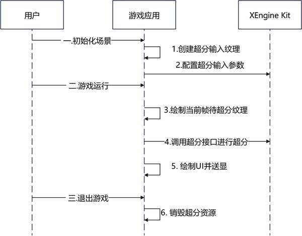

# 空域AI超分

更新时间：2026-05-26 06:48:54

来源：https://developer.huawei.com/consumer/cn/doc/harmonyos-guides/xengine-kit-ai-spatial-upscaling

XEngine Kit提供空域AI超分能力，基于单帧图像使用AI推理生成滤波参数进行超采样，通过GPU、NPU协同工作，实现比空域GPU超分更好的画质，建议超分倍率在1.5倍以下时使用。


#### 约束与限制

 - 支持的设备类型：Phone，从5.1.0(18)版本开始新增支持Tablet、PC/2in1设备，从5.1.1(19)版本开始新增支持TV设备。
 - 可通过以下方式查询相关扩展特性是否支持：

  
对于OpenGL ES，使用[HMS_XEG_GetString](https://developer.huawei.com/consumer/cn/doc/harmonyos-references/xengine-kit-xengine#hms_xeg_getstring)扩展特性查询接口进行查询。


对于OpenGL ES，使用[HMS_XEG_GetString](https://developer.huawei.com/consumer/cn/doc/harmonyos-references/xengine-kit-xengine#hms_xeg_getstring)扩展特性查询接口进行查询，如查询结果包含[XEG_NEURAL_UPSCALE_EXTENSION_NAME](https://developer.huawei.com/consumer/cn/doc/harmonyos-references/xengine-kit-xengine#xeg_neural_upscale_extension_name)，则表示支持该特性，若查询结果未包含，则表示不支持该特性。


#### 接口说明

以下接口为OpenGL ES空域AI超分设置接口，如需使用更丰富的设置和查询接口，具体API说明详见[接口文档](https://developer.huawei.com/consumer/cn/doc/harmonyos-references/xengine-kit-xengine)。

| 接口名 | 描述 |
| --- | --- |
| const GLubyte * HMS_XEG_GetString (GLenum name) | XEngine OpenGL ES扩展特性查询接口。 |
| GL_APICALL void GL_APIENTRY HMS_XEG_NeuralUpscaleParameter (GLenum pname, GLvoid * param) | 设置空域AI超分输入参数。 |
| GL_APICALL void GL_APIENTRY HMS_XEG_RenderNeuralUpscale (GLuint inputTexture) | 执行空域AI超分渲染命令。 |


#### 业务流程

 - 下面是基于OpenGL ES图形API平台集成空域AI超分的主要业务流程

  



1. 用户在进入游戏初始化场景时调用HMS_XEG_GetString接口查询XEngine支持的特性，当查询接口返回支持的特性列表中包含空域AI超分时代表可以使用此特性。
2. 初始化场景，空域AI超分的输入纹理需要使用OH_NativeBuffer来创建。
3. 调用HMS_XEG_NeuralUpscaleParameter接口配置超分参数，包含超分输入纹理对应的OH_NativeBuffer句柄。
4. 游戏运行时，每帧先渲染待超分的纹理。
5. 调用HMS_XEG_RenderNeuralUpscale接口执行超分，超分结果会写出到当前绑定的帧缓冲。
6. 渲染后续流程，如UI。
7. 当前帧已全部渲染完成，进行送显。
8. 当游戏退出时，释放游戏创建的资源，XEngine内部资源会自行释放。


#### 开发步骤

本章以OpenGL ES图像API集成为例，说明XEngine集成操作过程。


#### 配置项目

编译HAP时，Native层so编译需要依赖NDK中的libxengine.so。

 - 头文件引用

  
```text
#include <cstring>
#include <cstdlib>
#include <EGL/egl.h>
#include <EGL/eglext.h>
#include <GLES2/gl2.h>
#include <GLES2/gl2ext.h>
#include <xengine/xeg_gles_extension.h>
#include <xengine/xeg_gles_neural_upscale.h>
#include <native_buffer/native_buffer.h>
#include <native_window/external_window.h>
```

 - 编写CMakeLists.txt

  CMakeLists.txt部分示例代码如下，完整示例代码请参见[Demo（GPU加速引擎-GLES）](https://gitcode.com/harmonyos_samples/xengine-samplecode-gles-demo-cpp)。

  
```text
find_library(
    # 设置路径变量的名称。
    native-buffer-lib
    # 指定希望CMake定位的NDK库的名称。
    native_buffer
)
find_library(
    # 设置路径变量的名称。
    native-window-lib
    # 指定希望CMake定位的NDK库的名称。
    native_window
)
find_library(
    # 设置路径变量的名称。
    xengine-lib
    # 指定希望CMake定位的NDK库的名称。
    xengine
)
find_library(
    # 设置路径变量的名称。
    EGL-lib
    # 指定希望CMake定位的NDK库的名称。
    EGL
)
find_library(
    # 设置路径变量的名称。
    GLES-lib
    # 指定希望CMake定位的NDK库的名称。
    GLESv3
)

target_link_libraries(nativerender PUBLIC
${EGL-lib} ${GLES-lib} ${xengine-lib} ${native-window-lib} ${native-buffer-lib})
```


#### 集成XEngine空域AI超分（OpenGL ES）

Native层实现使用OpenGL ES和XEngine图形API搭建图像渲染管线并集成空域AI超分，渲染结果通过[XComponent](https://developer.huawei.com/consumer/cn/doc/harmonyos-references/ts-basic-components-xcomponent)组件显示到屏幕。

本节阐述OpenGL ES图形API的空域AI超分的使用，详细代码请参见[Demo（GPU加速引擎-GLES）](https://gitcode.com/harmonyos_samples/xengine-samplecode-gles-demo-cpp)。

在调用XEngine Kit能力前，需要先通过[Syscap](https://developer.huawei.com/consumer/cn/doc/harmonyos-references/syscap#什么是systemcapabilitysyscap)查询您的目标设备是否支持SystemCapability.Graphic.XEngine系统能力。
1. 调用[HMS_XEG_GetString](https://developer.huawei.com/consumer/cn/doc/harmonyos-references/xengine-kit-xengine#hms_xeg_getstring)接口，获取XEngine支持的扩展信息，只有在支持[XEG_NEURAL_UPSCALE_EXTENSION_NAME](https://developer.huawei.com/consumer/cn/doc/harmonyos-references/xengine-kit-xengine#xeg_neural_upscale_extension_name)扩展时才可以使用空域AI超分的相关接口。

  
```text
// 查询XEngine支持的GLES扩展信息
const char* extensions = (const char*)HMS_XEG_GetString(XEG_EXTENSIONS);
// 检查是否支持空域AI超分
if (!strstr(extensions, XEG_NEURAL_UPSCALE_EXTENSION_NAME)) {
    exit(1); // return error
}
```

2. 创建输入纹理，并关联一个OH_NativeBuffer。

  
```text
// 渲染宽高和送显宽高均为用户自定义参数，这里以将800*600的分辨率进行1.5倍超分到1200*900的分辨率为例
uint32_t renderWidth = 800;
uint32_t renderHeight = 600;
uint32_t displayWidth = 1200;
uint32_t displayHeight = 900;
// 获取函数指针
PFNEGLCREATEIMAGEKHRPROC fp_eglCreateImageKHR = reinterpret_cast<PFNEGLCREATEIMAGEKHRPROC>(eglGetProcAddress("eglCreateImageKHR"));
PFNEGLDESTROYIMAGEKHRPROC fp_eglDestroyImageKHR = reinterpret_cast<PFNEGLDESTROYIMAGEKHRPROC>(eglGetProcAddress("eglDestroyImageKHR"));
PFNGLEGLIMAGETARGETTEXTURE2DOESPROC fp_glEGLImageTargetTexture2DOES = reinterpret_cast<PFNGLEGLIMAGETARGETTEXTURE2DOESPROC>(eglGetProcAddress("glEGLImageTargetTexture2DOES"));
// 创建OH_NativeBuffer
OH_NativeBuffer_Config config = {};
config.width = renderWidth;
config.height = renderHeight;
config.usage = NATIVEBUFFER_USAGE_CPU_READ | NATIVEBUFFER_USAGE_CPU_READ_OFTEN | NATIVEBUFFER_USAGE_HW_TEXTURE | NATIVEBUFFER_USAGE_HW_RENDER| NATIVEBUFFER_USAGE_ALIGNMENT_512;
config.format = NATIVEBUFFER_PIXEL_FMT_RGBA_8888;
OH_NativeBuffer* bufferHandle = OH_NativeBuffer_Alloc(&config);
if (bufferHandle == nullptr) {
    // 创建失败，用户可自定义错误处理
}
OHNativeWindowBuffer *nativeWindowBuffer = OH_NativeWindow_CreateNativeWindowBufferFromNativeBuffer(bufferHandle);
EGLImageKHR eglImage = fp_eglCreateImageKHR(eglGetCurrentDisplay(), EGL_NO_CONTEXT, EGL_NATIVE_BUFFER_OHOS, static_cast<EGLClientBuffer>(nativeWindowBuffer), nullptr);
// 创建超分输入纹理
GLuint textureID;
glGenTextures(1, &textureID);
glBindTexture(GL_TEXTURE_2D, textureID);
// 设置纹理环绕和过滤参数
glTexParameteri(GL_TEXTURE_2D, GL_TEXTURE_WRAP_S, GL_REPEAT);
glTexParameteri(GL_TEXTURE_2D, GL_TEXTURE_WRAP_T, GL_REPEAT);
glTexParameteri(GL_TEXTURE_2D, GL_TEXTURE_MIN_FILTER, GL_NEAREST);
glTexParameteri(GL_TEXTURE_2D, GL_TEXTURE_MAG_FILTER, GL_NEAREST);
// 关联超分输入纹理和eglImage
fp_glEGLImageTargetTexture2DOES(GL_TEXTURE_2D, eglImage);
```

3. 在超分输入纹理上进行渲染。

  
```text
GLuint fboID = 0;
glGenFramebuffers(1, &fboID);
glBindFramebuffer(GL_FRAMEBUFFER, fboID);
glFramebufferTexture2D(GL_FRAMEBUFFER, GL_COLOR_ATTACHMENT0, GL_TEXTURE_2D, textureID, 0);
if (glCheckFramebufferStatus(GL_FRAMEBUFFER) != GL_FRAMEBUFFER_COMPLETE) {
    // 创建framebuffer失败，用户可自定义错误处理
}
glViewport(0, 0, renderWidth, renderHeight);
```

4. 调用[HMS_XEG_NeuralUpscaleParameter](https://developer.huawei.com/consumer/cn/doc/harmonyos-references/xengine-kit-xengine#hms_xeg_neuralupscaleparameter)接口，设置空域AI超分的输入参数。

  
```text
// sharpness为用户自定义超分锐化参数，此处以参数为0.3f为例
float sharpness = 0.3f;
HMS_XEG_NeuralUpscaleParameter(XEG_NEURAL_UPSCALE_SHARPNESS, &sharpness);
// inputScissor为超分输入纹理的裁剪窗口参数
GLuint inputScissor[4] = {0, 0, renderWidth, renderHeight};
HMS_XEG_NeuralUpscaleParameter(XEG_NEURAL_UPSCALE_SCISSOR, inputScissor);
// 设置超分输入纹理对应的OH_NativeBuffer句柄
HMS_XEG_NeuralUpscaleParameter(XEG_NEURAL_UPSCALE_INPUT_HANDLE, bufferHandle);
```

5. 调用[HMS_XEG_RenderNeuralUpscale](https://developer.huawei.com/consumer/cn/doc/harmonyos-references/xengine-kit-xengine#hms_xeg_renderneuralupscale)接口执行空域AI超分。

  
```text
// 绑定绘制超分结果的帧缓冲，此处使用默认帧缓冲，也可使用用户自定义帧缓冲
glBindFramebuffer(GL_FRAMEBUFFER, 0);
glViewport(0, 0, displayWidth, displayHeight);
// 执行空域AI超分
HMS_XEG_RenderNeuralUpscale(textureID);
```

6. 不需要进行超分渲染时，销毁相关资源。

  
```text
glDeleteFramebuffers(1, &fboID);
glDeleteTextures(1, &textureID);
if (eglImage != nullptr) {
   fp_eglDestroyImageKHR(eglGetCurrentDisplay(), eglImage);
}
if (nativeWindowBuffer != nullptr) {
   OH_NativeWindow_DestroyNativeWindowBuffer(nativeWindowBuffer);
}
if (bufferHandle != nullptr) {
   OH_NativeBuffer_Unreference(bufferHandle);
}
```
