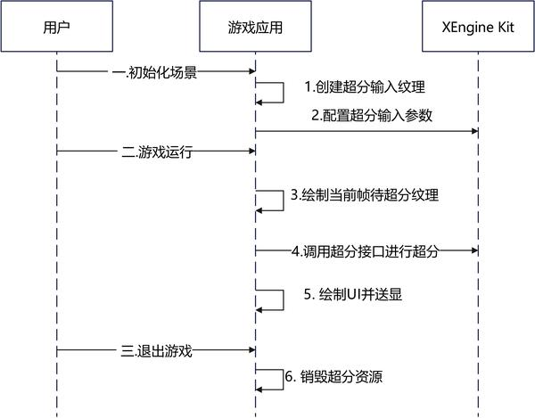

# 空域AI超分

更新时间：2026-07-28 11:23:46

来源：https://developer.huawei.com/consumer/cn/doc/harmonyos-guides/xengine-kit-ai-spatial-upscaling

从API版本26.0.0开始，新增支持Vulkan协议。

XEngine Kit提供空域AI超分特性，基于单帧图像使用AI推理生成滤波参数进行超采样，通过GPU、NPU协同工作，实现比空域GPU超分更好的画质，建议超分倍率在1.5倍以下时使用。


#### 约束与限制

 - 支持的设备类型：Phone，从5.1.0(18)版本开始新增支持Tablet、PC/2in1设备，从5.1.1(19)版本开始新增支持TV设备。
 - 可通过以下方式查询相关扩展特性是否支持：

  
对于OpenGL ES，使用[HMS_XEG_GetString](https://developer.huawei.com/consumer/cn/doc/harmonyos-references/xengine-kit-xengine#hms_xeg_getstring)扩展特性查询接口进行查询。
 - 对于Vulkan，使用[HMS_XEG_EnumerateDeviceExtensionProperties](https://developer.huawei.com/consumer/cn/doc/harmonyos-references/xengine-kit-xengine#hms_xeg_enumeratedeviceextensionproperties)扩展特性查询接口进行查询。


如查询结果包含[XEG_NEURAL_UPSCALE_EXTENSION_NAME](https://developer.huawei.com/consumer/cn/doc/harmonyos-references/xengine-kit-xengine#xeg_neural_upscale_extension_name)或者[XEG_NEURAL_UPSCALE2_EXTENSION_NAME](https://developer.huawei.com/consumer/cn/doc/harmonyos-references/xengine-kit-xengine#xeg_neural_upscale2_extension_name)，则表示支持该特性，若查询结果未包含，则表示不支持该特性。


#### 接口说明

以下为空域AI超分特性需要使用的接口，详细说明请参考[接口文档](https://developer.huawei.com/consumer/cn/doc/harmonyos-references/xengine-kit-xengine)。

**OpenGL ES接口：**

| 接口名 | 描述 |
| --- | --- |
| const GLubyte * HMS_XEG_GetString(GLenum name) | XEngine OpenGL ES扩展特性查询接口。 |
| GL_APICALL void GL_APIENTRY HMS_XEG_NeuralUpscaleParameter(GLenum pname, GLvoid *param) | 设置空域AI超分输入参数。 |
| GL_APICALL void GL_APIENTRY HMS_XEG_RenderNeuralUpscale(GLuint inputTexture) | 执行空域AI超分渲染命令。 |


**Vulkan接口：**

| 接口名 | 描述 |
| --- | --- |
| VKAPI_ATTR VkResult VKAPI_CALL HMS_XEG_EnumerateDeviceExtensionProperties(VkPhysicalDevice physicalDevice, uint32_t *pPropertyCount, XEG_ExtensionProperties *pProperties) | XEngine Vulkan扩展特性查询接口。 |
| VKAPI_ATTR VkResult VKAPI_CALL HMS_XEG_CreateNeuralUpscale(VkDevice device, const XEG_NeuralUpscaleCreateInfo *pCreateInfo, XEG_NeuralUpscale *pNeuralUpscale) | 创建XEG_NeuralUpscale对象。 |
| VKAPI_ATTR VkResult VKAPI_CALL HMS_XEG_CmdRenderNeuralUpscale(VkCommandBuffer commandBuffer, XEG_NeuralUpscale neuralUpscale, const XEG_NeuralUpscaleDescription *pDescription) | 执行空域AI超分渲染命令。 |
| VKAPI_ATTR void VKAPI_CALL HMS_XEG_DestroyNeuralUpscale(XEG_NeuralUpscale neuralUpscale) | 销毁XEG_NeuralUpscale对象。 |


#### 业务流程

 - 下面是基于OpenGL ES图形API平台集成空域AI超分的主要业务流程

  



1. 当用户进入游戏场景时，调用[HMS_XEG_GetString](https://developer.huawei.com/consumer/cn/doc/harmonyos-references/xengine-kit-xengine#hms_xeg_getstring)接口查询XEngine Kit支持的特性列表。
2. 检查返回列表中是否包含[XEG_NEURAL_UPSCALE_EXTENSION_NAME](https://developer.huawei.com/consumer/cn/doc/harmonyos-references/xengine-kit-xengine#xeg_neural_upscale_extension_name)或[XEG_NEURAL_UPSCALE2_EXTENSION_NAME](https://developer.huawei.com/consumer/cn/doc/harmonyos-references/xengine-kit-xengine#xeg_neural_upscale2_extension_name)。若不包含，则当前设备不支持此特性，流程终止。
3. 若支持[XEG_NEURAL_UPSCALE_EXTENSION_NAME](https://developer.huawei.com/consumer/cn/doc/harmonyos-references/xengine-kit-xengine#xeg_neural_upscale_extension_name)，通过[OH_NativeBuffer](https://developer.huawei.com/consumer/cn/doc/harmonyos-references/capi-oh-nativebuffer)创建空域AI超分所需的输入纹理；若支持[XEG_NEURAL_UPSCALE2_EXTENSION_NAME](https://developer.huawei.com/consumer/cn/doc/harmonyos-references/xengine-kit-xengine#xeg_neural_upscale2_extension_name)，创建GL_TEXTURE_2D类型纹理。
4. 使用[HMS_XEG_NeuralUpscaleParameter](https://developer.huawei.com/consumer/cn/doc/harmonyos-references/xengine-kit-xengine#hms_xeg_neuralupscaleparameter)接口配置超分参数。
5. 游戏运行时，每一帧先渲染需要进行超分的纹理。
6. 调用[HMS_XEG_RenderNeuralUpscale](https://developer.huawei.com/consumer/cn/doc/harmonyos-references/xengine-kit-xengine#hms_xeg_renderneuralupscale)接口执行超分操作，超分结果会自动写入当前绑定的帧缓冲中。
7. 进行后续的渲染流程，如UI元素的绘制。待当前帧的渲染完成后，统一调用送显操作。
8. 当游戏退出时，释放所有游戏创建的资源，XEngine Kit内部资源会自动释放。

 - 下面是基于Vulkan图形API平台集成空域AI超分的主要业务流程

  


1. 当用户进入游戏场景时，调用[HMS_XEG_EnumerateDeviceExtensionProperties](https://developer.huawei.com/consumer/cn/doc/harmonyos-references/xengine-kit-xengine#hms_xeg_enumeratedeviceextensionproperties)接口查询XEngine Kit支持的特性列表。
2. 检查返回列表中是否包含[XEG_NEURAL_UPSCALE_EXTENSION_NAME](https://developer.huawei.com/consumer/cn/doc/harmonyos-references/xengine-kit-xengine#xeg_neural_upscale_extension_name)。若不包含，则当前设备不支持此特性，流程终止。
3. 调用[HMS_XEG_CreateNeuralUpscale](https://developer.huawei.com/consumer/cn/doc/harmonyos-references/xengine-kit-xengine#hms_xeg_createneuralupscale)接口创建超分实例。
4. 游戏运行时，每一帧先渲染需要进行超分的纹理。
5. 调用[HMS_XEG_CmdRenderNeuralUpscale](https://developer.huawei.com/consumer/cn/doc/harmonyos-references/xengine-kit-xengine#hms_xeg_cmdrenderneuralupscale)接口执行超分操作。
6. 进行后续的渲染流程，如UI元素的绘制。待当前帧的渲染完成后，统一调用送显操作。
7. 当游戏退出时，调用[HMS_XEG_DestroyNeuralUpscale](https://developer.huawei.com/consumer/cn/doc/harmonyos-references/xengine-kit-xengine#hms_xeg_destroyneuralupscale)接口销毁超分实例。


#### 开发步骤

本章以OpenGL ES和Vulkan图形API集成为例，说明XEngine Kit空域AI超分特性集成操作过程。


#### 配置项目

编译HAP包时，Native层so编译需要依赖NDK中的libxengine.so。

 - 头文件引用

  若需使用OpenGL ES空域AI超分特性，请引入以下头文件。

  
```text
#include "xengine/xeg_gles_extension.h"
// ...
#include "xengine/xeg_gles_neural_upscale.h"
```
若需使用Vulkan空域AI超分特性，请引入以下头文件。

  
```text
#include "xengine/xeg_vulkan_extension.h"
// ...
#include "xengine/xeg_vulkan_neural_upscale.h"
```

 - 编写CMakeLists.txt

  若需使用OpenGL ES空域AI超分特性，请引用XEngine Kit的CMakeLists，CMakeLists.txt部分示例代码如下，完整示例代码请参见[Demo（GPU加速引擎-GLES）](https://gitcode.com/harmonyos_samples/xengine-samplecode-gles-demo-cpp)。

  
```text
find_library(
    # 设置路径变量的名称。
    native-buffer-lib
    # 指定希望CMake定位的NDK库的名称。
    native_buffer
)

find_library(
    # 设置路径变量的名称。
    native-window-lib
    # 指定希望CMake定位的NDK库的名称。
    native_window
)
find_library(
    # 设置路径变量的名称。
    EGL-lib
    # 指定希望CMake定位的NDK库的名称。
    EGL
)

find_library(
    # 设置路径变量的名称。
    GLES-lib
    # 指定希望CMake定位的NDK库的名称。
    GLESv3
)

find_library(
    # 设置路径变量的名称。
    xengine-lib
    # 指定希望CMake定位的NDK库的名称。
    xengine
)
# ...
target_link_libraries(nativerender PUBLIC
    ${EGL-lib} ${GLES-lib} ${xengine-lib}
    # ...
    ${native-window-lib}
    ${native-buffer-lib}
)
```
若需使用Vulkan空域AI超分特性，请引用XEngine Kit的CMakeLists，CMakeLists.txt部分示例代码如下，完整示例代码请参见[Demo（GPU加速引擎-Vulkan）](https://gitcode.com/harmonyos_samples/xengine-samplecode-vulkan-demo-cpp)。

  
```text
find_library(
    # 设置路径变量的名称。
    hilog-lib
    # 指定希望CMake定位的NDK库的名称。
    hilog_ndk.z
)

find_library(
    # 设置路径变量的名称。
    libace-lib
    # 指定希望CMake定位的NDK库的名称。
    ace_ndk.z
)

find_library(
    # 设置路径变量的名称。
    libnapi-lib
    # 指定希望CMake定位的NDK库的名称。
    ace_napi.z
)

find_library(
    # 设置路径变量的名称。
    libuv-lib
    # 指定希望CMake定位的NDK库的名称。
    uv
)

find_library(
    # 设置路径变量的名称。
    xengine-lib
    # 指定希望CMake定位的NDK库的名称。
    xengine
)

add_library(libassimp SHARED IMPORTED)
set_target_properties(
        libassimp
        PROPERTIES
        IMPORTED_LOCATION
        ${CMAKE_CURRENT_SOURCE_DIR}/libs/arm64-v8a/libassimp.so
)
target_link_libraries(nativerender PUBLIC
    ${hilog-lib} ${libace-lib} ${libnapi-lib} ${libuv-lib} libnative_window.so libc++.a libktx librawfile.z.so libassimp ${xengine-lib}
)
```


#### 集成XEngine Kit空域AI超分（OpenGL ES）

Native层实现使用OpenGL ES和XEngine Kit图形API搭建图像渲染管线并集成空域AI超分，渲染结果通过[XComponent](https://developer.huawei.com/consumer/cn/doc/harmonyos-references/ts-basic-components-xcomponent)组件显示到屏幕。

本节阐述OpenGL ES图形API的空域AI超分的使用，详细代码请参见[Demo（GPU加速引擎-GLES）](https://gitcode.com/harmonyos_samples/xengine-samplecode-gles-demo-cpp)。

在调用XEngine Kit能力前，需要先通过[Syscap](https://developer.huawei.com/consumer/cn/doc/harmonyos-references/syscap#什么是systemcapabilitysyscap)查询您的目标设备是否支持SystemCapability.Graphic.XEngine系统能力。
1. 检查扩展支持情况。

  调用[HMS_XEG_GetString](https://developer.huawei.com/consumer/cn/doc/harmonyos-references/xengine-kit-xengine#hms_xeg_getstring)接口，获取XEngine支持的扩展信息。仅当返回结果中包含[XEG_NEURAL_UPSCALE_EXTENSION_NAME](https://developer.huawei.com/consumer/cn/doc/harmonyos-references/xengine-kit-xengine#xeg_neural_upscale_extension_name)或[XEG_NEURAL_UPSCALE2_EXTENSION_NAME](https://developer.huawei.com/consumer/cn/doc/harmonyos-references/xengine-kit-xengine#xeg_neural_upscale2_extension_name)时，才可以使用空域AI超分的相关接口。

  
```text
// 查询XEngine支持的GLES扩展信息
std::string extensionStr = (const char*)HMS_XEG_GetString(XEG_EXTENSIONS);
std::vector<std::string> extensions;
std::istringstream istringstream(extensionStr);
std::string word;
while (istringstream >> word) {
    extensions.push_back(word);
}
    
// ...
// 查询是否支持空域AI超分
if (std::find(extensions.begin(), extensions.end(), XEG_NEURAL_UPSCALE_EXTENSION_NAME) != extensions.end()) {
    // 正常业务逻辑
    // ...
} else {
    // 错误处理
    // ...
}

// 查询是否支持空域AI超分2
if (std::find(extensions.begin(), extensions.end(), XEG_NEURAL_UPSCALE2_EXTENSION_NAME) != extensions.end()) {
    // 正常业务逻辑
    // ...
} else {
    // 错误处理
    // ...
}
```

2. 创建输入纹理。

  在超分流程中创建输入纹理并进行渲染，根据支持的扩展类型选择纹理创建方式。

  
若支持[XEG_NEURAL_UPSCALE_EXTENSION_NAME](https://developer.huawei.com/consumer/cn/doc/harmonyos-references/xengine-kit-xengine#xeg_neural_upscale_extension_name)：输入纹理必须关联OH_NativeBuffer。
3. 若支持[XEG_NEURAL_UPSCALE2_EXTENSION_NAME](https://developer.huawei.com/consumer/cn/doc/harmonyos-references/xengine-kit-xengine#xeg_neural_upscale2_extension_name)：输入纹理无需关联OH_NativeBuffer。
4. 调用[HMS_XEG_NeuralUpscaleParameter](https://developer.huawei.com/consumer/cn/doc/harmonyos-references/xengine-kit-xengine#hms_xeg_neuralupscaleparameter)接口，设置空域AI超分的输入参数。

  
```text
// m_sharpness为用户自定义超分锐化参数
HMS_XEG_NeuralUpscaleParameter(XEG_NEURAL_UPSCALE_SHARPNESS, &m_sharpness);
// upscaleScissor为超分输入纹理的裁剪窗口参数
HMS_XEG_NeuralUpscaleParameter(XEG_NEURAL_UPSCALE_SCISSOR, upscaleScissor);
// 设置超分输入纹理对应的OH_NativeBuffer句柄
// isSupportNeural表示是否支持XEG_NEURAL_UPSCALE_EXTENSION_NAME
if (isSupportNeural) {
    HMS_XEG_NeuralUpscaleParameter(XEG_NEURAL_UPSCALE_INPUT_HANDLE, m_lightNativeBufferHandle);
}
```

5. 调用[HMS_XEG_RenderNeuralUpscale](https://developer.huawei.com/consumer/cn/doc/harmonyos-references/xengine-kit-xengine#hms_xeg_renderneuralupscale)接口，执行空域AI超分。

  
```text
// 绑定绘制超分结果的帧缓冲，m_upscaleFBO为用户自定义创建的framebuffer
glBindFramebuffer(GL_FRAMEBUFFER, m_upscaleFBO);
// m_highResWidth和m_highResHeight分别为用户自定义超分宽度和超分高度
glViewport(0, 0, m_highResWidth, m_highResHeight);
// ...
// 执行空域AI超分。isSupportNeural表示是否支持XEG_NEURAL_UPSCALE_EXTENSION_NAME
if (isSupportNeural) {
    // m_lowLightNativeTexture为关联了OH_NativeBuffer的超分输入纹理附件，用户可自定义
    HMS_XEG_RenderNeuralUpscale(m_lowLightNativeTexture);
} else {
    // m_lowLightColorTexture为超分输入纹理附件，用户可自定义
    HMS_XEG_RenderNeuralUpscale(m_lowLightColorTexture);
}
```

6. 不需要进行超分渲染时，销毁相关资源。

  
```text
// 当支持XEG_NEURAL_UPSCALE_EXTENSION_NAME时，销毁相关资源
if (m_eglImage != nullptr) {
    eglDestroyImageKHR(eglGetCurrentDisplay(), m_eglImage);
}

if (m_nativeWindowBuffer != nullptr) {
    OH_NativeWindow_DestroyNativeWindowBuffer(m_nativeWindowBuffer);
}

if (m_lightNativeBufferHandle != nullptr) {
    OH_NativeBuffer_Unreference(m_lightNativeBufferHandle);
}
// ...
glDeleteTextures(1, &m_lowLightNativeTexture);
    
// 当支持XEG_NEURAL_UPSCALE2_EXTENSION_NAME时，销毁相关资源
glDeleteTextures(1, &m_lowLightColorTexture);
```


#### 集成XEngine Kit空域AI超分（Vulkan）

使用Vulkan图形API搭建图像渲染管线并集成空域AI超分在Native层实现，渲染结果通过[XComponent](https://developer.huawei.com/consumer/cn/doc/harmonyos-references/ts-basic-components-xcomponent)组件显示到屏幕。

本节阐述Vulkan图形API的空域AI超分使用，详细代码请参见[Demo（GPU加速引擎-Vulkan）](https://gitcode.com/harmonyos_samples/xengine-samplecode-vulkan-demo-cpp)。

在调用XEngine Kit能力前，需要先通过[Syscap](https://developer.huawei.com/consumer/cn/doc/harmonyos-references/syscap#什么是systemcapabilitysyscap)查询您的目标设备是否支持SystemCapability.Graphic.XEngine系统能力。
1. 调用[HMS_XEG_EnumerateDeviceExtensionProperties](https://developer.huawei.com/consumer/cn/doc/harmonyos-references/xengine-kit-xengine#hms_xeg_enumeratedeviceextensionproperties)接口，获取XEngine支持的扩展信息。

  只有在支持XEG_NEURAL_UPSCALE_EXTENSION_NAME扩展时才可以使用空域AI超分的相关接口。

  
```text
// 查询XEngine支持的Vulkan扩展列表
std::vector<std::string> supportedExtensions;
uint32_t pPropertyCount;
// physicalDevice为Vulkan物理设备，用户需进行初始化
HMS_XEG_EnumerateDeviceExtensionProperties(physicalDevice, &pPropertyCount, nullptr);
if (pPropertyCount > 0) {
    std::vector<XEG_ExtensionProperties> pProperties(pPropertyCount);
    if (HMS_XEG_EnumerateDeviceExtensionProperties(physicalDevice, &pPropertyCount,
        &pProperties.front()) == VK_SUCCESS) {
        for (auto ext : pProperties) {
            supportedExtensions.push_back(ext.extensionName);
        }
    }
}
// ...
// 查询是否支持空域AI超分
if (std::find(supportedExtensions.begin(), supportedExtensions.end(), XEG_NEURAL_UPSCALE_EXTENSION_NAME) ==
    supportedExtensions.end()) {
    // 错误处理
    // ...
}
```

2. 声明实例句柄。

  
```text
XEG_NeuralUpscale xegNeuralUpscale = nullptr;
```

3. 调用[HMS_XEG_CreateNeuralUpscale](https://developer.huawei.com/consumer/cn/doc/harmonyos-references/xengine-kit-xengine#hms_xeg_createneuralupscale)接口，创建超分实例。

  
```text
// VkRect2D为Vulkan指定的二维区域结构
// srcRect2D为超分输入纹理区域，用户可自定义
VkRect2D srcRect2D;
// srcRect2D.offset.x和srcRect2D.offset.y为原点偏移量
srcRect2D.offset.x = 0;
srcRect2D.offset.y = 0;
// srcRect2D.extent.width与srcRect2D.extent.height为输入纹理采样区域宽高
// lowResWidth与lowResHeight为用户自定义渲染宽高
srcRect2D.extent.width = lowResWidth;
srcRect2D.extent.height = lowResHeight;

// dstRect2D为超分输出纹理区域，用户可自定义
VkRect2D dstRect2D;
// dstRect2D.offset.x和dstRect2D.offset.y为原点偏移量
dstRect2D.offset.x = 0;
dstRect2D.offset.y = 0;
// dstRect2D.extent.width与dstRect2D.extent.height为超分纹理写入区域宽高
// highResWidth与highResHeight为用户自定义超分后宽高
dstRect2D.extent.width = highResWidth;
dstRect2D.extent.height = highResHeight;

XEG_NeuralUpscaleCreateInfo createInfo;

createInfo.sType = XEG_STRUCTURE_TYPE_NEURAL_UPSCALE_CREATE_INFO;
createInfo.pNext = nullptr;
createInfo.inputRegion = srcRect2D;
createInfo.inputSize = {lowResWidth, lowResHeight};
createInfo.outputSize = {highResWidth, highResHeight};
createInfo.outputRegion = dstRect2D;
createInfo.outputFormat = VK_FORMAT_R8G8B8A8_UNORM;
// device逻辑设备，用户需进行初始化
VkResult res = HMS_XEG_CreateNeuralUpscale(device, &createInfo, &xegNeuralUpscale);
if (res != VK_SUCCESS) {
    // 错误处理
    // ...
}
```

4. 调用[HMS_XEG_CmdRenderNeuralUpscale](https://developer.huawei.com/consumer/cn/doc/harmonyos-references/xengine-kit-xengine#hms_xeg_cmdrenderneuralupscale)接口下发超分，每帧都需要调用。

  
```text
XEG_NeuralUpscaleDescription xegDescription{};
xegDescription.sType = XEG_STRUCTURE_TYPE_NEURAL_UPSCALE_DESCRIPTION;
xegDescription.pNext = nullptr;
// xegDescription.sharpness为用户自定义超分锐化参数，此处以参数为0.2f为例
xegDescription.sharpness = 0.2f;
// inputColorView为用户创建的超分输入图像的VkImageView
xegDescription.inputImage = inputColorView;
// outputColorView为用户创建的超分输出图像的VkImageView
xegDescription.outputImage = outputColorView;
// drawCmdBuffers[currentBuffer]为命令缓冲区，用户需进行初始化
VkResult result = HMS_XEG_CmdRenderNeuralUpscale(drawCmdBuffers[currentBuffer], xegNeuralUpscale, &xegDescription);
if (result != VK_SUCCESS) {
    // 错误处理
    // ...
}
```

5. 调用[HMS_XEG_DestroyNeuralUpscale](https://developer.huawei.com/consumer/cn/doc/harmonyos-references/xengine-kit-xengine#hms_xeg_destroyneuralupscale)接口销毁实例。

  
```text
HMS_XEG_DestroyNeuralUpscale(xegNeuralUpscale);
```
