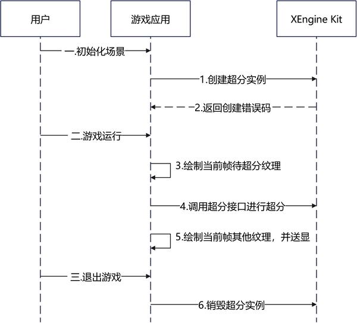

# 空域GPU超分

更新时间：2026-07-28 11:23:46

来源：https://developer.huawei.com/consumer/cn/doc/harmonyos-guides/xengine-kit-gpu-spatial-upscaling

XEngine Kit提供空域GPU超分特性，其基于单帧输入图像，使用空间邻域信息实现超采样，开销较小同时收益可观，建议使用超分倍率为[1.2, 1.5]。


#### 约束与限制

 - 支持的设备类型：Phone，从5.0.2(14)版本开始，新增支持Tablet、PC/2in1设备，从5.1.1(19)版本开始新增支持TV设备。
 - 可通过以下方式查询相关扩展特性是否支持：

  
对于OpenGL ES，使用[HMS_XEG_GetString](https://developer.huawei.com/consumer/cn/doc/harmonyos-references/xengine-kit-xengine#hms_xeg_getstring)扩展特性查询接口进行查询。
 - 对于Vulkan，使用[HMS_XEG_EnumerateDeviceExtensionProperties](https://developer.huawei.com/consumer/cn/doc/harmonyos-references/xengine-kit-xengine#hms_xeg_enumeratedeviceextensionproperties)扩展特性查询接口进行查询。


如查询结果包含[XEG_SPATIAL_UPSCALE_EXTENSION_NAME](https://developer.huawei.com/consumer/cn/doc/harmonyos-references/xengine-kit-xengine#xeg_spatial_upscale_extension_name)，则表示支持该特性，若查询结果未包含，则表示不支持该特性。


#### 接口说明

以下接口为OpenGL ES和Vulkan空域GPU超分设置接口，如需使用更丰富的设置和查询接口，具体API说明详见[接口文档](https://developer.huawei.com/consumer/cn/doc/harmonyos-references/xengine-kit-xengine)。

| 接口名 | 描述 |
| --- | --- |
| const GLubyte * HMS_XEG_GetString (GLenum name) | XEngine OpenGL ES扩展特性查询接口。 |
| GL_APICALL void GL_APIENTRY HMS_XEG_SpatialUpscaleParameter (GLenum pname, GLvoid *param) | 设置空域GPU超分输入参数。 |
| GL_APICALL void GL_APIENTRY HMS_XEG_RenderSpatialUpscale (GLuint inputTexture) | 执行空域GPU超分渲染命令。 |
| VKAPI_ATTR VkResult VKAPI_CALL HMS_XEG_EnumerateDeviceExtensionProperties (VkPhysicalDevice physicalDevice, uint32_t *pPropertyCount, XEG_ExtensionProperties *pProperties) | XEngine Vulkan扩展特性查询接口。 |
| VKAPI_ATTR VkResult VKAPI_CALL HMS_XEG_CreateSpatialUpscale (VkDevice device, const XEG_SpatialUpscaleCreateInfo *pXegSpatialUpscaleCreateInfo, XEG_SpatialUpscale *pXegSpatialUpscale) | 创建XEG_SpatialUpscale对象。 |
| VKAPI_ATTR void VKAPI_CALL HMS_XEG_CmdRenderSpatialUpscale (VkCommandBuffer commandBuffer, XEG_SpatialUpscale xegSpatialUpscale, XEG_SpatialUpscaleDescription *pXegSpatialUpscaleDescription) | 执行空域GPU超分渲染命令。 |
| VKAPI_ATTR void VKAPI_CALL HMS_XEG_DestroySpatialUpscale (XEG_SpatialUpscale xegSpatialUpscale) | 销毁XEG_SpatialUpscale对象。 |


#### 业务流程

 - 下面是基于OpenGL ES图形API平台集成空域GPU超分的主要业务流程

  


1. 用户在进入游戏初始化场景时调用[HMS_XEG_GetString](https://developer.huawei.com/consumer/cn/doc/harmonyos-references/xengine-kit-xengine#hms_xeg_getstring)接口查询XEngine Kit支持的特性。检查返回列表中是否包含[XEG_SPATIAL_UPSCALE_EXTENSION_NAME](https://developer.huawei.com/consumer/cn/doc/harmonyos-references/xengine-kit-xengine#xeg_spatial_upscale_extension_name)。若不包含，则当前设备不支持此特性，流程终止。
2. 调用[HMS_XEG_SpatialUpscaleParameter](https://developer.huawei.com/consumer/cn/doc/harmonyos-references/xengine-kit-xengine#hms_xeg_spatialupscaleparameter)接口配置超分参数。
3. 当游戏运行时，游戏渲染待超分的当前帧纹理。
4. 当待超分纹理渲染完成时，调用[HMS_XEG_RenderSpatialUpscale](https://developer.huawei.com/consumer/cn/doc/harmonyos-references/xengine-kit-xengine#hms_xeg_renderspatialupscale)接口对待超分的纹理超分。
5. 当超分渲染完成时，游戏渲染剩下的纹理，如UI等。待当前帧的渲染完成后，统一调用送显操作。
6. 当游戏退出时，超分资源会自行释放。

 - 下面是基于Vulkan图形API平台集成空域GPU超分的主要业务流程

  



1. 用户在进入游戏初始化场景时调用[HMS_XEG_EnumerateDeviceExtensionProperties](https://developer.huawei.com/consumer/cn/doc/harmonyos-references/xengine-kit-xengine#hms_xeg_enumeratedeviceextensionproperties)接口查询XEngine Kit支持的特性。检查返回列表中是否包含[XEG_SPATIAL_UPSCALE_EXTENSION_NAME](https://developer.huawei.com/consumer/cn/doc/harmonyos-references/xengine-kit-xengine#xeg_spatial_upscale_extension_name)。若不包含，则当前设备不支持此特性，流程终止。
2. 调用[HMS_XEG_CreateSpatialUpscale](https://developer.huawei.com/consumer/cn/doc/harmonyos-references/xengine-kit-xengine#hms_xeg_createspatialupscale)接口创建超分实例。
3. 当游戏运行时，游戏渲染待超分的当前帧纹理。
4. 当待超分纹理渲染完成时，调用[HMS_XEG_CmdRenderSpatialUpscale](https://developer.huawei.com/consumer/cn/doc/harmonyos-references/xengine-kit-xengine#hms_xeg_cmdrenderspatialupscale)接口对待超分的纹理超分。
5. 当超分渲染完成时，游戏渲染剩下的纹理，如UI等。待当前帧的渲染完成后，统一调用送显操作。
6. 当游戏退出时，调用[HMS_XEG_DestroySpatialUpscale](https://developer.huawei.com/consumer/cn/doc/harmonyos-references/xengine-kit-xengine#hms_xeg_destroyspatialupscale)接口销毁超分实例。


#### 开发步骤

本章以OpenGL ES和Vulkan图形API集成为例，说明XEngine Kit集成操作过程。


#### 配置项目

编译HAP包时，Native层so编译需要依赖NDK中的libxengine.so。

 - 头文件引用

  若需使用OpenGL ES空域GPU超分特性，请引入以下头文件。

  
```text
#include "xengine/xeg_gles_extension.h"
// ...
#include "xengine/xeg_gles_spatial_upscale.h"
```
若需使用Vulkan空域GPU超分特性，请引入以下头文件。

  
```text
#include "xengine/xeg_vulkan_extension.h"
// ...
#include "xengine/xeg_vulkan_spatial_upscale.h"
```

 - 编写CMakeLists.txt

  若需使用OpenGL ES空域GPU超分特性，请引用XEngine Kit的CMakeLists，CMakeLists.txt部分示例代码如下，完整示例代码请参见[Demo（GPU加速引擎-GLES）](https://gitcode.com/harmonyos_samples/xengine-samplecode-gles-demo-cpp)。

  
```text
find_library(
    # 设置路径变量的名称。
    EGL-lib
    # 指定希望CMake定位的NDK库的名称。
    EGL
)

find_library(
    # 设置路径变量的名称。
    GLES-lib
    # 指定希望CMake定位的NDK库的名称。
    GLESv3
)

find_library(
    # 设置路径变量的名称。
    xengine-lib
    # 指定希望CMake定位的NDK库的名称。
    xengine
)
# ...
target_link_libraries(nativerender PUBLIC
    ${EGL-lib} ${GLES-lib} ${xengine-lib}
    # ...
)
```
若需使用Vulkan空域GPU超分特性，请引用XEngine Kit的CMakeLists，CMakeLists.txt部分示例代码如下，完整示例代码请参见[Demo（GPU加速引擎-Vulkan）](https://gitcode.com/harmonyos_samples/xengine-samplecode-vulkan-demo-cpp)。

  
```text
find_library(
    # 设置路径变量的名称。
    xengine-lib
    # 指定希望CMake定位的NDK库的名称。
    xengine
)

target_link_libraries(nativerender PUBLIC
    # ...
    ${xengine-lib}
)
```


#### 集成XEngine Kit空域GPU超分（OpenGL ES）

使用EGL和OpenGL ES图形API搭建图像渲染管线并集成空域GPU超分在Native层实现，渲染结果通过[XComponent](https://developer.huawei.com/consumer/cn/doc/harmonyos-references/ts-basic-components-xcomponent)组件显示到屏幕。

本节阐述OpenGL ES图形API的空域GPU超分的使用，详细代码请参见[Demo（GPU加速引擎-GLES）](https://gitcode.com/harmonyos_samples/xengine-samplecode-gles-demo-cpp)。

在调用XEngine Kit能力前，需要先通过[Syscap](https://developer.huawei.com/consumer/cn/doc/harmonyos-references/syscap#什么是systemcapabilitysyscap)查询您的目标设备是否支持SystemCapability.Graphic.XEngine系统能力。
1. 调用[HMS_XEG_GetString](https://developer.huawei.com/consumer/cn/doc/harmonyos-references/xengine-kit-xengine#hms_xeg_getstring)接口，获取XEngine支持的扩展信息，只有在支持XEG_SPATIAL_UPSCALE_EXTENSION_NAME扩展时才可以使用空域GPU超分的相关接口。

  
```text
// 查询XEngine支持的GLES扩展信息
std::string extensionStr = (const char*)HMS_XEG_GetString(XEG_EXTENSIONS);
std::vector<std::string> extensions;
std::istringstream istringstream(extensionStr);
std::string word;
while (istringstream >> word) {
    extensions.push_back(word);
}
    
// ...
// 查询是否支持空域GPU超分
if (std::find(extensions.begin(), extensions.end(), XEG_SPATIAL_UPSCALE_EXTENSION_NAME) != extensions.end()) {
    // 正常业务逻辑
    // ...
} else {
    // 错误处理
    // ...
}
```

2. 调用[HMS_XEG_SpatialUpscaleParameter](https://developer.huawei.com/consumer/cn/doc/harmonyos-references/xengine-kit-xengine#hms_xeg_spatialupscaleparameter)接口，对空域GPU超分的参数赋值。

  
```text
// m_lowResWidth与m_lowResHeight分别为用户自定义的渲染宽度与渲染高度
// upscaleScissor为超分输入图像的采样区域
int upscaleScissor[4] = {0, 0, static_cast<int>(m_lowResWidth), static_cast<int>(m_lowResHeight)};

// m_sharpness为用户自定义超分锐化参数
HMS_XEG_SpatialUpscaleParameter(XEG_SPATIAL_UPSCALE_SHARPNESS, &m_sharpness);
HMS_XEG_SpatialUpscaleParameter(XEG_SPATIAL_UPSCALE_SCISSOR, upscaleScissor);
```

3. 调用[HMS_XEG_RenderSpatialUpscale](https://developer.huawei.com/consumer/cn/doc/harmonyos-references/xengine-kit-xengine#hms_xeg_renderspatialupscale)接口进行超分。

  
```text
// m_upscaleFBO为用户自定义创建的framebuffer
glBindFramebuffer(GL_FRAMEBUFFER, m_upscaleFBO);
// m_highResWidth和m_highResHeight分别为用户自定义超分宽度和超分高度
glViewport(0, 0, m_highResWidth, m_highResHeight);
glScissor(0, 0, m_highResWidth, m_highResHeight);
// m_lowLightColorTexture为纹理附件，用户可自定义
HMS_XEG_RenderSpatialUpscale(m_lowLightColorTexture);
```
m_upscaleFBO是已创建完成的framebuffer，并绑定纹理，超分接口调用后绘制到纹理上。


#### 集成XEngine空域GPU超分（Vulkan）

使用Vulkan图形API搭建图像渲染管线并集成空域GPU超分在Native层实现，渲染结果通过[XComponent](https://developer.huawei.com/consumer/cn/doc/harmonyos-references/ts-basic-components-xcomponent)组件显示到屏幕。

本节阐述Vulkan图形API的空域GPU超分使用，详细代码请参见[Demo（GPU加速引擎-Vulkan）](https://gitcode.com/harmonyos_samples/xengine-samplecode-vulkan-demo-cpp)。

在调用XEngine Kit能力前，需要先通过[Syscap](https://developer.huawei.com/consumer/cn/doc/harmonyos-references/syscap#什么是systemcapabilitysyscap)查询您的目标设备是否支持SystemCapability.Graphic.XEngine系统能力。
1. 调用[HMS_XEG_EnumerateDeviceExtensionProperties](https://developer.huawei.com/consumer/cn/doc/harmonyos-references/xengine-kit-xengine#hms_xeg_enumeratedeviceextensionproperties)接口，获取XEngine支持的扩展信息，只有在支持XEG_SPATIAL_UPSCALE_EXTENSION_NAME扩展时才可以使用空域GPU超分的相关接口。

  
```text
// 查询XEngine支持的Vulkan扩展列表
std::vector<std::string> supportedExtensions;
uint32_t pPropertyCount;
// physicalDevice为Vulkan物理设备，用户需进行初始化
HMS_XEG_EnumerateDeviceExtensionProperties(physicalDevice, &pPropertyCount, nullptr);
if (pPropertyCount > 0) {
    std::vector<XEG_ExtensionProperties> pProperties(pPropertyCount);
    if (HMS_XEG_EnumerateDeviceExtensionProperties(physicalDevice, &pPropertyCount,
        &pProperties.front()) == VK_SUCCESS) {
        for (auto ext : pProperties) {
            supportedExtensions.push_back(ext.extensionName);
        }
    }
}
// 查询是否支持空域GPU超分
if (std::find(supportedExtensions.begin(), supportedExtensions.end(), XEG_SPATIAL_UPSCALE_EXTENSION_NAME) ==
    supportedExtensions.end()) {
    // 错误处理
    // ...
}
```

2. 声明实例句柄。

  
```text
XEG_SpatialUpscale xegSpatialUpscale = nullptr;
```

3. 调用[HMS_XEG_CreateSpatialUpscale](https://developer.huawei.com/consumer/cn/doc/harmonyos-references/xengine-kit-xengine#hms_xeg_createspatialupscale)接口，创建超分实例。

  
```text
// VkRect2D为Vulkan指定的二维区域结构
// srcRect2D为超分输入纹理区域，用户可自定义
VkRect2D srcRect2D;
// srcRect2D.offset.x和srcRect2D.offset.y为原点偏移量
srcRect2D.offset.x = 0;
srcRect2D.offset.y = 0;
// srcRect2D.extent.width与srcRect2D.extent.height为输入纹理宽高
// lowResWidth与lowResHeight为用户可以自定义渲染宽高
srcRect2D.extent.width = lowResWidth;
srcRect2D.extent.height = lowResHeight;

// dstRect2D为超分输出纹理区域，用户可自定义
VkRect2D dstRect2D;
// dstRect2D.offset.x和dstRect2D.offset.y为原点偏移量
dstRect2D.offset.x = 0;
dstRect2D.offset.y = 0;
// dstRect2D.extent.width与dstRect2D.extent.height为超分纹理宽高
// highResWidth与highResHeight为用户可以自定义超分后宽高
dstRect2D.extent.width = highResWidth;
dstRect2D.extent.height = highResHeight;

XEG_SpatialUpscaleCreateInfo createInfo;
createInfo.format = VK_FORMAT_R8G8B8A8_UNORM;
// sharpness为用户自定义超分锐化参数，此处以参数为0.2f为例
createInfo.sharpness = 0.2f;
createInfo.outputSize = dstRect2D.extent;
createInfo.inputRegion = srcRect2D;
createInfo.inputSize = srcRect2D.extent;
createInfo.outputRegion = dstRect2D;
// device逻辑设备，用户需进行初始化
HMS_XEG_CreateSpatialUpscale(device, &createInfo, &xegSpatialUpscale);
```

4. 调用[HMS_XEG_CmdRenderSpatialUpscale](https://developer.huawei.com/consumer/cn/doc/harmonyos-references/xengine-kit-xengine#hms_xeg_cmdrenderspatialupscale)接口下发超分，每帧都需要调用。

  
```text
XEG_SpatialUpscaleDescription xegDescription{0};
// inputColorView为用户创建的超分输入图像的VkImageView
xegDescription.inputImage = inputColorView;
// outputColorView为用户创建的超分输出图像的VkImageView
xegDescription.outputImage = outputColorView;
// drawCmdBuffers[currentBuffer]为命令缓冲区，用户需进行初始化
HMS_XEG_CmdRenderSpatialUpscale(drawCmdBuffers[currentBuffer], xegSpatialUpscale, &xegDescription);
```

5. 调用[HMS_XEG_DestroySpatialUpscale](https://developer.huawei.com/consumer/cn/doc/harmonyos-references/xengine-kit-xengine#hms_xeg_destroyspatialupscale)接口销毁实例。

  
```text
HMS_XEG_DestroySpatialUpscale(xegSpatialUpscale);
```
