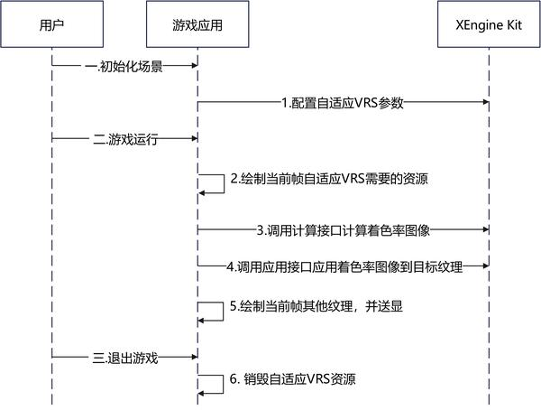
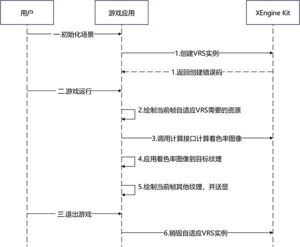

# 自适应VRS

更新时间：2026-07-28 11:23:46

来源：https://developer.huawei.com/consumer/cn/doc/harmonyos-guides/xengine-kit-adaptive-vrs

XEngine Kit提供自适应VRS特性，其通过合理分配画面的计算资源，视觉无损降低渲染频次，使不同的渲染图像使用不同的渲染速率，能够有效提高渲染性能。


#### 约束与限制

 - 支持的设备类型：Phone，从5.0.2(14)版本开始，新增支持Tablet、PC/2in1设备，从5.1.1(19)版本开始新增支持TV设备。
 - 可通过以下方式查询相关扩展特性是否支持：

  对于OpenGL ES，使用[HMS_XEG_GetString](https://developer.huawei.com/consumer/cn/doc/harmonyos-references/xengine-kit-xengine#hms_xeg_getstring)扩展特性查询接口进行查询，如查询结果包含[XEG_ADAPTIVE_VRS_EXTENSION_NAME](https://developer.huawei.com/consumer/cn/doc/harmonyos-references/xengine-kit-xengine#xeg_adaptive_vrs_extension_name)，则表示支持该特性，若查询结果未包含，则表示不支持该特性。


#### 接口说明

以下接口为自适应VRS设置接口，如需使用更丰富的设置和查询接口，具体API说明详见[接口文档](https://developer.huawei.com/consumer/cn/doc/harmonyos-references/xengine-kit-xengine)。

| 接口名 | 描述 |
| --- | --- |
| const GLubyte * HMS_XEG_GetString (GLenum name) | XEngine OpenGL ES扩展特性查询接口。 |
| GL_APICALL void GL_APIENTRY HMS_XEG_AdaptiveVRSParameter (GLenum pname, GLvoid * param) | 设置自适应VRS的参数。 |
| GL_APICALL void GL_APIENTRY HMS_XEG_DispatchAdaptiveVRS (GLfloat * reprojectionMatrix, GLuint inputColorImage, GLuint inputDepthImage, GLuint shadingRateImage) | 计算着色率图像。 |
| GL_APICALL void GL_APIENTRY HMS_XEG_ApplyAdaptiveVRS (GLuint shadingRateImage) | 将着色率图像应用到渲染目标中。 |
| VKAPI_ATTR VkResult VKAPI_CALL HMS_XEG_EnumerateDeviceExtensionProperties (VkPhysicalDevice physicalDevice, uint32_t * pPropertyCount, XEG_ExtensionProperties * pProperties) | XEngine Vulkan扩展特性查询接口。 |
| VKAPI_ATTR VkResult VKAPI_CALL HMS_XEG_CreateAdaptiveVRS (VkDevice device, XEG_AdaptiveVRSCreateInfo * pXegAdaptiveVRSCreateInfo, XEG_AdaptiveVRS * pXegAdaptiveVRS) | 创建XEG_AdaptiveVRS对象。 |
| VKAPI_ATTR void VKAPI_CALL HMS_XEG_CmdDispatchAdaptiveVRS (VkCommandBuffer commandBuffer, XEG_AdaptiveVRS xegAdaptiveVRS, XEG_AdaptiveVRSDescription * pXegAdaptiveVRSDescription) | 执行计算自适应VRS命令。 |
| VKAPI_ATTR void VKAPI_CALL HMS_XEG_DestroyAdaptiveVRS (XEG_AdaptiveVRS xegAdaptiveVRS) | 销毁XEG_AdaptiveVRS对象。 |


#### 业务流程

 - 下面是基于OpenGL ES图形API平台集成自适应VRS的主要业务流程

  



1. 当用户在进入游戏初始化场景时调用[HMS_XEG_GetString](https://developer.huawei.com/consumer/cn/doc/harmonyos-references/xengine-kit-xengine#hms_xeg_getstring)接口查询XEngine Kit支持的特性。检查返回列表中是否包含[XEG_ADAPTIVE_VRS_EXTENSION_NAME](https://developer.huawei.com/consumer/cn/doc/harmonyos-references/xengine-kit-xengine#xeg_adaptive_vrs_extension_name)。若不包含，则当前设备不支持此特性，流程终止。
2. 调用[HMS_XEG_AdaptiveVRSParameter](https://developer.huawei.com/consumer/cn/doc/harmonyos-references/xengine-kit-xengine#hms_xeg_adaptivevrsparameter)接口配置自适应VRS参数。
3. 当游戏运行时，游戏渲染当前帧纹理。
4. 在使用自适应VRS特性的阶段前，调用[HMS_XEG_DispatchAdaptiveVRS](https://developer.huawei.com/consumer/cn/doc/harmonyos-references/xengine-kit-xengine#hms_xeg_dispatchadaptivevrs)接口计算着色率图。
5. 调用[HMS_XEG_ApplyAdaptiveVRS](https://developer.huawei.com/consumer/cn/doc/harmonyos-references/xengine-kit-xengine#hms_xeg_applyadaptivevrs)将着色率图像应用到渲染目标中。
6. 游戏渲染剩下的纹理，如UI等。待当前帧的渲染完成后，统一调用送显操作。
7. 当游戏退出时，自适应VRS资源会自行释放。

 - 下面是基于Vulkan图形API平台集成自适应VRS的主要业务流程

  



1. 用户在进入游戏初始化场景时调用[HMS_XEG_EnumerateDeviceExtensionProperties](https://developer.huawei.com/consumer/cn/doc/harmonyos-references/xengine-kit-xengine#hms_xeg_enumeratedeviceextensionproperties)接口查询XEngine Kit支持的特性。检查返回列表中是否包含[XEG_ADAPTIVE_VRS_EXTENSION_NAME](https://developer.huawei.com/consumer/cn/doc/harmonyos-references/xengine-kit-xengine#xeg_adaptive_vrs_extension_name)。若不包含，则当前设备不支持此特性，流程终止。
2. 调用[HMS_XEG_CreateAdaptiveVRS](https://developer.huawei.com/consumer/cn/doc/harmonyos-references/xengine-kit-xengine#hms_xeg_createadaptivevrs)接口创建自适应VRS实例。
3. 使用自适应VRS特性时，需要创建能够支持VRS的vulkan资源。
4. 当游戏运行时，游戏渲染当前帧纹理。
5. 调用[HMS_XEG_CmdDispatchAdaptiveVRS](https://developer.huawei.com/consumer/cn/doc/harmonyos-references/xengine-kit-xengine#hms_xeg_cmddispatchadaptivevrs)计算着色率图。
6. 将着色率图像应用到渲染目标中。
7. 渲染剩下的游戏纹理，如UI等。待当前帧的渲染完成后，统一调用送显操作。
8. 当游戏退出时，调用[HMS_XEG_DestroyAdaptiveVRS](https://developer.huawei.com/consumer/cn/doc/harmonyos-references/xengine-kit-xengine#hms_xeg_destroyadaptivevrs)接口销毁自适应VRS实例。


#### 开发步骤

本章以OpenGL ES和Vulkan图形API集成为例，说明XEngine Kit集成操作过程。


#### 配置项目

编译HAP包时，Native层so编译需要依赖NDK中的libxengine.so。

 - 头文件引用

  若需使用OpenGL ES自适应VRS特性，请引入以下头文件。

  
```text
#include "xengine/xeg_gles_extension.h"
// ...
#include "xengine/xeg_gles_adaptive_vrs.h"
```
若需使用Vulkan自适应VRS特性，请引入以下头文件。

  
```text
#include "xengine/xeg_vulkan_extension.h"
// ...
#include "xengine/xeg_vulkan_adaptive_vrs.h"
```

 - 编写CMakeLists.txt

  若需使用OpenGL ES自适应VRS特性，请引用XEngine Kit的CMakeLists，CMakeLists.txt部分示例代码如下，完整示例代码请参见[Demo（GPU加速引擎-GLES）](https://gitcode.com/harmonyos_samples/xengine-samplecode-gles-demo-cpp)。

  
```text
find_library(
    # 设置路径变量的名称。
    EGL-lib
    # 指定希望CMake定位的NDK库的名称。
    EGL
)

find_library(
    # 设置路径变量的名称。
    GLES-lib
    # 指定希望CMake定位的NDK库的名称。
    GLESv3
)

find_library(
    # 设置路径变量的名称。
    xengine-lib
    # 指定希望CMake定位的NDK库的名称。
    xengine
)
# ...
target_link_libraries(nativerender PUBLIC
    ${EGL-lib} ${GLES-lib} ${xengine-lib}
    # ...
)
```
若需使用Vulkan自适应VRS特性，请引用XEngine Kit的CMakeLists，CMakeLists.txt部分示例代码如下，完整示例代码请参见[Demo（GPU加速引擎-Vulkan）](https://gitcode.com/harmonyos_samples/xengine-samplecode-vulkan-demo-cpp)。

  
```text
find_library(
    # 设置路径变量的名称。
    xengine-lib
    # 指定希望CMake定位的NDK库的名称。
    xengine
)

target_link_libraries(nativerender PUBLIC
    # ...
    ${xengine-lib}
)
```


#### 集成自适应VRS特性（OpenGL ES）

自适应VRS特性OpenGL ES版本的着色率纹理创建和绑定由特性提供的接口实现。

在调用XEngine Kit能力前，需要先通过[Syscap](https://developer.huawei.com/consumer/cn/doc/harmonyos-references/syscap#什么是systemcapabilitysyscap)查询您的目标设备是否支持SystemCapability.Graphic.XEngine系统能力。
1. 调用[HMS_XEG_GetString](https://developer.huawei.com/consumer/cn/doc/harmonyos-references/xengine-kit-xengine#hms_xeg_getstring)接口，获取XEngine支持的扩展信息，只有在支持[XEG_ADAPTIVE_VRS_EXTENSION_NAME](https://developer.huawei.com/consumer/cn/doc/harmonyos-references/xengine-kit-xengine#xeg_adaptive_vrs_extension_name)扩展时才可以使用自适应VRS的相关接口。

  
```text
// 查询XEngine支持的GLES扩展信息
std::string extensionStr = (const char*)HMS_XEG_GetString(XEG_EXTENSIONS);
std::vector<std::string> extensions;
std::istringstream istringstream(extensionStr);
std::string word;
while (istringstream >> word) {
    extensions.push_back(word);
}
    
// ...
// 查询是否支持自适应VRS
if (std::find(extensions.begin(), extensions.end(), XEG_ADAPTIVE_VRS_EXTENSION_NAME) != extensions.end()) {
    // 正常业务逻辑
    // ...
} else {
    // 错误处理
    // ...
}
```

2. 调用[HMS_XEG_AdaptiveVRSParameter](https://developer.huawei.com/consumer/cn/doc/harmonyos-references/xengine-kit-xengine#hms_xeg_adaptivevrsparameter)接口，对自适应VRS的参数赋值。

  
```text
// inputWidth与inputHeight分别为用户自定义的渲染宽度与渲染高度
// inputSize为上一帧渲染管线最终渲染的图像尺寸，用户可自定义
GLsizei inputSize[2] = {inputWidth, inputHeight};
HMS_XEG_AdaptiveVRSParameter(XEG_ADAPTIVE_VRS_INPUT_SIZE, inputSize);
// inputRegion为上一帧渲染管线最终渲染的图像区域，用户可自定义
GLuint inputRegion[4] = {0, 0, static_cast<GLuint>(inputWidth), static_cast<GLuint>(inputHeight)};
HMS_XEG_AdaptiveVRSParameter(XEG_ADAPTIVE_VRS_INPUT_REGION, inputRegion);
// flip为判断是否执行图像上下翻转，为true表示进行图像上下翻转，false则表示不进行图像上下翻转，此处以false为例
GLboolean flip = false;
HMS_XEG_AdaptiveVRSParameter(XEG_ADAPTIVE_VRS_FLIP, &flip);
// texelSize为渲染的分片大小，用户可自定义，当前支持[8, 8]和[16, 16]两种规格
GLsizei texelSize[2] = {ADAPTIVE_VRS_TEXEL_SIZE, ADAPTIVE_VRS_TEXEL_SIZE};
HMS_XEG_AdaptiveVRSParameter(XEG_ADAPTIVE_VRS_TEXEL_SIZE, texelSize);
// sensitivity为控制生成着色率图像的阈值，用户可自定义，建议取值范围为[0.0, 1.0]
GLfloat sensitivity = 0.3;
HMS_XEG_AdaptiveVRSParameter(XEG_ADAPTIVE_VRS_ERROR_SENSITIVITY, &sensitivity);
```

3. 调用[HMS_XEG_DispatchAdaptiveVRS](https://developer.huawei.com/consumer/cn/doc/harmonyos-references/xengine-kit-xengine#hms_xeg_dispatchadaptivevrs)接口计算着色率图像。

  
```text
// reprojectionM为用户根据投影矩阵和观察矩阵计算得来的重投影矩阵
// light为用户自定义上一帧渲染管线最终渲染结果颜色附件纹理
// depth为用户自定义当前帧渲染管线最终渲染结果深度附件纹理
// sri为用户可自定义生成着色率图像信息的纹理
HMS_XEG_DispatchAdaptiveVRS(reprojectionM, light, depth, sri);
```

4. 调用[HMS_XEG_ApplyAdaptiveVRS](https://developer.huawei.com/consumer/cn/doc/harmonyos-references/xengine-kit-xengine#hms_xeg_applyadaptivevrs)接口，将着色率图像应用到渲染目标中。

  
```text
HMS_XEG_ApplyAdaptiveVRS(sri);
```


#### 集成自适应VRS特性（Vulkan）

在调用XEngine Kit能力前，需要先通过[Syscap](https://developer.huawei.com/consumer/cn/doc/harmonyos-references/syscap#什么是systemcapabilitysyscap)查询您的目标设备是否支持SystemCapability.Graphic.XEngine系统能力。
1. 调用[HMS_XEG_EnumerateDeviceExtensionProperties](https://developer.huawei.com/consumer/cn/doc/harmonyos-references/xengine-kit-xengine#hms_xeg_enumeratedeviceextensionproperties)接口，获取XEngine支持的扩展信息，只有在支持[XEG_ADAPTIVE_VRS_EXTENSION_NAME](https://developer.huawei.com/consumer/cn/doc/harmonyos-references/xengine-kit-xengine#xeg_adaptive_vrs_extension_name)扩展时才可以使用自适应VRS的相关接口。

  
```text
// 查询XEngine支持的Vulkan扩展列表
std::vector<std::string> supportedExtensions;
uint32_t pPropertyCount;
// physicalDevice为Vulkan物理设备，用户需进行初始化
HMS_XEG_EnumerateDeviceExtensionProperties(physicalDevice, &pPropertyCount, nullptr);
if (pPropertyCount > 0) {
    std::vector<XEG_ExtensionProperties> pProperties(pPropertyCount);
    if (HMS_XEG_EnumerateDeviceExtensionProperties(physicalDevice, &pPropertyCount,
        &pProperties.front()) == VK_SUCCESS) {
        for (auto ext : pProperties) {
            supportedExtensions.push_back(ext.extensionName);
        }
    }
}
// ...
// 查询是否支持自适应VRS
if (std::find(supportedExtensions.begin(), supportedExtensions.end(), XEG_ADAPTIVE_VRS_EXTENSION_NAME) ==
    supportedExtensions.end()) {
    // 错误处理
    // ...
}
```

2. 声明实例句柄。

  
```text
XEG_AdaptiveVRS xegAdaptiveVRS = nullptr;
```

3. 调用[HMS_XEG_CreateAdaptiveVRS](https://developer.huawei.com/consumer/cn/doc/harmonyos-references/xengine-kit-xengine#hms_xeg_createadaptivevrs)接口，定义并创建实例。

  
```text
// VkExtent2D inputSize为上一帧渲染管线最终渲染的图像尺寸
// VkRect2D为Vulkan指定的二维区域结构
// inputRegion为自适应VRS输入纹理区域，用户可自定义
VkExtent2D inputSize;
VkRect2D inputRegion{};
// highResWidth、highResHeight为用户自定义的渲染宽高
// inputSize.width与inputSize.height分别上一帧渲染最终图像的宽高
inputSize.width = highResWidth;
inputSize.height = highResHeight;
// inputRegion.extent.width与inputRegion.extent.height分别为纹理采样宽高
inputRegion.extent.width = highResWidth;
inputRegion.extent.height = highResHeight;
// inputRegion.offset.x和inputRegion.offset.y为原点偏移量
inputRegion.offset.x = 0;
inputRegion.offset.y = 0;
// xegCreateInfo.inputSize为上一帧渲染管线最终渲染的图像尺寸
xegCreateInfo.inputSize = inputSize;
// xegCreateInfo.inputRegion为上一帧渲染管线最终渲染的图像区域
xegCreateInfo.inputRegion = inputRegion;
// xegCreateInfo.adaptiveTileSize为自适应VRS的渲染的分片大小
// VRS_TILE_SIZE为自适应VRS的渲染的分片大小
xegCreateInfo.adaptiveTileSize = VRS_TILE_SIZE;
// xegCreateInfo.errorSensitivity为控制最终生成着色率纹理结果的阈值
xegCreateInfo.errorSensitivity = SENSITIVITY;
// xegCreateInfo.flip为判断是否执行图像上下翻转，为true表示进行图像上下翻转，false则表示不进行图像上下翻转，此处以false为例
xegCreateInfo.flip = false;
// device逻辑设备，用户需进行初始化
// xegCreateInfo为自适应VRS实例句柄对象的参数信息
// xeg_adaptiveVRS为下发绘制着色率纹理命令所需参数信息
VkResult res = HMS_XEG_CreateAdaptiveVRS(device, &xegCreateInfo, &xegAdaptiveVRS);
```

4. 调用[HMS_XEG_CmdDispatchAdaptiveVRS](https://developer.huawei.com/consumer/cn/doc/harmonyos-references/xengine-kit-xengine#hms_xeg_cmddispatchadaptivevrs)接口，下发自适应VRS命令，生成perImage着色率纹理。

  
```text
XEG_AdaptiveVRSDescription adaptiveVRSDescription;
// inputColorImageView为用户自定义的上一帧渲染管线最终渲染结果颜色附件纹理
adaptiveVRSDescription.inputColorImage = inputColorImageView;
// inputDepthImageView为用户自定义的当前帧渲染管线最终渲染结果深度附件纹理
adaptiveVRSDescription.inputDepthImage = inputDepthImageView;
// outputShadingRateImage为用户自定义的生成着色率图信息的纹理
adaptiveVRSDescription.outputShadingRateImage = outputShadingRateImage;
// adaptiveVRSDescription.reprojectionMatrix为使用投影矩阵和观察矩阵计算而来的重投影矩阵
adaptiveVRSDescription.reprojectionMatrix = nullptr;
// ...
if (xegAdaptiveVRS) {
    HMS_XEG_CmdDispatchAdaptiveVRS(commandBuffer, xegAdaptiveVRS, &adaptiveVRSDescription);
    // ...
}
```

5. 调用[HMS_XEG_DestroyAdaptiveVRS](https://developer.huawei.com/consumer/cn/doc/harmonyos-references/xengine-kit-xengine#hms_xeg_destroyadaptivevrs)接口，卸载VRS实例，清理VRS相关资源。

  
```text
HMS_XEG_DestroyAdaptiveVRS(xegAdaptiveVRS);
```
