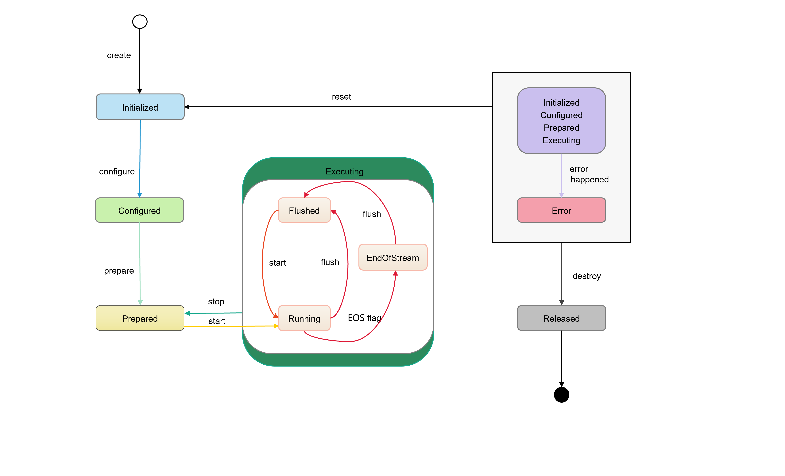
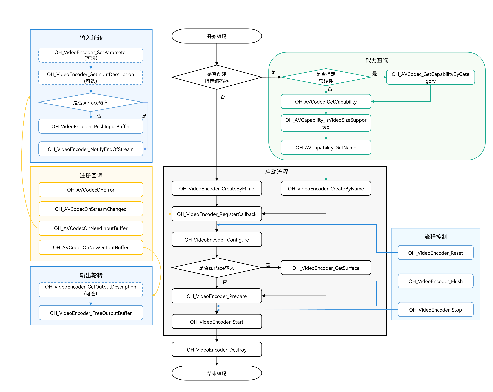

# 视频编码

更新时间：2026-05-26 06:48:54

来源：https://developer.huawei.com/consumer/cn/doc/harmonyos-guides/video-encoding

视频编码是多媒体处理流程中的重要环节，功能是将未压缩的视频数据压缩成视频码流，旨在降低原始视频数据的大小以便存储或传输。视频编码支持同步模式与异步模式两种运行机制，两者主要区别为buffer获取方式的同异步之分，开发者可根据自身业务选择适合的接口调用模式。

本文档主要介绍异步模式视频编码的实现流程，同步模式视频编码请参考[视频编码同步模式](https://developer.huawei.com/consumer/cn/doc/harmonyos-guides/synchronous-video-encoding)。根据编码前数据输入方式的不同，编码器支持Surface模式和Buffer模式两种输入模式，适用于不同的应用场景。

 - Surface模式。

  编码器通过[NativeWindow](https://developer.huawei.com/consumer/cn/doc/harmonyos-references/capi-nativewindow-nativewindow)来获取输入数据，可以与其他模块对接（如相机模块）。适用于与相机、屏幕录制等数据源直接对接的编码场景。
 - Buffer模式。

  编码器通过预分配的共享内存获取输入数据，开发者需将原始视频数据拷贝到预分配的共享内存中。适用于对文件或内存中的原始视频数据进行编码处理的场景。


| 差异 | Surface模式 | Buffer模式 |
| --- | --- | --- |
| 配置 | 在调用OH_VideoEncoder_Prepare接口前，必须调用OH_VideoEncoder_GetSurface接口获取OHNativeWindow，用于传递视频数据。 | - |
| 数据输入 | 通过OHNativeWindow获取输入帧，数据通常由生产者模块（如相机）直接写入。 | 通过OnNeedInputBuffer回调函数获取共享内存buffer信息，调用OH_VideoEncoder_PushInputBuffer送入数据。 |
| 输入结束 | 必须调用OH_VideoEncoder_NotifyEndOfStream接口通知编码器输入结束。 | 编码至最后一帧数据时，需将输入buffer的flags字段设置为AVCODEC_BUFFER_FLAGS_EOS标志，以通知编码器输入结束。 |


AVCodec支持的视频编码格式请参考[视频编码](https://developer.huawei.com/consumer/cn/doc/harmonyos-guides/avcodec-support-formats#视频编码)。

具体实现可参考[示例工程](https://gitcode.com/openharmony/applications_app_samples/tree/master/code/BasicFeature/Media/AVCodec)。


##### 状态机调用关系
1. 初始化状态（Initialized）。       
 - 初始创建编码器实例时，编码器处于Initialized状态。

2. 任何状态下，调用OH_VideoEncoder_Reset接口，可返回Initialized状态。

3. 配置状态（Configured）。       
Initialized状态下，调用OH_VideoEncoder_Configure接口配置编码器，配置成功后编码器进入Configured状态。

4. 就绪状态（Prepared）。       
Configured状态下，调用OH_VideoEncoder_Prepare接口进入Prepared状态。

5. 处于Executing状态时，调用OH_VideoEncoder_Stop接口可以使编码器返回到Prepared状态。

6. 运行状态（Executing）。       
Prepared状态下，调用OH_VideoEncoder_Start接口进入Executing状态。

7. Executing状态具有三个子状态：Running、Flushed和End-of-Stream。         
Running：调用OH_VideoEncoder_Start接口进入Running子状态。

8. Flushed：调用OH_VideoEncoder_Flush接口进入Flushed子状态。

9. End-of-Stream：编码器接收到输入buffer的flags为[OH_AVCodecBufferFlags](https://developer.huawei.com/consumer/cn/doc/harmonyos-references/capi-native-avbuffer-info-h#oh_avcodecbufferflags)中的AVCODEC_BUFFER_FLAGS_EOS，或者调用OH_VideoEncoder_NotifyEndOfStream接口时，进入End-of-Stream子状态。在此状态下，编码器不再接受新的输入，但是仍然会继续生成输出，直到输出到达尾帧。

10. 错误状态（Error）。       
在极少数情况下，编码器异常时进入Error状态。接口会返回错误码或通过OH_AVCodecOnError回调抛出异常。

11. Error状态下，可以调用OH_VideoEncoder_Reset接口返回Initialized状态，或者调用OH_VideoEncoder_Destroy接口进入到最后的Released状态。

12. 释放状态（Released）。       
使用完编码器后，必须调用OH_VideoEncoder_Destroy接口销毁编码器实例，使编码器进入Released状态。

  **图1** 状态机调用关系示意图

  



  

  ##### 开发指导

  详细的API说明请参考[native_avcodec_videoencoder.h](https://developer.huawei.com/consumer/cn/doc/harmonyos-references/capi-native-avcodec-videoencoder-h)。

  **图2** 视频编码调用关系示意图

  
虚线表示可选。
 - 实线表示必选。





##### 在 CMake 脚本中链接动态库

```text
target_link_libraries(sample PUBLIC libnative_media_codecbase.so)
target_link_libraries(sample PUBLIC libnative_media_core.so)
target_link_libraries(sample PUBLIC libnative_media_venc.so)
```

> [!NOTE]
> 上述'sample'字样仅为示例，此处由开发者根据实际工程目录自定义。


##### 定义基础结构

本部分示例代码按照C++17标准编写，仅作参考。开发者可以参考此部分，定义自己的buffer对象。
1. 添加头文件。

  
```text
#include <condition_variable>
#include <memory>
#include <mutex>
#include <queue>
#include <shared_mutex>
```

2. 编码器回调buffer的信息。

  
```text
struct CodecBufferInfo {
    CodecBufferInfo(uint32_t index, OH_AVBuffer *buffer): index(index), buffer(buffer), isValid(true) {}
    CodecBufferInfo(uint32_t index, OH_AVFormat *parameter): index(index), parameter(parameter), isValid(true) {}
    // 回调buffer。
    OH_AVBuffer *buffer = nullptr;
    // Surface模式下，输入回调的随帧参数，需要注册随帧通路后使用。
    OH_AVFormat *parameter = nullptr;
    // 回调buffer对应的index。
    uint32_t index = 0;
    // 判断当前buffer信息是否有效。
    bool isValid = true;
};
```

3. 编码输入输出队列。

  
```text
class CodecBufferQueue {
public:
    // 将回调buffer的信息传入队列。
    void Enqueue(const std::shared_ptr<CodecBufferInfo> bufferInfo)
    {
        std::unique_lock<std::mutex> lock(mutex_);
        bufferQueue_.push(bufferInfo);
        cond_.notify_all();
    }

    // 获取回调buffer的信息。
    std::shared_ptr<CodecBufferInfo> Dequeue(int32_t timeoutMs = 1000)
    {
        std::unique_lock<std::mutex> lock(mutex_);
        (void)cond_.wait_for(lock, std::chrono::milliseconds(timeoutMs), [this]() { return !bufferQueue_.empty(); });
        if (bufferQueue_.empty()) {
            return nullptr;
        }
        std::shared_ptr<CodecBufferInfo> bufferInfo = bufferQueue_.front();
        bufferQueue_.pop();
        return bufferInfo;
    }

    // 清空队列，之前的回调buffer设置为不可用。
    void Flush()
    {
        std::unique_lock<std::mutex> lock(mutex_);
        while (!bufferQueue_.empty()) {
            std::shared_ptr<CodecBufferInfo> bufferInfo = bufferQueue_.front();
            // Flush、Stop、Reset、Destroy操作之后，之前回调的buffer信息设置为无效。
            bufferInfo->isValid = false;
            bufferQueue_.pop();
        }
    }

private:
    std::mutex mutex_;
    std::condition_variable cond_;
    std::queue<std::shared_ptr<CodecBufferInfo>> bufferQueue_;
};
```

4. 全局变量。

  仅作参考，可以根据实际情况将其封装到对象中。

  
```text
// 视频帧宽度。
int32_t width = 320;
// 视频帧高度。
int32_t height = 240;
// 视频像素格式。
 OH_AVPixelFormat pixelFormat = AV_PIXEL_FORMAT_NV12;
// 视频宽跨距。
int32_t widthStride = 0;
// 视频高跨距。
int32_t heightStride = 0;
// 编码器实例指针。
OH_AVCodec *videoEnc = nullptr;
// 编码器同步锁。
std::shared_mutex codecMutex;
// 编码器输入队列。
CodecBufferQueue inQueue;
// 编码器输出队列。
CodecBufferQueue outQueue;
```


##### Surface模式

参考以下示例代码，可以完成Surface模式下视频编码的全流程，实现异步模式的数据轮转。此处以输入surface数据，编码成H.264格式为例。
1. 添加头文件。

  
```text
#include <multimedia/player_framework/native_avcodec_videoencoder.h>
#include <multimedia/player_framework/native_avcapability.h>
#include <multimedia/player_framework/native_avcodec_base.h>
#include <multimedia/player_framework/native_avformat.h>
#include <multimedia/player_framework/native_avbuffer.h>
#include <fstream>
```

2. 创建编码器实例。

  开发者可以通过名称或媒体类型创建编码器。示例中的变量说明如下：

  
videoEnc：视频编码器实例的指针；
3. capability：编解码器能力查询实例的指针；
4. OH_AVCODEC_MIMETYPE_VIDEO_AVC：AVC格式视频编解码器。
5. 调用OH_VideoEncoder_RegisterCallback()设置回调函数。

  注册回调函数指针集合OH_AVCodecCallback，包括：

  
OH_AVCodecOnError 编码器运行错误，返回的错误码详情请参见[OH_AVCodecOnError](https://developer.huawei.com/consumer/cn/doc/harmonyos-references/capi-native-avcodec-base-h#oh_avcodeconerror)；
6. OH_AVCodecOnStreamChanged 码流信息变化，如格式变化等；
7. OH_AVCodecOnNeedInputBuffer 输入回调无作用，开发者通过获取的surface输入数据；
8. OH_AVCodecOnNewOutputBuffer 运行过程中产生了新的输出数据，即编码完成。
9. （可选）调用OH_VideoEncoder_RegisterParameterCallback()在Configure接口之前注册随帧通路回调。

  详情请参考[时域可分层视频编码](https://developer.huawei.com/consumer/cn/doc/harmonyos-guides/video-encoding-temporal-scalability)。

  
```text
// 4.1 编码输入参数回调OH_VideoEncoder_OnNeedInputParameter实现
 static void OnNeedInputParameter(OH_AVCodec *codec, uint32_t index, OH_AVFormat *parameter, void *userData)
 {
     // 输入帧parameter对应的index，送入InParameterIndexQueue队列
     // 输入帧的数据parameter送入InParameterQueue队列
     // 数据处理
     // 随帧参数写入
     // 配置OH_MD_KEY_VIDEO_ENCODER_QP_MAX 的值应大于等于OH_MD_KEY_VIDEO_ENCODER_QP_MIN
     OH_AVFormat_SetIntValue(parameter, OH_MD_KEY_VIDEO_ENCODER_QP_MAX, 30);
     OH_AVFormat_SetIntValue(parameter, OH_MD_KEY_VIDEO_ENCODER_QP_MIN, 20);
     inQueue.Enqueue(std::make_shared<CodecBufferInfo>(index, parameter));
 }

 // 4.2 注册随帧参数回调
 OH_VideoEncoder_OnNeedInputParameter inParaCb = OnNeedInputParameter;
 OH_VideoEncoder_RegisterParameterCallback(videoEnc, inParaCb, NULL); // NULL:用户特定数据userData为空
```

10. 调用OH_VideoEncoder_Configure()配置编码器。

  详细可配置选项的说明请参考[媒体数据键值对](https://developer.huawei.com/consumer/cn/doc/harmonyos-references/capi-codecbase#媒体数据键值对)中的视频专有键值对。

  参数校验规则请参考[OH_VideoEncoder_Configure()参考文档](https://developer.huawei.com/consumer/cn/doc/harmonyos-references/capi-native-avcodec-videoencoder-h#oh_videoencoder_configure)。

  参数取值范围可以通过能力查询接口获取，具体示例请参考[获取支持的编解码能力文档](https://developer.huawei.com/consumer/cn/doc/harmonyos-guides/obtain-supported-codecs)。

  目前支持的所有格式都必须配置以下选项：视频帧宽度、视频帧高度、视频像素格式。

  
```text
// 配置视频帧速率。
double frameRate = 30.0;
// 配置视频YUV值范围标志。
int32_t rangeFlag = 0;
// 配置视频原色。
int32_t primary = static_cast<int32_t>(OH_ColorPrimary::COLOR_PRIMARY_BT709);
// 配置传输特性。
int32_t transfer = static_cast<int32_t>(OH_TransferCharacteristic::TRANSFER_CHARACTERISTIC_BT709);
// 配置最大矩阵系数。
int32_t matrix = static_cast<int32_t>(OH_MatrixCoefficient::MATRIX_COEFFICIENT_IDENTITY);
// 配置编码Profile。
int32_t profile = static_cast<int32_t>(OH_AVCProfile::AVC_PROFILE_HIGH);
// 配置编码比特率模式。
int32_t rateMode = static_cast<int32_t>(OH_BitrateMode::BITRATE_MODE_VBR);
// 配置关键帧的间隔，单位为毫秒。
int32_t iFrameInterval = 1000;
// 配置质量稳定码率因子。
int32_t sqrFactor = 30;
// 配置最大比特率，单位为bps。
int64_t maxBitRate = 20000000;
// 配置比特率，单位为bps。
int64_t bitRate = 5000000;
// 配置编码质量。
int64_t quality = 90;

auto format = std::shared_ptr<OH_AVFormat>(OH_AVFormat_Create(), OH_AVFormat_Destroy);
if (format == nullptr) {
    // 异常处理。
}
OH_AVFormat_SetIntValue(format.get(), OH_MD_KEY_WIDTH, width); // 必须配置。
OH_AVFormat_SetIntValue(format.get(), OH_MD_KEY_HEIGHT, height); // 必须配置。
OH_AVFormat_SetIntValue(format.get(), OH_MD_KEY_PIXEL_FORMAT, pixelFormat); // 必须配置，

OH_AVFormat_SetDoubleValue(format.get(), OH_MD_KEY_FRAME_RATE, frameRate);
OH_AVFormat_SetIntValue(format.get(), OH_MD_KEY_RANGE_FLAG, rangeFlag);
OH_AVFormat_SetIntValue(format.get(), OH_MD_KEY_COLOR_PRIMARIES, primary);
OH_AVFormat_SetIntValue(format.get(), OH_MD_KEY_TRANSFER_CHARACTERISTICS, transfer);
OH_AVFormat_SetIntValue(format.get(), OH_MD_KEY_MATRIX_COEFFICIENTS, matrix);
OH_AVFormat_SetIntValue(format.get(), OH_MD_KEY_I_FRAME_INTERVAL, iFrameInterval);
OH_AVFormat_SetIntValue(format.get(), OH_MD_KEY_PROFILE, profile);
// 只有当OH_BitrateMode = BITRATE_MODE_CQ时，才需要配置OH_MD_KEY_QUALITY。
if (rateMode == static_cast<int32_t>(OH_BitrateMode::BITRATE_MODE_CQ)) {
    OH_AVFormat_SetIntValue(format.get(), OH_MD_KEY_QUALITY, quality);
} else if (rateMode == static_cast<int32_t>(OH_BitrateMode::BITRATE_MODE_SQR)) {
    // 只有当OH_BitrateMode = BITRATE_MODE_SQR时，才需要配置OH_MD_KEY_MAX_BITRATE和OH_MD_KEY_SQR_FACTOR。
    OH_AVFormat_SetLongValue(format.get(), OH_MD_KEY_MAX_BITRATE, maxBitRate);
    OH_AVFormat_SetIntValue(format.get(), OH_MD_KEY_SQR_FACTOR, sqrFactor);
} else if (rateMode == static_cast<int32_t>(OH_BitrateMode::BITRATE_MODE_CBR) ||
           rateMode == static_cast<int32_t>(OH_BitrateMode::BITRATE_MODE_VBR) ||
           rateMode == static_cast<int32_t>(OH_BitrateMode::BITRATE_MODE_CBR_HIGH_QUALITY)){
    OH_AVFormat_SetLongValue(format.get(), OH_MD_KEY_BITRATE, bitRate);
}
OH_AVFormat_SetIntValue(format.get(), OH_MD_KEY_VIDEO_ENCODE_BITRATE_MODE, rateMode);
OH_AVErrCode ret = OH_VideoEncoder_Configure(videoEnc, format.get());
if (ret != AV_ERR_OK) {
    // 异常处理。
}
```


  

 

  配置非必须参数错误时，会返回AV_ERR_INVALID_VAL错误码。但OH_VideoEncoder_Configure()不会失败，而是使用默认值继续执行。
11. 获取surface。

  获取编码器Surface模式的OHNativeWindow输入，获取surface需要在调用OH_VideoEncoder_Prepare接口之前完成。

  
```text
// 获取需要输入的surface，以进行编码。
OHNativeWindow *nativeWindow;
OH_AVErrCode ret = OH_VideoEncoder_GetSurface(videoEnc, &nativeWindow);
if (ret != AV_ERR_OK) {
    // 异常处理。
}
// 通过OHNativeWindow*变量类型，可通过生产者接口获取待填充数据地址。
```
OHNativeWindow*变量类型的使用方法请参考图形子系统 [OHNativeWindow](https://developer.huawei.com/consumer/cn/doc/harmonyos-references/capi-nativewindow)。
12. 调用OH_VideoEncoder_Prepare()编码器就绪。

  该接口将在编码器运行前进行一些数据的准备工作。

  
```text
OH_AVErrCode ret = OH_VideoEncoder_Prepare(videoEnc);
if (ret != AV_ERR_OK) {
    // 异常处理。
}
```

13. 调用OH_VideoEncoder_Start()启动编码器。

  
```text
// 配置待编码文件路径。
std::string_view outputFilePath = "/*yourpath*.h264";
std::unique_ptr<std::ofstream> outputFile = std::make_unique<std::ofstream>();
if (outputFile != nullptr) {
    outputFile->open(outputFilePath.data(), std::ios::out | std::ios::binary | std::ios::ate);
}
// 启动编码器，开始编码。
OH_AVErrCode ret = OH_VideoEncoder_Start(videoEnc);
if (ret != AV_ERR_OK) {
    // 异常处理。
}
```

14. （可选）OH_VideoEncoder_SetParameter()在运行过程中动态配置编码器参数。

  
```text
OH_AVFormat *format = OH_AVFormat_Create();

// 支持动态请求IDR帧
OH_AVFormat_SetIntValue(format, OH_MD_KEY_REQUEST_I_FRAME, true);
// 支持动态重置比特率
int64_t bitRate = 2000000;
OH_AVFormat_SetLongValue(format, OH_MD_KEY_BITRATE, bitRate);
// 支持动态重置视频帧速率
double frameRate = 60.0;
OH_AVFormat_SetDoubleValue(format, OH_MD_KEY_FRAME_RATE, frameRate);
// 支持动态设置QP值
// 配置OH_MD_KEY_VIDEO_ENCODER_QP_MAX 的值应大于等于OH_MD_KEY_VIDEO_ENCODER_QP_MIN
OH_AVFormat_SetIntValue(format, OH_MD_KEY_VIDEO_ENCODER_QP_MAX, 30);
OH_AVFormat_SetIntValue(format, OH_MD_KEY_VIDEO_ENCODER_QP_MIN, 20);

int32_t ret = OH_VideoEncoder_SetParameter(videoEnc, format);
if (ret != AV_ERR_OK) {
    // 异常处理
}
OH_AVFormat_Destroy(format);
```

15. 写入编码图像。

  在之前的第6步中，开发者已经对OH_VideoEncoder_GetSurface接口返回的OHNativeWindow*类型变量进行配置。因为编码所需的数据，由配置的surface进行持续地输入，所以开发者无需对OnNeedInputBuffer回调函数进行处理，也无需使用OH_VideoEncoder_PushInputBuffer接口输入数据。

  在变分辨率场景中，此规则也同样适用。
16. （可选）调用OH_VideoEncoder_PushInputParameter()通知编码器随帧参数配置输入完成。

  在之前的第4步中，开发者已经注册随帧通路回调。

  以下示例中：

  
index：回调函数OnNeedInputParameter传入的参数，与buffer唯一对应的标识。
17. 调用OH_VideoEncoder_NotifyEndOfStream()通知编码器结束。

  
```text
// Surface模式：通知视频编码器输入流已结束，只能使用此接口进行通知。
// 不能像Buffer模式中将flag设为AVCODEC_BUFFER_FLAGS_EOS，再调用OH_VideoEncoder_PushInputBuffer接口通知编码器输入结束。
OH_AVErrCode ret = OH_VideoEncoder_NotifyEndOfStream(videoEnc);
if (ret != AV_ERR_OK) {
    // 异常处理。
}
```

18. 调用OH_VideoEncoder_FreeOutputBuffer()释放编码帧。

  以下示例中，bufferInfo的成员变量：

  
index：回调函数OnNewOutputBuffer传入的参数，与buffer唯一对应的标识；
19. buffer：回调函数OnNewOutputBuffer传入的参数，可以通过[OH_AVBuffer_GetAddr](https://developer.huawei.com/consumer/cn/doc/harmonyos-references/capi-native-avbuffer-h#oh_avbuffer_getaddr)接口得到共享内存地址的指针；
20. isValid：bufferInfo中存储的buffer实例是否有效。
21. （可选）调用OH_VideoEncoder_Flush()刷新编码器。

  调用OH_VideoEncoder_Flush接口后，编码器仍处于运行态，但会清除编码器中缓存的输入和输出数据及参数集如H.264格式的PPS/SPS。

  此时需要调用OH_VideoEncoder_Start接口重新开始编码。

  
```text
std::unique_lock<std::shared_mutex> lock(codecMutex);
// 刷新编码器videoEnc。
OH_AVErrCode flushRet = OH_VideoEncoder_Flush(videoEnc);
if (flushRet != AV_ERR_OK) {
    // 异常处理。
}
inQueue.Flush();
outQueue.Flush();
// 重新开始编码。
OH_AVErrCode startRet = OH_VideoEncoder_Start(videoEnc);
if (startRet != AV_ERR_OK) {
    // 异常处理。
}
```

22. （可选）调用OH_VideoEncoder_Reset()重置编码器。

  调用OH_VideoEncoder_Reset接口后，编码器将回到初始化的状态，需要调用OH_VideoEncoder_Configure接口和OH_VideoEncoder_Prepare接口重新配置。

  
```text
std::unique_lock<std::shared_mutex> lock(codecMutex);
// 重置编码器videoEnc。
OH_AVErrCode resetRet = OH_VideoEncoder_Reset(videoEnc);
if (resetRet != AV_ERR_OK) {
    // 异常处理。
}
inQueue.Flush();
outQueue.Flush();
// 重新配置编码器参数。
auto format = std::shared_ptr<OH_AVFormat>(OH_AVFormat_Create(), OH_AVFormat_Destroy);
if (format == nullptr) {
    // 异常处理。
}
OH_AVErrCode configRet = OH_VideoEncoder_Configure(videoEnc, format.get());
if (configRet != AV_ERR_OK) {
    // 异常处理。
}
// 编码器重新就绪。
OH_AVErrCode prepareRet = OH_VideoEncoder_Prepare(videoEnc);
if (prepareRet != AV_ERR_OK) {
    // 异常处理。
}
```

23. （可选）调用OH_VideoEncoder_Stop()停止编码器。

  调用OH_VideoEncoder_Stop接口后，编码器保留了编码实例，释放输入输出buffer。开发者可以直接调用OH_VideoEncoder_Start接口继续编码。

  
```text
std::unique_lock<std::shared_mutex> lock(codecMutex);
// 终止编码器videoEnc。
OH_AVErrCode ret = OH_VideoEncoder_Stop(videoEnc);
if (ret != AV_ERR_OK) {
    // 异常处理。
}
inQueue.Flush();
outQueue.Flush();
```

24. 调用OH_VideoEncoder_Destroy()销毁编码器实例，释放资源。

  
> [!NOTE]
> 不能在回调函数中调用； 执行该步骤之后，需要开发者将videoEnc指向nullptr，防止野指针导致程序错误。


  
```text
std::unique_lock<std::shared_mutex> lock(codecMutex);
// 释放nativeWindow实例。
if(nativeWindow != nullptr){
    OH_NativeWindow_DestroyNativeWindow(nativeWindow);
    nativeWindow = nullptr;
}
// 调用OH_VideoEncoder_Destroy，注销编码器。
OH_AVErrCode ret = AV_ERR_OK;
if (videoEnc != nullptr) {
    OH_VideoEncoder_Destroy(videoEnc);
    videoEnc = nullptr;
}
inQueue.Flush();
outQueue.Flush();
```


##### Buffer模式

参考以下示例代码，可以完成Buffer模式下视频编码的全流程，实现异步模式的数据轮转。此处以输入YUV文件，编码成H.264格式为例。
1. 添加头文件。

  
```text
#include <multimedia/player_framework/native_avcodec_videoencoder.h>
#include <multimedia/player_framework/native_avcapability.h>
#include <multimedia/player_framework/native_avcodec_base.h>
#include <multimedia/player_framework/native_avformat.h>
#include <multimedia/player_framework/native_avbuffer.h>
#include <fstream>
```

2. 创建编码器实例。

  与Surface模式相同，此处不再赘述。

  
```text
// 通过codec name创建编码器，应用有特殊需求，比如选择支持某种分辨率规格的编码器，可先查询capability，再根据codec name创建编码器。
OH_AVCapability *capability = OH_AVCodec_GetCapability(OH_AVCODEC_MIMETYPE_VIDEO_AVC, true);
const char *codecName = OH_AVCapability_GetName(capability);
OH_AVCodec *videoEnc = OH_VideoEncoder_CreateByName(codecName);
```

```text
// 通过MIME TYPE创建编码器。
OH_AVCodec *videoEnc = OH_VideoEncoder_CreateByMime(OH_AVCODEC_MIMETYPE_VIDEO_AVC);
```

3. 调用OH_VideoEncoder_RegisterCallback()设置回调函数。

  注册回调函数指针集合OH_AVCodecCallback，包括：

  
OH_AVCodecOnError 编码器运行错误，返回的错误码详情请参见[OH_AVCodecOnError](https://developer.huawei.com/consumer/cn/doc/harmonyos-references/capi-native-avcodec-base-h#oh_avcodeconerror)；
4. OH_AVCodecOnStreamChanged 码流信息变化，如格式变化等；
5. OH_AVCodecOnNeedInputBuffer 运行过程中需要新的输入数据，即编码器已准备好，可以输入YUV/RGB数据；
6. OH_AVCodecOnNewOutputBuffer 运行过程中产生了新的输出数据，即编码完成。
7. 调用OH_VideoEncoder_Configure()配置编码器。

  与Surface模式相同，此处不再赘述。

  
```text
auto format = std::shared_ptr<OH_AVFormat>(OH_AVFormat_Create(), OH_AVFormat_Destroy);
if (format == nullptr) {
    // 异常处理。
}
// 写入format。
OH_AVFormat_SetIntValue(format.get(), OH_MD_KEY_WIDTH, width); // 必须配置。
OH_AVFormat_SetIntValue(format.get(), OH_MD_KEY_HEIGHT, height); // 必须配置。
OH_AVFormat_SetIntValue(format.get(), OH_MD_KEY_PIXEL_FORMAT, pixelFormat); // 必须配置。
// 配置编码器。
OH_AVErrCode ret = OH_VideoEncoder_Configure(videoEnc, format.get());
if (ret != AV_ERR_OK) {
    // 异常处理。
}
```

8. 调用OH_VideoEncoder_Prepare()编码器就绪。

  该接口将在编码器运行前进行一些数据的准备工作。

  
```text
OH_AVErrCode ret = OH_VideoEncoder_Prepare(videoEnc);
if (ret != AV_ERR_OK) {
    // 异常处理。
}
```

9. 调用OH_VideoEncoder_Start()启动编码器，进入运行态。

  启动编码器后，回调函数将开始响应事件。所以，需要先配置输入文件、输出文件。

  
```text
// 配置待编码文件路径。
std::string_view inputFilePath = "/*yourpath*.yuv";
std::string_view outputFilePath = "/*yourpath*.h264";
std::unique_ptr<std::ifstream> inputFile = std::make_unique<std::ifstream>();
std::unique_ptr<std::ofstream> outputFile = std::make_unique<std::ofstream>();
if (inputFile != nullptr) {
    inputFile->open(inputFilePath.data(), std::ios::in | std::ios::binary);
}
if (outputFile != nullptr) {
    outputFile->open(outputFilePath.data(), std::ios::out | std::ios::binary | std::ios::ate);
}
// 启动编码器，开始编码。
OH_AVErrCode ret = OH_VideoEncoder_Start(videoEnc);
if (ret != AV_ERR_OK) {
    // 异常处理。
}
```

10. （可选）在运行过程中动态配置编码器参数。

  
```text
OH_AVFormat *format = OH_AVFormat_Create();

// 支持动态请求IDR帧
OH_AVFormat_SetIntValue(format, OH_MD_KEY_REQUEST_I_FRAME, true);
// 支持动态重置比特率
int64_t bitRate = 2000000;
OH_AVFormat_SetLongValue(format, OH_MD_KEY_BITRATE, bitRate);
// 支持动态重置视频帧速率
double frameRate = 60.0;
OH_AVFormat_SetDoubleValue(format, OH_MD_KEY_FRAME_RATE, frameRate);

int32_t ret = OH_VideoEncoder_SetParameter(videoEnc, format);
if (ret != AV_ERR_OK) {
    // 异常处理
}
OH_AVFormat_Destroy(format);
```

11. 调用OH_VideoEncoder_PushInputBuffer()写入编码图像。

  送入输入队列进行编码，以下示例中：

  
widthStride: 获取到的buffer数据的宽跨距。
12. heightStride：获取到的buffer数据的高跨距。
13. buffer：回调函数OnNeedInputBuffer传入的参数，可以通过[OH_AVBuffer_GetAddr](https://developer.huawei.com/consumer/cn/doc/harmonyos-references/capi-native-avbuffer-h#oh_avbuffer_getaddr)接口得到共享内存地址的指针；
14. index：回调函数OnNeedInputBuffer传入的参数，与buffer唯一对应的标识；
15. isValid：bufferInfo中存储的buffer实例是否有效。
16. OH_MD_KEY_WIDTH表示width；
17. OH_MD_KEY_HEIGHT表示height；
18. OH_MD_KEY_VIDEO_STRIDE表示wStride；
19. OH_MD_KEY_VIDEO_SLICE_HEIGHT表示hStride。
20. 通知编码器结束。

  在编码过程中，当最后一帧数据被送入编码输入队列时，需要设置bufferInfo的flag标识为AVCODEC_BUFFER_FLAGS_EOS，通知编码器输入结束。

  以下示例中，bufferInfo的成员变量：

  
index：回调函数OnNeedInputBuffer传入的参数，与buffer唯一对应的标识；
21. buffer：回调函数OnNeedInputBuffer传入的参数，可以通过[OH_AVBuffer_GetAddr](https://developer.huawei.com/consumer/cn/doc/harmonyos-references/capi-native-avbuffer-h#oh_avbuffer_getaddr)接口得到共享内存地址的指针;
22. isValid：bufferInfo中存储的buffer实例是否有效。
23. 调用OH_VideoEncoder_FreeOutputBuffer()释放编码帧。

  与Surface模式相同，此处不再赘述。

  
```text
std::shared_ptr<CodecBufferInfo> bufferInfo = outQueue.Dequeue();
std::shared_lock<std::shared_mutex> lock(codecMutex);
if (bufferInfo == nullptr || !bufferInfo->isValid) {
    // 异常处理。
}
// 获取编码后信息。
OH_AVCodecBufferAttr info;
OH_AVErrCode getBufferRet = OH_AVBuffer_GetBufferAttr(bufferInfo->buffer, &info);
if (getBufferRet != AV_ERR_OK) {
    // 异常处理。
}
// 将编码完成帧数据buffer写入到对应输出文件中。
uint8_t *addr = OH_AVBuffer_GetAddr(bufferInfo->buffer);
if (addr == nullptr) {
   // 异常处理。
}
if (outputFile != nullptr && outputFile->is_open()) {
    outputFile->write(reinterpret_cast<char *>(addr), info.size);
}
// 释放已完成写入的数据，index为对应输出队列的下标。
OH_AVErrCode freeOutputRet = OH_VideoEncoder_FreeOutputBuffer(videoEnc, bufferInfo->index);
if (freeOutputRet != AV_ERR_OK) {
    // 异常处理。
}
```


后续流程（包括刷新、重置、停止和销毁编码器）与Surface模式一致，请参考[Surface模式](#surface模式)的步骤14-17。


##### 注意事项
1. Buffer模式不支持10bit的图像数据。
2. 由于硬件编码器资源有限，每个编码器在使用完毕后都必须调用OH_VideoEncoder_Destroy接口销毁实例，并释放资源。
3. Flush，Reset，Stop，Destroy接口需在非回调线程中调用。接口执行时会阻塞等待所有已触发的回调执行完毕，再将执行结果返回给开发者。
4. 一旦调用Flush，Reset，Stop接口，会触发系统回收OH_AVBuffer，开发者不可对之前回调函数获取到的OH_AVBuffer继续进行操作。
5. 在Buffer模式下，开发者通过输入回调函数OH_AVCodecOnNeedInputBuffer获取到OH_AVBuffer的指针实例后，必须调用OH_VideoEncoder_PushInputBuffer接口来通知系统该实例已被使用完毕。确保系统能够将该实例里面的数据进行编码。如果开发者通过调用OH_AVBuffer_GetNativeBuffer接口获取到OH_NativeBuffer指针实例，并且该实例的生命周期超过了当前的OH_AVBuffer指针实例，那么开发者需手动拷贝数据，并自行管理新生成的OH_NativeBuffer实例的生命周期，确保其正确使用和释放。
6. 为确保系统服务的持续可用性，当检测到应用存在异常实例占用行为时，系统将自动介入。开发者应注意：持续的实例管理不当可能导致进程被终止。


##### 视频编码支持的能力

| 支持的能力 | 使用简述 |
| --- | --- |
| 分层编码、设置LTR帧、参考帧 | 具体可参考：时域可分层视频编码。 |
| 支持历史帧repeat编码 | 具体可参考：native_avcodec_base.h[变量]OH_MD_KEY_VIDEO_ENCODER_REPEAT_PREVIOUS_FRAME_AFTER中的OH_MD_KEY_VIDEO_ENCODER_REPEAT_PREVIOUS_FRAME_AFTER和OH_MD_KEY_VIDEO_ENCODER_REPEAT_PREVIOUS_MAX_COUNT。 |
| 支持的能力 | 使用简述 |
| -------------------------- | ------------------------------------------------- |
| 运行时配置编码器参数，包括帧率、码率、QPMin/QPMax | 通过调用OH_VideoEncoder_SetParameter()配置， 具体可参考下文中：Surface模式的步骤-9 |
| 随帧设置编码QPMin/QPMax | 通过调用OH_VideoEncoder_RegisterParameterCallback()注册随帧参数回调时配置，具体可参考下文中：Surface模式的步骤-4 |
| 分层编码，LTR设置 | 具体可参考：时域可分层视频编码 |
| 获取编码每帧平均量化参数（QPAverage）、平方误差（mseValue） | 在配置回调函数OnNewOutputBuffer()时获取，具体可参考下文中：Surface模式的步骤-3 |
| 变分辨率 | 编码器支持输入图像分辨率发生变化。目前仅Surface模式支持且图像的宽、高不能超过OH_VideoEncoder_Configure接口配置的宽、高，具体可参考下文中：Surface模式的步骤-5 |
