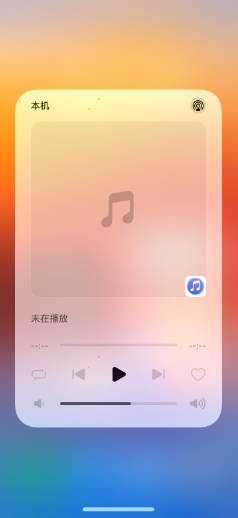
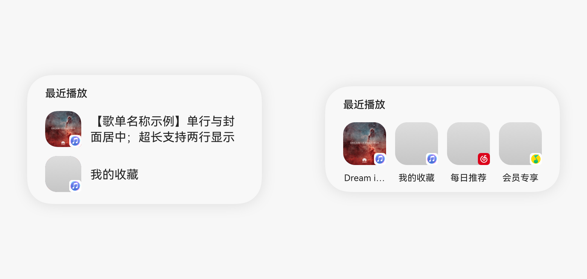

# 快捷播放

更新时间：2026-03-09 02:50:43

来源：https://developer.huawei.com/consumer/cn/doc/harmonyos-guides/quick-playback

针对音乐/听书类应用，播控中心提供一系列快捷播放能力，包括一键启动冷启动续播以及历史歌单与推荐歌单功能，其中歌单功能中支持显示的音频媒体内容有：音乐歌单、有声书专辑、播客专辑等。视频媒体内容、直播类媒体内容暂不支持歌单。应用选择PlayMusicList意图（音乐类应用）或者PlayAudio意图（听书类应用）其一，注册并适配[意图调用](https://developer.huawei.com/consumer/cn/doc/harmonyos-guides/intents-habit-rec-access-programme)，即可实现接入上述三个功能，具体实现参考[历史歌单](https://developer.huawei.com/consumer/cn/doc/harmonyos-guides/avsession-access-scene#历史歌单)。
  

#### 播放按钮一键冷启动播放

 
 
**自验证关注点：** 用户在应用内播放后，上滑结束应用进程，再进入播控中心，点击播放键查看是否正常拉起应用播放，播控中心是否正确显示当前播放信息及播放状态。
  

 

 
  

#### 历史歌单/歌单推荐

 
 
**自验证关注点：**
  1. 应用内播放多个歌单/专辑等，进入播控中心，查看播控卡片下方是否正确显示播放的列表，点击任意播放列表，是否能正常切换播放。
2. 销毁应用进程，再次进入播控中心，查看播控卡片下方是否正确显示播放的列表，点击任意播放列表，是否能正常冷启动播放对应歌单/专辑内容。
  

 
- 显示规则

  应用根据用户播放当前音频媒体时选择的入口，向播控提供对应的歌单信息。歌单信息仅包括：歌单封面（图片显示规则等同于[媒体封面](https://developer.huawei.com/consumer/cn/doc/harmonyos-guides/basic-playback-control#媒体封面)）、歌单标题（不支持显示副标题）、歌单唯一Id（应用内可识别并播放对应歌单）。
- 交互规则

  歌单分为 “最近播放” 的历史歌单，和 “为你推荐” 的个性化歌单；分别通过用户播放行为记录和应用推荐产生。

  用户如未开启 “播控推荐服务”，歌单列表仅展示 “最近播放”。播控会记录用户播放过的音频内容所属的歌单信息。如果多个音频内容同属一个歌单，则只记录为一个歌单信息。最多可展示 4 个最近播放的歌单。

  如果用户开启了 “[播控推荐服务](https://developer.huawei.com/consumer/cn/doc/harmonyos-guides/avsession-recommendation)”，歌单列表展示 “为你推荐”。最多可展示 8 个基于算法推荐的歌单。

  

