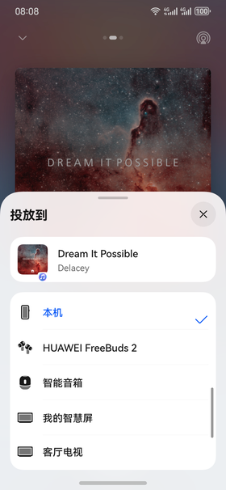
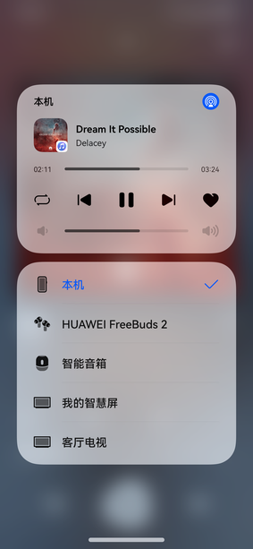

# 音视频投播

更新时间：2026-03-09 02:50:43

来源：https://developer.huawei.com/consumer/cn/doc/harmonyos-guides/avcastpicker

针对音视频类应用，播控中心提供系统级设备切换、投播能力选择入口，提供音视频发声设备统一投播组件。应用通过接入统一投播组件，可以实现在应用内及系统播控中心，将应用音视频资源通过Cast+协议/DLNA协议投播到远端设备。应用需先按自检要求接入[基础播控](https://developer.huawei.com/consumer/cn/doc/harmonyos-guides/basic-playback-control)，才可正常接入音视频投播组件。

## 基础投播能力

## Cast+协议音视频投播/DLNA协议音视频投播

**自验证关注点：** 播放可投播的音视频资源，点击投播至3.1以上的华为智慧屏/DLNA协议的设备，查看投播功能是否正常可用，且在应用内及系统播控中心内能控制远端投播。  界面是否正确显示Picker。 如不显示，排查是否按自检要求正确适配了[基础播控](https://developer.huawei.com/consumer/cn/doc/harmonyos-guides/basic-playback-control)。  双端设备联网后，是否可以在应用内及播控中心显示可投播设备列表。 如不显示，排查是否设置了setExtras({requireAbilityList: ['url-cast']})，具体参考[投播开发指南](https://developer.huawei.com/consumer/cn/doc/harmonyos-guides/distributed-playback-guide)。  点击可投播设备后，对端设备是否可以正常播放。 如对端黑屏/不显示播放内容，应用自排查是否正确设置了资源链接，正确调用prepare及start接口，具体参考[投播开发指南](https://developer.huawei.com/consumer/cn/doc/harmonyos-guides/distributed-playback-guide)。  投播后，在系统播控中心是否可正常控制远端投播的播放暂停、上下一集、进度控制、音量调节等。 应用按照实际功能的有无，参照自检表注册必需的控制指令，例如on(type: 'playbackStateChange')来监听播控及远端设备的播放暂停指令，具体控制指令的开发参考[投播开发指南](https://developer.huawei.com/consumer/cn/doc/harmonyos-guides/distributed-playback-guide)。

## DRM数字加密视频投播

**自验证关注点：** 播放可投播的DRM数字加密视频资源，点击投播至3.1以上的华为智慧屏，或支持DRM硬件解码的大屏设备，查看投播功能是否正常可用。

## 投播能力增强

## 镜像投屏自动切换资源投播

**自验证关注点：** 在控制中心发起无线投屏后，在应用内播放可投播的音视频资源，查看是否自动切换为资源投播模式（Cast+协议音视频投播/DLNA协议音视频投播）。   用户通过“无线投屏”功能实现手机等设备和大屏等的镜像投屏，然后打开视频应用进入视频播放，此时应用需切换到资源投播。具体实现可参考[镜像投屏自动切换资源投播](https://developer.huawei.com/consumer/cn/doc/harmonyos-guides/distributed-playback-guide#镜像投屏自动切换资源投播)。
