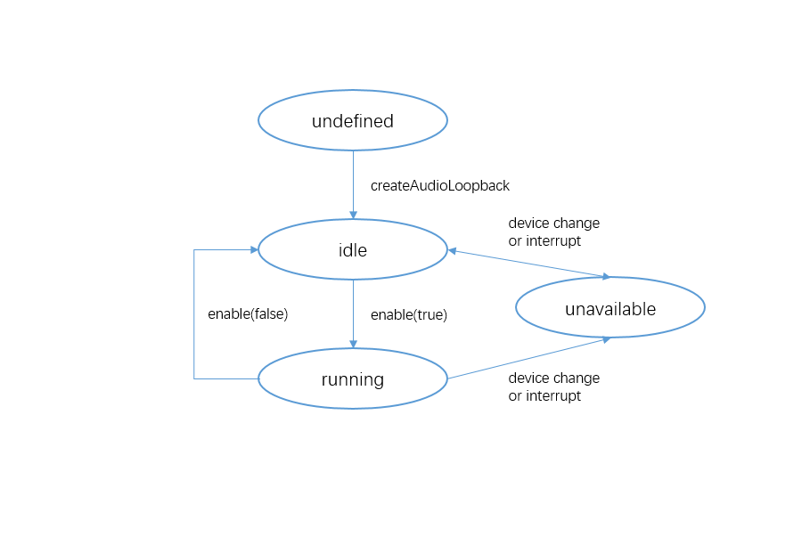

# 实现音频低时延耳返

更新时间：2026-05-26 06:48:54

来源：https://developer.huawei.com/consumer/cn/doc/harmonyos-guides/audio-ear-monitor-loopback

从API version 20开始，支持音频低时延耳返。

AudioLoopback是音频返听器，可将音频以更低时延的方式实时传输到耳机中，让用户可以实时听到自己或者其他的相关声音。

常用于K歌类应用，将录制的人声和背景音乐实时传送到耳机中，使用户通过反馈即时进行调整，获得更好的使用体验。

当启用音频返听时，系统会创建低时延渲染器与低时延采集器，实现低时延耳返功能。采集的音频直接通过内部路由返回到渲染器。对于渲染器，其音频焦点策略与[STREAM_USAGE_MUSIC](https://developer.huawei.com/consumer/cn/doc/harmonyos-references/arkts-apis-audio-e#streamusage)相匹配。对于采集器，其音频焦点策略与[SOURCE_TYPE_MIC](https://developer.huawei.com/consumer/cn/doc/harmonyos-references/arkts-apis-audio-e#sourcetype8)相匹配。

输入/输出设备由系统自动选择。如果当前输入/输出不支持低时延，则音频返听无法启用。在运行过程中，如果音频焦点被另一个音频流抢占，输入/输出设备切换到不支持低时延的设备，系统会自动禁用音频返听。


##### 使用前提

 - 当前仅支持通过有线耳机实现低时延返听功能，音频由有线耳机进行采集并播放。
 - 低功耗渲染器和低时延渲染器在API version 20不能实现并发。若要启用渲染器，建议采用[STREAM_USAGE_UNKNOWN](https://developer.huawei.com/consumer/cn/doc/harmonyos-references/arkts-apis-audio-e#streamusage)；系统内决策采用[STREAM_USAGE_MUSIC](https://developer.huawei.com/consumer/cn/doc/harmonyos-references/arkts-apis-audio-e#streamusage)创建普通渲染器。


##### 开发指导

使用AudioLoopback音频返听涉及到[isAudioLoopbackSupported](https://developer.huawei.com/consumer/cn/doc/harmonyos-references/arkts-apis-audio-audiostreammanager#isaudioloopbacksupported20)返听能力查询、AudioLoopback实例创建、返听音量设置、返听状态监听与返听启用禁用等。本开发指导将以一次启用返听的过程为例，向开发者讲解如何使用AudioLoopback进行音频返听，建议搭配[AudioLoopback](https://developer.huawei.com/consumer/cn/doc/harmonyos-references/arkts-apis-audio-audioloopback)的API说明阅读。

下图展示了AudioLoopback的状态变化。在创建实例后，调用对应的方法可以进入指定的状态实现对应行为。

需要注意的是在确定的状态执行不合适的方法可能导致AudioLoopback发生错误，建议开发者在调用状态转换的方法前进行状态检查，避免程序运行产生预期以外的结果。

**AudioLoopback状态变化示意图**





使用[on('statusChange')](https://developer.huawei.com/consumer/cn/doc/harmonyos-references/arkts-apis-audio-audioloopback#onstatuschange20)方法可以监听AudioLoopback的状态变化，每个状态对应值与说明见[AudioLoopbackStatus](https://developer.huawei.com/consumer/cn/doc/harmonyos-references/arkts-apis-audio-e#audioloopbackstatus20)。


##### 开发步骤及注意事项

以下各步骤示例为片段代码，可通过示例代码右下方链接获取[完整示例](https://gitcode.com/openharmony/applications_app_samples/blob/master/code/DocsSample/Media/Audio/AudioCaptureSampleJS)。
1. 查询返听能力并创建AudioLoopback实例，音频返听模式可以查看[AudioLoopbackMode](https://developer.huawei.com/consumer/cn/doc/harmonyos-references/arkts-apis-audio-e#audioloopbackmode20)。

  
> [!NOTE]
> 返听需要申请麦克风权限ohos.permission.MICROPHONE，申请方式参考： 向用户申请授权 。


  
```ArkTS
import { audio } from '@kit.AudioKit'; // 导入audio模块。
import { BusinessError } from '@kit.BasicServicesKit'; // 导入BusinessError。
// ...
let mode: audio.AudioLoopbackMode = audio.AudioLoopbackMode.HARDWARE;
let audioLoopback: audio.AudioLoopback | undefined = undefined;
// ...
  let isSupported = audio.getAudioManager().getStreamManager().isAudioLoopbackSupported(mode);
  if (isSupported) {
    audio.createAudioLoopback(mode).then((loopback) => {
      console.info('Invoke createAudioLoopback succeeded.');
      // ...
      audioLoopback = loopback;
    }).catch((err: BusinessError) => {
      console.error(`Invoke createAudioLoopback failed, code is ${err.code}, message is ${err.message}.`);
      // ...
    });
  } else {
    console.error('Audio loopback is unsupported.');
    // ...
  }
```

2. 调用[getStatus](https://developer.huawei.com/consumer/cn/doc/harmonyos-references/arkts-apis-audio-audioloopback#getstatus20)方法，查询当前返听状态。

  

 

  音频返听状态受音频焦点、低时延管控、采集与播放设备等因素影响。

  
```ArkTS
import { BusinessError } from '@kit.BasicServicesKit'; // 导入BusinessError。
// ...
    audioLoopback.getStatus().then((status: audio.AudioLoopbackStatus) => {
      console.info(`getStatus success, status is ${status}.`);
      // ...
    }).catch((err: BusinessError) => {
      console.error(`getStatus failed, code is ${err.code}, message is ${err.message}.`);
      // ...
    })
```

3. 调用[setVolume](https://developer.huawei.com/consumer/cn/doc/harmonyos-references/arkts-apis-audio-audioloopback#setvolume20)方法，设置音频返听音量。

  

 

  
在启用返听前设置音量，音量将在启用返听成功后生效。
4. 在启用返听后设置音量，音量将立即生效。
5. 启用返听前未设置音量，启用返听时将采用默认音量0.5。
6. 从API21开始，支持调用[setReverbPreset](https://developer.huawei.com/consumer/cn/doc/harmonyos-references/arkts-apis-audio-audioloopback#setreverbpreset21)方法，设置音频返听的混响模式。

  

 

  
在启用返听前设置混响模式，混响模式将在启用返听成功后生效。
7. 在启用返听后设置混响模式，混响模式将立即生效。
8. 启用返听前未设置混响模式，启用返听时将采用默认混响模式[THEATER](https://developer.huawei.com/consumer/cn/doc/harmonyos-references/arkts-apis-audio-e#audioloopbackreverbpreset21)。
9. 从API21开始，支持调用[getReverbPreset](https://developer.huawei.com/consumer/cn/doc/harmonyos-references/arkts-apis-audio-audioloopback#getreverbpreset21)方法，查询当前的音频返听的混响模式。

  

 

  若未设置混响模式，查询得到将是默认混响模式[THEATER](https://developer.huawei.com/consumer/cn/doc/harmonyos-references/arkts-apis-audio-e#audioloopbackreverbpreset21)。

  
```ArkTS
import { BusinessError } from '@kit.BasicServicesKit'; // 导入BusinessError。
// ...
    try {
      let reverbPreset = audioLoopback.getReverbPreset();
    } catch (err) {
      console.error(`getReverbPreset:ERROR: ${err}`);
      // ...
    }
```

10. 从API21开始，支持调用[setEqualizerPreset](https://developer.huawei.com/consumer/cn/doc/harmonyos-references/arkts-apis-audio-audioloopback#setequalizerpreset21)方法，设置音频返听的均衡器类型。

  

 

  
在启用返听前设置均衡器类型，均衡器类型将在启用返听成功后生效。
11. 在启用返听后设置均衡器类型，均衡器类型将立即生效。
12. 启用返听前未设置均衡器类型，启用返听时将采用默认均衡器类型[FULL](https://developer.huawei.com/consumer/cn/doc/harmonyos-references/arkts-apis-audio-e#audioloopbackequalizerpreset21)。
13. 从API21开始，支持调用[getEqualizerPreset](https://developer.huawei.com/consumer/cn/doc/harmonyos-references/arkts-apis-audio-audioloopback#getequalizerpreset21)方法，查询当前的音频返听的均衡器类型。

  

 

  若未设置均衡器类型，查询得到将是默认均衡器类型[FULL](https://developer.huawei.com/consumer/cn/doc/harmonyos-references/arkts-apis-audio-e#audioloopbackequalizerpreset21)。

  
```ArkTS
import { BusinessError } from '@kit.BasicServicesKit'; // 导入BusinessError。
// ...
    try {
      let equalizerPreset = audioLoopback.getEqualizerPreset();
    } catch (err) {
      console.error(`getEqualizerPreset:ERROR: ${err}`);
      // ...
    }
```

14. 调用[enable](https://developer.huawei.com/consumer/cn/doc/harmonyos-references/arkts-apis-audio-audioloopback#enable20)方法，启用或禁用音频返听功能。

  
```ArkTS
import { BusinessError } from '@kit.BasicServicesKit'; // 导入BusinessError。
// ...
// 设置监听事件，启用音频返听。
async function enable(updateCallback?: (msg: string, isError: boolean) => void): Promise<void> {
  if (audioLoopback !== undefined) {
    try {
      let status = await audioLoopback.getStatus();
      if (status == audio.AudioLoopbackStatus.AVAILABLE_IDLE) {
        // 注册监听。
        audioLoopback.on('statusChange', statusChangeCallback);
        // 启动返听。
        let success = await audioLoopback.enable(true);
        if (success) {
          console.info('Invoke enable succeeded');
          // ...
        } else {
          status = await audioLoopback.getStatus();
          statusChangeCallback(status);
        }
      } else {
        statusChangeCallback(status);
      }
    } catch (err) {
      console.error(`Invoke enable failed, code is ${err.code}, message is ${err.message}.`);
      // ...
    }
  } else {
    console.error('Audio loopback not created.');
    // ...
  }
}

// 禁用音频返听，关闭监听事件。
async function disable(updateCallback?: (msg: string, isError: boolean) => void): Promise<void> {
  if (audioLoopback !== undefined) {
    try {
      let status = await audioLoopback.getStatus();
      if (status == audio.AudioLoopbackStatus.AVAILABLE_RUNNING) {
        // 禁用返听。
        let success = await audioLoopback.enable(false);
        if (success) {
          console.info('Invoke disable succeeded');
          // ...
          // 关闭监听。
          audioLoopback.off('statusChange', statusChangeCallback);
        } else {
          status = await audioLoopback.getStatus();
          statusChangeCallback(status);
        }
      } else {
        statusChangeCallback(status);
      }
    } catch (err) {
      console.error(`Invoke disable failed, code is ${err.code}, message is ${err.message}.`);
      // ...
    }
  } else {
    console.error('Audio loopback not created.');
    // ...
  }
}
```


##### 完整示例

使用AudioLoopback启用音频低时延返听示例代码如下所示。

```ArkTS
import { audio } from '@kit.AudioKit'; // 导入audio模块。
import { BusinessError } from '@kit.BasicServicesKit'; // 导入BusinessError。
import { common, abilityAccessCtrl, PermissionRequestResult } from '@kit.AbilityKit'; // 导入UIAbilityContext。

const TAG = 'AudioLoopbackDemo';
let mode: audio.AudioLoopbackMode = audio.AudioLoopbackMode.HARDWARE;
let audioLoopback: audio.AudioLoopback | undefined = undefined;
let currentReverbPreset: audio.AudioLoopbackReverbPreset = audio.AudioLoopbackReverbPreset.THEATER;
let currentEqualizerPreset: audio.AudioLoopbackEqualizerPreset = audio.AudioLoopbackEqualizerPreset.FULL;
// ...

// ...

// 查询能力，创建实例。
function init(updateCallback?: (msg: string, isError: boolean) => void): void {
  let isSupported = audio.getAudioManager().getStreamManager().isAudioLoopbackSupported(mode);
  if (isSupported) {
    audio.createAudioLoopback(mode).then((loopback) => {
      console.info('Invoke createAudioLoopback succeeded.');
      // ...
      audioLoopback = loopback;
    }).catch((err: BusinessError) => {
      console.error(`Invoke createAudioLoopback failed, code is ${err.code}, message is ${err.message}.`);
      // ...
    });
  } else {
    console.error('Audio loopback is unsupported.');
    // ...
  }
}

// 设置音频返听音量。
async function setVolume(volume: number, updateCallback?: (msg: string, isError: boolean) => void): Promise<void> {
  if (audioLoopback !== undefined) {
    try {
      await audioLoopback.setVolume(volume);
      console.info(`Invoke setVolume ${volume} succeeded.`);
      // ...
    } catch (err) {
      console.error(`Invoke setVolume failed, code is ${err.code}, message is ${err.message}.`);
      // ...
    }
  } else {
    console.error('Audio loopback not created.');
    // ...
  }
}

// 设置音频返听的混响模式。
async function setReverbPreset(preset: audio.AudioLoopbackReverbPreset, updateCallback?: (msg: string,
  isError: boolean) => void): Promise<void> {
  if (audioLoopback !== undefined) {
    try {
      audioLoopback.setReverbPreset(preset);
      console.info(`setReverbPreset( ${preset} succeeded.`);
      // ...
      currentReverbPreset = audioLoopback.getReverbPreset(); // 查询当前的混响模式，防止设置失败。
    } catch (err) {
      console.error(`setReverbPreset( failed, code is ${err.code}, message is ${err.message}.`);
      // ...
    }
  } else {
    console.error('Audio loopback not created.');
    // ...
  }
}

// 设置音频返听的均衡器类型。
async function setEqualizerPreset(preset: audio.AudioLoopbackEqualizerPreset, updateCallback?:
  (msg: string, isError: boolean) => void): Promise<void> {
  if (audioLoopback !== undefined) {
    try {
      audioLoopback.setEqualizerPreset(preset);
      console.info(`setEqualizerPreset ${preset} succeeded.`);
      // ...
      currentEqualizerPreset = audioLoopback.getEqualizerPreset(); // 查询当前的均衡器类型，防止设置失败。
    } catch (err) {
      console.error(`setEqualizerPreset failed, code is ${err.code}, message is ${err.message}.`);
      // ...
    }
  } else {
    console.error('Audio loopback not created.');
    // ...
  }
}

// 设置监听事件，启用音频返听。
async function enable(updateCallback?: (msg: string, isError: boolean) => void): Promise<void> {
  if (audioLoopback !== undefined) {
    try {
      let status = await audioLoopback.getStatus();
      if (status == audio.AudioLoopbackStatus.AVAILABLE_IDLE) {
        // 注册监听。
        audioLoopback.on('statusChange', statusChangeCallback);
        // 启动返听。
        let success = await audioLoopback.enable(true);
        if (success) {
          console.info('Invoke enable succeeded');
          // ...
        } else {
          status = await audioLoopback.getStatus();
          statusChangeCallback(status);
        }
      } else {
        statusChangeCallback(status);
      }
    } catch (err) {
      console.error(`Invoke enable failed, code is ${err.code}, message is ${err.message}.`);
      // ...
    }
  } else {
    console.error('Audio loopback not created.');
    // ...
  }
}

// 禁用音频返听，关闭监听事件。
async function disable(updateCallback?: (msg: string, isError: boolean) => void): Promise<void> {
  if (audioLoopback !== undefined) {
    try {
      let status = await audioLoopback.getStatus();
      if (status == audio.AudioLoopbackStatus.AVAILABLE_RUNNING) {
        // 禁用返听。
        let success = await audioLoopback.enable(false);
        if (success) {
          console.info('Invoke disable succeeded');
          // ...
          // 关闭监听。
          audioLoopback.off('statusChange', statusChangeCallback);
        } else {
          status = await audioLoopback.getStatus();
          statusChangeCallback(status);
        }
      } else {
        statusChangeCallback(status);
      }
    } catch (err) {
      console.error(`Invoke disable failed, code is ${err.code}, message is ${err.message}.`);
      // ...
    }
  } else {
    console.error('Audio loopback not created.');
    // ...
  }
}
```
