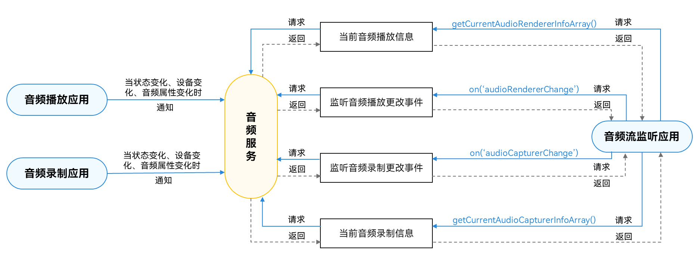

# 音频播放流管理

更新时间：2026-05-26 06:48:54

来源：https://developer.huawei.com/consumer/cn/doc/harmonyos-guides/audio-playback-stream-management

对于播放音频类的应用，开发者需要关注该应用的音频流的状态以做出相应的操作，比如监听到状态为播放中/暂停时，及时改变播放按钮的UI显示。

以下各步骤示例为片段代码，可通过示例代码右下方链接获取[完整示例](https://gitcode.com/openharmony/applications_app_samples/blob/master/code/DocsSample/Media/Audio/AudioRendererSampleJS)。


#### 读取或监听应用内音频流状态变化

参考[使用AudioRenderer开发音频播放功能(ArkTs)](https://developer.huawei.com/consumer/cn/doc/harmonyos-guides/using-audiorenderer-for-playback)或[audio.createAudioRenderer](https://developer.huawei.com/consumer/cn/doc/harmonyos-references/arkts-apis-audio-f#audiocreateaudiorenderer8)，先完成AudioRenderer的创建，再通过以下两种方法查看音频流状态的变化。

 - 方法1：直接查看AudioRenderer的[属性](https://developer.huawei.com/consumer/cn/doc/harmonyos-references/arkts-apis-audio-audiorenderer#属性)state：

  
```ArkTS
import { audio } from '@kit.AudioKit';
// ...
    let audioRendererState: audio.AudioState = audioRenderer.state;
    console.info(`Current state is: ${audioRendererState }`);
```

 - 方法2：注册stateChange监听AudioRenderer的状态变化：

  
```ArkTS
import { audio } from '@kit.AudioKit';
// ...
    audioRenderer.on('stateChange', (rendererState: audio.AudioState) => {
      console.info(`State change to: ${rendererState}`);
      // ...
    });
```


获取state后可对照[AudioState](https://developer.huawei.com/consumer/cn/doc/harmonyos-references/arkts-apis-audio-e#audiostate8)来进行相应的操作，比如更改暂停播放按钮的显示等。


#### 读取或监听所有音频流的变化

如果部分应用需要查询获取所有音频流的变化信息，可以通过AudioStreamManager读取或监听所有音频流的变化。

如下为音频流管理调用关系图：





在进行应用开发的过程中，开发者需要先调用[getStreamManager](https://developer.huawei.com/consumer/cn/doc/harmonyos-references/arkts-apis-audio-audiomanager#getstreammanager9)创建AudioStreamManager实例，进而通过该实例管理音频流。

详细API含义可参考[AudioStreamManager](https://developer.huawei.com/consumer/cn/doc/harmonyos-references/arkts-apis-audio-audiostreammanager)。


#### 开发步骤及注意事项
1. 创建AudioStreamManager实例。

  
```ArkTS
import { audio } from '@kit.AudioKit';
// ...
let audioManager = audio.getAudioManager();
// ...
let audioStreamManager = audioManager.getStreamManager();
```

2. 使用[on('audioRendererChange')](https://developer.huawei.com/consumer/cn/doc/harmonyos-references/arkts-apis-audio-audiostreammanager#onaudiorendererchange9)监听音频播放流的变化。如果音频流监听应用需要在音频播放流状态变化、设备变化时获取通知，可以订阅该事件。

  
```ArkTS
import { audio } from '@kit.AudioKit';
// ...
  audioStreamManager.on('audioRendererChange',  (audioRendererChangeInfoArray: audio.AudioRendererChangeInfoArray) => {
    for (let i = 0; i < audioRendererChangeInfoArray.length; i++) {
      let audioRendererChangeInfo = audioRendererChangeInfoArray[i];
      console.info(`## RendererChange on is called for ${i} ##`);
      console.info(`StreamId for ${i} is: ${audioRendererChangeInfo.streamId}`);
      console.info(`Content ${i} is: ${audioRendererChangeInfo.rendererInfo.content}`);
      console.info(`Stream ${i} is: ${audioRendererChangeInfo.rendererInfo.usage}`);
      console.info(`Flag ${i} is: ${audioRendererChangeInfo.rendererInfo.rendererFlags}`);
      // ...
      for (let j = 0;j < audioRendererChangeInfo.deviceDescriptors.length; j++) {
        console.info(`Id: ${i} : ${audioRendererChangeInfo.deviceDescriptors[j].id}`);
        console.info(`Type: ${i} : ${audioRendererChangeInfo.deviceDescriptors[j].deviceType}`);
        console.info(`Role: ${i} : ${audioRendererChangeInfo.deviceDescriptors[j].deviceRole}`);
        console.info(`Name: ${i} : ${audioRendererChangeInfo.deviceDescriptors[j].name}`);
        console.info(`Address: ${i} : ${audioRendererChangeInfo.deviceDescriptors[j].address}`);
        console.info(`SampleRates: ${i} : ${audioRendererChangeInfo.deviceDescriptors[j].sampleRates[0]}`);
        console.info(`ChannelCount ${i} : ${audioRendererChangeInfo.deviceDescriptors[j].channelCounts[0]}`);
        console.info(`ChannelMask: ${i} : ${audioRendererChangeInfo.deviceDescriptors[j].channelMasks}`);
      }
    }
  });
```

3. （可选）使用[off('audioRendererChange')](https://developer.huawei.com/consumer/cn/doc/harmonyos-references/arkts-apis-audio-audiostreammanager#offaudiorendererchange9)取消监听音频播放流变化。

  
```ArkTS
audioStreamManager.off('audioRendererChange');
console.info('RendererChange Off is called ');
```

4. （可选）使用[getCurrentAudioRendererInfoArray](https://developer.huawei.com/consumer/cn/doc/harmonyos-references/arkts-apis-audio-audiostreammanager#getcurrentaudiorendererinfoarray9)获取所有音频播放流的信息。该接口可获取音频播放流唯一ID、音频渲染器信息以及音频播放设备信息。

  
> [!NOTE]
> 对所有音频流状态进行监听的应用需要 声明权限 ohos.permission.USE_BLUETOOTH，否则无法获得实际的设备名称和设备地址信息，查询到的设备名称和设备地址（蓝牙设备的相关属性）将为空字符串。


  
```ArkTS
import { audio } from '@kit.AudioKit';
// ...
import { BusinessError } from '@kit.BasicServicesKit';
// ...
async function getCurrentAudioRendererInfoArray(): Promise<void> {
  await audioStreamManager.getCurrentAudioRendererInfoArray()
    .then((audioRendererChangeInfoArray: audio.AudioRendererChangeInfoArray) => {
      console.info(`getCurrentAudioRendererInfoArray  Get Promise is called `);
      // ...
      if (audioRendererChangeInfoArray != null) {
        for (let i = 0; i < audioRendererChangeInfoArray.length; i++) {
          let audioRendererChangeInfo = audioRendererChangeInfoArray[i];
          console.info(`StreamId for ${i} is: ${audioRendererChangeInfo.streamId}`);
          console.info(`Content ${i} is: ${audioRendererChangeInfo.rendererInfo.content}`);
          console.info(`Stream ${i} is: ${audioRendererChangeInfo.rendererInfo.usage}`);
          console.info(`Flag ${i} is: ${audioRendererChangeInfo.rendererInfo.rendererFlags}`);
          // ...
          for (let j = 0;j < audioRendererChangeInfo.deviceDescriptors.length; j++) {
            console.info(`Id: ${i} : ${audioRendererChangeInfo.deviceDescriptors[j].id}`);
            console.info(`Type: ${i} : ${audioRendererChangeInfo.deviceDescriptors[j].deviceType}`);
            console.info(`Role: ${i} : ${audioRendererChangeInfo.deviceDescriptors[j].deviceRole}`);
            console.info(`Name: ${i} : ${audioRendererChangeInfo.deviceDescriptors[j].name}`);
            console.info(`Address: ${i} : ${audioRendererChangeInfo.deviceDescriptors[j].address}`);
            console.info(`SampleRates: ${i} : ${audioRendererChangeInfo.deviceDescriptors[j].sampleRates[0]}`);
            console.info(`ChannelCount ${i} : ${audioRendererChangeInfo.deviceDescriptors[j].channelCounts[0]}`);
            console.info(`ChannelMask: ${i} : ${audioRendererChangeInfo.deviceDescriptors[j].channelMasks}`);
          }
        }
      }
    }).catch((err: BusinessError ) => {
      console.error(`Invoke getCurrentAudioRendererInfoArray failed, code is ${err.code}, message is ${err.message}`);
      // ...
    });
}
```
