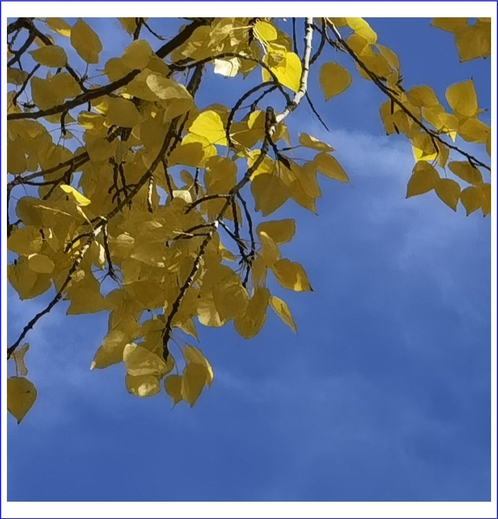
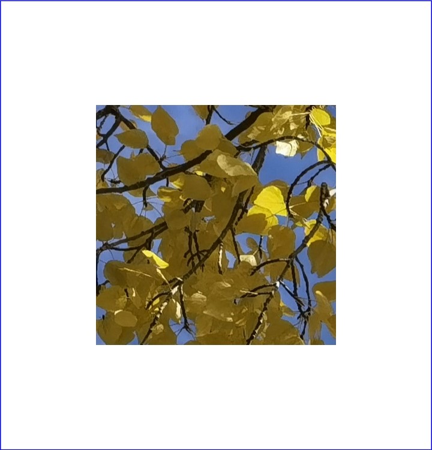
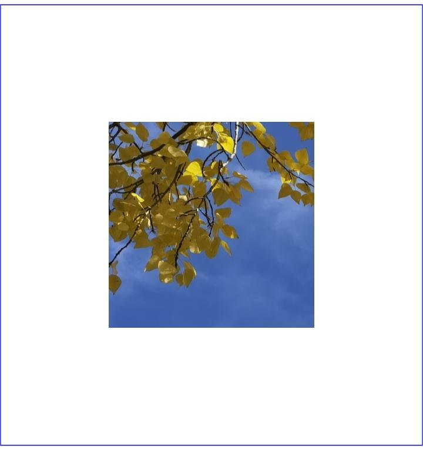
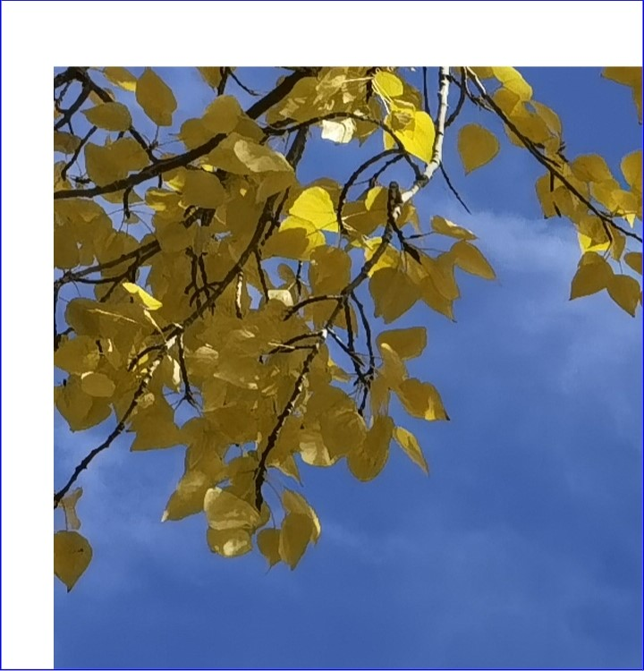
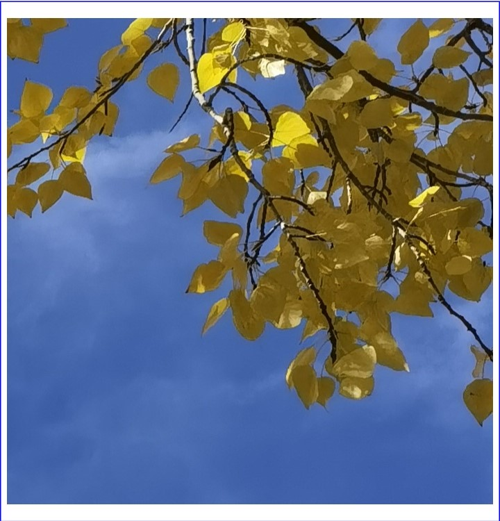

# 使用PixelMap完成图像变换

更新时间：2026-03-09 02:50:43

来源：https://developer.huawei.com/consumer/cn/doc/harmonyos-guides/image-transformation

图片处理指对PixelMap进行相关的操作，如获取图片信息、裁剪、缩放、偏移、旋转、翻转、设置透明度、读写像素数据等。图片处理主要包括图像变换、[位图操作](https://developer.huawei.com/consumer/cn/doc/harmonyos-guides/image-pixelmap-operation)，本文介绍图像变换。


## 开发步骤

图像变换相关API的详细介绍请参见[API参考](https://developer.huawei.com/consumer/cn/doc/harmonyos-references/arkts-apis-image-pixelmap)。 完成[图片解码](https://developer.huawei.com/consumer/cn/doc/harmonyos-guides/image-decoding)，获取PixelMap对象。 获取图片信息。
```text
import { BusinessError } from '@kit.BasicServicesKit';
// 获取图片大小。
pixelMap.getImageInfo().then( (info : image.ImageInfo) => {
  console.info('info.width = ' + info.size.width);
  console.info('info.height = ' + info.size.height);
}).catch((err : BusinessError) => {
  console.error("Failed to obtain the image pixel map information.And the error is: " + err);
});
```

进行图像变换操作。 原图：

裁剪
```text
// x：裁剪起始点横坐标0。
// y：裁剪起始点纵坐标0。
// height：裁剪高度400，方向为从上往下（裁剪后的图片高度为400）。
// width：裁剪宽度400，方向为从左到右（裁剪后的图片宽度为400）。
pixelMap.crop({x: 0, y: 0, size: { height: 400, width: 400 } });
```


缩放
```text
// 宽为原来的0.5。
// 高为原来的0.5。
pixelMap.scale(0.5, 0.5);
```


偏移
```text
// 向下偏移100。
// 向右偏移100。
pixelMap.translate(100, 100);
```


旋转
```text
// 顺时针旋转90°。
pixelMap.rotate(90);
```


翻转
```text
// 垂直翻转。
pixelMap.flip(false, true);
```


```text
// 水平翻转。
pixelMap.flip(true, false);
```


透明度
```text
// 透明度0.5。
pixelMap.opacity(0.5);
```


## 示例代码

[拼图](https://gitcode.com/HarmonyOS_Samples/game-puzzle)
