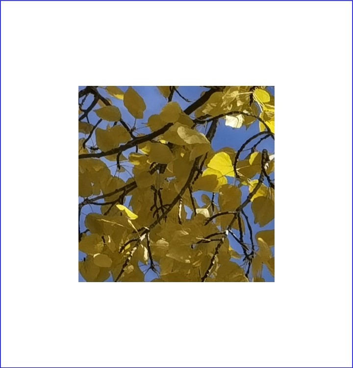
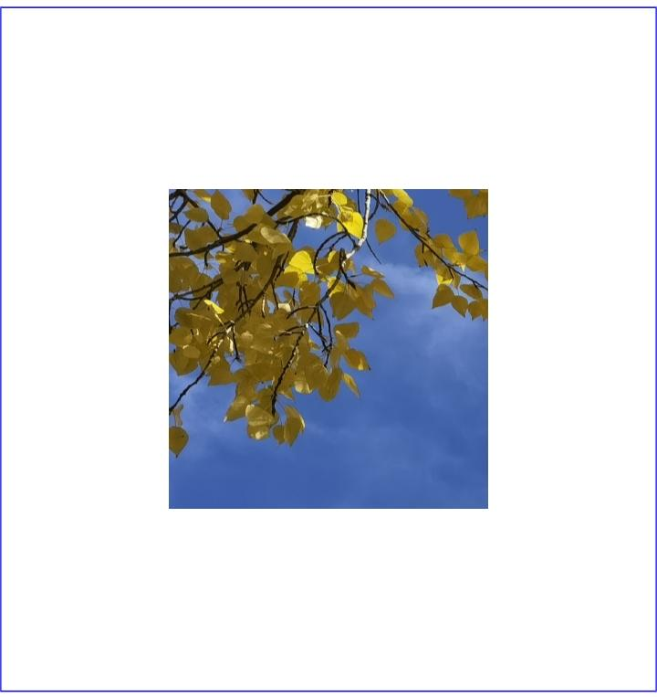
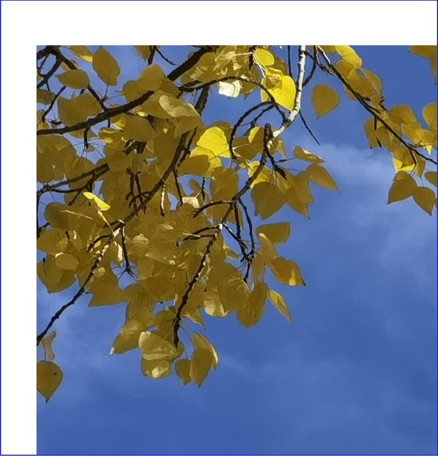
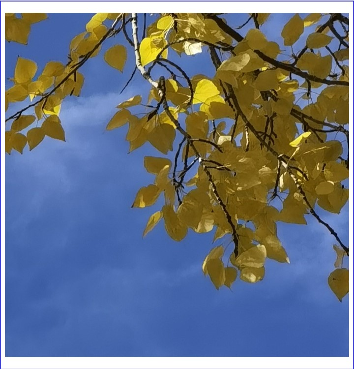
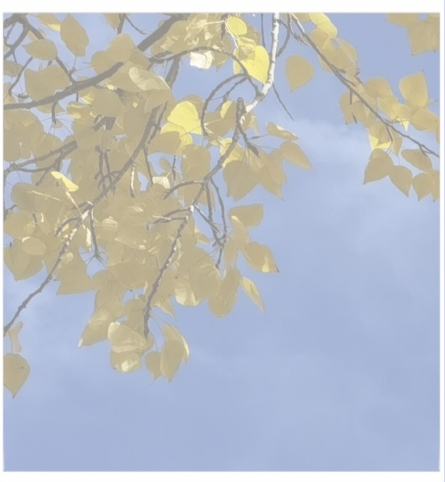

# 使用PixelMap完成图像变换

更新时间：2026-07-28 11:23:46

来源：https://developer.huawei.com/consumer/cn/doc/harmonyos-guides/image-transformation

图片处理指对PixelMap进行相关的操作，如获取图片信息、裁剪、缩放、偏移、旋转、翻转、设置透明度、读写像素数据等。图片处理主要包括图像变换、[位图操作](https://developer.huawei.com/consumer/cn/doc/harmonyos-guides/image-pixelmap-operation)，本文介绍图像变换。


#### 开发步骤

图像变换相关API的详细介绍请参见[Interface (PixelMap)](https://developer.huawei.com/consumer/cn/doc/harmonyos-references/arkts-apis-image-pixelmap)。
1. 完成[图片解码](https://developer.huawei.com/consumer/cn/doc/harmonyos-guides/image-decoding)，获取PixelMap对象。
2. 获取图片信息。

  
```text
// 获取图片大小。
await this.pixelMap.getImageInfo().then((info: image.ImageInfo) => {
  this.imageInfo = info;
  Logger.info('Image width: ', info.size.width.toString());
  Logger.info('Image height: ', info.size.height.toString());
}).catch((err: BusinessError) => {
  Logger.error('Failed to obtain the image pixel map information. The error is: ', String(err));
});
```

3. 进行图像变换操作。

  原图：

  


  
 - 裁剪

  
```text
const imageInfo = this.pixelMap.getImageInfoSync();
const cropWidth = Math.min(400, imageInfo.size.width); // 原图宽度小于400时防止裁剪区域超出范围。
const cropHeight = Math.min(400, imageInfo.size.height); // 原图高度小于400时防止裁剪区域超出范围。
// x：裁剪起始点横坐标0。
// y：裁剪起始点纵坐标0。
// width：原图宽度不小于400时，裁剪宽度400，方向为从左到右（裁剪后的图片宽度为400）。
// height：原图高度不小于400时，裁剪高度400，方向为从上往下（裁剪后的图片高度为400）。
this.pixelMap.crop({ x: 0, y: 0, size: { width: cropWidth, height: cropHeight } }).then(() => {
  // ...
});
```




4. 缩放

  
```text
// 宽为原来的0.5倍。
// 高为原来的0.5倍。
this.pixelMap.scale(0.5, 0.5).then(() => {
  // ...
});
```




5. 平移

  
```text
// 向下平移100。
// 向右平移100。
this.pixelMap.translate(100, 100).then(() => {
  // ...
});
```




6. 旋转

  
```text
// 顺时针旋转90°。
this.pixelMap.rotate(90).then(() => {
  // ...
});
```


7. 翻转

  
```text
// 垂直翻转。
this.pixelMap.flip(false, true).then(() => {
  // ...
});
```


  
```text
// 水平翻转。
this.pixelMap.flip(true, false).then(() => {
  // ...
});
```




8. 透明度

  
```text
// 将所有像素的透明度改为0.5。
this.pixelMap.opacity(0.5).then(() => {
  // ...
});
```




  

  #### 示例代码

  
[拼图](https://gitcode.com/HarmonyOS_Samples/game-puzzle)
