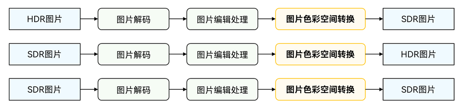

# 图片色彩空间转换

更新时间：2026-04-20 06:34:33

来源：https://developer.huawei.com/consumer/cn/doc/harmonyos-guides/image-csc

调用者可以调用本模块提供的[C API接口](https://developer.huawei.com/consumer/cn/doc/harmonyos-references/capi-imageprocessing)，实现HDR2SDR、SDR2HDR、SDR2SDR的图片色彩空间转换。

 该能力常用于图片编辑中，如下图所示：

 


## 规格说明

**支持的数据输入格式：** 图片色彩空间转换算法为HDR2SDR：
| 输入[ColorSpaceName](https://developer.huawei.com/consumer/cn/doc/harmonyos-references/capi-native-color-space-manager-h#colorspacename) | 输入[HdrMetadataType](https://developer.huawei.com/consumer/cn/doc/harmonyos-references/capi-pixelmap-native-h#oh_pixelmap_hdrmetadatatype) | 输入[PIXEL_FORMAT](https://developer.huawei.com/consumer/cn/doc/harmonyos-references/capi-pixelmap-native-h#pixel_format) | 输出[ColorSpaceName](https://developer.huawei.com/consumer/cn/doc/harmonyos-references/capi-native-color-space-manager-h#colorspacename) | 输出 [HdrMetadataType](https://developer.huawei.com/consumer/cn/doc/harmonyos-references/capi-pixelmap-native-h#oh_pixelmap_hdrmetadatatype) | 输出[PIXEL_FORMAT](https://developer.huawei.com/consumer/cn/doc/harmonyos-references/capi-pixelmap-native-h#pixel_format) |
| --- | --- | --- | --- | --- | --- |
| BT2020_HLG_LIMIT / BT2020_HLG | HDR_METADATA_TYPE_ALTERNATE | PIXEL_FORMAT_YCBCR_P010 / PIXEL_FORMAT_YCRCB_P010 / PIXEL_FORMAT_RGBA_1010102 | SRGB_LIMIT/SRGB | HDR_METADATA_TYPE_BASE | PIXEL_FORMAT_RGBA_8888 / PIXEL_FORMAT_BGRA_8888 |
| BT2020_PQ_LIMIT / BT2020_PQ | HDR_METADATA_TYPE_ALTERNATE | YCBCR_P010 YCRCB_P010 RGBA_1010102 | SRGB_LIMIT/SRGB | HDR_METADATA_TYPE_BASE | PIXEL_FORMAT_RGBA_8888 / PIXEL_FORMAT_BGRA_8888 |
| BT2020_HLG_LIMIT / BT2020_HLG | HDR_METADATA_TYPE_NONE | YCBCR_P010 YCRCB_P010 RGBA_1010102 | SRGB_LIMIT/SRGB | HDR_METADATA_TYPE_BASE | PIXEL_FORMAT_RGBA_8888 / PIXEL_FORMAT_BGRA_8888 |
| BT2020_PQ_LIMIT / BT2020_PQ | HDR_METADATA_TYPE_NONE | YCBCR_P010 YCRCB_P010 RGBA_1010102 | SRGB_LIMIT/SRGB | HDR_METADATA_TYPE_BASE | PIXEL_FORMAT_RGBA_8888 / PIXEL_FORMAT_BGRA_8888 |
| BT2020_HLG_LIMIT / BT2020_HLG | HDR_METADATA_TYPE_ALTERNATE | YCBCR_P010 YCRCB_P010 RGBA_1010102 | DISPLAY_P3_LIMIT/DISPLAY_P3 | HDR_METADATA_TYPE_BASE | PIXEL_FORMAT_RGBA_8888 / PIXEL_FORMAT_BGRA_8888 |
| BT2020_PQ_LIMIT / BT2020_PQ | HDR_METADATA_TYPE_ALTERNATE | YCBCR_P010 YCRCB_P010 RGBA_1010102 | DISPLAY_P3_LIMIT/DISPLAY_P3 | HDR_METADATA_TYPE_BASE | PIXEL_FORMAT_RGBA_8888 / PIXEL_FORMAT_BGRA_8888 |
| BT2020_HLG_LIMIT / BT2020_HLG | HDR_METADATA_TYPE_NONE | YCBCR_P010 YCRCB_P010 RGBA_1010102 | DISPLAY_P3_LIMIT/DISPLAY_P3 | HDR_METADATA_TYPE_BASE | PIXEL_FORMAT_RGBA_8888 / PIXEL_FORMAT_BGRA_8888 |
| BT2020_PQ_LIMIT / BT2020_PQ | HDR_METADATA_TYPE_NONE | YCBCR_P010 YCRCB_P010 RGBA_1010102 | DISPLAY_P3_LIMIT/DISPLAY_P3 | HDR_METADATA_TYPE_BASE | PIXEL_FORMAT_RGBA_8888 / PIXEL_FORMAT_BGRA_8888 |
| BT2020_HLG_LIMIT / BT2020_HLG | HDR_METADATA_TYPE_ALTERNATE | YCBCR_P010 YCRCB_P010 RGBA_1010102 | SRGB_LIMIT/SRGB | HDR_METADATA_TYPE_NONE | PIXEL_FORMAT_RGBA_8888 / PIXEL_FORMAT_BGRA_8888 |
| BT2020_PQ_LIMIT / BT2020_PQ | HDR_METADATA_TYPE_ALTERNATE | YCBCR_P010 YCRCB_P010 RGBA_1010102 | SRGB_LIMIT/SRGB | HDR_METADATA_TYPE_NONE | PIXEL_FORMAT_RGBA_8888 / PIXEL_FORMAT_BGRA_8888 |
| BT2020_HLG_LIMIT / BT2020_HLG | HDR_METADATA_TYPE_NONE | YCBCR_P010 YCRCB_P010 RGBA_1010102 | SRGB_LIMIT/SRGB | HDR_METADATA_TYPE_NONE | PIXEL_FORMAT_RGBA_8888 / PIXEL_FORMAT_BGRA_8888 |
| BT2020_PQ_LIMIT / BT2020_PQ | HDR_METADATA_TYPE_NONE | YCBCR_P010 YCRCB_P010 RGBA_1010102 | SRGB_LIMIT/SRGB | HDR_METADATA_TYPE_NONE | PIXEL_FORMAT_RGBA_8888 / PIXEL_FORMAT_BGRA_8888 |
| BT2020_HLG_LIMIT / BT2020_HLG | HDR_METADATA_TYPE_ALTERNATE | YCBCR_P010 YCRCB_P010 RGBA_1010102 | DISPLAY_P3_LIMIT/DISPLAY_P3 | HDR_METADATA_TYPE_NONE | PIXEL_FORMAT_RGBA_8888 / PIXEL_FORMAT_BGRA_8888 |
| BT2020_PQ_LIMIT / BT2020_PQ | HDR_METADATA_TYPE_ALTERNATE | YCBCR_P010 YCRCB_P010 RGBA_1010102 | DISPLAY_P3_LIMIT/DISPLAY_P3 | HDR_METADATA_TYPE_NONE | PIXEL_FORMAT_RGBA_8888 / PIXEL_FORMAT_BGRA_8888 |
| BT2020_HLG_LIMIT / BT2020_HLG | HDR_METADATA_TYPE_NONE | YCBCR_P010 YCRCB_P010 RGBA_1010102 | DISPLAY_P3_LIMIT/DISPLAY_P3 | HDR_METADATA_TYPE_NONE | PIXEL_FORMAT_RGBA_8888 / PIXEL_FORMAT_BGRA_8888 |
| BT2020_PQ_LIMIT / BT2020_PQ | HDR_METADATA_TYPE_NONE | YCBCR_P010 YCRCB_P010 RGBA_1010102 | DISPLAY_P3_LIMIT/DISPLAY_P3 | HDR_METADATA_TYPE_NONE | PIXEL_FORMAT_RGBA_8888 / PIXEL_FORMAT_BGRA_8888 |

图片色彩空间转换算法为SDR2HDR：
| 输入[ColorSpaceName](https://developer.huawei.com/consumer/cn/doc/harmonyos-references/capi-native-color-space-manager-h#colorspacename) | 输入[HdrMetadataType](https://developer.huawei.com/consumer/cn/doc/harmonyos-references/capi-pixelmap-native-h#oh_pixelmap_hdrmetadatatype) | 输入[PIXEL_FORMAT](https://developer.huawei.com/consumer/cn/doc/harmonyos-references/capi-pixelmap-native-h#pixel_format) | 输出[ColorSpaceName](https://developer.huawei.com/consumer/cn/doc/harmonyos-references/capi-native-color-space-manager-h#colorspacename) | 输出 [HdrMetadataType](https://developer.huawei.com/consumer/cn/doc/harmonyos-references/capi-pixelmap-native-h#oh_pixelmap_hdrmetadatatype) | 输出[PIXEL_FORMAT](https://developer.huawei.com/consumer/cn/doc/harmonyos-references/capi-pixelmap-native-h#pixel_format) |
| --- | --- | --- | --- | --- | --- |
| SRGB_LIMIT | HDR_METADATA_TYPE_NONE | RGBA_8888 | BT2020_HLG | HDR_METADATA_TYPE_ALTERNATE | YCBCR_P010 / RGBA_1010102 |
| DISPLAY_P3_LIMIT | HDR_METADATA_TYPE_NONE | RGBA_8888 | BT2020_HLG | HDR_METADATA_TYPE_ALTERNATE | YCBCR_P010 / RGBA_1010102 |
| SRGB | HDR_METADATA_TYPE_NONE | RGBA_8888 | BT2020_HLG | HDR_METADATA_TYPE_ALTERNATE | YCBCR_P010 / RGBA_1010102 |
| DISPLAY_P3 | HDR_METADATA_TYPE_NONE | RGBA_8888 | BT2020_HLG | HDR_METADATA_TYPE_ALTERNATE | YCBCR_P010 / RGBA_1010102 |
| SRGB | HDR_METADATA_TYPE_NONE | RGBA_8888 | BT2020_HLG | HDR_METADATA_TYPE_NONE | YCBCR_P010 / RGBA_1010102 |
| DISPLAY_P3 | HDR_METADATA_TYPE_NONE | RGBA_8888 | BT2020_HLG | HDR_METADATA_TYPE_NONE | YCBCR_P010 / RGBA_1010102 |
| ADOBE_RGB_1998 | HDR_METADATA_TYPE_NONE | RGBA_8888 BGRA_8888 | BT2020_HLG | HDR_METADATA_TYPE_NONE | YCBCR_P010 / RGBA_1010102 |
| SRGB | HDR_METADATA_TYPE_NONE | RGBA_8888 BGRA_8888 | BT2020_PQ | HDR_METADATA_TYPE_NONE | YCBCR_P010 / RGBA_1010102 |
| DISPLAY_P3 | HDR_METADATA_TYPE_NONE | RGBA_8888 BGRA_8888 | BT2020_PQ | HDR_METADATA_TYPE_NONE | YCBCR_P010 / RGBA_1010102 |
| ADOBE_RGB_1998 | HDR_METADATA_TYPE_NONE | RGBA_8888 BGRA_8888 | BT2020_PQ | HDR_METADATA_TYPE_NONE | YCBCR_P010 / RGBA_1010102 |

图片色彩空间转换算法为SDR2SDR：
| 输入[ColorSpaceName](https://developer.huawei.com/consumer/cn/doc/harmonyos-references/capi-native-color-space-manager-h#colorspacename) | 输入[HdrMetadataType](https://developer.huawei.com/consumer/cn/doc/harmonyos-references/capi-pixelmap-native-h#oh_pixelmap_hdrmetadatatype) | 输入[PIXEL_FORMAT](https://developer.huawei.com/consumer/cn/doc/harmonyos-references/capi-pixelmap-native-h#pixel_format) | 输出[ColorSpaceName](https://developer.huawei.com/consumer/cn/doc/harmonyos-references/capi-native-color-space-manager-h#colorspacename) | 输出 [HdrMetadataType](https://developer.huawei.com/consumer/cn/doc/harmonyos-references/capi-pixelmap-native-h#oh_pixelmap_hdrmetadatatype) | 输出[PIXEL_FORMAT](https://developer.huawei.com/consumer/cn/doc/harmonyos-references/capi-pixelmap-native-h#pixel_format) |
| --- | --- | --- | --- | --- | --- |
| SRGB | HDR_METADATA_TYPE_NONE | RGBA_8888, BGRA_8888 | SRGB | HDR_METADATA_TYPE_NONE | RGBA_8888 |
| DISPLAY_P3 | HDR_METADATA_TYPE_NONE | RGBA_8888, BGRA_8888 | SRGB | HDR_METADATA_TYPE_NONE | RGBA_8888 |
| ADOBE_RGB_1998 | HDR_METADATA_TYPE_NONE | RGBA_8888, BGRA_8888 | SRGB | HDR_METADATA_TYPE_NONE | RGBA_8888 |
| SRGB | HDR_METADATA_TYPE_NONE | RGBA_8888, BGRA_8888 | DISPLAY_P3 | HDR_METADATA_TYPE_NONE | RGBA_8888 |
| DISPLAY_P3 | HDR_METADATA_TYPE_NONE | RGBA_8888, BGRA_8888 | DISPLAY_P3 | HDR_METADATA_TYPE_NONE | RGBA_8888 |
| ADOBE_RGB_1998 | HDR_METADATA_TYPE_NONE | RGBA_8888, BGRA_8888 | DISPLAY_P3 | HDR_METADATA_TYPE_NONE | RGBA_8888 |

**分辨率规格：**
| 最小分辨率（单位：像素） | 最大分辨率（单位：像素） |
| --- | --- |
| 32*32 | 8880*8880 |

**内存规格：** 处理的PixelMap对象需为[DMA内存](https://developer.huawei.com/consumer/cn/doc/harmonyos-guides/image-allocator-type-c#内存类型介绍)。

## 开发指导

具体实现可参考[示例工程](https://gitcode.com/HarmonyOS_Samples/DocsSample_MultiMedia/tree/master/UsingImageProcessingToProcessImages)。

## 在 CMake 脚本中链接动态库


```text
add_library(entry SHARED napi_init.cpp ImageProcessing/ImageProcessing.cpp)
target_link_libraries(entry PUBLIC ${BASE_LIBRARY})
```


## ArkTS侧调用的开发步骤

创建8 bit的PixelMap。
```text
let srcPixelMap = nativePix.createPixelMap(this.inputHeight, this.inputWidth);
let outPutPixelMap = nativePix.createPixelMap(this.inputHeight, this.inputWidth);
```

配置色彩空间和元数据信息。
```text
let colorSpaceDISPLAY_P3 : colorSpaceManager.ColorSpaceManager = colorSpaceManager.create(colorSpaceManager.ColorSpace.DISPLAY_P3);
let colorSpaceSrgb : colorSpaceManager.ColorSpaceManager = colorSpaceManager.create(colorSpaceManager.ColorSpace.SRGB);
inputpixelMap.setColorSpace(colorSpaceDISPLAY_P3);
inputpixelMap.setMetadata(image.HdrMetadataKey.HDR_METADATA_TYPE, image.HdrMetadataType.NONE);
outputpixelMap.setColorSpace(colorSpaceSrgb);
outputpixelMap.setMetadata(image.HdrMetadataKey.HDR_METADATA_TYPE, image.HdrMetadataType.NONE);
```


## Native侧调用的开发步骤

添加头文件。
```text
#include
#include
#include
#include
#include
#include
```

（可选）初始化环境。 一般在进程内第一次使用时调用，可提前完成部分耗时操作。
```text
ImageProcessing_ErrorCode ret =  OH_ImageProcessing_InitializeEnvironment();
```

（可选）查询能力支持。建议在使用对应能力前调用。
```text
//输入格式
ImageProcessing_ColorSpaceInfo SRC_INFO;
ImageProcessing_ColorSpaceInfo DST_GAIN_INFO;
ImageProcessing_ColorSpaceInfo DST_INFO;
SRC_INFO.colorSpace = DISPLAY_P3;
SRC_INFO.metadataType = HDR_METADATA_TYPE_NONE;
SRC_INFO.pixelFormat = PIXEL_FORMAT_RGBA_8888;
DST_INFO.colorSpace = SRGB;
DST_INFO.metadataType = HDR_METADATA_TYPE_NONE;
DST_INFO.pixelFormat = PIXEL_FORMAT_RGBA_8888;
//能力查询
bool flag = OH_ImageProcessing_IsColorSpaceConversionSupported(&SRC_INFO, &DST_INFO);
```

创建8 bit的PixelMap。
```text
napi_value ImageProcessing::CreatePixelMap(napi_env env, napi_callback_info info)
{
    napi_value udfVar = nullptr;
    napi_value pixelMap = nullptr;
    napi_value thisVar = nullptr;
    napi_value argValue[2] = {0};
    size_t argCount = 2;
    size_t count = 2;
    if (napi_get_cb_info(env, info, &argCount, argValue, &thisVar, nullptr) != napi_ok || argCount 将ArkTS中的PixelMap转换为C++的PixelMap。
```text
OH_PixelmapNative* srcImg = nullptr;
OH_PixelmapNative_ConvertPixelmapNativeFromNapi(env, argValue[0], &srcImg);
OH_PixelmapNative* dstImg= nullptr;
OH_PixelmapNative_ConvertPixelmapNativeFromNapi(env, argValue[1], &dstImg);
```

  创建图片色彩空间转换模块。 应用可以通过图片处理引擎模块类型来创建图片色彩空间转换模块。示例中的变量说明如下：  instance：图片处理模块实例。IMAGE_PROCESSING_TYPE_COLOR_SPACE_CONVERSION：图片色彩空间转换。预期返回值：IMAGE_PROCESSING_SUCCESS
```text
OH_ImageProcessing* instance = nullptr;
ret = OH_ImageProcessing_Create(&instance, IMAGE_PROCESSING_TYPE_COLOR_SPACE_CONVERSION);
```

  执行算法。
```text
ret = OH_ImageProcessing_ConvertColorSpace(instance, srcImg, dstImg);
```

  释放实例资源。
```text
ret = OH_ImageProcessing_Destroy(instance);
instance = nullptr;
```

  释放初始化环境资源。
```text
ret = OH_ImageProcessing_DeinitializeEnvironment();
```


## 完整示例代码

ArkTS示例代码： [ImageColorSpaceConversion.ets示例代码](https://gitcode.com/HarmonyOS_Samples/DocsSample_MultiMedia/blob/master/UsingImageProcessingToProcessImages/entry/src/main/ets/view/ImageColorSpaceConversionComponent.ets) C++相关示例代码： [CMakeLists.txt示例代码](https://gitcode.com/HarmonyOS_Samples/DocsSample_MultiMedia/blob/master/UsingImageProcessingToProcessImages/entry/src/main/cpp/CMakeLists.txt)  [ImageProcessing.h示例代码](https://gitcode.com/HarmonyOS_Samples/DocsSample_MultiMedia/blob/master/UsingImageProcessingToProcessImages/entry/src/main/cpp/ImageProcessing/ImageProcessing.h)  [ImageProcessing.cpp示例代码](https://gitcode.com/HarmonyOS_Samples/DocsSample_MultiMedia/blob/master/UsingImageProcessingToProcessImages/entry/src/main/cpp/ImageProcessing/ImageProcessing.cpp)
