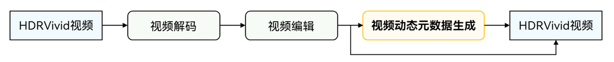

# 视频动态元数据生成

更新时间：2026-04-30 02:41:24

来源：https://developer.huawei.com/consumer/cn/doc/harmonyos-guides/generate-video-dynamic-metadata

调用者可以调用本模块提供的[C API接口](https://developer.huawei.com/consumer/cn/doc/harmonyos-references/capi-videoprocessing)，实现HDRVivid标准动态元数据生成。

 该能力常用于视频编辑中，如下图所示：

 


## 规格说明

当前支持的数据输入格式类型组合如下： 格式类型组合一：
| 参数 | 数据输入格式 |
| --- | --- |
| [ColorSpace](https://developer.huawei.com/consumer/cn/doc/harmonyos-references/capi-buffer-common-h#oh_nativebuffer_colorspace) | OH_COLORSPACE_BT2020_PQ_LIMIT |
| [MetadataType](https://developer.huawei.com/consumer/cn/doc/harmonyos-references/capi-buffer-common-h#oh_nativebuffer_metadatatype) | OH_VIDEO_HDR_VIVID |
| [pixelFormat](https://developer.huawei.com/consumer/cn/doc/harmonyos-references/capi-buffer-common-h#oh_nativebuffer_format) | NATIVEBUFFER_PIXEL_FMT_YCBCR_P010, NATIVEBUFFER_PIXEL_FMT_YCRCB_P010, NATIVEBUFFER_PIXEL_FMT_RGBA_1010102 |

格式类型组合二：
| 参数 | 数据输入格式 |
| --- | --- |
| [ColorSpace](https://developer.huawei.com/consumer/cn/doc/harmonyos-references/capi-buffer-common-h#oh_nativebuffer_colorspace) | OH_COLORSPACE_BT2020_HLG_LIMIT |
| [MetadataType](https://developer.huawei.com/consumer/cn/doc/harmonyos-references/capi-buffer-common-h#oh_nativebuffer_metadatatype) | OH_VIDEO_HDR_VIVID |
| [pixelFormat](https://developer.huawei.com/consumer/cn/doc/harmonyos-references/capi-buffer-common-h#oh_nativebuffer_format) | NATIVEBUFFER_PIXEL_FMT_YCBCR_P010, NATIVEBUFFER_PIXEL_FMT_YCRCB_P010, NATIVEBUFFER_PIXEL_FMT_RGBA_1010102 |

格式类型组合三：
| 参数 | 数据输入格式 |
| --- | --- |
| [ColorSpace](https://developer.huawei.com/consumer/cn/doc/harmonyos-references/capi-buffer-common-h#oh_nativebuffer_colorspace) | OH_COLORSPACE_BT2020_HLG_LIMIT |
| [MetadataType](https://developer.huawei.com/consumer/cn/doc/harmonyos-references/capi-buffer-common-h#oh_nativebuffer_metadatatype) | OH_VIDEO_HDR_HLG |
| [pixelFormat](https://developer.huawei.com/consumer/cn/doc/harmonyos-references/capi-buffer-common-h#oh_nativebuffer_format) | NATIVEBUFFER_PIXEL_FMT_YCBCR_P010, NATIVEBUFFER_PIXEL_FMT_YCRCB_P010, NATIVEBUFFER_PIXEL_FMT_RGBA_1010102 |

格式类型组合四：
| 参数 | 数据输入格式 |
| --- | --- |
| [ColorSpace](https://developer.huawei.com/consumer/cn/doc/harmonyos-references/capi-buffer-common-h#oh_nativebuffer_colorspace) | OH_COLORSPACE_BT2020_PQ_LIMIT |
| [MetadataType](https://developer.huawei.com/consumer/cn/doc/harmonyos-references/capi-buffer-common-h#oh_nativebuffer_metadatatype) | OH_VIDEO_HDR_HDR10 |
| [pixelFormat](https://developer.huawei.com/consumer/cn/doc/harmonyos-references/capi-buffer-common-h#oh_nativebuffer_format) | NATIVEBUFFER_PIXEL_FMT_YCBCR_P010, NATIVEBUFFER_PIXEL_FMT_YCRCB_P010, NATIVEBUFFER_PIXEL_FMT_RGBA_1010102 |

格式类型组合五（从API version 23 开始支持）：
| 参数 | 数据输入格式 |
| --- | --- |
| [ColorSpace](https://developer.huawei.com/consumer/cn/doc/harmonyos-references/capi-buffer-common-h#oh_nativebuffer_colorspace) | OH_COLORSPACE_BT2020_PQ_FULL |
| [MetadataType](https://developer.huawei.com/consumer/cn/doc/harmonyos-references/capi-buffer-common-h#oh_nativebuffer_metadatatype) | OH_VIDEO_HDR_VIVID |
| [pixelFormat](https://developer.huawei.com/consumer/cn/doc/harmonyos-references/capi-buffer-common-h#oh_nativebuffer_format) | NATIVEBUFFER_PIXEL_FMT_RGBA_1010102 |

格式类型组合六（从API version 23 开始支持）：
| 参数 | 数据输入格式 |
| --- | --- |
| [ColorSpace](https://developer.huawei.com/consumer/cn/doc/harmonyos-references/capi-buffer-common-h#oh_nativebuffer_colorspace) | OH_COLORSPACE_BT2020_HLG_FULL |
| [MetadataType](https://developer.huawei.com/consumer/cn/doc/harmonyos-references/capi-buffer-common-h#oh_nativebuffer_metadatatype) | OH_VIDEO_HDR_VIVID |
| [pixelFormat](https://developer.huawei.com/consumer/cn/doc/harmonyos-references/capi-buffer-common-h#oh_nativebuffer_format) | NATIVEBUFFER_PIXEL_FMT_RGBA_1010102 |

格式类型组合七（从API version 23 开始支持）：
| 参数 | 数据输入格式 |
| --- | --- |
| [ColorSpace](https://developer.huawei.com/consumer/cn/doc/harmonyos-references/capi-buffer-common-h#oh_nativebuffer_colorspace) | OH_COLORSPACE_BT2020_HLG_FULL |
| [MetadataType](https://developer.huawei.com/consumer/cn/doc/harmonyos-references/capi-buffer-common-h#oh_nativebuffer_metadatatype) | OH_VIDEO_HDR_HLG |
| [pixelFormat](https://developer.huawei.com/consumer/cn/doc/harmonyos-references/capi-buffer-common-h#oh_nativebuffer_format) | NATIVEBUFFER_PIXEL_FMT_RGBA_1010102 |

格式类型组合八（从API version 23 开始支持）：
| 参数 | 数据输入格式 |
| --- | --- |
| [ColorSpace](https://developer.huawei.com/consumer/cn/doc/harmonyos-references/capi-buffer-common-h#oh_nativebuffer_colorspace) | OH_COLORSPACE_BT2020_PQ_FULL |
| [MetadataType](https://developer.huawei.com/consumer/cn/doc/harmonyos-references/capi-buffer-common-h#oh_nativebuffer_metadatatype) | OH_VIDEO_HDR_HDR10 |
| [pixelFormat](https://developer.huawei.com/consumer/cn/doc/harmonyos-references/capi-buffer-common-h#oh_nativebuffer_format) | NATIVEBUFFER_PIXEL_FMT_RGBA_1010102 |

**支持的分辨率规格：**
| 最小分辨率（单位：像素） | 最大分辨率（单位：像素） |
| --- | --- |
| 32*32 | 8192*8192 |


## 约束与限制

为保障转换效率，建议并行转换不超过5个。  视频动态元数据生成，只支持生成OH_VIDEO_HDR_VIVID类型的动态元数据，转换后会将metadataType修改为OH_VIDEO_HDR_VIVID。  不允许在视频处理回调函数中，直接调用视频处理相关接口或其他耗时操作，请在应用自己的线程中调用。

## 开发指导

具体实现可参考[示例工程](https://gitcode.com/HarmonyOS_Samples/VideoProcessing)。

## 在 CMake 脚本中链接动态库


```text
target_link_libraries(sample PUBLIC libvideo_processing.so)
```


## 开发步骤

添加头文件。
```text
#include
#include
#include
#include
#include
#include
```

（可选）初始化环境。 一般在进程内第一次使用时调用，可提前完成部分耗时操作。
```text
OH_VideoProcessing_InitializeEnvironment();
```

（可选）查询能力支持。建议在使用对应能力前调用。
```text
//输入格式
VideoProcessing_ColorSpaceInfo videoInfo;
videoInfo.metadataType = OH_VIDEO_HDR_HDR10;
videoInfo.colorSpace = OH_COLORSPACE_BT2020_PQ_LIMIT;
videoInfo.pixelFormat = NATIVEBUFFER_PIXEL_FMT_YCBCR_P010;

//输入格式是否支持转换为vivid元数据类型
bool isSupport = OH_VideoProcessing_IsMetadataGenerationSupported(&videoInfo);
```

创建动态元数据生成转换模块。 应用可以通过视频处理引擎模块类型来创建动态元数据生成模块。示例中的变量说明如下：  videoProcessor：动态元数据生成模块实例。VIDEO_PROCESSING_TYPE_METADATA_GENERATION：动态元数据生成类型。预期返回值：VIDEO_PROCESSING_SUCCESS
```text
// 通过指定视频处理引擎类型创建动态元数据生成模块实例
OH_VideoProcessing* videoProcessor = nullptr;
VideoProcessing_ErrorCode ret = OH_VideoProcessing_Create(&videoProcessor, VIDEO_PROCESSING_TYPE_METADATA_GENERATION);
```

配置异步回调函数。
```text
// 回调函数声明（其中userData会传递注册回调时传入的调用者数据，如：this指针）
void OnError(OH_VideoProcessing* videoProcessor, VideoProcessing_ErrorCode error, void* userData);
void OnState(OH_VideoProcessing* videoProcessor, VideoProcessing_State state, void* userData);
void OnNewOutputBuffer(OH_VideoProcessing* videoProcessor, uint32_t index, void* userData);

// 创建回调实例
VideoProcessing_Callback* callback = nullptr;
ret = OH_VideoProcessingCallback_Create(&callback);
// 绑定回调函数
OH_VideoProcessingCallback_BindOnError(callback, OnError);
OH_VideoProcessingCallback_BindOnState(callback, OnState);
OH_VideoProcessingCallback_BindOnNewOutputBuffer(callback, OnNewOutputBuffer);
// 注册回调函数
ret = OH_VideoProcessing_RegisterCallback(videoProcessor, callback, this);
```

（可选）从API version 22 开始，支持配置视频动态元数据生成的风格模式，当前有对比度风格模式和亮度风格模式两种，若不配置则默认为对比度风格模式。
```text
// 创建format实例
OH_AVFormat* parameter = OH_AVFormat_Create();
// 指定为亮度风格模式
OH_AVFormat_SetIntValue(parameter, VIDEO_METADATA_GENERATOR_STYLE_CONTROL, VIDEO_METADATA_GENERATOR_BRIGHT_MODE);
// 配置参数
OH_VideoProcessing_SetParameter(videoProcessor, parameter);
// 销毁format实例
OH_AVFormat_Destroy(parameter);
```

获取Surface。
```text
//获取输入surface
OHNativeWindow *inWindow = nullptr;
ret = OH_VideoProcessing_GetSurface(videoProcessor, &inWindow);
```

设置Surface。
> [!NOTE]
> 可以通过XComponent等其他方式获取OHNativeWindow实例，具体参见NativeWindows开发指导。  视频处理引擎的SetSurface的windowOut从XComponent的OnSurfaceCreatedCB回调函数获取，需要对windowOut设置元数据类型、数据格式和颜色空间等参数。


```text
// 设置元数据类型、数据格式、颜色空间
uint8_t metadataType = OH_VIDEO_HDR_HLG;
OH_NativeWindow_SetMetadataValue(windowOut, OH_HDR_METADATA_TYPE, sizeof(uint8_t),
(uint8_t *)&metadataType);
OH_NativeBuffer_Format format = NATIVEBUFFER_PIXEL_FMT_YCBCR_P010;
OH_NativeWindow_NativeWindowHandleOpt(windowOut, SET_FORMAT, format);
OH_NativeBuffer_ColorSpace colorSpace = OH_COLORSPACE_BT2020_HLG_LIMIT;
OH_NativeWindow_SetColorSpace(windowOut, colorSpace);
// 设置输出surface
VideoProcessing_ErrorCode ret = OH_VideoProcessing_SetSurface(videoProcessor, windowOut);
```

调用[OH_VideoProcessing_Start()](https://developer.huawei.com/consumer/cn/doc/harmonyos-references/capi-video-processing-h#oh_videoprocessing_start)启动动态元数据生成处理。
```text
// 开始动态元数据生成转换处理
ret = OH_VideoProcessing_Start(videoProcessor);
```

调用[OH_VideoProcessing_Stop()](https://developer.huawei.com/consumer/cn/doc/harmonyos-references/capi-video-processing-h#oh_videoprocessing_stop)停止动态元数据生成处理。
```text
//停止动态元数据生成处理
ret = OH_VideoProcessing_Stop(videoProcessor);
```

释放处理实例。
```text
OH_VideoProcessingCallback_Destroy(callback);
callback = nullptr;
OH_VideoProcessing_Destroy(videoProcessor);
videoProcessor = nullptr;
```

释放处理资源。
```text
OH_VideoProcessing_DeinitializeEnvironment();
```
