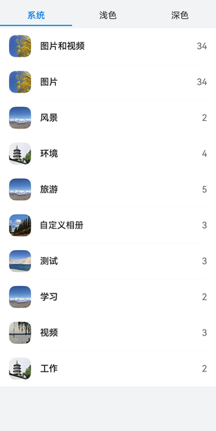

# 使用AlbumPicker组件访问相册列表

更新时间：2026-03-09 02:50:43

来源：https://developer.huawei.com/consumer/cn/doc/harmonyos-guides/component-guidelines-albumpicker

开发者可以在布局中嵌入AlbumPickerComponent组件，通过此组件，应用无需申请权限，即可访问公共目录中的相册列表。

 需配合[使用PhotoPicker组件访问图片/视频](https://developer.huawei.com/consumer/cn/doc/harmonyos-guides/component-guidelines-photoviewpicker)一起使用，用户通过AlbumPickerComponent组件选择对应相册并通知PhotoPickerComponent组件刷新成对应相册的图片和视频。

 界面效果如图所示。

 


## 开发步骤

导入相册组件模块文件。
```text
import {
  AlbumPickerComponent,
  AlbumPickerOptions,
  AlbumInfo,
  PickerColorMode,
  PickerController,
  DataType
} from '@kit.MediaLibraryKit';
```

创建相册组件配置选项实例（AlbumPickerOptions）。  通过AlbumPickerOptions，开发者可配置相册页主题颜色，详见[AlbumPickerOptions API参考](https://developer.huawei.com/consumer/cn/doc/harmonyos-references/ohos-file-albumpickercomponent#albumpickeroptions)。
```text
// 用于相册组件初始化时设置参数信息。
albumOptions: AlbumPickerOptions = new AlbumPickerOptions();
pickerController: PickerController = new PickerController();
```

初始化组件配置选项实例（AlbumPickerOptions）。
```text
/**
 * 设置相册页颜色模式， 默认AUTO。
 * AUTO：跟随系统的模式，LIGHT：浅色模式，DARK：深色模式。
 */
this.albumOptions.themeColorMode = PickerColorMode.AUTO;
```

创建[AlbumPickerComponent](https://developer.huawei.com/consumer/cn/doc/harmonyos-references/ohos-file-albumpickercomponent#albumpickercomponent)组件。
```text
AlbumPickerComponent({
  // 设置组件选择选项实例。
  albumPickerOptions: this.albumOptions,

  /**
   *相册被选中回调，返回相册信息。
   * AlbumInfo（uri）
   */
  onAlbumClick: (albumInfo: AlbumInfo): boolean => this.onAlbumClick(albumInfo),
})
```

与PhotoPicker组件联动，将相册URI给到应用，根据相册URI更新PhotoPicker组件宫格页内容。
```text
private onAlbumClick(albumInfo: AlbumInfo): boolean {
    if (albumInfo?.uri) {
        // 根据相册url更新宫格页内容。
        this.pickerController.setData(DataType.SET_ALBUM_URI, albumInfo.uri);
    }
    return true;
}
```


## 完整示例


```text
import {
  PhotoPickerComponent,
  AlbumPickerComponent,
  AlbumPickerOptions,
  AlbumInfo,
  PickerColorMode,
  PickerController,
  DataType
} from '@kit.MediaLibraryKit';

@Entry
@Component
struct AlbumPage {
  @State pickerController: PickerController = new PickerController();
  @State Width: string = '100%';
  @State Height: string = '100%';
  @State isShowAlbum: boolean = false;
  @State fontColor: string = '#182431222'
  @State selectedFontColor: string = '#007DFF'
  @State currentIndex: number = 0
  private controller: TabsController = new TabsController();
  albumOptions = new AlbumPickerOptions();
  albumOptions1 = new AlbumPickerOptions();
  albumOptions2 = new AlbumPickerOptions();

  /**
   *相册被选中回调，返回相册信息
   * AlbumInfo（uri）
   */
  private onAlbumClick(albumInfo: AlbumInfo): boolean {
    this.isShowAlbum = false;
    if (albumInfo?.uri) {
      //  根据相册url更新宫格页内容。
      this.pickerController.setData(DataType.SET_ALBUM_URI, albumInfo.uri);
    }
    return true;
  }

  aboutToAppear() {
    /**
     * 设置相册页颜色模式， 默认AUTO。
     * AUTO：跟随系统的模式， LIGHT：浅色模式， DARK：深色模式
     */
    this.albumOptions.themeColorMode = PickerColorMode.AUTO;
    this.albumOptions1.themeColorMode = PickerColorMode.LIGHT;
    this.albumOptions2.themeColorMode = PickerColorMode.DARK;
  }

  // 设置导航栏的样式
  @Builder
  tabBuilder(index: number, name: string) {
    Column() {
      Text(name)
        .fontColor(this.currentIndex === index ? this.selectedFontColor : this.fontColor)
        .fontSize(16)
        .fontWeight(this.currentIndex === index ? 500 : 400)
        .lineHeight(22)
        .margin({ top: 17, bottom: 7 })
      Divider()
        .strokeWidth(2)
        .color('#007DFF')
        .opacity(this.currentIndex === index ? 1 : 0)
    }.width('100%')
  }

  build() {
    Stack() {
      Column() {
        Row() {
          Button("全部相册").width('95%').height('5%').onClick(() => {
            this.isShowAlbum = true;
          })
        }.margin({ top: 40 })
        Column() {
          PhotoPickerComponent({
            pickerController: this.pickerController,
          }).height(this.Height).width(this.Width)
        }.width('100%').height('100%').alignItems(HorizontalAlign.Center).visibility(this.isShowAlbum ? Visibility.None: Visibility.Visible)
      }

      if (this.isShowAlbum) {
        Row() {
          Column() {
            /**
             * 使用3个组件,以便更好展示不同效果。
             * 需要注意的是切换tab会导致AlbumPickerComponent覆盖在PhotoPickerComponent上导致点击事件失效，
             * 设置PhotoPickerComponent不可见可以规避点击失效。
             */
            Tabs({ barPosition: BarPosition.Start, index: this.currentIndex, controller: this.controller }) {
              TabContent() {
                AlbumPickerComponent({
                  albumPickerOptions: this.albumOptions,
                  onAlbumClick: (albumInfo: AlbumInfo): boolean => this.onAlbumClick(albumInfo),
                }).height('100%').width('100%')
              }.tabBar(this.tabBuilder(0, '系统'))
              TabContent() {
                AlbumPickerComponent({
                  albumPickerOptions: this.albumOptions1,
                  onAlbumClick: (albumInfo: AlbumInfo): boolean => this.onAlbumClick(albumInfo),
                }).height('100%').width('100%')
              }.tabBar(this.tabBuilder(1, '浅色'))

              TabContent() {
                AlbumPickerComponent({
                  albumPickerOptions: this.albumOptions2,
                  onAlbumClick: (albumInfo: AlbumInfo): boolean => this.onAlbumClick(albumInfo),
                }).height('100%').width('100%')
              }.tabBar(this.tabBuilder(2, '深色'))
            }
            .vertical(false)
            .barMode(BarMode.Fixed)
            .barWidth('100%')
            .barHeight(56)
            .animationDuration(100)
            .onChange((index: number) => {
              this.currentIndex = index;
            })
            .width('100%')
            .height('100%')
            .backgroundColor('#F1F3F5')
          }.width('100%').height('100%').justifyContent(FlexAlign.Center).alignItems(HorizontalAlign.Center)
        }
        .margin({ top: 40 })
      }
    }
  }
}
```
