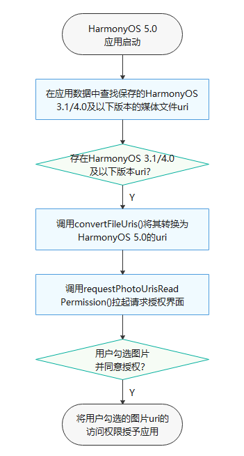
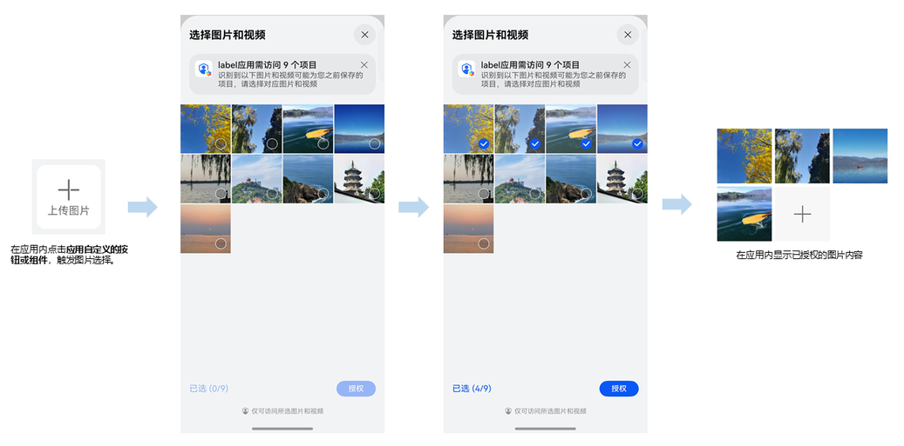

# 设备升级继承媒体文件访问权限

更新时间：2026-04-24 08:10:21

来源：https://developer.huawei.com/consumer/cn/doc/harmonyos-guides/medialibrary-request-photouris-permission

应用在HarmonyOS 3.1 Release API 9及更低版本运行时，有图片/视频访问权限，并在应用内记录对应的图片/视频文件路径或uri，在进入应用特定界面时，可实时访问图片/视频显示内容。
 
但在设备从HarmonyOS 3.1 Release API 9及更低版本升级至HarmonyOS 5.0.2及以上版本时，图片、视频等媒体文件的访问方式发生变化，应用无法使用原来的文件路径或uri访问媒体文件，且新版本上应用默认没有权限直接访问图片/视频。在新版本上，应用需要向用户发起请求，用户同意后，可继承原有的媒体文件访问权限。
 
本指南将帮助开发者了解如何在升级后，继承媒体文件的访问权限。
 



 
应用在启动或是进入对应的业务界面之后，从应用数据中获取在HarmonyOS 3.1/4.0版本的应用上已有权限且需要继承权限的媒体文件uri，调用Scenario Fusion Kit的接口[convertFileUris](https://developer.huawei.com/consumer/cn/doc/harmonyos-references/scenario-fusion-fileuriresult#convertfileuris)，获取转换后的HarmonyOS 5.0可访问的uri。再调用Media Library Kit的接口[requestPhotoUrisReadPermission()](https://developer.huawei.com/consumer/cn/doc/harmonyos-references/arkts-apis-photoaccesshelper-photoaccesshelper#requestphotourisreadpermission14)，输入需要继承访问权限的媒体文件uri，拉起授权界面。在授权界面，根据应用输入的uri，将显示对应图片/视频缩略图。用户可以勾选对应的图片/视频，并同意授权，此时应用将获取该图片/视频的访问权限。
 
在用户界面的效果如图所示。
 



  

##### 开发步骤

此处仅展示如何调用Media Library Kit的接口[requestPhotoUrisReadPermission()](https://developer.huawei.com/consumer/cn/doc/harmonyos-references/arkts-apis-photoaccesshelper-photoaccesshelper#requestphotourisreadpermission14)，输入需要继承访问权限的媒体文件uri，拉起授权界面。
 
调用Scenario Fusion Kit的接口[convertFileUris](https://developer.huawei.com/consumer/cn/doc/harmonyos-references/scenario-fusion-fileuriresult#convertfileuris)，获取转换后的HarmonyOS 5.0可访问的uri，请参考[公共目录文件URI继承](https://developer.huawei.com/consumer/cn/doc/harmonyos-guides/code-precautions#公共目录文件uri继承)。
 1. 导入相关接口模块文件。

  
```text
import { photoAccessHelper } from '@kit.MediaLibraryKit';
```

2. 初始化输入的uri列表。

  
```text
// 用于初始化时接口类实例
// 请在组件内获取context，确保this.getUiContext().getHostContext()返回结果为UIAbilityContext
import { common } from '@kit.AbilityKit';
let context: Context = this.getUIContext().getHostContext() as common.UIAbilityContext;
let phAccessHelper: photoAccessHelper.PhotoAccessHelper = photoAccessHelper.getPhotoAccessHelper(context);
```

3. 初始化输入的uri列表并赋值。

  
```text
private uris: Array<string> = new Array<string>();
// 自行对其赋值，输入需要授权的uri信息
this.uris = [];
```

4. 调用接口拉起授权界面。

  
```json
try {
  phAccessHelper.requestPhotoUrisReadPermission(this.uris).then((result: Array<string>) => {
    console.info("requestPhotoUrisReadPermission, result = " + JSON.stringify(result));
    if (result) {
      // 授权成功返回授权后新的uri列表
    } else {
      // 授权失败后的处理
    }
  })
} catch(error) {
  console.error("requestPhotoUrisReadPermission error: " + JSON.stringify(error));
}
```

 
  

##### 完整示例

```json
import { photoAccessHelper } from '@kit.MediaLibraryKit';
import { common } from '@kit.AbilityKit';
@Entry
@Component
struct Index{
  private uris: Array<string> = new Array<string>();

  build() {
    Row() {
      Column() {
        Button("拉起授权界面").width('100%').height('10%').margin({top: 150})
          .onClick(()=>{
            // 自行对其赋值，输入需要授权的uri信息
            this.uris = [];
            let context: Context = this.getUIContext().getHostContext() as common.UIAbilityContext;
            let phAccessHelper: photoAccessHelper.PhotoAccessHelper = photoAccessHelper.getPhotoAccessHelper(context);
            try {
              phAccessHelper.requestPhotoUrisReadPermission(this.uris).then((result: Array<string>) => {
                console.info("requestPhotoUrisReadPermission, result = " + JSON.stringify(result));
                if (result) {
                  // 授权成功返回授权后新的uri列表
                } else {
                  // 授权失败后的处理
                }
              })
            } catch(error) {
              console.error("requestPhotoUrisReadPermission error: " + JSON.stringify(error));
            }
          })
      }
      .width('100%')
    }
    .height('100%')
  }
}
```
