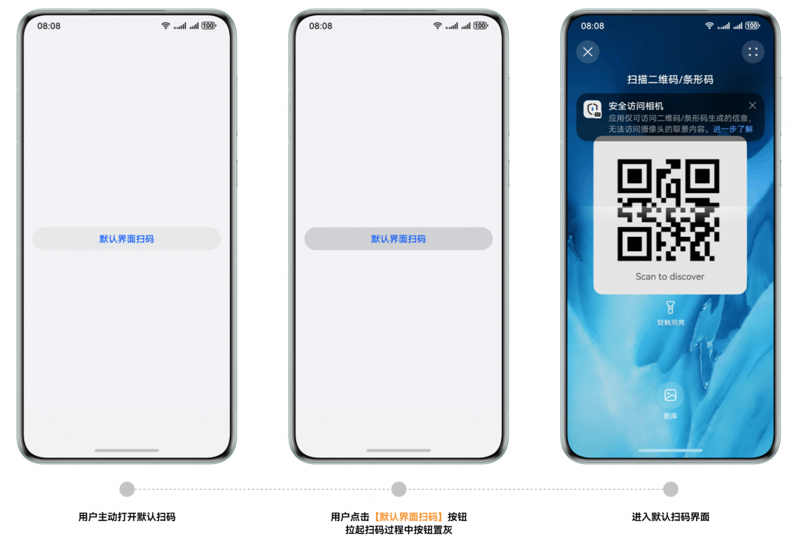

# 默认界面扫码/自定义界面扫码体验设计

更新时间：2026-04-20 06:34:33

来源：https://developer.huawei.com/consumer/cn/doc/harmonyos-guides/scan-faq-16

**问题现象**
 
点击按钮后，无法确认是否正在拉起扫码功能。
 
**解决措施**
 
点击按钮拉起默认界面扫码或自定义界面扫码后，将按钮置灰，说明正在拉起扫码功能，以“默认界面扫码”按钮为例：
 

