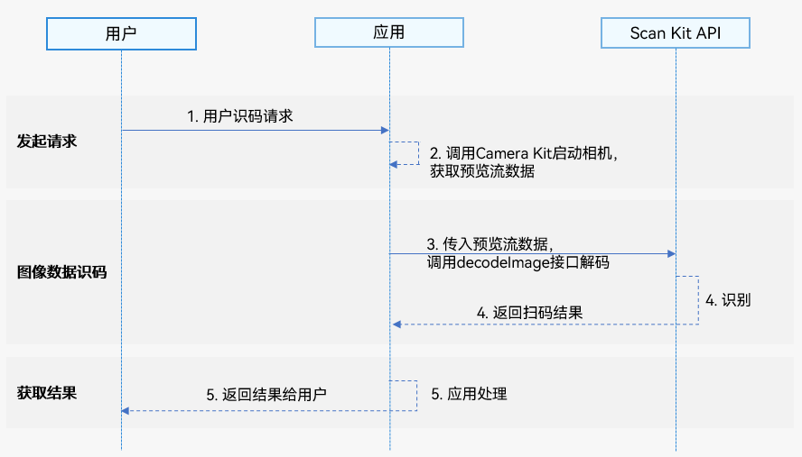

# 识别图像数据

更新时间：2026-04-28 03:31:56

来源：https://developer.huawei.com/consumer/cn/doc/harmonyos-guides/scan-decodeimage

##### 基本概念

图像数据识码能力支持对相机预览流数据中的码图进行扫描识别，并获取信息。


##### 场景介绍

图像数据识码能力支持对相机预览流数据中的条形码、二维码、MULTIFUNCTIONAL CODE进行识别，并获得码类型、码值、码位置、相机变焦比等信息。该能力可用于一图单码和一图多码的识别，比如条形码、付款码等。


##### 业务流程




1. 用户向应用发起识码请求。
2. 应用通过调用[Camera Kit](https://developer.huawei.com/consumer/cn/doc/harmonyos-guides/camera-overview)启动相机，获取预览流数据。
3. 应用通过调用Scan Kit的decodeImage接口识别码图。
4. Scan Kit通过回调返回识别结果。
5. 应用向用户返回扫码结果。


##### 接口说明

识别图像数据中的码图，以Promise形式返回识别结果。具体API说明详见[接口文档](https://developer.huawei.com/consumer/cn/doc/harmonyos-references/scan-imagedecode)。

| 接口名 | 描述 |
| --- | --- |
| decodeImage(image: ByteImage, options?: scanBarcode.ScanOptions): Promise&lt;DetectResult&gt; | 启动图像识码，通过传入ByteImage类型的图像数据信息，使用Promise异步回调返回识码结果。 |


##### 开发步骤

图像数据识码能力支持对相机预览流数据中的条形码、二维码、MULTIFUNCTIONAL CODE进行识别，并返回码类型、码值、码位置（码图最小外接矩形左上角和右下角的坐标，QR码支持返回四个点坐标）、相机变焦比等信息。

为了方便开发者接入，我们提供了详细的样例工程供参考，推荐参考[示例工程](https://gitcode.com/HarmonyOS_Samples/scankit-samplecode-clientdemo-arkts)接入。

以下示例为调用detectBarcode.decodeImage接口获取码图信息。
1. 导入图像识码接口和相关接口模块，该模块提供了图像识码参数和方法，导入方法如下。

  
```text
import { detectBarcode, scanBarcode, scanCore } from '@kit.ScanKit';
import { BusinessError } from '@kit.BasicServicesKit';
import { camera } from '@kit.CameraKit';
import { image } from '@kit.ImageKit';
import { hilog } from '@kit.PerformanceAnalysisKit';
```

2. 使用Camera Kit启动相机能力，实现双路预览功能，具体实现详见[双路预览](https://developer.huawei.com/consumer/cn/doc/harmonyos-guides/camera-dual-channel-preview)。
3. 通过ImageReceiver实时获取预览图像数据，详见[双路预览](https://developer.huawei.com/consumer/cn/doc/harmonyos-guides/camera-dual-channel-preview)，调用detectBarcode.decodeImage接口解析图像数据。请在识别完成后再释放图像数据。

  
```json
// 从ImageReceiver获取imgComponent: image.Component，预览流设置的宽高: width, height
function decodeImageBuffer(imgComponent: image.Component, width: number, height: number) {
  let byteImg: detectBarcode.ByteImage = {
    byteBuffer: imgComponent.byteBuffer,
    // 相机预览流数据旋转90°
    width: height,
    height: width,
    format: detectBarcode.ImageFormat.NV21
  };
  let options: scanBarcode.ScanOptions = {
    scanTypes: [scanCore.ScanType.ALL],
    enableMultiMode: true,
    enableAlbum: false
  };
  try {
    detectBarcode.decodeImage(byteImg, options).then((data: detectBarcode.DetectResult) => {
      hilog.info(0x0001, '[Scan Sample]',
        `Succeeded in getting DetectResult by promise with options, result is ${JSON.stringify(data)}`);
    }).catch((err: BusinessError) => {
      hilog.error(0x0001, '[Scan Sample]',
        `Failed to get DetectResult by promise with options. Code: ${err.code}, message: ${err.message}`);
    });
  } catch (err) {
    hilog.error(0x0001, '[Scan Sample]', `Failed to detectBarcode. Code: ${err.code}, message: ${err.message}`);
  }
}
```

4. detectBarcode.[DetectResult](https://developer.huawei.com/consumer/cn/doc/harmonyos-references/scan-imagedecode#detectresult)中返回的cornerPoints可参考以下说明使用。

  
因为屏幕自然方向和摄像头传感器方向不同，所以cornerPoints四个点的坐标需按屏幕自然方向对应的坐标系转换。四个点的对应转换逻辑如下（假设创建的相机预览流宽高为1080 * 1920）。

  
右下角(x, y)：(1080 - cornerPoints[0].y, cornerPoints[0].x）
5. 左下角(x, y)：(1080 - cornerPoints[1].y, cornerPoints[1].x）
6. 左上角(x, y)：(1080 - cornerPoints[2].y, cornerPoints[2].x）
7. 右上角(x, y)：(1080 - cornerPoints[3].y, cornerPoints[3].x）
8. 当创建的相机预览流宽高和实际预览组件XComponent的宽高不一致时，cornerPoints四个点的坐标需按缩放比例转换。例如相机预览流宽高为1080 * 1920，XComponent的宽高为width * height，则坐标缩放比例ratio为：width / 1080, 最终转换后的坐标为(x * ratio, y * ratio)。


##### 模拟器开发

暂不支持模拟器开发，调用接口会返回错误信息“Emulator is not supported.”
