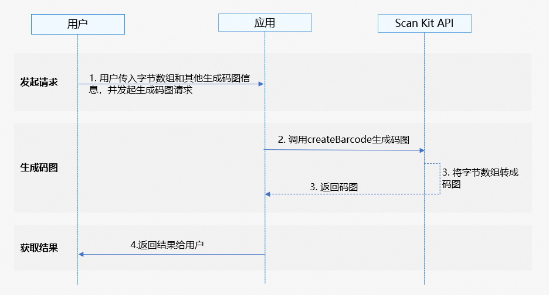

# 通过字节数组生成码图

更新时间：2026-04-28 03:31:56

来源：https://developer.huawei.com/consumer/cn/doc/harmonyos-guides/scan-generatearray

#### 基本概念

码图生成能力支持将字节数组转换为自定义格式的码图。


#### 场景介绍

码图生成能力支持将字节数组转换为自定义格式的码图。

例如：调用码图生成能力，将字节数组转换成交通一卡通二维码使用。


#### 约束与限制

 - 码图生成能力支持Phone、Tablet、Wearable、2in1、TV（从5.1.0(18)版本开始支持Wearable、从5.1.1(19)版本开始支持2in1、TV）。
 - 若Scan Kit识别某码图内容显示内容为乱码，则该码图的字节数组需要通过专门的解码器解析，例如地铁闸机。


#### 业务流程




1. 用户向应用发起生成码图请求后，传入需要生成的码图信息，包括码图的类型、宽高等。
2. 应用通过调用Scan Kit的createBarcode接口启动码图生成能力。
3. Scan Kit通过将字节数组转换为码图并返回给应用。
4. 应用向用户返回生成码图结果。


#### 接口说明

通过字节数组生成码图，以Promise形式生成码图。具体API说明详见[接口文档](https://developer.huawei.com/consumer/cn/doc/harmonyos-references/scan-generatebarcode)。

| 接口名 | 接口描述 |
| --- | --- |
| createBarcode(content: ArrayBuffer, options: CreateOptions): Promise<image.PixelMap> | 码图生成接口，返回生成的码图，类型为image.PixelMap，可以使用Image组件渲染成图片。使用Promise异步回调。 |


#### 开发步骤

码图生成根据传参内容直接生成所需码图，需要传入固定参数和可选参数。

为了方便开发者接入，我们提供了详细的样例工程供参考，推荐参考[示例工程](https://gitcode.com/HarmonyOS_Samples/scankit-samplecode-clientdemo-arkts)接入。

以下示例为调用码图生成能力的createBarcode接口实现码图生成。
1. 导入码图生成接口模块，该模块提供了码图生成的参数和方法，导入方法如下。

  
```text
// 导入码图生成需要的图片模块、错误码模块
import { scanCore, generateBarcode } from '@kit.ScanKit';
import { BusinessError } from '@kit.BasicServicesKit';
import { image } from '@kit.ImageKit';
import { hilog } from '@kit.PerformanceAnalysisKit';
import { buffer } from '@kit.ArkTS';
```

2. 调用码图生成能力的createBarcode接口实现码图生成。

  
通过Promise方式回调，获取生成的码图。         
```text
const TAG: string = 'Create barcode';

@Entry
@Component
struct Index {
  @State pixelMap: image.PixelMap | undefined = undefined;

  build() {
    Flex({ direction: FlexDirection.Column, alignItems: ItemAlign.Center, justifyContent: FlexAlign.Center }) {
      Button('generateBarcode Promise').onClick(() => {
        this.pixelMap = undefined;
        let content: string =
          '0177C10DD10F7768600202312110000063458FD14112345678FFFFD381012610b746365409210201b66636540ad0200020000000000110e617003201000000000000000000000000000000000000000000000000000000000000000000000000000000000000000000000000000000006645fbec664358ECF657CB40693c92da';
        let contentBuffer: ArrayBuffer = buffer.from(content, 'hex').buffer; // 将包含十六进制字符的字符串转换成ArrayBuffer
        let options: generateBarcode.CreateOptions = {
          scanType: scanCore.ScanType.QR_CODE,
          height: 400,
          width: 400
        };
        try {
          // 码图生成接口，成功返回PixelMap格式图片
          generateBarcode.createBarcode(contentBuffer, options).then((pixelMap: image.PixelMap) => {
            this.pixelMap = pixelMap;
            hilog.info(0x0001, TAG, 'Succeeded in creating barCode.');
          }).catch((err: BusinessError) => {
            hilog.error(0x0001, TAG, `Failed to createBarCode. Code: ${err.code}, message: ${err.message}`);
          });
        } catch (err) {
          hilog.error(0x0001, TAG,
            `Failed to createBarcode by Promise with options. Code: ${err.code}, message: ${err.message}`);
        }
      })
      // 获取生成码图后显示
      if (this.pixelMap) {
        Image(this.pixelMap).width(300).height(300).objectFit(ImageFit.Contain)
      }
    }
    .width('100%')
    .height('100%')
  }
}
```


#### 模拟器开发

暂不支持模拟器开发，调用接口会返回错误信息“Emulator is not supported.”
