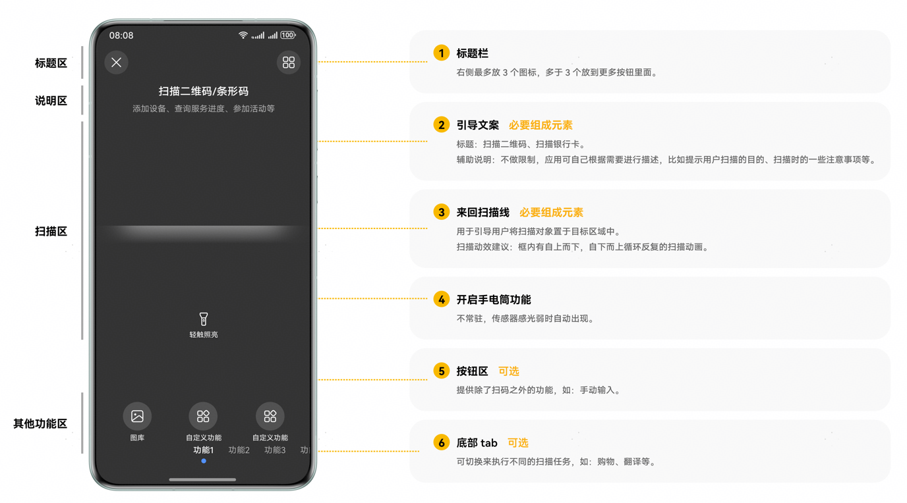
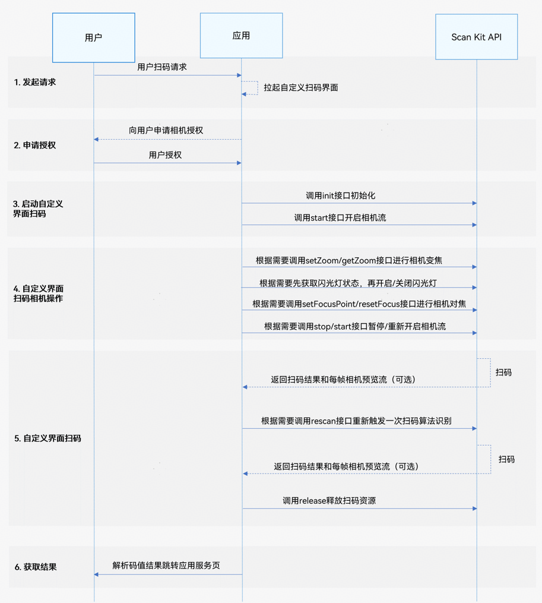

# 自定义界面扫码

更新时间：2026-04-29 07:35:50

来源：https://developer.huawei.com/consumer/cn/doc/harmonyos-guides/scan-customscan

## 基本概念

自定义界面扫码能力提供了相机流控制接口，可根据自身需求自定义扫码界面，适用于对扫码界面有定制化需求的应用开发。
> [!NOTE]
> 通过自定义界面扫码可以实现应用内的扫码功能，为了获得更好的应用体验，推荐同时接入“扫码直达”服务，应用可以同时支持系统扫码入口（控制中心扫一扫）和应用内扫码两种方式跳转到指定服务页面。


## 场景介绍

自定义界面扫码能力提供扫码相机流控制接口，支持相机流的初始化、开启、暂停、释放、重新扫码功能；支持闪光灯的状态获取、开启、关闭；支持变焦比的获取和设置；支持设置相机焦点和连续自动对焦；支持对条形码、二维码、MULTIFUNCTIONAL CODE进行扫码识别（具体类型参见[ScanType](https://developer.huawei.com/consumer/cn/doc/harmonyos-references/scan-scancore#scantype)），并获得码类型、码值、码位置、相机预览流（YUV）等信息。该能力可用于单码和多码的扫描识别。 开发者集成自定义界面扫码能力可以自行定义扫码的界面样式，请按照业务流程完成扫码接口调用实现实时扫码功能。建议开发者基于[Sample Code](https://gitcode.com/HarmonyOS_Samples/scankit-samplecode-clientdemo-arkts)做个性化修改。 扫码页面UX设计规范：

> [!NOTE]
> YUV（相机预览流图像数据）适合于扫码和识物的综合识别场景，开发者需要自己控制相机流，普通扫码场景无需关注。


## 约束与限制

从6.1.0(23)版本开始，自定义界面扫码能力支持带后置相机的Wearable，可以通过[cameraManager.getSupportedCameras](https://developer.huawei.com/consumer/cn/doc/harmonyos-references/arkts-apis-camera-cameramanager#getsupportedcameras)接口查询是否带后置相机。 需要请求相机的使用权限。 需要开发者自行实现扫码的人机交互界面。例如：多码场景需要暂停相机流由用户选择一个码图进行识别。

## 业务流程


**发起请求：** 用户向开发者的应用发起扫码请求，应用拉起已定义好的扫码界面。 **申请授权：** 应用需要向用户申请相机权限授权。若未同意授权，则无法使用此功能。 **启动自定义界面扫码：** 在扫码前必须调用init接口初始化自定义界面扫码，加载资源。相机流初始化结束后，调用start接口开始扫码。 **自定义界面扫码相机操作：** 可以配置自定义界面扫码相机操作参数，调整相应功能，包括闪光灯、变焦、焦距、暂停、重启扫码等。例如： 根据当前码图位置，比如当前码图太远或太近时，调用getZoom获取变焦比，setZoom接口设置变焦比，调整焦距以便于用户扫码。 根据当前扫码的光线条件或根据on('lightingFlash')监听闪光灯开启或关闭时机，通过getFlashLightStatus接口先获取闪光灯状态，再调用openFlashLight/closeFlashLight接口控制闪光灯开启或关闭，以便于用户进行扫码。 调用setFocusPoint设置对焦位置，resetFocus恢复默认对焦模式，以便于用户进行扫码。 在应用处于前后台或其他特殊场景需要中断/重新进行扫码时，可调用stop或start接口来控制相机流达到暂停或重新扫码的目的。 **自定义界面扫码：** Scan Kit API在扫码完成后会返回扫码结果。同时根据开发者的需要，Scan Kit API会返回每帧相机预览流数据。如需不重启相机并重新触发一次扫码，可以在start接口的Callback异步回调中，调用rescan接口。完成扫码后，需调用release接口进行释放扫码资源的操作。 **获取结果：** 解析码值结果跳转应用服务页。

## 接口说明

自定义界面扫码提供init、start、stop、release、getFlashLightStatus、openFlashLight、closeFlashLight、setZoom、getZoom、setFocusPoint、resetFocus、rescan、on('lightingFlash')、off('lightingFlash')接口，其中部分接口返回值有两种返回形式：Callback和Promise回调。Callback和Promise回调函数只是返回值方式不一样，功能相同。具体API说明详见[接口文档](https://developer.huawei.com/consumer/cn/doc/harmonyos-references/scan-customscan-api)。
| 接口名 | 描述 |
| --- | --- |
| [init](https://developer.huawei.com/consumer/cn/doc/harmonyos-references/scan-customscan-api#customscaninit)(options?: scanBarcode.[ScanOptions](https://developer.huawei.com/consumer/cn/doc/harmonyos-references/scan-scanbarcode-api#scanoptions)): void | 初始化自定义界面扫码，加载资源。无返回结果。 |
| [start](https://developer.huawei.com/consumer/cn/doc/harmonyos-references/scan-customscan-api#customscanstart)(viewControl: [ViewControl](https://developer.huawei.com/consumer/cn/doc/harmonyos-references/scan-customscan-api#viewcontrol)): Promise> | 启动扫码相机流获取扫码结果。使用Promise异步回调。 |
| [stop](https://developer.huawei.com/consumer/cn/doc/harmonyos-references/scan-customscan-api#customscanstop)(): Promise | 暂停扫码相机流。使用Promise异步回调。 |
| [release](https://developer.huawei.com/consumer/cn/doc/harmonyos-references/scan-customscan-api#customscanrelease)(): Promise | 释放扫码相机流。使用Promise异步回调。 |
| [start](https://developer.huawei.com/consumer/cn/doc/harmonyos-references/scan-customscan-api#customscanstart-1)(viewControl: ViewControl, callback: AsyncCallback>, frameCallback?: AsyncCallback): void | 启动扫码相机流获取扫码结果以及YUV图像数据。使用callback异步回调。 |
| [getFlashLightStatus](https://developer.huawei.com/consumer/cn/doc/harmonyos-references/scan-customscan-api#customscangetflashlightstatus)(): boolean | 获取闪光灯状态。返回结果为布尔值，true为打开状态，false为关闭状态。 |
| [openFlashLight](https://developer.huawei.com/consumer/cn/doc/harmonyos-references/scan-customscan-api#customscanopenflashlight)(): void | 开启闪光灯。无返回结果。 |
| [closeFlashLight](https://developer.huawei.com/consumer/cn/doc/harmonyos-references/scan-customscan-api#customscancloseflashlight)(): void | 关闭闪光灯。无返回结果。 |
| [setZoom](https://developer.huawei.com/consumer/cn/doc/harmonyos-references/scan-customscan-api#customscansetzoom)(zoomValue : number): void | 设置变焦比。无返回结果。 |
| [getZoom](https://developer.huawei.com/consumer/cn/doc/harmonyos-references/scan-customscan-api#customscangetzoom)(): number | 获取当前的变焦比。 |
| [setFocusPoint](https://developer.huawei.com/consumer/cn/doc/harmonyos-references/scan-customscan-api#customscansetfocuspoint)(point: scanBarcode.[Point](https://developer.huawei.com/consumer/cn/doc/harmonyos-references/scan-scanbarcode-api#point)): void | 设置相机焦点。 |
| [resetFocus](https://developer.huawei.com/consumer/cn/doc/harmonyos-references/scan-customscan-api#customscanresetfocus)(): void | 设置连续自动对焦模式。 |
| [rescan](https://developer.huawei.com/consumer/cn/doc/harmonyos-references/scan-customscan-api#customscanrescan)(): void | 触发一次重新扫码。仅对start接口callback异步回调有效，Promise异步回调无效。 |
| [stop](https://developer.huawei.com/consumer/cn/doc/harmonyos-references/scan-customscan-api#customscanstop-1)(callback: AsyncCallback): void | 暂停扫码相机流。使用callback异步回调。 |
| [release](https://developer.huawei.com/consumer/cn/doc/harmonyos-references/scan-customscan-api#customscanrelease-1)(callback: AsyncCallback): void | 释放扫码相机流。使用callback异步回调。 |
| [on](https://developer.huawei.com/consumer/cn/doc/harmonyos-references/scan-customscan-api#customscanonlightingflash)(type: 'lightingFlash', callback: AsyncCallback): void | 订阅闪光灯状态监听事件，当环境暗、亮状态变化时返回闪光灯开启或关闭时机。使用callback异步回调。 |
| [off](https://developer.huawei.com/consumer/cn/doc/harmonyos-references/scan-customscan-api#customscanofflightingflash)(type: 'lightingFlash', callback?: AsyncCallback): void | 注销闪光灯状态监听事件。使用callback异步回调。 |


## 开发步骤

自定义界面扫码接口支持自定义UI界面，识别相机流中的条形码，二维码以及MULTIFUNCTIONAL CODE，并返回码类型、码值、码位置（码图最小外接矩形左上角和右下角的坐标）、相机预览流（YUV）等信息。 为了方便开发者接入，我们提供了详细的样例工程供参考，推荐参考[示例工程](https://gitcode.com/HarmonyOS_Samples/scankit-samplecode-clientdemo-arkts)接入。 以下示例为调用自定义界面扫码接口拉起相机流并返回扫码结果和相机预览流（YUV）。 在开发应用前，需要先申请相机相关权限，确保应用拥有访问相机的权限。在module.json5文件中配置相机权限，具体配置方式，请参见[声明权限](https://developer.huawei.com/consumer/cn/doc/harmonyos-guides/declare-permissions)。
| 权限名 | 说明 | 授权方式 |
| --- | --- | --- |
| ohos.permission.CAMERA | 允许应用使用相机扫码。 | user_grant |

使用接口[requestPermissionsFromUser](https://developer.huawei.com/consumer/cn/doc/harmonyos-references/js-apis-abilityaccessctrl#requestpermissionsfromuser9-1)请求用户授权。具体申请方式及校验方式，请参见[向用户申请授权](https://developer.huawei.com/consumer/cn/doc/harmonyos-guides/request-user-authorization)。 导入自定义界面扫码接口以及相关接口模块，导入方法如下。
```text
import { scanCore, scanBarcode, customScan } from '@kit.ScanKit';
// 导入功能涉及的权限申请、回调接口
import { display } from '@kit.ArkUI';
import { AsyncCallback, BusinessError } from '@kit.BasicServicesKit';
import { hilog } from '@kit.PerformanceAnalysisKit';
import { common, abilityAccessCtrl, PermissionRequestResult } from '@kit.AbilityKit';
```

遵循[业务流程](#业务流程)完成自定义界面扫码功能。
> [!NOTE]
> 在设置start接口的viewControl参数时，width和height与XComponent的宽高值相同，start接口会根据XComponent的宽高比例从相机的分辨率选择最优分辨率，如果比例与相机的分辨率比例相差过大会影响预览流体验。 当前支持的分辨率比例为16:9、4:3、1:1。竖屏场景下，XComponent的高度需要大于宽度，且高宽比在支持的分辨率比例中。横屏场景下，XComponent的宽度需要大于高度，且宽高比在支持的分辨率比例中。 XComponent的宽高需根据使用场景计算适配。例如：在开发设备为折叠屏时，需按照折叠屏的展开态和折叠态分别计算XComponent的宽高，start接口会根据XComponent的宽高适配对应的相机分辨率。设备屏幕宽高可通过display.getDefaultDisplaySync方法获取（获取的为px单位，需要通过px2vp方法转为vp）。

通过Promise方式回调，调用自定义界面扫码接口拉起相机流并返回扫码结果。
```text
const TAG: string = '[customScanPage]';

@Entry
@Component
struct CustomScanPage {
  @State userGrant: boolean = false; // 是否已申请相机权限
  @State surfaceId: string = ''; // XComponent组件生成id
  @State isShowBack: boolean = false; // 是否已经返回扫码结果
  @State isFlashLightEnable: boolean = false; // 是否开启了闪光灯
  @State isSensorLight: boolean = false; // 记录当前环境亮暗状态
  @State cameraHeight: number = 640; // 设置预览流高度，默认单位：vp
  @State cameraWidth: number = 360; // 设置预览流宽度，默认单位：vp
  @State offsetX: number = 0; // 设置预览流x轴方向偏移量，默认单位：vp
  @State offsetY: number = 0; // 设置预览流y轴方向偏移量，默认单位：vp
  @State zoomValue: number = 1; // 预览流缩放比例
  @State setZoomValue: number = 1; // 已设置的预览流缩放比例
  @State scaleValue: number = 1; // 屏幕缩放比
  @State pinchValue: number = 1; // 双指缩放比例
  @State displayHeight: number = 0; // 屏幕高度，单位vp
  @State displayWidth: number = 0; // 屏幕宽度，单位vp
  @State scanResult: Array = []; // 扫码结果
  private mXComponentController: XComponentController = new XComponentController();

  async onPageShow() {
    // 自定义启动第一步，用户申请权限
    await this.requestCameraPermission();
    // 多码扫码识别，enableMultiMode: true 单码扫码识别enableMultiMode: false
    let options: scanBarcode.ScanOptions = {
      scanTypes: [scanCore.ScanType.ALL],
      enableMultiMode: true,
      enableAlbum: true
    };
    // 自定义启动第二步：设置预览流布局尺寸
    this.setDisplay();
    try {
      // 自定义启动第三步，初始化接口
      customScan.init(options);
    } catch (err) {
      hilog.error(0x0001, TAG, `Failed to init customScan. Code: ${err.code}, message: ${err.message}`);
    }
  }

  onPageHide() {
    // 页面消失或隐藏时，停止并释放相机流
    this.userGrant = false;
    this.isFlashLightEnable = false;
    this.isSensorLight = false;
    try {
      customScan.off('lightingFlash');
    } catch (err) {
      hilog.error(0x0001, TAG, `Failed to off lightingFlash. Code: ${err.code}, message: ${err.message}`);
    }
    this.customScanStop();
    try {
      // 自定义相机流释放接口
      customScan.release().catch((err: BusinessError) => {
        hilog.error(0x0001, TAG,
          `Failed to release customScan by promise. Code: ${err.code}, message: ${err.message}`);
      });
    } catch (err) {
      hilog.error(0x0001, TAG, `Failed to release customScan. Code: ${err.code}, message: ${err.message}`);
    }
  }

  // 用户申请权限
  async reqPermissionsFromUser(): Promise {
    hilog.info(0x0001, TAG, 'reqPermissionsFromUser start');
    let context = this.getUIContext().getHostContext() as common.UIAbilityContext;
    let atManager = abilityAccessCtrl.createAtManager();
    try {
      const grantStatus: PermissionRequestResult =
        await atManager.requestPermissionsFromUser(context, ['ohos.permission.CAMERA']);
      return grantStatus.authResults;
    } catch (err) {
      hilog.error(0x0001, TAG, `Failed to requestPermissionsFromUser. Code: ${err.code}, message: ${err.message}`);
      return [];
    }
  }

  // 用户申请相机权限
  async requestCameraPermission() {
    let grantStatus = await this.reqPermissionsFromUser();
    for (let i = 0; i ) => {
          hilog.info(0x0001, TAG, `result: ${JSON.stringify(data)}`);
          if (data.length) {
            // 解析码值结果跳转应用服务页
            this.scanResult = data;
            this.isShowBack = true;
            // 获取到扫描结果后暂停相机流
            this.customScanStop();
          }
        }).catch((err: BusinessError) => {
        hilog.error(0x0001, TAG, `Failed to start customScan. Code: ${err.code}, message: ${err.message}`);
      });
    } catch (err) {
      hilog.error(0x0001, TAG, `Failed to start customScan. Code: ${err.code}, message: ${err.message}`);
    }
  }

  customScanStop() {
    try {
      customScan.stop().catch((err: BusinessError) => {
        hilog.error(0x0001, TAG, `Failed to stop customScan. Code: ${err.code}, message: ${err.message}`);
      });
    } catch (err) {
      hilog.error(0x0001, TAG, `Failed to stop customScan. Code: ${err.code}, message: ${err.message}`);
    }
  }

  // 自定义扫码界面的顶部返回按钮和扫码提示
  @Builder
  topTool() {
    Column() {
      Flex({ direction: FlexDirection.Row, justifyContent: FlexAlign.SpaceBetween, alignItems: ItemAlign.Center }) {
        Text('返回')
          .onClick(() => {
            this.getUIContext().getRouter().back();
          })
      }.padding({ left: 24, right: 24, top: 40 })


      Column() {
        Text('扫描二维码/条形码')
        Text('对准二维码/条形码，即可自动扫描')
      }.margin({ left: 24, right: 24, top: 24 })
    }
    .height(146)
    .width('100%')
  }

  build() {
    Stack() {
      if (this.userGrant) {
        Column() {
          XComponent({
            id: 'componentId',
            type: XComponentType.SURFACE,
            controller: this.mXComponentController
          })
            .onLoad(() => {
              hilog.info(0x0001, TAG, 'Succeeded in loading, onLoad is called.');
              // 获取XComponent组件的surfaceId
              this.surfaceId = this.mXComponentController.getXComponentSurfaceId();
              hilog.info(0x0001, TAG, `Succeeded in getting surfaceId: ${this.surfaceId}`);
              this.initCamera();
              // 闪光灯监听接口
              customScan.on('lightingFlash', (err, isLightingFlash) => {
                if (err) {
                  hilog.error(0x0001, TAG,
                    `Failed to on lightingFlash. Code: ${err.code}, message: ${err.message}`);
                  return;
                }
                if (isLightingFlash) {
                  this.isFlashLightEnable = true;
                } else {
                  try {
                    if (!customScan.getFlashLightStatus()) {
                      this.isFlashLightEnable = false;
                    }
                  } catch (err) {
                    hilog.error(0x0001, TAG,
                      `Failed to get flashLightStatus. Code: ${err.code}, message: ${err.message}`);
                  }
                }
                this.isSensorLight = isLightingFlash;
              });
            })
            .width(this.cameraWidth)
            .height(this.cameraHeight)
            .position({ x: this.offsetX, y: this.offsetY })
        }
        .height('100%')
        .width('100%')
      }


      Column() {
        this.topTool();
        Column() {
        }
        .layoutWeight(1)
        .width('100%')


        Column() {
          Row() {
            // 闪光灯按钮，启动相机流后才能使用
            Button('FlashLight')
              .onClick(() => {
                let lightStatus: boolean = false;
                try {
                  lightStatus = customScan.getFlashLightStatus();
                } catch (err) {
                  hilog.error(0x0001, TAG,
                    `Failed to get flashLightStatus. Code: ${err.code}, message: ${err.message}`);
                }


                // 根据当前闪光灯状态，选择打开或关闭闪光灯
                if (lightStatus) {
                  try {
                    customScan.closeFlashLight();
                    setTimeout(() => {
                      this.isFlashLightEnable = this.isSensorLight;
                    }, 200);
                  } catch (err) {
                    hilog.error(0x0001, TAG,
                      `Failed to close flashLight. Code: ${err.code}, message: ${err.message}`);
                  }
                } else {
                  try {
                    customScan.openFlashLight();
                  } catch (err) {
                    hilog.error(0x0001, TAG,
                      `Failed to open flashLight. Code: ${err.code}, message: ${err.message}`);
                  }
                }
              })
              .visibility((this.userGrant && this.isFlashLightEnable) ? Visibility.Visible : Visibility.None)


            // 扫码成功后，点击按钮后重新扫码
            Button('Scan')
              .onClick(() => {
                // 点击按钮重启相机流，重新扫码
                this.initCamera();
              })
              .visibility(this.isShowBack ? Visibility.Visible : Visibility.None)
          }


          Row() {
            // 预览流设置缩放比例
            Button('缩放比例,当前比例:' + this.setZoomValue)
              .onClick(() => {
                // 设置相机缩放比例
                if (!this.isShowBack) {
                  if (!this.zoomValue || this.zoomValue === this.setZoomValue) {
                    this.setZoomValue = this.customGetZoom();
                  } else {
                    this.zoomValue = this.zoomValue;
                    this.customSetZoom(this.zoomValue);
                    setTimeout(() => {
                      if (!this.isShowBack) {
                        this.setZoomValue = this.customGetZoom();
                      }
                    }, 1000);
                  }
                }
              })
          }
          .margin({ top: 10, bottom: 10 })


          Row() {
            // 输入要设置的预览流缩放比例
            TextInput({ placeholder: '输入缩放倍数' })
              .type(InputType.Number)
              .borderWidth(1)
              .backgroundColor(Color.White)
              .onChange(value => {
                this.zoomValue = Number(value);
              })
          }
        }
        .width('50%')
        .height(180)
      }


      // 单码、多码扫描后，显示码图蓝点位置。点击toast码图信息
      ForEach(this.scanResult, (item: scanBarcode.ScanResult) => {
        if (item.scanCodeRect) {
          // scan_selected2.svg为示例资源，可放置于工程路径src/main/resources/rawfile/，开发者可自行替换，以保证正常编译运行
          Image($rawfile('scan_selected2.svg'))
            .width(40)
            .height(40)
            .markAnchor({ x: 20, y: 20 })
            .position({
              x: (item.scanCodeRect.left + item?.scanCodeRect?.right) / 2 + this.offsetX,
              y: (item.scanCodeRect.top + item?.scanCodeRect?.bottom) / 2 + this.offsetY
            })
            .onClick(() => {
              this.showScanResult(item);
            })
        }
      }, (item: scanBarcode.ScanResult) => '' + item?.scanCodeRect?.left + item?.scanCodeRect?.right + 'px');
    }
    // 建议相机流设置为全屏
    .width('100%')
    .height('100%')
    .onClick((event: ClickEvent) => {
      // 是否已扫描到结果
      if (this.isShowBack) {
        return;
      }
      // 点击屏幕位置，获取点击位置(x,y)，设置相机焦点
      let x1 = event.displayY / (this.displayHeight + 0.0);
      let y1 = 1.0 - event.displayX / (this.displayWidth + 0.0);
      try {
        customScan.setFocusPoint({ x: x1, y: y1 });
        hilog.info(0x0001, TAG, `Succeeded in setting focusPoint x1: ${x1}, y1: ${y1}`);
      } catch (err) {
        hilog.error(0x0001, TAG, `Failed to set focusPoint. Code: ${err.code}, message: ${err.message}`);
      }
      hilog.info(0x0001, TAG, `Succeeded in setting focusPoint x1: ${x1}, y1: ${y1}`);
      // 设置连续自动对焦模式
      setTimeout(() => {
        try {
          customScan.resetFocus();
        } catch (err) {
          hilog.error(0x0001, TAG, `Failed to reset focus. Code: ${err.code}, message: ${err.message}`);
        }
      }, 200);
    }).gesture(PinchGesture({ fingers: 2 })
      .onActionStart(() => {
        hilog.info(0x0001, TAG, 'Pinch start');
      })
      .onActionUpdate((event: GestureEvent) => {
        if (event) {
          this.scaleValue = event.scale;
        }
      })
      .onActionEnd(() => {
        // 是否已扫描到结果
        if (this.isShowBack) {
          return;
        }
        // 获取双指缩放比例，设置变焦比
        try {
          let zoom = this.customGetZoom();
          this.pinchValue = this.scaleValue * zoom;
          this.customSetZoom(this.pinchValue);
          hilog.info(0x0001, TAG, 'Pinch end');
        } catch (err) {
          hilog.error(0x0001, TAG, `Failed to set zoom. Code: ${err.code}, message: ${err.message}`);
        }
      }))
  }

  public customGetZoom(): number {
    let zoom = 1;
    try {
      zoom = customScan.getZoom();
      hilog.info(0x0001, TAG, `Succeeded in getting zoom, zoom: ${zoom}`);
    } catch (err) {
      hilog.error(0x0001, TAG, `Failed to get zoom. Code: ${err.code}, message: ${err?.message}`);
    }
    return zoom;
  }

  public customSetZoom(pinchValue: number): void {
    try {
      customScan.setZoom(pinchValue);
      hilog.info(0x0001, TAG, `Succeeded in setting zoom.`);
    } catch (err) {
      hilog.error(0x0001, TAG, `Failed to set zoom. Code: ${err.code}, message: ${err?.message}`);
    }
  }
}
```

通过Callback方式回调，调用自定义界面扫码接口拉起相机流并返回扫码结果和相机预览流（YUV）。
```text
const TAG: string = '[customScanPage]';

@Entry
@Component
struct CustomScanPage {
  @State userGrant: boolean = false; // 是否已申请相机权限
  @State surfaceId: string = ''; // XComponent组件生成id
  @State isShowBack: boolean = false; // 是否已经返回扫码结果
  @State isFlashLightEnable: boolean = false; // 是否开启了闪光灯
  @State isSensorLight: boolean = false; // 记录当前环境亮暗状态
  @State cameraHeight: number = 640; // 设置预览流高度，默认单位：vp
  @State cameraWidth: number = 360; // 设置预览流宽度，默认单位：vp
  @State offsetX: number = 0; // 设置预览流x轴方向偏移量，默认单位：vp
  @State offsetY: number = 0; // 设置预览流y轴方向偏移量，默认单位：vp
  @State zoomValue: number = 1; // 预览流缩放比例
  @State setZoomValue: number = 1; // 已设置的预览流缩放比例
  @State scaleValue: number = 1; // 屏幕缩放比
  @State pinchValue: number = 1; // 双指缩放比例
  @State displayHeight: number = 0; // 屏幕高度，单位vp
  @State displayWidth: number = 0; // 屏幕宽度，单位vp
  @State scanResult: Array = []; // 扫码结果
  private mXComponentController: XComponentController = new XComponentController();
  // 返回自定义扫描结果的回调
  private callback: AsyncCallback =
    (err: BusinessError, data: scanBarcode.ScanResult[]) => {
      if (err && err.code) {
        hilog.error(0x0001, TAG,
          `Failed to get ScanResult by callback. Code: ${err.code}, message: ${err.message}`);
        return;
      }
      // 解析码值结果跳转应用服务页
      hilog.info(0x0001, TAG, `Succeeded in getting ScanResult by callback, result: ${JSON.stringify(data)}`);
      if (data.length) {
        // 解析码值结果跳转应用服务页
        this.scanResult = data;
        this.isShowBack = true;
        // 获取到扫描结果后暂停相机流
        this.customScanStop();
      }
    };
  // 返回相机帧的回调
  private frameCallback: AsyncCallback =
    (err: BusinessError, frameResult: customScan.ScanFrame) => {
      if (err) {
        hilog.error(0x0001, TAG, `Failed to get ScanFrame by callback. Code: ${err.code}, message: ${err.message}`);
        return;
      }
      // byteBuffer相机YUV图像数组
      hilog.info(0x0001, TAG,
        `Succeeded in getting ScanFrame.byteBuffer.byteLength: ${frameResult.byteBuffer.byteLength}`);
      hilog.info(0x0001, TAG, `Succeeded in getting ScanFrame.width: ${frameResult.width}`);
      hilog.info(0x0001, TAG, `Succeeded in getting ScanFrame.height: ${frameResult.height}`);
    };

  async onPageShow() {
    // 自定义启动第一步，用户申请权限
    await this.requestCameraPermission();
    // 多码扫码识别，enableMultiMode: true 单码扫码识别enableMultiMode: false
    let options: scanBarcode.ScanOptions = {
      scanTypes: [scanCore.ScanType.ALL],
      enableMultiMode: true,
      enableAlbum: true
    };
    // 自定义启动第二步：设置预览流布局尺寸
    this.setDisplay();
    try {
      // 自定义启动第三步，初始化接口
      customScan.init(options);
    } catch (err) {
      hilog.error(0x0001, TAG, `Failed to init customScan. Code: ${err.code}, message: ${err.message}`);
    }
  }

  onPageHide() {
    // 页面消失或隐藏时，停止并释放相机流
    this.userGrant = false;
    this.isFlashLightEnable = false;
    this.isSensorLight = false;
    try {
      customScan.off('lightingFlash');
    } catch (err) {
      hilog.error(0x0001, TAG, `Failed to off lightingFlash. Code: ${err.code}, message: ${err.message}`);
    }
    this.customScanStop();
    try {
      // 自定义相机流释放接口
      customScan.release().catch((err: BusinessError) => {
        hilog.error(0x0001, TAG,
          `Failed to release customScan by promise. Code: ${err.code}, message: ${err.message}`);
      });
    } catch (err) {
      hilog.error(0x0001, TAG, `Failed to release customScan. Code: ${err.code}, message: ${err.message}`);
    }
  }

  // 用户申请权限
  async reqPermissionsFromUser(): Promise {
    hilog.info(0x0001, TAG, 'reqPermissionsFromUser start');
    let context = this.getUIContext().getHostContext() as common.UIAbilityContext;
    let atManager = abilityAccessCtrl.createAtManager();
    try {
      const grantStatus: PermissionRequestResult =
        await atManager.requestPermissionsFromUser(context, ['ohos.permission.CAMERA']);
      return grantStatus.authResults;
    } catch (err) {
      hilog.error(0x0001, TAG, `Failed to requestPermissionsFromUser. Code: ${err.code}, message: ${err.message}`);
      return [];
    }
  }

  // 用户申请相机权限
  async requestCameraPermission() {
    let grantStatus = await this.reqPermissionsFromUser();
    for (let i = 0; i  {
        hilog.error(0x0001, TAG, `Failed to stop customScan. Code: ${err.code}, message: ${err.message}`);
      });
    } catch (err) {
      hilog.error(0x0001, TAG, `Failed to stop customScan. Code: ${err.code}, message: ${err.message}`);
    }
  }

  // 自定义扫码界面的顶部返回按钮和扫码提示
  @Builder
  topTool() {
    Column() {
      Flex({ direction: FlexDirection.Row, justifyContent: FlexAlign.SpaceBetween, alignItems: ItemAlign.Center }) {
        Text('返回')
          .onClick(() => {
            this.getUIContext().getRouter().back();
          })
      }.padding({ left: 24, right: 24, top: 40 })


      Column() {
        Text('扫描二维码/条形码')
        Text('对准二维码/条形码，即可自动扫描')
      }.margin({ left: 24, right: 24, top: 24 })
    }
    .height(146)
    .width('100%')
  }

  build() {
    Stack() {
      if (this.userGrant) {
        Column() {
          XComponent({
            id: 'componentId',
            type: XComponentType.SURFACE,
            controller: this.mXComponentController
          })
            .onLoad(() => {
              hilog.info(0x0001, TAG, 'Succeeded in loading, onLoad is called.');
              // 获取XComponent组件的surfaceId
              this.surfaceId = this.mXComponentController.getXComponentSurfaceId();
              hilog.info(0x0001, TAG, `Succeeded in getting surfaceId: ${this.surfaceId}`);
              this.initCamera();
              // 闪光灯监听接口
              customScan.on('lightingFlash', (err, isLightingFlash) => {
                if (err) {
                  hilog.error(0x0001, TAG,
                    `Failed to on lightingFlash. Code: ${err.code}, message: ${err.message}`);
                  return;
                }
                if (isLightingFlash) {
                  this.isFlashLightEnable = true;
                } else {
                  try {
                    if (!customScan.getFlashLightStatus()) {
                      this.isFlashLightEnable = false;
                    }
                  } catch (err) {
                    hilog.error(0x0001, TAG,
                      `Failed to get flashLightStatus. Code: ${err.code}, message: ${err.message}`);
                  }
                }
                this.isSensorLight = isLightingFlash;
              });
            })
            .width(this.cameraWidth)
            .height(this.cameraHeight)
            .position({ x: this.offsetX, y: this.offsetY })
        }
        .height('100%')
        .width('100%')
      }


      Column() {
        this.topTool();
        Column() {
        }
        .layoutWeight(1)
        .width('100%')


        Column() {
          Row() {
            // 闪光灯按钮，启动相机流后才能使用
            Button('FlashLight')
              .onClick(() => {
                let lightStatus: boolean = false;
                try {
                  lightStatus = customScan.getFlashLightStatus();
                } catch (err) {
                  hilog.error(0x0001, TAG,
                    `Failed to get flashLightStatus. Code: ${err.code}, message: ${err.message}`);
                }


                // 根据当前闪光灯状态，选择打开或关闭闪光灯
                if (lightStatus) {
                  try {
                    customScan.closeFlashLight();
                    setTimeout(() => {
                      this.isFlashLightEnable = this.isSensorLight;
                    }, 200);
                  } catch (err) {
                    hilog.error(0x0001, TAG,
                      `Failed to close flashLight. Code: ${err.code}, message: ${err.message}`);
                  }
                } else {
                  try {
                    customScan.openFlashLight();
                  } catch (err) {
                    hilog.error(0x0001, TAG,
                      `Failed to open flashLight. Code: ${err.code}, message: ${err.message}`);
                  }
                }
              })
              .visibility((this.userGrant && this.isFlashLightEnable) ? Visibility.Visible : Visibility.None)


            // 扫码成功后，点击按钮后重新扫码
            Button('Scan')
              .onClick(() => {
                // 点击按钮重启相机流，重新扫码
                this.initCamera();
              })
              .visibility(this.isShowBack ? Visibility.Visible : Visibility.None)
          }


          Row() {
            // 预览流设置缩放比例
            Button('缩放比例,当前比例:' + this.setZoomValue)
              .onClick(() => {
                // 设置相机缩放比例
                if (!this.isShowBack) {
                  if (!this.zoomValue || this.zoomValue === this.setZoomValue) {
                    this.setZoomValue = this.customGetZoom();
                  } else {
                    this.zoomValue = this.zoomValue;
                    this.customSetZoom(this.zoomValue);
                    setTimeout(() => {
                      if (!this.isShowBack) {
                        this.setZoomValue = this.customGetZoom();
                      }
                    }, 1000);
                  }
                }
              })
          }
          .margin({ top: 10, bottom: 10 })


          Row() {
            // 输入要设置的预览流缩放比例
            TextInput({ placeholder: '输入缩放倍数' })
              .type(InputType.Number)
              .borderWidth(1)
              .backgroundColor(Color.White)
              .onChange(value => {
                this.zoomValue = Number(value);
              })
          }
        }
        .width('50%')
        .height(180)
      }


      // 单码、多码扫描后，显示码图蓝点位置。点击toast码图信息
      ForEach(this.scanResult, (item: scanBarcode.ScanResult) => {
        if (item.scanCodeRect) {
          // scan_selected2.svg为示例资源，可放置于工程路径src/main/resources/rawfile/，开发者可自行替换，以保证正常编译运行
          Image($rawfile('scan_selected2.svg'))
            .width(40)
            .height(40)
            .markAnchor({ x: 20, y: 20 })
            .position({
              x: (item.scanCodeRect.left + item?.scanCodeRect?.right) / 2 + this.offsetX,
              y: (item.scanCodeRect.top + item?.scanCodeRect?.bottom) / 2 + this.offsetY
            })
            .onClick(() => {
              this.showScanResult(item);
            })
        }
      }, (item: scanBarcode.ScanResult) => '' + item?.scanCodeRect?.left + item?.scanCodeRect?.right + 'px');
    }
    // 建议相机流设置为全屏
    .width('100%')
    .height('100%')
    .onClick((event: ClickEvent) => {
      // 是否已扫描到结果
      if (this.isShowBack) {
        return;
      }
      // 点击屏幕位置，获取点击位置(x,y)，设置相机焦点
      let x1 = event.displayY / (this.displayHeight + 0.0);
      let y1 = 1.0 - event.displayX / (this.displayWidth + 0.0);
      try {
        customScan.setFocusPoint({ x: x1, y: y1 });
        hilog.info(0x0001, TAG, `Succeeded in setting focusPoint x1: ${x1}, y1: ${y1}`);
      } catch (err) {
        hilog.error(0x0001, TAG, `Failed to set focusPoint. Code: ${err.code}, message: ${err.message}`);
      }
      hilog.info(0x0001, TAG, `Succeeded in setting focusPoint x1: ${x1}, y1: ${y1}`);
      // 设置连续自动对焦模式
      setTimeout(() => {
        try {
          customScan.resetFocus();
        } catch (err) {
          hilog.error(0x0001, TAG, `Failed to reset focus. Code: ${err.code}, message: ${err.message}`);
        }
      }, 200);
    }).gesture(PinchGesture({ fingers: 2 })
      .onActionStart(() => {
        hilog.info(0x0001, TAG, 'Pinch start');
      })
      .onActionUpdate((event: GestureEvent) => {
        if (event) {
          this.scaleValue = event.scale;
        }
      })
      .onActionEnd(() => {
        // 是否已扫描到结果
        if (this.isShowBack) {
          return;
        }
        // 获取双指缩放比例，设置变焦比
        try {
          let zoom = this.customGetZoom();
          this.pinchValue = this.scaleValue * zoom;
          this.customSetZoom(this.pinchValue);
          hilog.info(0x0001, TAG, 'Pinch end');
        } catch (err) {
          hilog.error(0x0001, TAG, `Failed to set zoom. Code: ${err.code}, message: ${err.message}`);
        }
      }))
  }

  public customGetZoom(): number {
    let zoom = 1;
    try {
      zoom = customScan.getZoom();
      hilog.info(0x0001, TAG, `Succeeded in getting zoom, zoom: ${zoom}`);
    } catch (err) {
      hilog.error(0x0001, TAG, `Failed to get zoom. Code: ${err.code}, message: ${err?.message}`);
    }
    return zoom;
  }

  public customSetZoom(pinchValue: number): void {
    try {
      customScan.setZoom(pinchValue);
      hilog.info(0x0001, TAG, `Succeeded in setting zoom.`);
    } catch (err) {
      hilog.error(0x0001, TAG, `Failed to set zoom. Code: ${err.code}, message: ${err?.message}`);
    }
  }
}
```

通过scanCodeRect数据可确定码图中心点的位置。 以设备竖屏、充电口向下为例，使用说明如下。 scanCodeRect的四个点坐标如下，可根据坐标点绘制码图外围矩形框 左上角(x, y)：(left, top) 右上角(x, y)：(right, top) 左下角(x, y)：(left, bottom) 右下角(x, y)：(right, bottom) 由于码图中心点坐标需和XComponent的坐标保持一致，如果XComponent的x轴和y轴存在偏移，则码图位置需做相应的偏移。例如：x轴偏移量为：offsetX；y轴偏移量为：offsetY，中心点坐标最终转换为： x = (left + right) / 2 + offsetX y = (top + bottom) / 2 + offsetY 如果设备涉及旋转，码图中心点位置需要根据屏幕旋转角度([Display.rotation](https://developer.huawei.com/consumer/cn/doc/harmonyos-references/js-apis-display#属性))进行变换，以保证在各旋转角度下码图中心位置正确。推荐参考[示例工程](https://gitcode.com/HarmonyOS_Samples/scankit-samplecode-clientdemo-arkts)。 例如：XComponent宽度为width，高度为height，x轴偏移量为offsetX，y轴偏移量为offsetY： 当[Display.rotation](https://developer.huawei.com/consumer/cn/doc/harmonyos-references/js-apis-display#属性) = 0时，中心点坐标为： x = (left + right) / 2 + offsetX y = (top + bottom) / 2 + offsetY 当[Display.rotation](https://developer.huawei.com/consumer/cn/doc/harmonyos-references/js-apis-display#属性) = 1时，中心点坐标为： x = width - (top + bottom) / 2 + offsetX y = (left + right) / 2 + offsetY 当[Display.rotation](https://developer.huawei.com/consumer/cn/doc/harmonyos-references/js-apis-display#属性) = 2时，中心点坐标为： x = width - (left + right) / 2 + offsetX y = height - (top + bottom) / 2 + offsetY 当[Display.rotation](https://developer.huawei.com/consumer/cn/doc/harmonyos-references/js-apis-display#属性) = 3时，中心点坐标为： x = (top + bottom) / 2 + offsetX y = height - (left + right) / 2+ offsetY
> [!NOTE]
> 从5.0.2(14)开始，由于屏幕Display对象rotation和orientation属性变更，设备旋转不同角度后码图的位置需要重新适配。 对于5.0.2(14)之前版本，可以使用Display对象中的rotation或者orientation属性处理设备旋转不同角度后的码图位置，且需要针对设备类型做特殊适配。 对于5.0.2(14)及之后版本，需要统一使用Display对象的rotation属性处理设备旋转不同角度后的码图位置，无需针对设备类型做特殊适配。


## 模拟器开发

部分接口支持模拟器开发，模拟器使用指导请参见[使用模拟器运行应用](https://developer.huawei.com/consumer/cn/doc/harmonyos-guides/ide-run-emulator)。 从6.0.0(20)版本开始，模拟器支持部分自定义界面扫码接口开发（支持的接口包括[init](https://developer.huawei.com/consumer/cn/doc/harmonyos-references/scan-customscan-api#customscaninit)、[start](https://developer.huawei.com/consumer/cn/doc/harmonyos-references/scan-customscan-api#customscanstart)、[stop](https://developer.huawei.com/consumer/cn/doc/harmonyos-references/scan-customscan-api#customscanstop)、[release](https://developer.huawei.com/consumer/cn/doc/harmonyos-references/scan-customscan-api#customscanrelease)、[rescan](https://developer.huawei.com/consumer/cn/doc/harmonyos-references/scan-customscan-api#customscanrescan)），可实现自定义界面扫码能力的基本功能验证。 模拟器自定义界面扫码能力仅支持1280*720分辨率，开发者传入其他分辨率会统一转换成1280*720。
