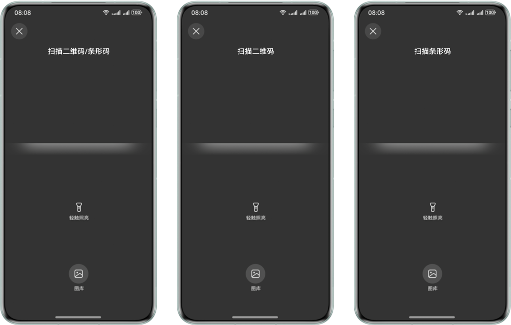
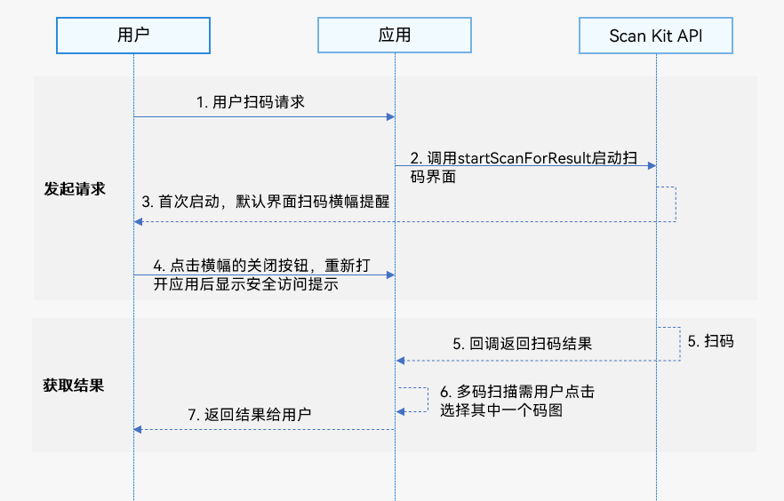

# 默认界面扫码

更新时间：2026-04-28 03:31:56

来源：https://developer.huawei.com/consumer/cn/doc/harmonyos-guides/scan-scanbarcode

## 基本概念

默认界面扫码能力提供系统级体验一致的扫码界面，包含相机预览流，相册扫码入口，暗光环境闪光灯开启提示。Scan Kit默认界面扫码对系统相机权限进行了预授权且调用期间处于安全访问状态，无需开发者再次申请相机权限。适用于不同扫码场景的应用开发。
> [!NOTE]
> 通过默认界面扫码可以实现应用内的扫码功能，为了获得更好的应用体验，推荐同时接入“扫码直达”服务，应用可以同时支持系统扫码入口（控制中心扫一扫）和应用内扫码两种方式跳转到指定服务页面。


## 场景介绍

默认界面扫码能力提供了系统级体验一致的扫码界面以及相册扫码入口，支持单码和多码识别，支持多种识码类型，请参见[ScanType](https://developer.huawei.com/consumer/cn/doc/harmonyos-references/scan-scancore#scantype)。无需使用三方库就可帮助开发者的应用快速处理各种扫码场景。 默认界面扫码UX：

> [!NOTE]
> 系统首次使用默认界面扫码功能时，会向用户弹出隐私横幅提醒。 用户可以点击“进一步了解”查看安全访问相机说明，也可以关闭隐私横幅，关闭后重新打开应用的扫码界面将不再显示隐私横幅提醒，显示安全访问提示，3s后消失。 从6.1.0(23)版本开始，默认界面扫码的标题支持根据ScanOptions的scanTypes进行动态显示。 对于6.1.0(23)之前版本，标题统一显示为“扫描二维码/条形码”。 对于6.1.0(23)及之后版本： scanTypes为ALL、FORMAT_UNKNOWN，或同时包含条形码和二维码类型，标题显示为“扫描二维码/条形码”。 scanTypes未设置，标题显示为“扫描二维码/条形码”。 scanTypes仅包含条形码类型，标题显示为“扫描条形码”。 scanTypes仅包含二维码类型，标题显示为“扫描二维码”。


## 约束与限制

从6.1.0(23)版本开始，默认界面扫码的标题支持根据[ScanOptions](https://developer.huawei.com/consumer/cn/doc/harmonyos-references/scan-scanbarcode-api#scanoptions)的scanTypes进行动态显示。 从6.1.0(23)版本开始，默认界面扫码能力支持带后置相机的Wearable，可以通过[cameraManager.getSupportedCameras](https://developer.huawei.com/consumer/cn/doc/harmonyos-references/arkts-apis-camera-cameramanager#getsupportedcameras)接口查询是否带后置相机。 从6.0.0(20)版本开始，默认界面扫码能力支持悬浮屏、分屏场景。 相册扫码只支持单码识别。 不支持界面UX添加自定义设置。

## 业务流程

使用默认界面扫码的主要业务流程如下：

用户向开发者的应用发起扫码请求。 开发者的应用通过调用Scan Kit的startScanForResult接口启动扫码界面。 系统首次使用默认界面扫码功能时，会向用户弹出隐私横幅提醒。 用户可以点击关闭隐私横幅，重新打开应用的扫码界面将不再显示隐私横幅提醒，显示安全访问提示，3s后消失。 Scan Kit通过Callback回调函数或Promise方式返回扫码结果。 用户进行多码扫描时，需点击选择其中一个码图获取扫码结果返回。单码扫描则可直接返回扫码结果。 解析码值结果跳转应用服务页。

## 接口说明

接口返回值有两种返回形式：Callback和Promise回调。下表中为默认界面扫码Callback和Promise形式接口，Callback和Promise只是返回值方式不一样，功能相同。startScanForResult接口打开的是应用内呈现的扫码界面样式。具体API说明详见[接口文档](https://developer.huawei.com/consumer/cn/doc/harmonyos-references/scan-scanbarcode-api)。
| 接口名 | 描述 |
| --- | --- |
| [startScanForResult](https://developer.huawei.com/consumer/cn/doc/harmonyos-references/scan-scanbarcode-api#scanbarcodestartscanforresult)(context: [common.Context](https://developer.huawei.com/consumer/cn/doc/harmonyos-references/js-apis-app-ability-common#context), options?: [ScanOptions](https://developer.huawei.com/consumer/cn/doc/harmonyos-references/scan-scanbarcode-api#scanoptions)): Promise | 启动默认界面扫码，通过ScanOptions进行扫码参数设置，返回扫码结果。使用Promise异步回调。 |
| [startScanForResult](https://developer.huawei.com/consumer/cn/doc/harmonyos-references/scan-scanbarcode-api#scanbarcodestartscanforresult-2)(context: common.Context, options: ScanOptions, callback: AsyncCallback): void | 启动默认界面扫码，通过ScanOptions进行扫码参数设置，返回扫码结果。使用callback异步回调。 |
| [startScanForResult](https://developer.huawei.com/consumer/cn/doc/harmonyos-references/scan-scanbarcode-api#scanbarcodestartscanforresult-1)(context: common.Context, callback: AsyncCallback): void | 启动默认界面扫码，返回扫码结果。使用callback异步回调。 |


> [!NOTE]
> startScanForResult接口需要在页面和组件的生命周期内调用。若需要设置扫码页面为全屏或沉浸式，请参见开发应用沉浸式效果。


## 开发步骤

Scan Kit提供了默认界面扫码的能力，由扫码接口直接控制相机实现最优的相机放大控制、自适应的曝光调节、自适应对焦调节等操作，保障流畅的扫码体验，减少开发者的工作量。 为了方便开发者接入，我们提供了详细的样例工程供参考，推荐参考[示例工程](https://gitcode.com/HarmonyOS_Samples/scankit-samplecode-clientdemo-arkts)接入。 以下示例为调用Scan Kit的startScanForResult接口跳转扫码页面。 导入默认界面扫码模块，[scanCore](https://developer.huawei.com/consumer/cn/doc/harmonyos-references/scan-scancore)提供扫码类型定义，[scanBarcode](https://developer.huawei.com/consumer/cn/doc/harmonyos-references/scan-scanbarcode-api)提供拉起默认界面扫码的方法和参数，导入方法如下。
```text
import { scanCore, scanBarcode } from '@kit.ScanKit';
// 导入默认界面扫码需要的日志模块和错误码模块
import { hilog } from '@kit.PerformanceAnalysisKit';
import { BusinessError } from '@kit.BasicServicesKit';
```

调用startScanForResult方法拉起默认界面扫码。 通过Promise方式得到扫码结果。
```text
@Entry
@Component
struct ScanBarCodePage {
  build() {
    Column() {
      Row() {
        Button('Promise with options')
          .backgroundColor('#0D9FFB')
          .fontSize(20)
          .fontColor($r('sys.color.comp_background_list_card'))
          .fontWeight(FontWeight.Normal)
          .align(Alignment.Center)
          .type(ButtonType.Capsule)
          .width('90%')
          .height(40)
          .margin({ top: 5, bottom: 5 })
          .onClick(() => {
            // 定义扫码参数options
            let options: scanBarcode.ScanOptions = {
              scanTypes: [scanCore.ScanType.ALL],
              enableMultiMode: true,
              enableAlbum: true
            };
            try {
              // 可调用getHostContext接口获取当前页面关联的Context
              scanBarcode.startScanForResult(this.getUIContext().getHostContext(), options)
                .then((data: scanBarcode.ScanResult) => {
                  // 解析码值结果跳转应用服务页
                  hilog.info(0x0001, '[Scan CPSample]',
                    `Succeeded in getting ScanResult by promise with options, result is ${JSON.stringify(data)}`);
                })
                .catch((err: BusinessError) => {
                  hilog.error(0x0001, '[Scan CPSample]',
                    `Failed to get ScanResult by promise with options. Code:${err.code}, message: ${err.message}`);
                });
            } catch (err) {
              hilog.error(0x0001, '[Scan CPSample]',
                `Failed to start the scanning service. Code:${err.code}, message: ${err.message}`);
            }
          })
      }
      .height('100%')
    }
    .width('100%')
  }
}
```

通过Callback回调函数得到扫码结果。
```text
@Entry
@Component
struct ScanBarCodePage {
  build() {
    Column() {
      Row() {
        Button('Callback with options')
          .backgroundColor('#0D9FFB')
          .fontSize(20)
          .fontColor($r('sys.color.comp_background_list_card'))
          .fontWeight(FontWeight.Normal)
          .align(Alignment.Center)
          .type(ButtonType.Capsule)
          .width('90%')
          .height(40)
          .margin({ top: 5, bottom: 5 })
          .onClick(() => {
            // 定义扫码参数options
            let options: scanBarcode.ScanOptions = {
              scanTypes: [scanCore.ScanType.ALL],
              enableMultiMode: true,
              enableAlbum: true
            };
            try {
              // 可调用getHostContext接口获取当前页面关联的Context
              scanBarcode.startScanForResult(this.getUIContext().getHostContext(), options,
                (err: BusinessError, data: scanBarcode.ScanResult) => {
                  if (err) {
                    hilog.error(0x0001, '[Scan CPSample]',
                      `Failed to get ScanResult by callback with options. Code: ${err.code}, message: ${err.message}`);
                    return;
                  }
                  // 解析码值结果跳转应用服务页
                  hilog.info(0x0001, '[Scan CPSample]',
                    `Succeeded in getting ScanResult by callback with options, result is ${JSON.stringify(data)}`);
                });
            } catch (err) {
              hilog.error(0x0001, '[Scan CPSample]',
                `Failed to start the scanning service. Code:${err.code}, message: ${err.message}`);
            }
          })
      }
      .height('100%')
    }
    .width('100%')
  }
}
```


## 模拟器开发

从6.0.0(20)版本开始，模拟器支持默认界面扫码能力开发，模拟器使用指导请参见[使用模拟器运行应用](https://developer.huawei.com/consumer/cn/doc/harmonyos-guides/ide-run-emulator)。 模拟器中默认界面扫码的相机流存在镜像问题，且由于仅支持固定分辨率比例，画面会出现上下黑边。
