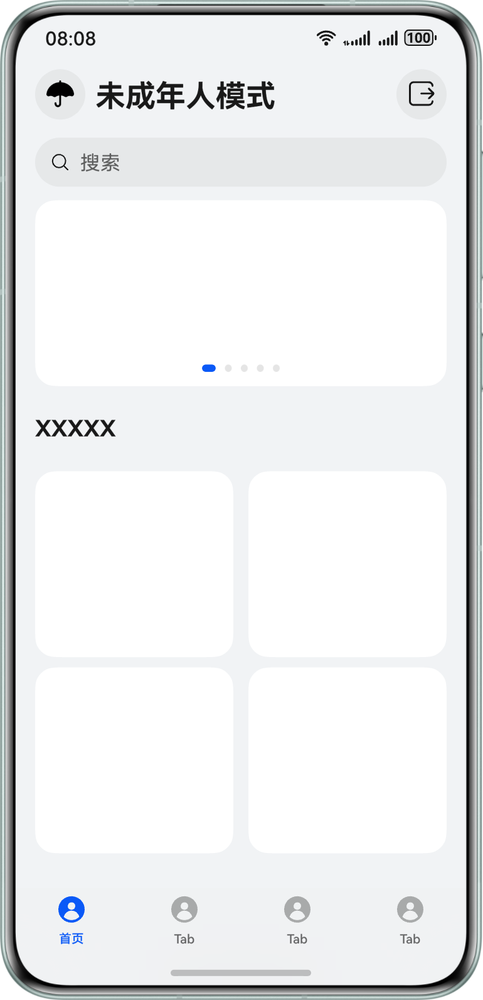

# 订阅到系统未成年人模式开启了，这个时候应用要怎么处理

更新时间：2026-04-20 06:34:33

来源：https://developer.huawei.com/consumer/cn/doc/harmonyos-guides/account-faq-14

如果应用处于后台，可以在应用切换至前台时进行页面内容的刷新。开发者可自行关注应用后台行为是否需要中断，例如是否需要中断后台播放的音视频内容等，避免未成年人绕过限制，继续访问非适龄内容。
 
如果应用处于前台（用户正在浏览内容或播放音视频等场景），可以在监听到状态变化后回到应用的主页，并将主页内容刷新为当前模式下的适龄内容。如果未及时刷新，可能存在未成年用户浏览到非适龄内容绕过管控，或成年用户仍浏览未成年人模式下的内容，无法关闭未成年人模式的情况。刷新后的未成年人模式主页可参考如下设计：
 

