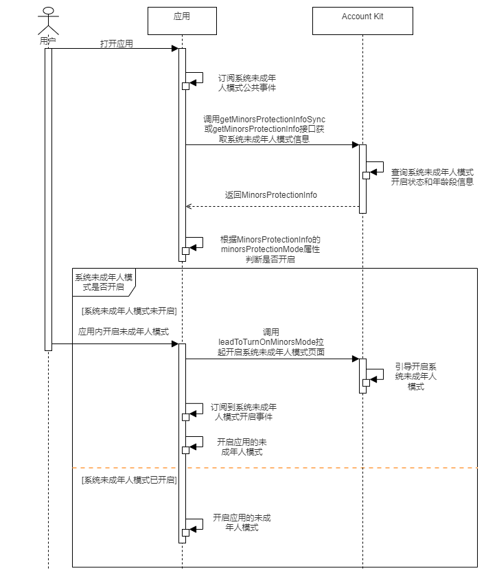

# 应用内开启未成年人模式

更新时间：2026-04-28 03:31:56

来源：https://developer.huawei.com/consumer/cn/doc/harmonyos-guides/account-app-turn-on-minorsprotection

## 场景介绍

在应用内增加引导开启系统未成年人模式的入口，当系统的未成年人模式未开启，可在应用内开启系统未成年人模式。 应用可调用系统的未成年人模式开启接口[leadToTurnOnMinorsMode](https://developer.huawei.com/consumer/cn/doc/harmonyos-references/account-api-minorsprotection#leadtoturnonminorsmode)引导用户设置家长身份验证密码，开启系统的未成年人模式。

## 业务流程


流程说明： 用户打开应用时，应用通过订阅[系统未成年人模式公共事件](#事件说明)感知系统未成年人模式的状态变化。 调用[getMinorsProtectionInfoSync](https://developer.huawei.com/consumer/cn/doc/harmonyos-references/account-api-minorsprotection#getminorsprotectioninfosync)或[getMinorsProtectionInfo](https://developer.huawei.com/consumer/cn/doc/harmonyos-references/account-api-minorsprotection#getminorsprotectioninfo)获取系统未成年人模式的开启状态，如果系统未成年人模式未开启，则调用[leadToTurnOnMinorsMode](https://developer.huawei.com/consumer/cn/doc/harmonyos-references/account-api-minorsprotection#leadtoturnonminorsmode)引导用户开启系统未成年人模式，当应用订阅到系统未成年人模式已开启事件，应用则需开启自身的未成年人模式。如果系统未成年人模式已开启，应用则需开启自身的未成年人模式。

## 接口说明

以下是应用内开启未成年人模式的相关接口说明，更多接口及使用方法请参见[API参考](https://developer.huawei.com/consumer/cn/doc/harmonyos-references/account-api-minorsprotection)。
| 接口名 | 描述 |
| --- | --- |
| [getMinorsProtectionInfoSync](https://developer.huawei.com/consumer/cn/doc/harmonyos-references/account-api-minorsprotection#getminorsprotectioninfosync)(): [MinorsProtectionInfo](https://developer.huawei.com/consumer/cn/doc/harmonyos-references/account-api-minorsprotection#minorsprotectioninfo) | 同步接口，获取系统未成年人模式的开启状态，以及年龄段信息。 |
| [getMinorsProtectionInfo](https://developer.huawei.com/consumer/cn/doc/harmonyos-references/account-api-minorsprotection#getminorsprotectioninfo)(): Promise | 异步接口，获取系统未成年人模式的开启状态，以及年龄段信息。 |
| [leadToTurnOnMinorsMode](https://developer.huawei.com/consumer/cn/doc/harmonyos-references/account-api-minorsprotection#leadtoturnonminorsmode)(context: [common.Context](https://developer.huawei.com/consumer/cn/doc/harmonyos-references/js-apis-app-ability-common#context)): Promise | 调用该方法进行开启系统未成年人模式流程。 |


[leadToTurnOnMinorsMode](https://developer.huawei.com/consumer/cn/doc/harmonyos-references/account-api-minorsprotection#leadtoturnonminorsmode)接口不支持海外账号开启未成年人模式，在开启过程中登录海外账号会返回错误码[1009900007](https://developer.huawei.com/consumer/cn/doc/harmonyos-references/account-api-error-code#section1009900007-不支持的账号)。 [leadToTurnOnMinorsMode](https://developer.huawei.com/consumer/cn/doc/harmonyos-references/account-api-minorsprotection#leadtoturnonminorsmode)接口需在页面或自定义组件生命周期内调用。 当未成年人模式开启时，当前设备的开发者调试模式会被禁用，开发者可以进入设置-系统-开发者选项，点击USB调试开关，会校验健康使用设备密码，校验成功后可解除开发者调试模式限制。 如开发者重新开启USB调试开关后，发现DevEco Studio工具上hilog日志未恢复到断连之前，请执行“hdc shell hilog -G 16M”来扩大hilog日志缓存区，若hilog日志仍无法完全展示，可取出hilog日志本地查看。更多命令请参见[hilog](https://developer.huawei.com/consumer/cn/doc/harmonyos-guides/hilog)。 在应用内调用开启或关闭系统未成年人模式接口，如应用需弹出toast或弹框告知用户“未成年人模式已开启或关闭”，须在接口执行完成之后，在接口的then方法里面弹出toast或弹框，否则可能出现因系统页面未完全关闭，导致toast无法正常展示的情况。 如开发者需要频繁使用未成年人模式开启状态或者年龄段信息，建议在获取结果后进行缓存，并通过订阅[系统未成年人模式公共事件](#事件说明)来刷新未成年人模式开启状态或者年龄段信息，避免重复调用接口带来的性能损耗。 当设备处于开机未解锁状态下，开发者调用[getMinorsProtectionInfoSync](https://developer.huawei.com/consumer/cn/doc/harmonyos-references/account-api-minorsprotection#getminorsprotectioninfosync)接口时，其返回的minorsProtectionMode字段为false。

## 事件说明

以下是系统未成年人模式开启或关闭发送的广播事件。
| 事件名称 | 值 | 描述 |
| --- | --- | --- |
| [COMMON_EVENT_MINORSMODE_ON](https://developer.huawei.com/consumer/cn/doc/harmonyos-references/commoneventmanager-definitions#common_event_minorsmode_on12) | usual.event.MINORSMODE_ON | 表示系统未成年人模式开启事件。 |
| [COMMON_EVENT_MINORSMODE_OFF](https://developer.huawei.com/consumer/cn/doc/harmonyos-references/commoneventmanager-definitions#common_event_minorsmode_off12) | usual.event.MINORSMODE_OFF | 表示系统未成年人模式关闭事件。 |


> [!NOTE]
> 未成年人模式开启事件触发时机： 主动开启系统未成年人模式（PC/2in1设备暂不支持从控制中心开启未成年人模式），当前设备会发送未成年人模式开启事件。


## 开发前提

请先参考“开发准备”的[配置签名和指纹](https://developer.huawei.com/consumer/cn/doc/harmonyos-guides/account-sign-fingerprints)章节，通过自动签名方式完成签名信息的配置。请注意，该接口无需配置公钥指纹、Client ID，也无需申请账号权限。

## 开发步骤

导入[minorsProtection](https://developer.huawei.com/consumer/cn/doc/harmonyos-references/account-api-minorsprotection)模块及相关公共模块。
```text
import { minorsProtection } from '@kit.AccountKit';
import { hilog } from '@kit.PerformanceAnalysisKit';
import { BusinessError } from '@kit.BasicServicesKit';
```

订阅系统未成年人模式开启或关闭事件、获取未成年人模式的开启状态，以及年龄段信息请参考应用与系统联动切换未成年人模式章节的[开发步骤](https://developer.huawei.com/consumer/cn/doc/harmonyos-guides/account-system-minorsprotection#开发步骤)。 当系统未成年人模式未开启，且用户主动开启应用内未成年人模式时，应用需要调用[leadToTurnOnMinorsMode](https://developer.huawei.com/consumer/cn/doc/harmonyos-references/account-api-minorsprotection#leadtoturnonminorsmode)引导用户开启未成年人模式。开启未成年人模式后，应用会订阅到未成年人模式开启事件，开发者可调用[getMinorsProtectionInfoSync](https://developer.huawei.com/consumer/cn/doc/harmonyos-references/account-api-minorsprotection#getminorsprotectioninfosync)或[getMinorsProtectionInfo](https://developer.huawei.com/consumer/cn/doc/harmonyos-references/account-api-minorsprotection#getminorsprotectioninfo)获取系统未成年人模式年龄段信息，根据年龄段信息进行内容分级，详细的订阅步骤可参考开发步骤第2步。
```text
if (canIUse('SystemCapability.AuthenticationServices.HuaweiID.MinorsProtection')) {
  try {
    // 查询是否支持系统未成年人模式
    if (minorsProtection.supportMinorsMode()) {
      // 此示例为代码片段，实际需在自定义组件实例中使用，并传入有效的Context上下文对象
      minorsProtection.leadToTurnOnMinorsMode(this.getUIContext().getHostContext())
        .then(() => {
          // 接口调用完成，如需显示弹窗，请在此处处理
        })
        .catch((error: BusinessError) => {
          dealTurnOnAllError(error);
        });
    } else {
      hilog.info(0x0000, 'testTag',
        'The current device environment does not support the youth mode, please check the current device environment.');
    }
  } catch (error) {
    hilog.error(0x0000, 'testTag',
      `Failed to invoke supportMinorsMode. errCode: ${error.code}, errMessage: ${error.message}`);
  }
} else {
  hilog.info(0x0000, 'testTag',
    'The current device does not support the invoking of the leadToTurnOnMinorsMode interface.');
}
```


```text
function dealTurnOnAllError(error: BusinessError): void {
  hilog.error(0x0000, 'testTag', `Failed to leadToTurnOnMinorsMode. Code: ${error.code}, message: ${error.message}`);
}
```
