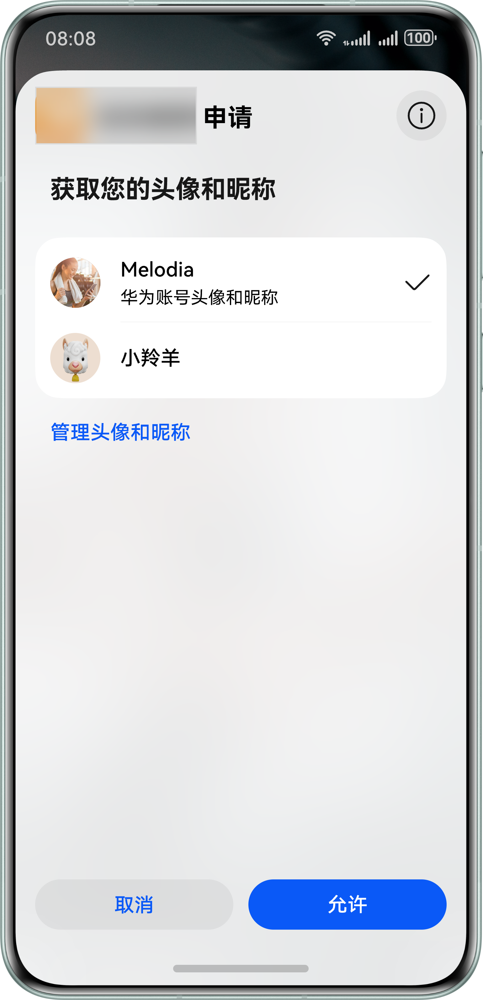
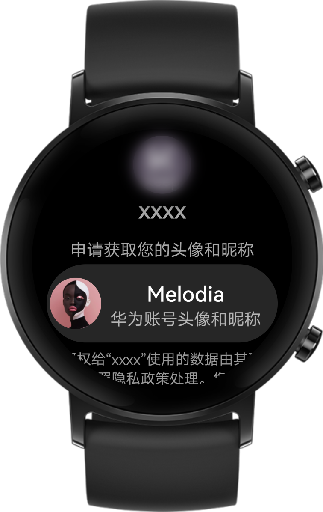
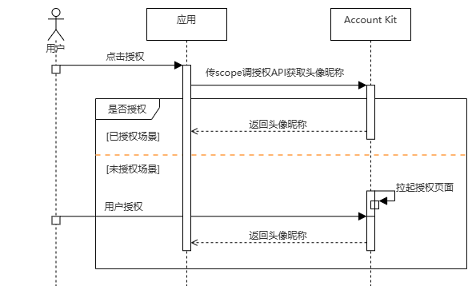

# 获取头像昵称

更新时间：2026-04-29 07:35:50

来源：https://developer.huawei.com/consumer/cn/doc/harmonyos-guides/account-get-avatar-nickname

## 场景介绍

当应用需要获取用户头像昵称信息，可使用Account Kit提供的头像昵称授权能力，用户允许应用获取头像昵称后，可快速完成个人信息填写。以下对Account Kit提供的头像昵称授权能力进行介绍。此外，开发者也可通过场景化控件中的[选择头像Button](https://developer.huawei.com/consumer/cn/doc/harmonyos-guides/scenario-fusion-button-chooseavatar)获取用户头像。 **图1** 手机端获取头像昵称（请以实际效果为准）

**图2** Wearable设备获取头像昵称（请以实际效果为准）


## 约束与限制

获取头像昵称能力支持Phone、Tablet、PC/2in1设备。并且从5.1.0(18)版本开始，新增支持Wearable设备；从5.1.1(19)版本开始，新增支持TV设备。

## 业务流程


流程说明： 应用传对应scope调用授权API请求获取用户头像昵称。 如用户已给应用授权，则开发者能直接获取用户头像昵称。 如用户未授权，则授权请求会拉起授权页面，在用户确认授权后，开发者能获取到用户头像昵称。 获取到头像url信息，开发者可以通过该url下载并使用用户头像。

## 接口说明

获取头像昵称关键接口如下表所示，具体API说明详见[API参考](https://developer.huawei.com/consumer/cn/doc/harmonyos-references/account-api-authentication)。
| 接口名 | 描述 |
| --- | --- |
| [createAuthorizationWithHuaweiIDRequest](https://developer.huawei.com/consumer/cn/doc/harmonyos-references/account-api-authentication#createauthorizationwithhuaweiidrequest)(): [AuthorizationWithHuaweiIDRequest](https://developer.huawei.com/consumer/cn/doc/harmonyos-references/account-api-authentication#authorizationwithhuaweiidrequest) | 获取授权请求对象接口，通过在[AuthorizationWithHuaweiIDRequest](https://developer.huawei.com/consumer/cn/doc/harmonyos-references/account-api-authentication#authorizationwithhuaweiidrequest)对象中传入头像昵称的scope：profile及Authorization Code的permission：serviceauthcode，即可在授权结果中获取到用户头像昵称和Authorization Code。 |
| [constructor](https://developer.huawei.com/consumer/cn/doc/harmonyos-references/account-api-authentication#constructor)(context?: [common.Context](https://developer.huawei.com/consumer/cn/doc/harmonyos-references/js-apis-app-ability-common#context)) | 创建授权请求Controller。 |
| [executeRequest](https://developer.huawei.com/consumer/cn/doc/harmonyos-references/account-api-authentication#executerequest-1)(request: [AuthenticationRequest](https://developer.huawei.com/consumer/cn/doc/harmonyos-references/account-api-authentication#authenticationrequest)): Promise | 通过Promise方式执行授权操作。          头像昵称，可从[AuthenticationResponse](https://developer.huawei.com/consumer/cn/doc/harmonyos-references/account-api-authentication#authenticationresponse)的子类[AuthorizationWithHuaweiIDResponse](https://developer.huawei.com/consumer/cn/doc/harmonyos-references/account-api-authentication#authorizationwithhuaweiidresponse)中解析，具体解析方法请参考[客户端开发](#客户端开发)的示例代码。 |


1.上述接口需在页面或自定义组件生命周期内调用。 2.未设置昵称默认返回华为账号绑定的匿名手机号/邮箱。

## 开发前提

在进行代码开发前，请确保已按照“开发准备”章节中的指导完成[配置签名和指纹](https://developer.huawei.com/consumer/cn/doc/harmonyos-guides/account-sign-fingerprints)、[配置Client ID](https://developer.huawei.com/consumer/cn/doc/harmonyos-guides/account-client-id)。此场景无需申请账号权限。

若未正确配置公钥指纹，将报错[1001500001 应用指纹证书校验失败](https://developer.huawei.com/consumer/cn/doc/harmonyos-guides/account-faq-1)。

## 开发步骤


## 客户端开发

导入[authentication](https://developer.huawei.com/consumer/cn/doc/harmonyos-references/account-api-authentication)模块及相关公共模块。
```text
import { authentication } from '@kit.AccountKit';
import { hilog } from '@kit.PerformanceAnalysisKit';
import { util } from '@kit.ArkTS';
import { BusinessError } from '@kit.BasicServicesKit';
```

创建授权请求并设置参数。
```text
// 创建授权请求，并设置参数
const authRequest = new authentication.HuaweiIDProvider().createAuthorizationWithHuaweiIDRequest();
// 获取头像昵称需要传如下scope
authRequest.scopes = ['profile'];
// 若开发者需要进行服务端开发以获取头像昵称，则需传如下permission获取authorizationCode
authRequest.permissions = ['serviceauthcode'];
// 用户是否需要登录授权，该值为true且用户未登录或未授权时，会拉起用户登录或授权页面
authRequest.forceAuthorization = true;
// 建议使用generateRandomUUID生成state，可用于一致性比对，防止跨站攻击
authRequest.state = util.generateRandomUUID();
```

调用[AuthenticationController](https://developer.huawei.com/consumer/cn/doc/harmonyos-references/account-api-authentication#authenticationcontroller)对象的[executeRequest](https://developer.huawei.com/consumer/cn/doc/harmonyos-references/account-api-authentication#executerequest-1)方法执行授权请求，并处理授权结果，从授权结果中解析出头像昵称和Authorization Code。
```text
// 执行授权请求
try {
  // 此示例为代码片段，实际需在自定义组件实例中使用，并传入有效的Context上下文对象
  const controller = new authentication.AuthenticationController(this.getUIContext().getHostContext());
  controller.executeRequest(authRequest).then((data) => {
    const authorizationWithHuaweiIDResponse = data as authentication.AuthorizationWithHuaweiIDResponse;
    const state = authorizationWithHuaweiIDResponse.state;
    if (state && authRequest.state !== state) {
      hilog.error(0x0000, 'testTag', `Failed to authorize. The state is different, response state: ${state}`);
      return;
    }
    hilog.info(0x0000, 'testTag', 'Succeeded in authentication.');
    const authorizationWithHuaweiIDCredential = authorizationWithHuaweiIDResponse?.data;
    const avatarUri = authorizationWithHuaweiIDCredential?.avatarUri;
    const nickName = authorizationWithHuaweiIDCredential?.nickName;
    // 开发者处理avatarUri, nickName
    const authorizationCode = authorizationWithHuaweiIDCredential?.authorizationCode;
    // 涉及服务端开发以获取头像昵称场景，开发者处理authorizationCode
  }).catch((err: BusinessError) => {
    dealAllError(err);
  });
} catch (error) {
  dealAllError(error);
}
```


```text
// 错误处理
function dealAllError(error: BusinessError): void {
  hilog.error(0x0000, 'testTag', `Failed to obtain userInfo. Code: ${error.code}, message: ${error.message}`);
  // 在应用获取头像昵称场景下，涉及UI交互时，建议按照如下错误码指导提示用户
  if (error.code === ErrorCode.ERROR_CODE_LOGIN_OUT) {
    // 用户未登录华为账号，请登录华为账号并重试
  } else if (error.code === ErrorCode.ERROR_CODE_NETWORK_ERROR) {
    // 网络异常，请检查当前网络状态并重试
  } else if (error.code === ErrorCode.ERROR_CODE_USER_CANCEL) {
    // 用户取消授权
  } else if (error.code === ErrorCode.ERROR_CODE_SYSTEM_SERVICE) {
    // 系统服务异常，请稍后重试
  } else if (error.code === ErrorCode.ERROR_CODE_REQUEST_REFUSE) {
    // 重复请求，应用无需处理
  } else {
    // 获取用户信息失败，请稍后重试
  }
}

export enum ErrorCode {
  // 账号未登录
  ERROR_CODE_LOGIN_OUT = 1001502001,
  // 网络错误
  ERROR_CODE_NETWORK_ERROR = 1001502005,
  // 用户取消授权
  ERROR_CODE_USER_CANCEL = 1001502012,
  // 系统服务异常
  ERROR_CODE_SYSTEM_SERVICE = 12300001,
  // 重复请求
  ERROR_CODE_REQUEST_REFUSE = 1001500002
}
```


## 服务端开发（可选）

开发者根据业务需要选择是否进行服务端开发。 应用服务端使用Client ID、Client Secret、Authorization Code调用[获取用户级凭证接口](https://developer.huawei.com/consumer/cn/doc/harmonyos-references/account-api-obtain-user-token#接口原型)向华为账号服务器请求获取Access Token、Refresh Token。 使用Access Token调用[获取用户信息接口](https://developer.huawei.com/consumer/cn/doc/harmonyos-references/account-api-get-user-info-get-nickname-and-avatar#接口原型)获取用户信息，从用户信息中获取用户头像昵称。 **Access Token过期处理** 由于Access Token的有效期仅为60分钟，当Access Token失效或者即将失效时（可通过[REST API错误码](https://developer.huawei.com/consumer/cn/doc/harmonyos-references/account-api-get-user-info-get-nickname-and-avatar#错误码)判断），可以使用Refresh Token（有效期180天）通过[刷新用户级凭证接口](https://developer.huawei.com/consumer/cn/doc/harmonyos-references/account-api-obtain-refresh-token#接口原型)向华为账号服务器请求获取新的Access Token。
> [!NOTE]
> 当Access Token失效时，若您不使用Refresh Token向账号服务器请求获取新的Access Token，账号的授权信息将会失效，导致使用Access Token的功能都会失败。 当Access Token非正常失效（如修改密码、退出账号、删除设备）时，业务可重新登录授权获取Authorization Code，向账号服务器请求获取新的Access Token。

**Refresh Token过期处理** 由于Refresh Token的有效期为180天，当Refresh Token失效后（可通过[REST API错误码](https://developer.huawei.com/consumer/cn/doc/harmonyos-references/account-api-obtain-refresh-token#错误码)判断），应用服务端需要通知客户端，重新调用授权接口，请求用户重新授权。
