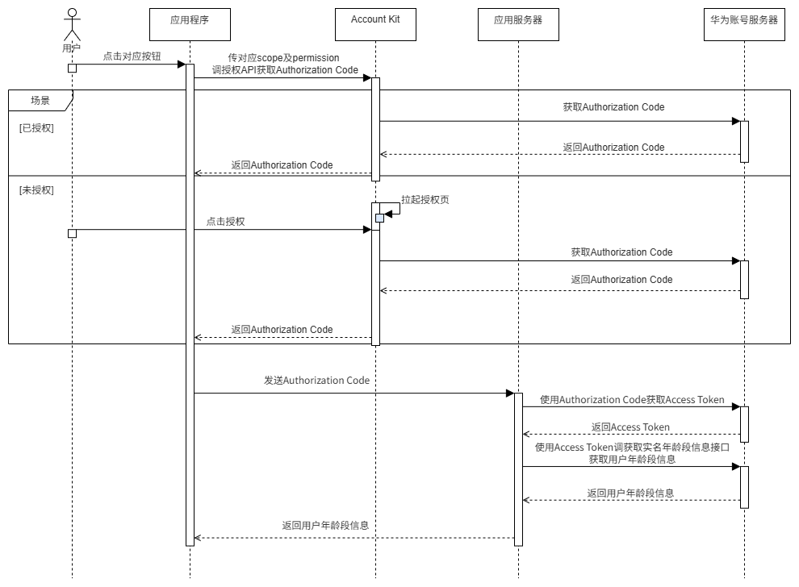

# 获取实名年龄段

更新时间：2026-05-12 09:31:20

来源：https://developer.huawei.com/consumer/cn/doc/harmonyos-guides/account-get-realname-age

#### 场景介绍

当应用需要获取用户实名年龄段信息时，可使用Account Kit的年龄段授权能力。用户授权后，应用可快速获取实名年龄段信息。


#### 约束与限制

获取用户实名年龄段能力支持Phone、Tablet、PC/2in1设备。并且从5.1.0(18)版本开始，新增支持Wearable设备；从5.1.1(19)版本开始，新增支持TV设备。


#### 业务流程





流程说明：
1. 应用通过传对应scope和permission调用授权API，如果已授权则直接返回临时登录凭证Authorization Code；如果未授权则拉起授权页，在用户确认授权后，返回Authorization Code。
2. 应用将Authorization Code传给应用服务端，使用Client ID、Client Secret、Authorization Code从华为服务器中获取Access Token，再使用Access Token请求获取用户的实名年龄段信息。


#### 接口说明

获取年龄段关键接口如下表所示，具体API说明详见[API参考](https://developer.huawei.com/consumer/cn/doc/harmonyos-references/account-api-authentication)。

| 接口名 | 描述 |
| --- | --- |
| createAuthorizationWithHuaweiIDRequest(): AuthorizationWithHuaweiIDRequest | 获取授权请求对象接口，通过AuthorizationWithHuaweiIDRequest传入返回获取用户实名年龄段的scope：realNameAgeRange及返回Authorization Code的permission：serviceauthcode，即可获取到Authorization Code。 |
| constructor(context?: common.Context) | 创建授权请求Controller。 |
| executeRequest(request: AuthenticationRequest): Promise&lt;AuthenticationResponse&gt; | 通过Promise方式执行授权操作。 |


上述接口需在页面或自定义组件生命周期内调用。


#### 开发前提

1、在进行代码开发前，请先确认已完成[开发准备](https://developer.huawei.com/consumer/cn/doc/harmonyos-guides/account-config-permissions)工作。

 - 若未配置签名和指纹，将报错[1001500001 应用指纹证书校验失败](https://developer.huawei.com/consumer/cn/doc/harmonyos-guides/account-faq-1)。
 - 若未完成“获取您的年龄段”权限申请，将报错[1001502014 应用未申请scopes或permissions权限](https://developer.huawei.com/consumer/cn/doc/harmonyos-guides/account-faq-2)。


2、设备需要登录华为账号，若未登录则拉起登录页面。


#### 开发步骤


#### 客户端开发
1. 导入[authentication](https://developer.huawei.com/consumer/cn/doc/harmonyos-references/account-api-authentication)模块及相关公共模块。

  
```text
import { authentication } from '@kit.AccountKit';
import { hilog } from '@kit.PerformanceAnalysisKit';
import { util } from '@kit.ArkTS';
import { BusinessError } from '@kit.BasicServicesKit';
```

2. 创建授权请求并设置参数。

  
```text
// 创建授权请求，并设置参数
const authRequest = new authentication.HuaweiIDProvider().createAuthorizationWithHuaweiIDRequest();
// 获取用户实名年龄段需要传如下scope，传参数之前需要先申请对应scope权限，否则会返回1001502014错误码
authRequest.scopes = ['realNameAgeRange'];
// 获取authorizationCode需传如下permission
authRequest.permissions = ['serviceauthcode'];
// 用户是否需要登录授权，该值为true且用户未登录或未授权时，会拉起用户登录或授权页面
authRequest.forceAuthorization = true;
// 建议使用generateRandomUUID生成state，可用于一致性比对，防止跨站攻击
authRequest.state = util.generateRandomUUID();
```

3. 调用[AuthenticationController](https://developer.huawei.com/consumer/cn/doc/harmonyos-references/account-api-authentication#authenticationcontroller)对象的[executeRequest](https://developer.huawei.com/consumer/cn/doc/harmonyos-references/account-api-authentication#executerequest-1)方法执行授权请求，并处理授权结果，从授权结果中解析出Authorization Code，之后将Authorization Code传给应用服务端处理。

  
```text
// 执行请求
try {
  // 此示例为代码片段，实际需在自定义组件实例中使用，并传入有效的Context上下文对象
  const controller = new authentication.AuthenticationController(this.getUIContext().getHostContext());
  controller.executeRequest(authRequest).then((data) => {
    const authorizationWithHuaweiIDResponse = data as authentication.AuthorizationWithHuaweiIDResponse;
    const state = authorizationWithHuaweiIDResponse.state;
    if (state && authRequest.state !== state) {
      hilog.error(0x0000, 'testTag', `Failed to authorize. The state is different, response state: ${state}`);
      return;
    }
    hilog.info(0x0000, 'testTag', 'Succeeded in authentication.');
    const authorizationWithHuaweiIDCredential = authorizationWithHuaweiIDResponse?.data;
    const authorizationCode = authorizationWithHuaweiIDCredential?.authorizationCode;
    // 开发者处理authorizationCode
  }).catch((err: BusinessError) => {
    dealAllError(err);
  });
} catch (error) {
  dealAllError(error);
}
```

```text
// 错误处理
function dealAllError(error: BusinessError): void {
  hilog.error(0x0000, 'testTag', `Failed to obtain userInfo. Code: ${error.code}, message: ${error.message}`);
  // 在应用获取用户实名年龄段标识场景下，涉及UI交互时，建议按照如下错误码指导提示用户
  if (error.code === ErrorCode.ERROR_CODE_LOGIN_OUT) {
    // 用户未登录华为账号，请登录华为账号并重试
  } else if (error.code === ErrorCode.ERROR_CODE_NETWORK_ERROR) {
    // 网络异常，请检查当前网络状态并重试
  } else if (error.code === ErrorCode.ERROR_CODE_USER_CANCEL) {
    // 用户取消授权
  } else if (error.code === ErrorCode.ERROR_CODE_SYSTEM_SERVICE) {
    // 系统服务异常，请稍后重试
  } else if (error.code === ErrorCode.ERROR_CODE_REQUEST_REFUSE) {
    // 重复请求，应用无需处理
  } else {
    // 获取用户信息失败，请尝试使用其他方式登录
  }
}

export enum ErrorCode {
  // 账号未登录
  ERROR_CODE_LOGIN_OUT = 1001502001,
  // 网络错误
  ERROR_CODE_NETWORK_ERROR = 1001502005,
  // 用户取消授权
  ERROR_CODE_USER_CANCEL = 1001502012,
  // 系统服务异常
  ERROR_CODE_SYSTEM_SERVICE = 12300001,
  // 重复请求
  ERROR_CODE_REQUEST_REFUSE = 1001500002
}
```


#### 服务端开发
1. 应用服务端使用Client ID、Client Secret、Authorization Code调用[获取用户级凭证接口](https://developer.huawei.com/consumer/cn/doc/harmonyos-references/account-api-obtain-user-token#接口原型)向华为账号服务器请求获取Access Token、Refresh Token。
2. 使用Access Token调用[获取实名年龄段接口](https://developer.huawei.com/consumer/cn/doc/harmonyos-references/account-api-get-realname-age-range-flag#接口原型)获取用户实名年龄段。

  **Access Token过期处理**

  由于Access Token的有效期仅为60分钟，当Access Token失效或者即将失效时（可通过[REST API错误码](https://developer.huawei.com/consumer/cn/doc/harmonyos-references/account-api-get-user-info-get-nickname-and-avatar#错误码)判断），可以使用Refresh Token（有效期180天）通过[刷新用户级凭证接口](https://developer.huawei.com/consumer/cn/doc/harmonyos-references/account-api-obtain-refresh-token#接口原型)向华为账号服务器请求获取新的Access Token。

  
> [!NOTE]
> 当Access Token失效时，若您不使用Refresh Token向账号服务器请求获取新的Access Token，账号的授权信息将会失效，导致使用Access Token的功能都会失败。 当Access Token非正常失效（如修改密码、退出账号、删除设备）时，业务可重新登录授权获取Authorization Code，向账号服务器请求获取新的Access Token。


  **Refresh Token过期处理**

  由于Refresh Token的有效期为180天，当Refresh Token失效后（可通过[REST API错误码](https://developer.huawei.com/consumer/cn/doc/harmonyos-references/account-api-obtain-refresh-token#错误码)判断），应用服务端需要通知客户端，重新调用授权接口，请求用户重新授权。
