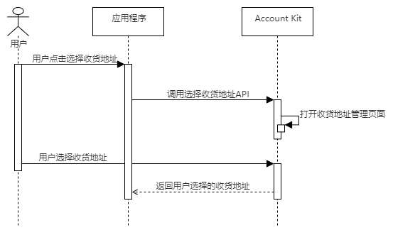

# 获取收货地址

更新时间：2026-04-28 03:31:56

来源：https://developer.huawei.com/consumer/cn/doc/harmonyos-guides/account-choose-address-dev

## 场景介绍

当应用需要获取用户收货地址时，可使用Account Kit提供的获取收货地址的能力，引导用户添加或选择已有的收货地址，并最终获取用户的收货地址。以下对Account Kit提供的获取收货地址能力进行介绍，获取收货地址功能还可使用场景化控件[选择收货地址Button](https://developer.huawei.com/consumer/cn/doc/harmonyos-guides/scenario-fusion-button-ship-to)进行实现。


## 约束与限制

收货地址中的手机号信息仅支持输入中国境内（香港特别行政区、澳门特别行政区、中国台湾除外）手机号、地址信息只支持填写中国境内（香港特别行政区、澳门特别行政区、中国台湾除外）。 Wearable、TV设备暂不支持使用获取收货地址功能。

## 业务流程


流程说明： 用户需要使用收货地址时，应用程序调用选择收货地址API，打开华为账号收货地址管理页面。 用户可以在收货地址管理页面添加新的收货地址或者选择已有收货地址，点击确认后，选择的收货地址将返回给应用。

## 接口说明

获取收货地址关键接口如下表所示，具体API说明详见[API参考](https://developer.huawei.com/consumer/cn/doc/harmonyos-references/account-choose-address)。
| 接口名 | 描述 |
| --- | --- |
| [chooseAddress](https://developer.huawei.com/consumer/cn/doc/harmonyos-references/account-choose-address#chooseaddress)(context: [common.Context](https://developer.huawei.com/consumer/cn/doc/harmonyos-references/js-apis-app-ability-common#context)): Promise | 拉起收货地址管理页面并返回用户所选择的收货地址。 |


上述接口需在页面或自定义组件生命周期内调用。

## 开发前提

在进行代码开发前，请先确认以下准备工作是否完成： 1、是否完成[申请账号权限](https://developer.huawei.com/consumer/cn/doc/harmonyos-guides/account-config-permissions)，未申请通过调用获取收货地址API，将返回[1008100005 应用未申请对应permissions权限](https://developer.huawei.com/consumer/cn/doc/harmonyos-references/account-api-error-code#section1008100005-应用未申请对应permissions权限)错误码，无法获取收货地址。
> [!NOTE]
> 如果在权限申请前已完成“配置签名和指纹”，则需要重新申请调试Profile，并重新手动配置签名信息。

2、是否完成[配置签名和指纹](https://developer.huawei.com/consumer/cn/doc/harmonyos-guides/account-sign-fingerprints)、[配置Client ID](https://developer.huawei.com/consumer/cn/doc/harmonyos-guides/account-client-id)，未配置调用获取收货地址API，将返回 [1008100004 应用指纹证书校验失败](https://developer.huawei.com/consumer/cn/doc/harmonyos-references/account-api-error-code#section1008100004-应用指纹证书校验失败)错误码，无法获取收货地址。

## 开发步骤

导入[shippingAddress](https://developer.huawei.com/consumer/cn/doc/harmonyos-references/account-choose-address)模块及相关公共模块。
```text
import { shippingAddress } from '@kit.AccountKit';
import { hilog } from '@kit.PerformanceAnalysisKit';
import { BusinessError } from '@kit.BasicServicesKit';
```

调用[chooseAddress](https://developer.huawei.com/consumer/cn/doc/harmonyos-references/account-choose-address#chooseaddress)方法打开收货地址管理页面，引导用户添加或选择收货地址后，应用即可获取用户收货地址。
```text
// 执行请求
try {
  // 此示例为代码片段，实际需在自定义组件实例中使用，并传入有效的Context上下文对象
  shippingAddress.chooseAddress(this.getUIContext().getHostContext()).then((data: shippingAddress.AddressInfo) => {
    hilog.info(0x0000, 'testTag', 'Succeeded in choosing address.');
    const userName: string = data.userName;
    const mobileNumber: string = data.mobileNumber;
    const countryCode: string = data.countryCode;
    const provinceName: string = data.provinceName;
    const cityName: string = data.cityName;
    const districtName: string = data.districtName;
    const streetName: string = data.streetName;
    const detailedAddress: string = data.detailedAddress;
    // 开发者处理获取的收货地址信息
  }).catch((error: BusinessError) => {
    dealAllError(error);
  });
} catch (error) {
  dealAllError(error);
}
```


```text
// 错误处理
function dealAllError(error: BusinessError): void {
  hilog.error(0x0000, 'testTag', `Failed to chooseAddress. Code: ${error.code}, message: ${error.message}`);
}
```
