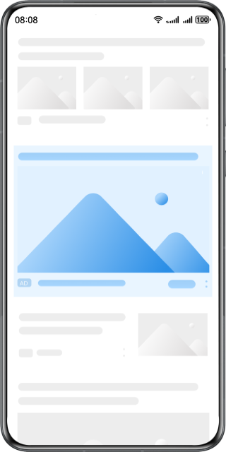

# 原生广告

更新时间：2026-05-14 10:06:22

来源：https://developer.huawei.com/consumer/cn/doc/harmonyos-guides/ads-publisher-service-native

##### 场景介绍

原生广告是与应用内容融于一体的广告，通过“和谐”的内容呈现广告信息，在不破坏用户体验的前提下，为用户提供有价值的信息，展示形式包含图片和视频，支持您自由定制界面。





##### 约束与限制

支持Phone、Tablet、PC/2in1设备。

使用PC/2in1设备时，需要确保设备上智慧营销服务或广告服务的版本在8.4.80.300及以上，版本号可通过选择“设置> 应用和元服务 > 更多应用”查看。


##### 接口说明

| 接口名 | 描述 |
| --- | --- |
| loadAd(adParam: AdRequestParams, adOptions: AdOptions, listener: AdLoadListener): void | 请求单广告位广告，通过AdRequestParams、AdOptions进行广告请求参数设置，通过AdLoadListener监听广告请求回调。 |
| loadAdWithMultiSlots(adParams: AdRequestParams[], adOptions: AdOptions, listener: MultiSlotsAdLoadListener): void | 请求多广告位广告，通过AdRequestParams[]、AdOptions进行广告请求参数设置，通过MultiSlotsAdLoadListener监听广告请求回调。 |
| AdComponent({ads: advertising.Advertisement[], displayOptions: advertising.AdDisplayOptions, interactionListener: advertising.AdInteractionListener, @BuilderParam adRenderer?: () => void, @Prop rollPlayState?: number}) | 展示广告，通过AdDisplayOptions进行广告展示参数设置，通过AdInteractionListener监听广告状态回调。 说明：为了保证广告能正确展示，该接口必须和请求广告接口配套使用。 |


##### AdComponent组件建议宽高

| 样式 | 建议宽高 |
| --- | --- |
| 原生信息流/原生瀑布流 | width：与信息流内容保持一致。 height：无需设置。 |
| 原生插图 | width：312vp。 height：284vp。 |


##### 开发步骤


##### 请求广告
1. 导入相关模块。

  
```text
import { abilityAccessCtrl, common, PermissionRequestResult } from '@kit.AbilityKit';
import { advertising, identifier } from '@kit.AdsKit';
import { hilog } from '@kit.PerformanceAnalysisKit';
```

2. 获取OAID。

  若需提升广告推送精准度，可以在请求参数[AdRequestParams](https://developer.huawei.com/consumer/cn/doc/harmonyos-references/js-apis-advertising#adrequestparams)中添加oaid属性。

  如何获取OAID参见[获取OAID信息](https://developer.huawei.com/consumer/cn/doc/harmonyos-guides/oaid-service)。

  
> [!NOTE]
> 使用以下示例中提供的测试广告位时，必须先获取OAID信息。

3. 请求广告。

  请求广告需要创建一个AdLoader对象。

  
如果要请求单广告位广告，通过AdLoader的[loadAd](https://developer.huawei.com/consumer/cn/doc/harmonyos-references/js-apis-advertising#loadad)方法请求广告，通过[AdLoadListener](https://developer.huawei.com/consumer/cn/doc/harmonyos-references/js-apis-advertising#adloadlistener)来监听广告的加载状态。
4. 如果要请求多广告位广告，通过AdLoader的[loadAdWithMultiSlots](https://developer.huawei.com/consumer/cn/doc/harmonyos-references/js-apis-advertising#loadadwithmultislots)方法请求广告，通过[MultiSlotsAdLoadListener](https://developer.huawei.com/consumer/cn/doc/harmonyos-references/js-apis-advertising#multislotsadloadlistener)来监听广告的加载状态。


##### 展示广告
1. 导入相关模块。

  
```text
import { AdComponent, advertising } from '@kit.AdsKit';
import { hilog } from '@kit.PerformanceAnalysisKit';
```

2. 展示广告。

  展示广告通过[AdInteractionListener](https://developer.huawei.com/consumer/cn/doc/harmonyos-references/js-apis-advertising#adinteractionlistener)监听广告状态回调，涉及的回调状态如下所示：

| 回调状态 | 说明 | 使用建议 |

| --- | --- | --- |

| onAdOpen | 打开广告。 | - |

| onAdClick | 点击广告。 | - |

| onAdClose | 关闭广告。 | 用户点击负反馈或关闭广告时触发，需要将广告组件隐藏。回调状态包含了具体的关闭原因，详情见：data说明。 |

| onAdFail | 广告加载失败。 | 广告展示失败时触发，需要将广告组件隐藏。 |

  原生信息流广告通常不需要显式设置广告展示组件[AdComponent](https://developer.huawei.com/consumer/cn/doc/harmonyos-references/js-apis-adcomponent)的高度，组件会自动调整高度以适应需要展示的内容。

  示例代码如下所示：

  
```text
@Entry
@Component
struct Index {
  @State ads: advertising.Advertisement[] = [];
  @State visibilityState: Visibility = Visibility.Visible;
  // ...

  build() {
    Column() {
      if (this.ads.length > 0) {
        this.inFeedNativeAd(this.ads[0]);
        // ...
      }
    }
    .width('100%')
    .height('100%')
  }

  @Builder
  inFeedNativeAd(ad: advertising.Advertisement): void {
    Row() {
      AdComponent({
        ads: [ad],
        // 广告展示参数，开发者可根据项目实际情况设置
        displayOptions: {
          // 是否静音
          mute: true
        },
        interactionListener: {
          onStatusChanged: (status: string, ad: advertising.Advertisement, data: string) => {
            switch (status) {
              case 'onAdOpen':
                hilog.info(0x0000, 'testTag', 'Status is onAdOpen');
                break;
              case 'onAdClick':
                hilog.info(0x0000, 'testTag', 'Status is onAdClick');
                break;
              case 'onAdClose':
                hilog.info(0x0000, 'testTag', 'Status is onAdClose');
                this.visibilityState = Visibility.None;
                break;
              case 'onAdFail':
                hilog.error(0x0000, 'testTag', 'Status is onAdFail');
                this.visibilityState = Visibility.None;
                break;
            }
          }
        }
      })
      // 原生信息流样式，不建议设置高度，宽度建议设置为100%，撑满父容器
        .width('100%')
    }
    .width('100%')
    .padding({ left: 16, right: 16 })
    .visibility(this.visibilityState)
  }

  // ...
}
```
原生插图广告宽高为固定值312vp*284vp，开发者可以将广告展示组件[AdComponent](https://developer.huawei.com/consumer/cn/doc/harmonyos-references/js-apis-adcomponent)居中展示。

  示例代码如下所示：

  
```text
@Entry
@Component
struct Index {
  @State ads: advertising.Advertisement[] = [];
  @State visibilityState: Visibility = Visibility.Visible;
  // ...

  build() {
    Column() {
      if (this.ads.length > 0) {
        // ...
        this.nativeCardAd(this.ads[0]);
      }
    }
    .width('100%')
    .height('100%')
  }

  // ...

  @Builder
  nativeCardAd(ad: advertising.Advertisement): void {
    Row() {
      AdComponent({
        ads: [ad],
        // 广告展示参数，开发者可根据项目实际情况设置
        displayOptions: {
          // 是否静音
          mute: true
        },
        interactionListener: {
          onStatusChanged: (status: string, ad: advertising.Advertisement, data: string) => {
            switch (status) {
              case 'onAdOpen':
                hilog.info(0x0000, 'testTag', 'Status is onAdOpen');
                break;
              case 'onAdClick':
                hilog.info(0x0000, 'testTag', 'Status is onAdClick');
                break;
              case 'onAdClose':
                hilog.info(0x0000, 'testTag', 'Status is onAdClose');
                this.visibilityState = Visibility.None;
                break;
              case 'onAdFail':
                hilog.error(0x0000, 'testTag', 'Status is onAdFail');
                this.visibilityState = Visibility.None;
                break;
            }
          }
        }
      })
      // 原生插图样式，宽高为固定值，为312vp*284vp
        .width(312)
        .height(284)
    }
    .width('100%')
    // 宽高固定无法撑满父容器，将广告居中展示
    .justifyContent(FlexAlign.Center)
    .visibility(this.visibilityState)
  }
}
```


##### 测试原生广告

原生广告测试广告位ID，仅可用于调测原生广告功能，不可用于广告变现，在应用正式发布前需替换为正式的原生广告位ID。您应在应用发布前先进入[流量变现官网](https://developer.huawei.com/consumer/cn/monetize)，点击“开始变现”，登录[鲸鸿动能媒体服务平台](https://developer.huawei.com/consumer/cn/service/ads/publisher/html/index.html?lang=zh)，申请正式的广告位ID并替换测试广告位ID，具体操作详情请参见[展示位创建](https://developer.huawei.com/consumer/cn/doc/distribution/monetize/zhanshiweichuangjian-0000001132700049)。

原生广告测试广告位ID列表如下：

| 广告位类型 | 测试广告位ID | 展示形式 | 比例 | 推广类型 |
| --- | --- | --- | --- | --- |
| 原生 | h8asowxwhq | 大图 | 16:9 | 网页推广 |
| 原生 | k94abyn2z4 | 小图 | 4:3 | 应用下载 |
| 原生 | o7dj7qsbvy | 三图 | 4:3 | 应用促活 |
| 原生 | s7moc0jc6m | 视频 | 16:9 | 应用下载 |
